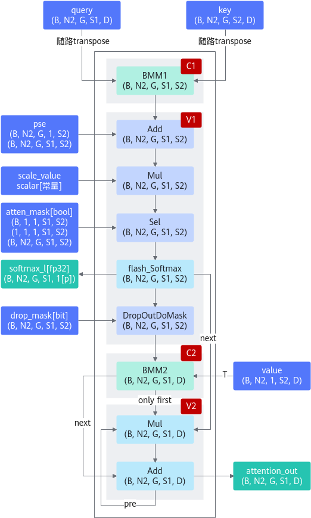

# FlashAttentionScore

## 算子基础信息

FlashAttentionScore算子新增torch\_npu接口，支持torch\_npu接口调用。

**表 1** 算子信息

|算子名称|FlashAttentionScore|
|-------|-------------------|
|torch_npu api接口|torch_npu.npu_fusion_attention|
|支持的PyTorch版本|2.7.1, 2.10.0|
|支持的芯片类型|<term>Atlas A2 训练系列产品</term>|
|支持的数据类型|float16, bfloat16|

FlashAttentionScore算子支持原生SDPA接口调用。

**表 2** 原生接口调用

|算子名称|FlashAttentionScore|
|-------|-------------------|
|torch_npu api接口|torch.nn.functional.scaled_dot_product_attention|
|支持的PyTorch版本|2.7.1, 2.10.0|
|支持的芯片类型|<term>Atlas A2 训练系列产品</term>|
|支持的数据类型|float16, bfloat16|

## torch_npu接口参数

torch_npu接口：

```python
torch_npu.npu_fusion_attention(query, key, value, head_num, input_layout, pse=None, padding_mask=None, atten_mask=None, scale=1., keep_prob=1., pre_tockens=2147483647, next_tockens=2147483647, inner_precise=0, prefix=None, actual_seq_qlen=None, actual_seq_kvlen=None, sparse_mode=0, gen_mask_parallel=True, sync=False, softmax_layout="") -> (Tensor, Tensor, Tensor, Tensor, int, int, int)
```

> [!NOTE]
>
> torch_npu接口中的问号表示这个输入参数是可选的。

实现“Transformer Attention Score”的融合计算，实现的计算公式如下：


参数说明、输出说明和约束说明具体请参考《API参考》中的“[torch_npu.npu_fusion_attention](https://gitcode.com/Ascend/op-plugin/blob/26.0.0/docs/zh/custom_APIs/torch_npu/torch_npu-npu_fusion_attention.md)”章节。

## 模型中替换代码

当前GPU模式下，调用FA算子的方式有多种，torch调用FA的接口scaled\_dot_product\_attention，通过flash-attention库中的flash\_attn\_func、flash\_attn\_varlen\_func等接口调用。NPU模式下除了已经适配的sdpa接口，其余模式需要通过torch\_npu接口——npu\_fusion\_attention接口实现调用。两者之间的适配可能涉及一些脚本迁移工作，以下通过范例说明接口适配方式。

**torch原生接口**

scaled\_dot\_product\_attention：

当前已适配NPU，训练场景直接调用即可调用到FA，相关规格限制请参考[torch原生接口调用FA算子使用限制](#custom-anchor)。若依然需要使用NPU接口，可以按以下方式适配替换，但输入规格依然要满足[torch原生接口调用FA算子使用限制](#custom-anchor)要求。

- 不使能is\_causal时，原调用接口代码：

    ```python
    res = torch.nn.functional.scaled_dot_product_attention(query, key, value, atten_mask=attention_mask,
                                         dropout_p=0.0, is_causal=False)
    ```

    替换为：

    ```python
    if atten_mask.dtype == torch.bool:
        atten_mask_npu = torch.logical_not(attention_mask.bool()).to(device) # atten_mask需要取反
    else:
        atten_mask_npu = attention_mask.bool().to(device)
    head_num = query.shape[1]
    res = torch_npu.npu_fusion_attention(
                           query, key, value, head_num, input_layout="BNSD", 
                           pse=None,
                           atten_mask=atten_mask_npu,
                           scale=1.0 / math.sqrt(query.shape[-1]),
                           pre_tockens=2147483647,
                           next_tockens=2147483647,
                           keep_prob=1
                       )[0]
    ```

- 使能is\_causal时，原调用接口代码：

    ```python
    res = torch.nn.functional.scaled_dot_product_attention(query, key, value, atten_mask=None,
                                         dropout_p=0.0, is_causal=True)
    ```

    替换为：

    ```python
    atten_mask_npu= torch.triu(torch.ones([2048, 2048]), diagonal=1).bool().to(device)
    head_num = query.shape[1]
    res = torch_npu.npu_fusion_attention(
                           query, key, value, head_num, input_layout="BNSD", 
                           pse=None,
                           atten_mask=atten_mask_npu,
                           scale=1.0 / math.sqrt(query.shape[-1]),
                           pre_tockens=2147483647,
                           next_tockens=2147483647,
                           keep_prob=1,
                           sparse_mode=2 )[0]
    ```

**flash-attention库**

- flash\_attn\_func
    - 接口参数对应表格：

        **表 3** 接口参数替换

        |gpu参数名称|npu参数名称|说明|
        |----|----|----|
        |q|q|query；gpu、npu参数名一致且含义一致。|
        |k|k|key；gpu、npu参数名一致且含义一致。|
        |v|v|value；gpu、npu参数名一致且含义一致。|
        |dropout|keep_prob|keep_prob= 1 - dropout；gpu接口中dropout代表数据需要忽略的概率，npu接口中keep_prob代表数据需要保留的概率。|
        |softmax_scale|scale|对QKT的缩放系数；gpu、npu参数名不一致，含义一致；npu接口参数的默认值为1.0，适配时查阅原实现的scale值。|
        |causal|atten_mask|gpu接口参数causal=true时，npu接口需要传入下三角形式的atten mask；gpu接口参数causal=false时，npu接口不需要传入atten mask。|
        |-|head_num|npu接口新增参数，表示query的头数。|
        |-|layout|npu接口新增参数，表示qkv的layout，gpu接口默认layout为“BSND”。|
        |-|sparse_mode|npu接口新增参数，表示稀疏计算模式。sparse_mode=2表示leftUp causal，sparse_mode=3表示rightDown causal；gpu接口在FA2.0版本及之前，causal场景默认是leftUp，在2.0版本之后，默认是rightDown。|

    - 接口参数替换实例：

        不使能causal时，模型中替换代码：

        ```python
        out= flash_attn_func(q, k, v, dropout_p=0.0, softmax_scale=scale, causal=False)
        ```

        替换为：

        ```python
        head_num = q.shape[2]
        out = torch_npu.npu_fusion_attention(q, k, v, head_num, "BSND", keep_prob=1.0,
                                             scale=scale)[0]
        ```

        使能causal时，模型中替换代码：

        ```python
        out= flash_attn_func(q, k, v, dropout_p=0.0, softmax_scale=scale, causal=True)
        ```

        替换为：

        ```python
        atten_mask_npu = torch.triu(torch.ones([2048, 2048]), diagonal=1).bool().to(device)
        head_num = q.shape[2]
        out = torch_npu.npu_fusion_attention(q, k, v, head_num, "BSND", keep_prob=1.0,
                                             scale=scale, atten_mask=atten_mask_npu, sparse_mode=3)[0]
        ```

        > [!NOTE]
        >
        > 当替换flash-attention为2.0或之前版本时，应设置sparse\_mode=2；当替换2.1或之后版本时，应设置sparse\_mode=3。

- flash\_attn\_varlen\_func
    - 接口参数对应表格：

        **表 4** 接口参数替换

        |gpu参数名称|npu参数名称|说明|
        |--|--|--|
        |q|q|query；gpu、npu参数名一致且含义一致。|
        |k|k|key；gpu、npu参数名一致且含义一致。|
        |v|v|value；gpu、npu参数名一致且含义一致。|
        |dropout|keep_prob|keep_prob= 1 - dropout；gpu接口中dropout代表数据需要忽略的概率，npu接口中keep_prob代表数据需要保留的概率。|
        |softmax_scale|scale|对QKT的缩放系数；gpu、npu参数名不一致，含义一致；npu接口参数的默认值为1.0，适配时查阅原实现的scale值。|
        |causal|atten_mask|gpu接口参数causal=true时，npu接口需要传入下三角形式的atten mask；gpu接口参数causal=false时，npu接口不需要传入atten mask。|
        |cu_seqlens_q|actual_seq_qlen|query序列的累积长度；gpu、npu参数名不一致，含义一致；npu接口该参数需要转换为host侧的list格式。|
        |cu_seqlens_k|actual_seq_kvlen|key、value序列的累积长度；gpu、npu参数名不一致，含义一致；npu接口该参数需要转换为host侧的list格式。|
        |max_seqlen_q|-|npu无需配置该参数；gpu接口中表示query序列的最大长度，npu在接口内部计算。|
        |max_seqlen_k|-|npu无需配置该参数；gpu接口中表示key、value序列的最大长度，npu在接口内部计算。|
        |-|head_num|npu接口新增参数，表示query的头数。|
        |-|layout|npu接口新增参数，表示qkv的layout，gpu接口默认layout为"BSND"。|
        |-|sparse_mode|npu接口新增参数，表示稀疏计算模式。sparse_mode=2表示leftUp causal，sparse_mode=3表示rightDown causal；gpu接口在FA2.0版本及之前，causal场景默认是leftUp，在2.0版本之后，默认是rightDown。|

    - 接口参数替换实例：

        不使能causal时，原调用接口代码：

        ```python
        out = flash_attn_varlen_func(
            q,
            k,
            v,
            cu_seqlens_q,
            cu_seqlens_k,
            max_seqlen_q,
            max_seqlen_k,
            dropout_p=0.0,
            softmax_scale=None,
            causal=False
        )
        ```

        替换为：

        ```python
        head_num = q.shape[1]
        output = torch_npu.npu_fusion_attention(
                     q, k, v, head_num,
                     pse=None,             
                     atten_mask=None,
                     scale=1.0 / math.sqrt(q.shape[-1]),
                     keep_prob=1,
                     input_layout="TND",
                     actual_seq_qlen=tuple(cu_seqlens_q[1:].cpu().numpy().tolist()),
                     actual_seq_kvlen=tuple(cu_seqlens_k[1:].cpu().numpy().tolist()))[0]
        ```

        使能causal时，GPU调用接口代码：

        ```python
        out = flash_attn_varlen_func(
            q,
            k,
            v,
            cu_seqlens_q,
            cu_seqlens_k,
            max_seqlen_q,
            max_seqlen_k,
            dropout_p=0.0,
            softmax_scale=None,
            causal=True
        )
        ```

        替换为：

        ```python
        atten_mask_npu = torch.triu(torch.ones([2048, 2048]), diagonal=1).bool().to(device)
        head_num = q.shape[1]
        output = torch_npu.npu_fusion_attention(
                     q, k, v, head_num,
                     pse=None,
                     padding_mask=None,
                     atten_mask=atten_mask_npu,
                     scale=1.0 / math.sqrt(q.shape[-1]),
                     keep_prob=1,
                     input_layout="TND",
                     actual_seq_qlen=tuple(cu_seqlens_q[1:].cpu().numpy().tolist()),
                     actual_seq_kvlen=tuple(cu_seqlens_k[1:].cpu().numpy().tolist()),
                     sparse_mode=3)[0]
        ```

        > [!NOTE]
        >
        > 当替换flash-attention为2.0或之前版本时，应设置sparse\_mode=2；当替换2.1或之后版本时，应设置sparse\_mode=3。

**xFormers库**

memory\_efficient\_attention

模型中替换代码：

```python
def __init__(self, attention_op: Optional[Callable] = None):
       self.attention_op = attention_op

def head_to_batch_dim(self, tensor):
       tensor = tensor.reshape(batch_size * head_size, seq_len, dim // head_size)
       return tensor

...

query = attn.head_to_batch_dim(query).contiguous()
key = attn.head_to_batch_dim(key).contiguous()
value = attn.head_to_batch_dim(value).contiguous()
hidden_states = xformers.ops.memory_efficient_attention(
            query, key, value, attn_bias=attention_mask, op=self.attention_op, scale=attn.scale
        )
```

替换为：

```python
def head_to_batch_dim(self, tensor, out_dim=3):
       head_size = self.heads
       batch_size, seq_len, dim = tensor.shape
       tensor = torch_npu.npu_confusion_transpose(tensor, [0, 2, 1, 3], (batch_size, seq_len, head_size, dim // head_size), False)

       if out_dim == 3:
           tensor = tensor.reshape(batch_size * head_size, seq_len, dim // head_size)

       return tensor

...

query = attn.head_to_batch_dim(query, out_dim=4)
key = attn.head_to_batch_dim(key, out_dim=4)
value = attn.head_to_batch_dim(value, out_dim=4)
hidden_states = torch_npu.npu_fusion_attention(
            query, key, value, heads, input_layout="BNSD",
            pse=None,
            atten_mask=attention_mask,
            scale=scale,
            pre_tockens=2147483647,
            next_tockens=2147483647,
            keep_prob=1.,
            sync=False
        )[0]
```

## 算子计算逻辑

算子的计算逻辑如下：

```python
def forward(q, k, v, drop_mask, atten_mask, pse, scale, keep_prob):
    if pse is None:
        qk = torch.matmul(q, k.permute(0, 1, 3, 2)).mul(scale)
    else:
        qk = (torch.matmul(q, k.permute(0, 1, 3, 2)) + pse).mul(scale)
    if atten_mask is None:
        qk = qk
    else:
        qk = qk + atten_mask * torch.finfo(torch.float32).min
    softmax_res, softmax_max, softmax_sum = softmax(qk)
    if drop_mask:
        drop_res = softmax_res
    else:
        drop_res = softmax_res * drop_mask * (1.0 / (keep_prob))
    attention_out = torch.matmul(drop_res, v)
    return attention_out
```

**图 1** 计算流程图



## 已支持模型典型case

**表 5** case列表

|id|query|key|value|head_num|input_layout|atten_mask|pre_tockens|next_tockens|actual_seq_qlen|actual_seq_kvlen|sparse_mode|
|--|--|--|--|--|--|--|--|--|--|--|--|
|1|[6144,1,2048]|[6144,1,256]|[6144,1,256]|16|SBH|[2048,2048]|2048|0|None|None|4|
|2|[1,8192,1536]|[1,8192,1536]|[1,8192,1536]|12|BSH|[1,1,8192,8192]|2147483647|0|None|None|0|
|3|[1,10,32768,256]|[1,10,32768,256]|[1,10,32768,256]|10|BNSD|[2048,2048]|8191|0|None|None|4|
|4|[1,4096,48,64]|[1,4096,8,64]|[1,4096,8,64]|48|BSND|None|2147483647|2147483647|None|None|0|
|5|[13440,16,72]|[13440,16,72]|[13440,16,72]|16|TND|None|2147483647|2147483647|[4480,8960,13440]|[4480,8960,13440]|0|

> [!NOTE]
>
> 1. query/key/value的数据类型为fp16/bf16。
> 2. atten\_mask的数据类型为bool/uint8。
> 3. case5的actual\_seq\_qlen/actual\_seq\_kvlen是数据类型为int64且shape为\[3,\]的list。

## torch原生接口调用FA算子使用限制<a id="custom-anchor"></a>

接口和参数说明：

参考开源说明可单击[LINK](https://pytorch.org/docs/stable/generated/torch.nn.functional.scaled_dot_product_attention.html#torch.nn.functional.scaled_dot_product_attention)。

使用限制：

- 参数输入符合规格：
    - 输入query、key、value的N：batch size，当前只支持\[N，head\_num, S\(L\), E\(Ev\)\]的排布方式，取值范围1\~2K。
    - 输入query的head\_num和key/value的head\_num必须成比例关系，即Nq/Nkv必须是非0整数，取值范围1\~256。
    - 输入query的L：target sequence length，取值范围1\~512K。
    - 输入key、value的S：source sequence length，取值范围1\~512K。
    - 输入query、key、value的E：embedding dimension of the query and key，取值范围1\~512。
    - 输入value的Ev：embedding dimension of the value，必须与E相等。
    - 输入atten\_mask：当前支持\[N, 1, L, S\]、\[N, head\_num, L, S\]、\[1, 1, L, S\]、\[L, S\]共4种排布方式。
    - 在使能is\_causal计算时，atten\_mask必须为None；不使能is\_causal时，若atten\_mask输入有效数据，输入数据类型必须是bool类型。

- 与原接口除了规格限制之外还存在如下差异点：
    - NPU的随机算法部分用DSA硬件实现，算法在DSA引擎固化与GPU算法实现存在差异，导致dropout功能和GPU结果不一致。
    - 当前接口支持输入query的head\_num和key/value的head\_num不等长，而原生PyTorch接口不支持。
    - 输入query、key、value的数据类型bf16、fp16、fp32并且使能requires\_grad时，执行FA算子。
