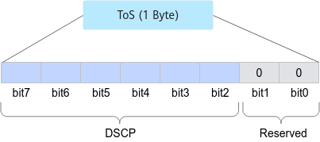

# HCCL\_RDMA\_TC

## 功能描述

此参数为网络路由拓扑参数，由具体硬件路由方式决定。用于配置RDMA网卡的traffic class。

该环境变量的取值范围为\[0,255\]，且需要配置为4的整数倍，默认值为132。

在RoCE V2协议中，该值对应IP报文头中ToS（Type of Service）域。共8个bit，其中，bit\[0,1\]固定为0，bit\[2,7\]为DSCP，因此，该值除以4即为DSCP的值。



## 配置示例

```shell
# 该环境变量配置为25*4 = 100，则DSCP为25
export HCCL_RDMA_TC=100
```

## 使用场景

昇腾网卡与交换机QoS（Quality of Service，服务质量）不匹配导致RDMA通信带宽下降时配置。

