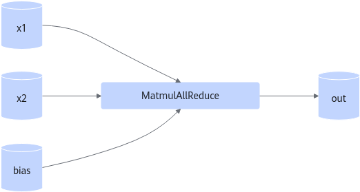

# MatmulAllReduce

## 算子基础信息

**表 1** 算子信息

|算子名称|MatmulAllReduce|
|------|----------------|
|torch_npu api接口|torch_npu.npu_mm_all_reduce_base|
|支持的torch_npu版本|2.6.0,2.8.0|
|支持的芯片类型|<term>Atlas A2 训练系列产品</term>|
|支持的数据类型|支持的输入和输出数据类型有差异，详细请参考《API参考》中的“[torch_npu.npu_mm_all_reduce_base](https://gitcode.com/Ascend/op-plugin/blob/7.3.0/docs/context/torch_npu-npu_mm_all_reduce_base.md)”章节的“参数说明”|

## torch\_npu接口参数

torch\_npu接口：

```python
torch_npu.npu_mm_all_reduce_base(x1, x2, hcom, *, reduce_op='sum', bias=None, antiquant_scale=None, antiquant_offset=None, x3=None, dequant_scale=None, pertoken_scale=None, comm_quant_scale_1=None, comm_quant_scale_2=None, comm_turn=0, antiquant_group_size=0) -> Tensor
```

> [!NOTE]
>
> torch\_npu接口中的问号表示这个输入参数是可选的。

参数说明、输出说明和约束说明具体请参考《API参考》中的“[torch\_npu.npu\_mm\_all\_reduce\_base](https://gitcode.com/Ascend/op-plugin/blob/7.3.0/docs/context/torch_npu-npu_mm_all_reduce_base.md)”章节。

## 模型中替换代码及算子计算逻辑

> [!NOTE]
>
> 当前仅展示非量化场景替换逻辑，全量化/伪量化场景请参考《API参考》中的“[torch\_npu.npu\_mm\_all\_reduce\_base](https://gitcode.com/Ascend/op-plugin/blob/7.3.0/docs/context/torch_npu-npu_mm_all_reduce_base.md)”章节的“调用示例“。

模型中替换代码：

```python
import torch.distributed as dist

world_size = 8
rank = 8
master_ip = '127.0.0.1'
master_port = '50001'
m = 64
k = 512
n = 128
input_shape = [m,k]
weight_shape = [k,n]

torch_npu.npu.set_device(rank)
init_method = 'tcp://'
init_method += master_ip + ':' + master_port
dist.init_process_group(backend="hccl", rank=rank, world_size=world_size, init_method=init_method)
if dist.is_available():
    from torch.distributed.distributed_c10d import _get_default_group, ReduceOp
    default_pg = _get_default_group()

world_size = torch.distributed.get_world_size(default_pg)
if torch.__version__ > '2.0.1':
    hcomm_info = default_pg._get_backend(torch.device("npu")).get_hccl_comm_name(rank)
else:
    hcomm_info = default_pg.get_hccl_comm_name(rank)

weight = torch.randn(weight_shape, dtype=dtype).npu()
input = torch.randn(input_shape, dtype=dtype).npu()

output = torch.matmul(input, weight)
dist.all_reduce(output,op=ReduceOp.SUM)
```

其中output替换为：

```python
output = torch_npu.npu_mm_all_reduce_base(input, weight, hcomm_info, reduce_op="sum", comm_turn=0)
```

## 算子替换的模型中小算子

MatMul/hcom\_allReduce

**图 1** 计算图  


## 使用限制

当前仅支持Atlas A2 训练系列产品TP切分场景。

## 已支持模型典型case

GPT3 65B

- case 1：

    x1: S = 1 \~ 8192, \{S,1024\}, BF16/FP16

    x2: \{1024,8192\}, BF16/FP16

    bias: \{8192\}

- case 2：

    x1: S = 1 \~ 8192, \{S,2732\}, BF16/FP16

    x2: \{2732,8192\}, BF16/FP16

    bias: \{8192\}

- case 3：

    x1: B = 1 \~ 24, \{B,1024\}, BF16/FP16

    x2: \{1024,8192\}, BF16/FP16

    bias: \{8192\}

- case 4：

    x1: B = 1 \~ 24, \{B,2732\}, BF16/FP16

    x2: \{2732,8192\}, BF16/FP16

    bias: \{8192\}
