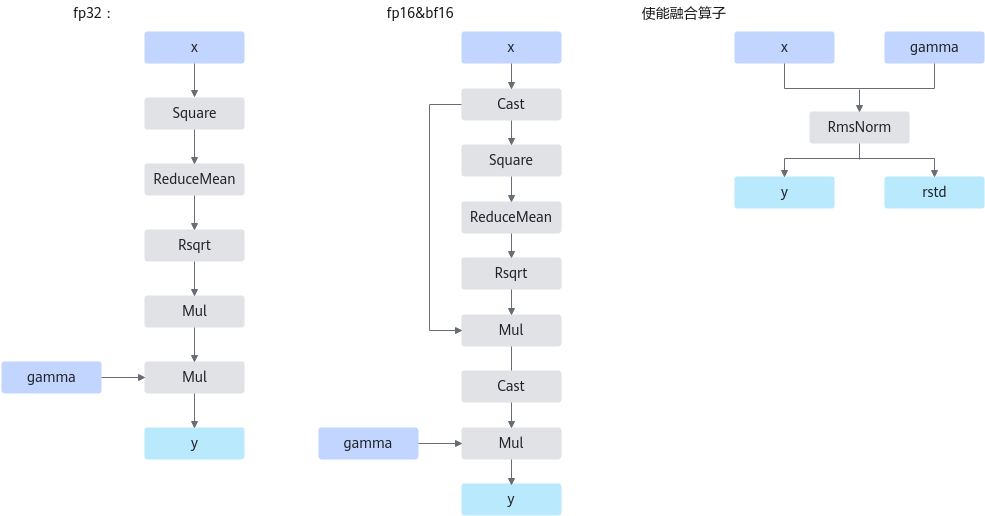
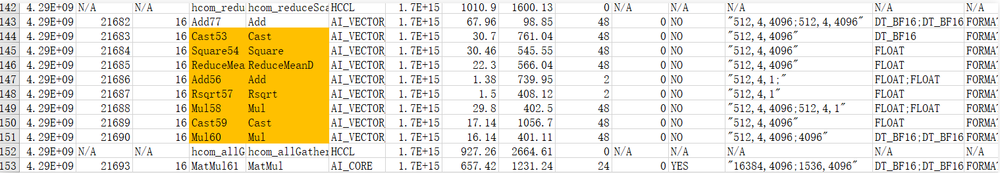

# RmsNorm & RmsNormGrad

## 算子基础信息

**表 1** 算子信息

|算子名称|RmsNorm & RmsNormGrad|
|------|----------------------|
|torch_npu api接口|torch_npu.npu_rms_norm(x, gamma, epsilon)|
|支持的PyTorch版本|2.6.0|
|支持的芯片类型|<term>Atlas A2 训练系列产品</term>，<term>Atlas A3 训练系列产品</term> |
|支持的数据类型|float16, bfloat16, float|

## torch\_npu接口参数

torch\_npu接口：

```python
torch_npu.npu_rms_norm(self, gamma, epsilon=1e-06) -> (Tensor, Tensor)
```

参数说明：

- **self：** Tensor类型，shape支持1-8维。
- **gamma：** Tensor类型，通常为weight，shape要求与self的后几维保持一致。
- **epsilon：** float数据类型，用于防止除0错误。

输出说明：

- 第1个输出为Tensor，计算公式的最终输出y。
- 第2个输出为Tensor，rms\_norm的中间结果rstd，用于反向计算。

## 模型中替换代码及算子计算逻辑

RmsNorm算子常见于LLaMA、LLaMA2、Baichuan等LLM模型中，由于torch侧没有提供RmsNorm算子的接口，因此在模型中通常是以自定义类的形式出现，在forward函数中定义计算逻辑，例如：

```python
class RMSNorm(torch.nn.Module):
    def __init__(self, dim: int, eps: float = 1e-6):
        """
        Initialize the RMSNorm normalization layer.

        Args:
            dim (int): The dimension of the input tensor.
            eps (float, optional): A small value added to the denominator for numerical stability. Default is 1e-6.

        Attributes:
            eps (float): A small value added to the denominator for numerical stability.
            weight (nn.Parameter): Learnable scaling parameter.

        """
        super().__init__()
        self.eps = eps
        self.weight = nn.Parameter(torch.ones(dim))

    def _norm(self, x):
        """
        Apply the RMSNorm normalization to the input tensor.

        Args:
            x (torch.Tensor): The input tensor.

        Returns:
            torch.Tensor: The normalized tensor.

        """
        return x * torch.rsqrt(x.pow(2).mean(-1, keepdim=True) + self.eps)

    def forward(self, x):
        """
        Forward pass through the RMSNorm layer.

        Args:
            x (torch.Tensor): The input tensor.

        Returns:
            torch.Tensor: The output tensor after applying RMSNorm.

        """
        output = self._norm(x.float()).type_as(x)
        return output * self.weight
```

替换为：

```python
import torch_npu
class RMSNorm(torch.nn.Module):
    def __init__(self, dim: int, eps: float = 1e-6):
        """
        Initialize the RMSNorm normalization layer.

        Args:
            dim (int): The dimension of the input tensor.
            eps (float, optional): A small value added to the denominator for numerical stability. Default is 1e-6.

        Attributes:
            eps (float): A small value added to the denominator for numerical stability.
            weight (nn.Parameter): Learnable scaling parameter.

        """
        super().__init__()
        self.eps = eps
        self.weight = nn.Parameter(torch.ones(dim))

    def forward(self, x):
        """
        Forward pass through the RMSNorm layer.

        Args:
            x (torch.Tensor): The input tensor.

        Returns:
            torch.Tensor: The output tensor after applying RMSNorm.

        """
        return torch_npu.npu_rms_norm(x, self.weight, epsilon=self.eps)[0]
```

**图 1** 计算流程  


融合后多了一个输出rstd，为计算中间结果，用于反向算子输入，具体如下。

```python
torch.rsqrt(x.pow(2).mean(-1, keepdim=True) + self.eps)
```

## 算子替换的模型中小算子



## 使用限制

<term>Atlas A2 训练系列产品</term>支持全泛化case，<term>Atlas 推理系列产品</term>当前仅支持gamma shape大于等于32 bytes。

## 已支持模型典型case

- case 1：

    x: \[1024, 1, 12288\], bfloat16

    gamma: \[12288\], bfloat16

- case 2：

    x: \[512, 4, 4096\], bfloat16

    gamma: \[4096\], bfloat16

- case 3：

    x: \[4, 2048, 5120\], bfloat16

    gamma: \[5120\], bfloat16

- case 4：

    x: \[2, 2048, 4096\], bfloat16

    gamma: \[4096\], bfloat16
