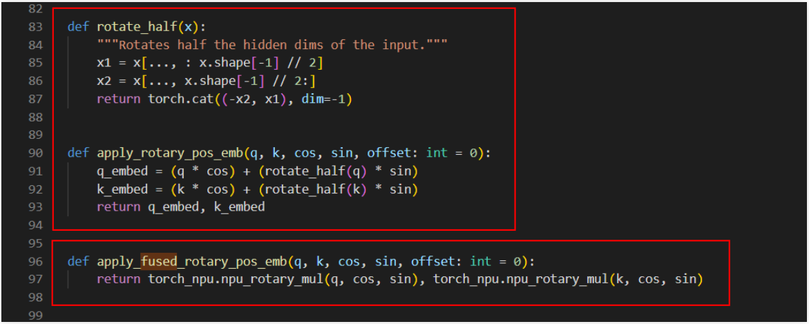
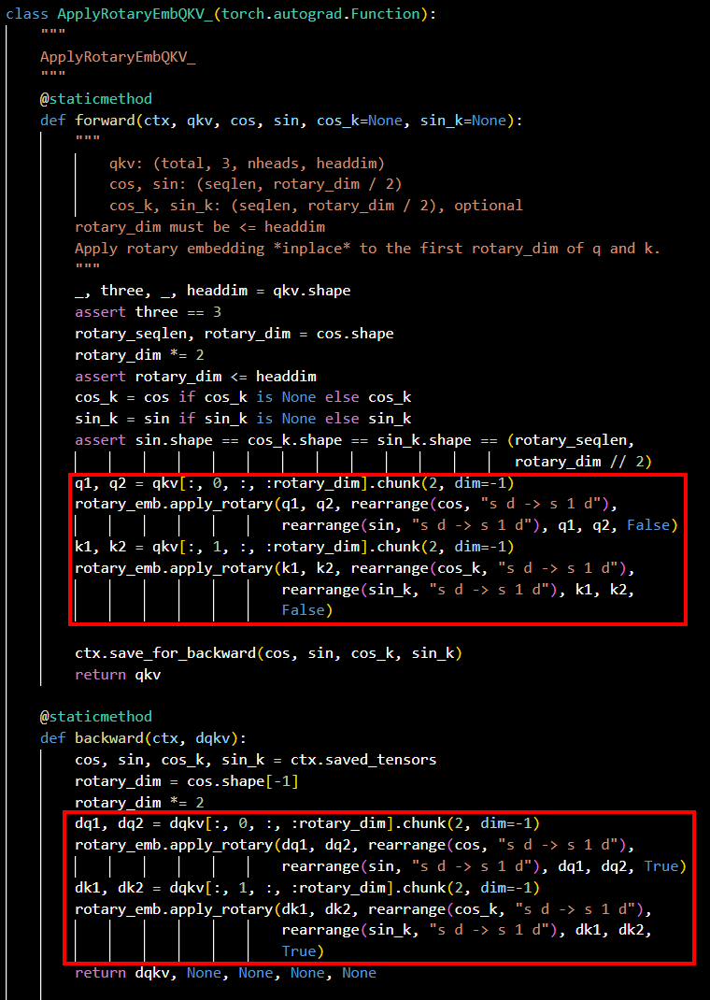
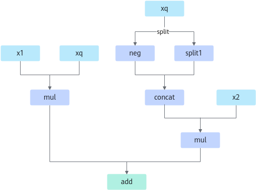
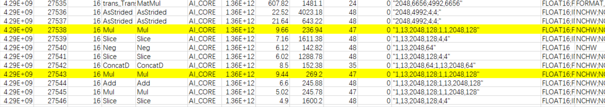

# RotaryMul & RotaryMulGrad

## 算子基础信息

**表 1** 算子信息

|算子名称|RotaryMul & RotaryMulGrad|
|-------|-------------------------|
|torch_npu api接口|torch_npu.npu_rotary_mul(x, r1, r2)|
|支持的PyTorch版本|2.7.1, 2.10.0|
|支持的芯片类型|<term>Atlas 训练系列产品</term>，<term>Atlas A2 训练系列产品</term>，<term>Atlas A3 训练系列产品</term>|
|支持的数据类型|float16, bfloat16, float|

## torch\_npu接口参数

torch\_npu接口：

```python
torch_npu.npu_rotary_mul(x, r1, r2)
```

参数说明：

- **x：** q，k，shape要求输入为4维，一般为\[B, N, S, D\]或\[B, S, N, D\]或\[S, B, N, D\]。
- **r1：** cos值，shape要求输入为4维，一般为\[1, 1, S, D\]或\[1, S, 1, D\]或\[S, 1, 1, D\]。
- **r2：** sin值，shape要求输入为4维，一般为\[1, 1, S, D\]或\[1, S, 1, D\]或\[S, 1, 1, D\]。

## 模型中替换代码及算子计算逻辑

模型中替换代码：

- **示例一：**

    模型中替换代码截图参见图1，上方红框里的内容为模型源码，下方红框里的内容为替换的新接口。

    **图 1** rotary\_mul替换代码  
    

    ```python
    q_embed = (q * cos) + (rotate_half(q) * sin)
    k_embed = (k * cos) + (rotate_half(k) * sin)
    ```

    替换为：

    ```python
    q_embed = torch_npu.npu_rotary_mul(q, cos, sin)
    k_embed = torch_npu.npu_rotary_mul(k, cos, sin)
    ```

- **示例二：**

    模型源码截图参见图2，红框里的内容为替换前的源码。

    **图 2** InterLM模型源码  
    

    ```python
    ## forward
    q1, q2 = qkv[:, 0, :, :rotary_dim].chunk(2, dim=-1)
    rotary_emb.apply_rotary(q1, q2, rearrange(cos, "s d -> s 1 d"),rearrange(sin, "s d -> s 1 d"), q1, q2, False)
    k1, k2 = qkv[:, 1, :, :rotary_dim].chunk(2, dim=-1)
    rotary_emb.apply_rotary(k1, k2, rearrange(cos_k, "s d -> s 1 d"),rearrange(sin_k, "s d -> s 1 d"), k1, k2, False)
    
    ## backward
    dq1, dq2 = dqkv[:, 0, :, :rotary_dim].chunk(2, dim=-1)
    rotary_emb.apply_rotary(dq1, dq2, rearrange(cos, "s d -> s 1 d"),rearrange(sin, "s d -> s 1 d"), dq1, dq2, True)
    dk1, dk2 = dqkv[:, 1, :, :rotary_dim].chunk(2, dim=-1)
    rotary_emb.apply_rotary(dk1, dk2, rearrange(cos_k, "s d -> s 1 d"),rearrange(sin_k, "s d -> s 1 d"), dk1, dk2, True)
    ```

    替换为：

    ```python
    ## forward
    qkv[:, 0, :, :rotary_dim] = torch_npu.npu_rotary_mul(qkv[:, 0, :, :rotary_dim],cos, sin)
    qkv[:, 1, :, :rotary_dim] = torch_npu.npu_rotary_mul(qkv[:, 1, :, :rotary_dim], cos_k, sin_k)
    
    ## backward
    dqkv[:, 0, :, :rotary_dim] = -torch_npu.npu_rotary_mul(dqkv[:, 0, :, :rotary_dim],cos, sin)
    dqkv[:, 1, :, :rotary_dim] = -torch_npu.npu_rotary_mul(dqkv[:, 1, :, :rotary_dim],cos_k, sin_k)
    ```

算子的计算逻辑如下：

```python
x1, x2 = torch.chunk(x, 2, -1)
x_new = torch.cat((-x2, x1), dim=-1)
output = r1 * x + r2 * x_new
```

**图 3** 计算流程图  


## 算子替换的模型中小算子



## 使用限制

目前算子仅支持r1、r2需要broadcast为x的shape的情形，且算子shape中最后一维D必须是128的倍数。

## 已支持模型典型case

- case 1：

  x: \[1, 13, 2048, 128\]

  r1: \[1, 1, 2048, 128\]

  r2: \[1, 1, 2048, 128\]

- case 2：

  x: \[2, 8192, 5, 128\]

  r1: \[1, 8192, 1, 128\]

  r2: \[1, 8192, 1, 128\]

  dy: \[2, 8192, 5, 128\]

- case 3：

  x: \[8192, 2, 5, 128\]

  r1: \[8192, 1, 1, 128\]

  r2: \[8192, 1, 1, 128\]

  dy: \[8192, 2, 5, 128\]
