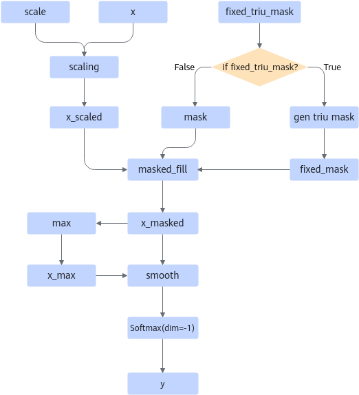
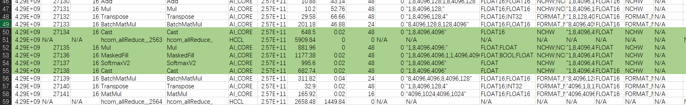

# ScaledMaskedSoftmax & ScaledMaskedSoftmaxGrad

## 算子基础信息

**表 1** 算子信息

|算子名称|ScaledMaskedSoftmax & ScaledMaskedSoftmaxGrad|
|-------|---------------------------------------------|
|torch_npu api接口|torch_npu.npu_scaled_masked_softmax(x, mask, scale, fixed_triu_mask)|
|支持的PyTorch版本|2.7.1, 2.10.0|
|支持的芯片类型|<term>Atlas 训练系列产品</term>，<term>Atlas A2 训练系列产品</term>，<term>Atlas A3 训练系列产品</term>|
|支持的数据类型|float16, bfloat16, float|

## torch\_npu接口参数

torch\_npu接口：

```python
torch_npu.npu_scaled_masked_softmax(x, mask, scale, fixed_triu_mask)
```

**表 2：** 参数定义

|名称|类型|Dtype|Shape要求|默认值|
|--|--|--|--|--|
|x|输入|bfloat16，float16，float32|必须为4维, 且后两维都需要在[32, 4096]范围内，且能被32整除|-|
|mask|输入|bool|必须为4维，且后两维和x一致，且能被广播成x的shape|-|
|scale|属性|float|对输入x缩放|1.0|
|fixed_triu_mask|属性|bool|是否生成可用的上三角bool掩码|False|

## 模型中替换代码及算子计算逻辑

模型中替换代码：

```python
if self.input_in_float16 and self.softmax_in_fp32:
    input = input.float()

if self.scale is not None:
    input = input * self.scale
mask_output = self.mask_func(input, mask) if mask is not None else input
probs = torch.nn.Softmax(dim=-1)(mask_output)

if self.input_in_float16 and self.softmax_in_fp32:
    if self.input_in_fp16:
        probs = probs.half()
    else:
        probs = probs.bfloat16()
```

替换为：

```python
probs = torch_npu.npu_scaled_masked_softmax(input, mask, self.scale, fixed_triu_mask )
```

算子的计算逻辑如下：

```python
if fixed_triu_mask:
    mask = torch.triu(mask.shape, diagonal=1)
y = torch.softmax((x * scale).masked_fill(mask, -inf), dim=-1)
```

**图 1** 计算流程图  


## 算子替换的模型中小算子



## 使用限制

- 输入x的shape限制如下：
    - 必须为4维。
    - 第三维的取值需要在\[32, 4096\]范围内。
    - 第四维的取值需要在\[32, 4096\]范围内。
    - 第三维的取值需要能被32整除。
    - 第四维的取值需要能被32整除。

- 输入mask的shape限制如下：
    - 必须为4维。
    - 后两维必须与x的后两维相等。
    - 前两维需要能被广播成x的前两维。

## 已支持模型典型case

**表 3** case列表

|id|x|mask|
|--|--|--|
|1|[1, 8, 4096, 4096]|[1, 1, 4096, 4096]|
|2|[4, 32, 2048, 2048]|[4, 1, 2048, 2048]|
|3|[8, 16, 512, 2048]|[8, 16, 512, 2048]|
|4|[8, 16, 512, 1536]|[8, 16, 512, 1536]|
|5|[8, 16, 512, 1024]|[8, 16, 512, 1024]|
|6|[8, 16, 512, 512]|[8, 16, 512, 512]|
|7|[8, 16, 512, 256]|[8, 16, 512, 256]|
|8|[4, 4, 2048, 2048]|[4, 4, 2048, 2048]|
