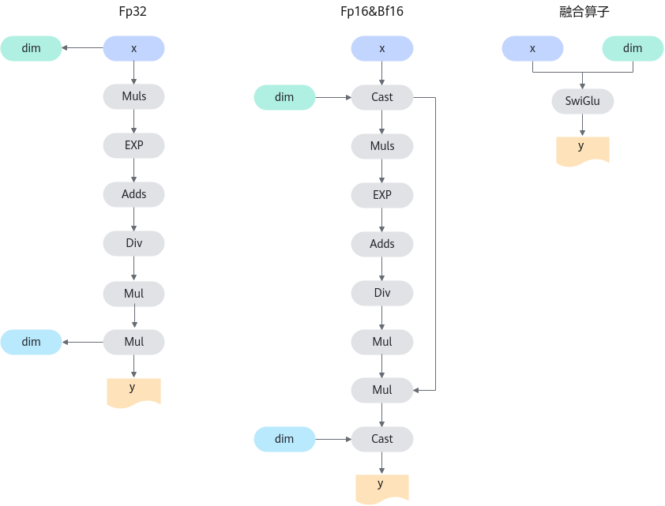
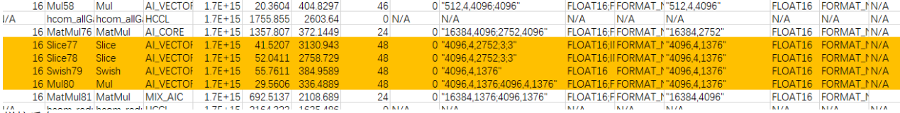

# SwiGlu

## 算子基础信息

**表 1** 算子信息
|算子名称|SwiGlu|
|------|-------|
|torch_npu api接口|torch_npu.npu_swiglu(self,dim)|
|支持的torch_npu版本|2.6.0|
|支持的芯片类型|<term>Atlas A2 训练系列产品</term>，<term>Atlas A3 训练系列产品</term>|
|支持的数据类型|float16，bfloat16，float|

## torch\_npu接口参数

torch\_npu接口：

```python
torch_npu.npu_swiglu(Tensor self, int dim=-1) -> (Tensor)
```

参数说明：

-   **self：** Tensor类型，shape支持1-8维。
-   **dim：** int类型，默认为-1。

输出说明：

输出为Tensor，计算公式的最终输出y。

## 模型中替换代码及算子计算逻辑

-   SwiGlu算子常见于LLaMA、LLaMA2、Baichuan等LLM模型中，由于torch侧没有提供SwiGlu算子的接口，因此在模型中通常是以自定义类的形式出现，在forward函数中定义计算逻辑。例如：

    ```python
    class SwiGlu(torch.nn.Module):
        def __init__(self, dim: = -1):
            """
            Initialize the SwiGlu.
    
            Args:
                dim (int): The dimension of the input tensor.
                dim(int, optional): The splitting dimension of input tensor. Default is -1.
    
            Attributes:
                dim(int): The splitting dimension of input tensor.
    
            """
            super().__init__()
            self.dim= dim
    
        def _swiglu(self, x):
            """
            Apply the SwiGlu to the input tensor.
    
            Args:
                x (torch.Tensor): The input tensor.
    
            Returns:
                torch.Tensor: The normalized tensor.
    
            """
            x = torch.chunk(x, 2, -1)
            return torch.nn.functional.silu(x[0])*x[1]
    
        def forward(self, x):
            """
            Forward pass through the SwiGlu.
    
            Args:
                x (torch.Tensor): The input tensor.
    
            Returns:
                torch.Tensor: The output tensor after applying SwiGlu.
    
            """
            output = self._swiglu(x)
            return output
    ```

-   用torch\_npu的接口替换forward函数中的所有内容。替换如下：

    ```python
    import torch_npu
    class SwiGlu(torch.nn.Module):
        def __init__(self, dim: = -1):
            """
           Initialize the SwiGlu.
    
            Args:
                dim (int): The dimension of the input tensor.
                dim(int, optional): The splitting dimension of input tensor. Default is -1.
    
            Attributes:
                dim(int): The splitting dimension of input tensor
    
            """
            super().__init__()
            self.dim= dim
    
        def forward(self, x):
            """
           Forward pass through the SwiGlu.
    
            Args:
                x (torch.Tensor): The input tensor.
    
            Returns:
                torch.Tensor: The output tensor after applying SwiGlu.
    
            """
            dim = -1
            return torch_npu.npu_swiglu(x, dim = dim)
    ```

-   算子的计算逻辑：

    参考替换前forward函数。

**图 1** 计算流程图  


## 算子替换的模型中小算子



## 使用限制

当前仅支持<term>Atlas A2 训练系列产品</term>。

## 已支持模型典型case

-   case 1:

    x: \[8192, 1, 3904\], bfloat16

-   case 2:

    x: \[4096, 4, 1376\], bfloat16

-   case 3:

    x: \[4096, 4, 4096\], bfloat16,float16

-   case 4:

    x: \[4096, 4, 6848\], bfloat16,float16

