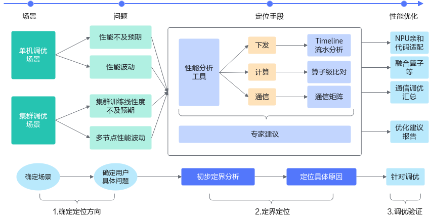

# 基础优化流程

如前文所说，模型性能涉及包括算法在内的多个模块，因此模型性能的优化的关键在于找到当前性能瓶颈，找到关键问题后再针对性优化，模型训练性能优化遵循以下流程：

**图 1** 模型训练性能优化流程  

1. 我们根据性能问题的场景，按照单机和集群场景进行分类，再明确性能问题属于哪一类，明确好性能问题背景之后，才方便进行下一步问题的定位；

2. 在明确问题背景后，参考[性能调优工具介绍](introduction_to_performance_tuning_tools.md)，选择对应的性能工具，采集性能数据并拆解性能，找到需要提升性能的模块；

3. 在明确性能瓶颈模块后，将问题细化定位到下发、计算和通信等模块，并通过本文目录搜索到对应章节找到对应优化算法。

