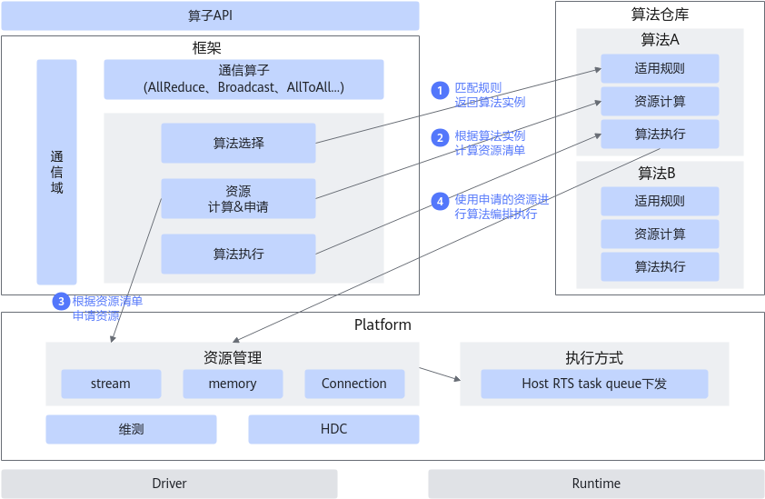
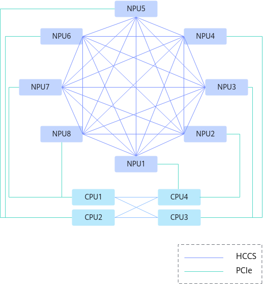
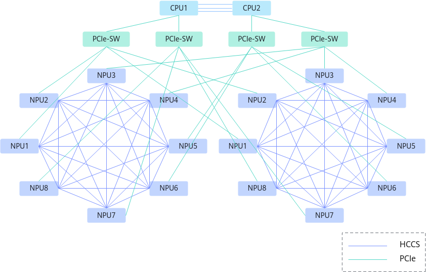

# 通信基础概述

HCCL（Huawei Collective Communication Library，华为集合通信库）是基于昇腾AI处理器的高性能集合通信库，提供单机多卡、多机多卡集合通信原语，在PCIe、HCCS和RoCE高速链路实现集合通信功能，实现分布式训练。

-   HCCS（Huawei Cache Coherent System），华为一致性系统总线，用于NPU和NPU之间互联的高速总线。
-   PCIe（Peripheral Component Interconnect Express），一种串行外设扩展总线标准，用于计算机系统的外设扩展使用。
-   DMA（Direct Memory Access）指一种高速的数据传输操作，允许在外部设备和存储器之间直接读写数据，既不通过CPU，也不需要CPU干预。
-   RDMA（Remote Direct Memory Access），远程直接内存访问技术，一般指能够跨过网络的DMA方式。
-   RoCE（RDMA over Converged Ethernet），承载在融合以太网上的RDMA技术，即跨越以太网的RDMA通信方式，本文特指RoCE v2。

**图 1**  软件架构图  

**图 2**  硬件架构图（8p）  

在硬件中，通过HCCS实现两两互联（Full Mesh），NPU和CPU之间通过PCIe连接。

Full Mesh是指在一个网络拓扑中，每个节点都直接连接到其他节点，形成一个完全互联的网络结构。在Full Mesh网络中，任何两个节点之间都可以直接通信，这种网络结构通常用于需要高度可靠性和高带宽的应用场景，如数据中心、高性能计算和金融交易等。

**图 3**  硬件架构图（16p）  

