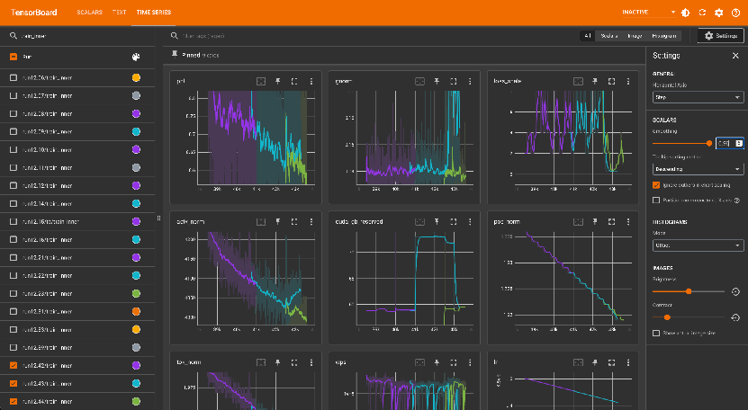
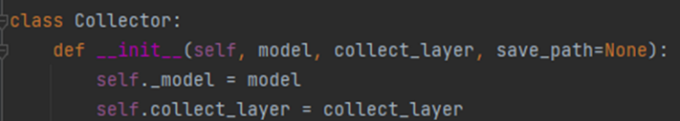
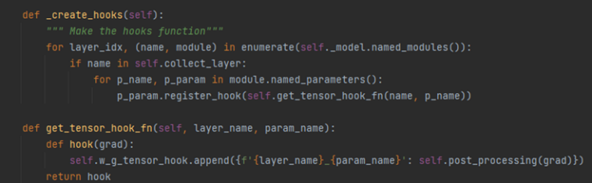

# 使用Monitor工具调试模型收敛问题

当遇到模型收敛问题时，一般的做法是将怀疑有问题的张量进行全量或者压缩后打印，这种方法存在以下缺点：

1. 自行添加的打印代码可能会对性能产生较大的影响，导致问题无法复现或者性能受到严重影响，无法跟随训练长期监视。
2. 添加张量打印代码需要对训练框架或者模型结构非常了解，并且需要较长时间的代码测试。导致自行添加张量打印门槛较高。
3. 当调试人员和模型开发人员不属于同一个组织时，调试人员无法访问所有的训练脚本，无法快速添加张量打印代码，并根据调试情况修改dump代码。

因此，为了帮助昇腾客户在实际调试模型过程中解决各种困难，开发了基于张量探查技术的Monitor调试工具。

## Monitor工具介绍

Monitor工具具备以下功能：

- 打印模型层次结构和训练使用的集合通信API，以便于接下来指定要监控的网络层和通信。
- 支持添加几行代码就可以分层按需探查训练中指定的各种中间张量，例如参数梯度、激活值梯度、权重和Adam优化器状态、梯度同步“all-reduce/reduce-scatter”和参数“all-gather”集合通信算子的输入输出张量。
- 支持多种张量压缩操作，例如norm、max、min和zeros。
- 支持张量特征值异常波动监测和告警。

Monitor工具的详细使用方法请参见[LINK](https://gitcode.com/Ascend/mstt/blob/master/debug/accuracy_tools/msprobe/docs/zh/monitor_instruct.md)。

## 使用Monitor工具解决训练问题

- 确定llama2 loss尖刺根因

    某位昇腾用户在训练类llama2-13b模型时，遇到频繁的loss尖刺，怀疑是因为Adam优化器超参配置不合理所导致的。随后使用Monitor工具，采集了词嵌入层的实际更新张量，公式如下：

    

    从采集结果可以看出，在训练稳定后的很长一段时间，词嵌入层几乎没有更新。然而，在遇到一个特定（不一定是坏数据）的batch时，词嵌入层突然发生了剧烈更新。最终确认是由于Adam优化器beta2偏大所导致的问题，当降低beta2后，问题得到解决。

- 确定Open Sora在deepspeed ZeRO-1设置下不收敛问题

    有用户反映在DeepSpeed ZeRO-1下进行训练时，使用FP32类型的反向梯度计算可以正常收敛，但使用BF16的混合精度训练却无法收敛。通过使用Monitor工具，对比Open Sora模型靠近输入的网络层（早期层）的权重梯度在dtype为FP32和BF16时的变化趋势。发现在loss跑飞前的几百步，早期层梯度在FP32和BF16下都会有上升，但由于BF16的浮点精度问题，BF16下的梯度波动更为剧烈。当用户将控制梯度裁剪的max norm值设为1，远大于正常训练时的gnorm（约为1e-4），导致梯度裁剪无法工作。因此，降低梯度裁剪的max norm参数到正确范围， BF16下的混合精度可以正常收敛。

使用工具来调试训练问题，相比于盲目调整超参，更系统化和具有确定性。在大规模训练场景下，解决问题的时间会大大缩短，节约了大量计算资源。所以我们推荐在遇到训练收敛问题时，首先使用Monitor工具打开训练过程。

## 训练状态监控

在大模型训练过程中，为确保训练的稳定性与有效性，需密切关注多项关键指标以评估训练状态，其中包括但不限于perplexity \(PPL\)、gradient norm \(GNorm\)、activation norm、内存占用情况以及Loss scale等参数。推荐采用TensorBoard工具进行数据可视化。

**图 1** TensorBoard上的数据可视化  

另外，在模型的训练中，我们可以通过PyTorch中的hook机制对容易出现问题的某些层配置hook，监控这些层的梯度信息，及时处理出现异常的step以减少对模型训练效果的影响。具体操作如下：

1. 在train方法中获取模型结构后，将模型传入指定的collector中。

    

2. 对指定层的tensor注册tensor hook，该类型hook只返回对应tensor的梯度信息，该hook会在每份micro batch数据完成反向传播后调用，即对于每份micro batch数据均有梯度值的记录。

    

对该梯度信息进行监控和分析，可以检查训练中的一些异常状态，收集梯度值时，建议只采集梯度的最大值、最小值、平均值等统计信息作为训练状态的监控指标。

除了梯度爆炸问题的监控，我们也要关注梯度下溢问题。特别是对于FP16，如果梯度出现大量0，往往意味着训练出现不正常，这时候需要停止训练，找出问题（例如伪FP32，实际是混合精度）。如果训练器使用了Loss scale，则监控Loss scale是必须的。

## 异常状态急救和恢复

当发现训练异常状态时，除了最常用的clip\_grad之外，业界实践中还会用到跳过Grad Norm异常增大的step、回滚到正常状态的checkpoint重新拉起训练，以及重新训练时清空优化器状态并从头warmup。

另外，PaLM论文提出，在发生崩溃时可以从之前的一个中间节点开始继续训练，并且跳过之前那段导致崩溃的训练数据。重新训练的checkpoint需要选择监控指标都正常的，以免最终得到的模型在下游评测任务表现不佳。为了准确判断训练是否处于健康状态，一般来说，我们应尽可能采集详细的梯度和激活值信息。

