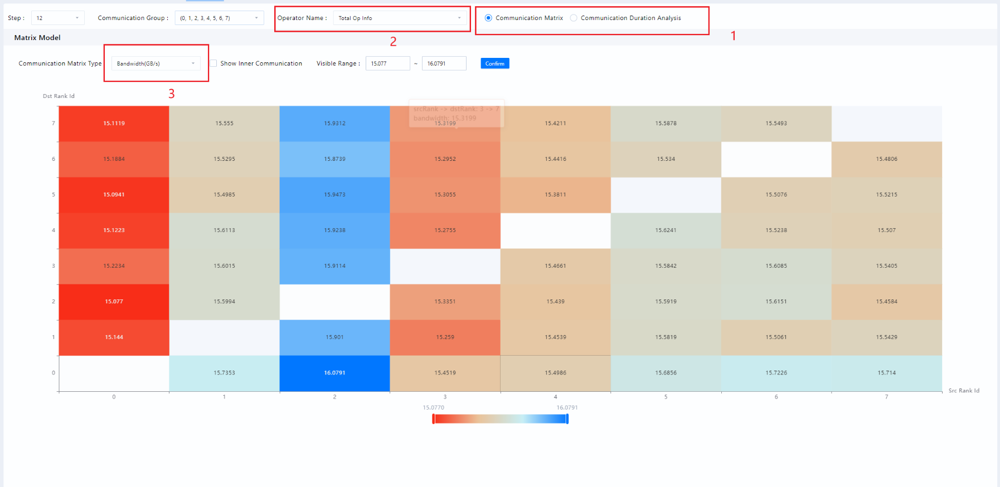
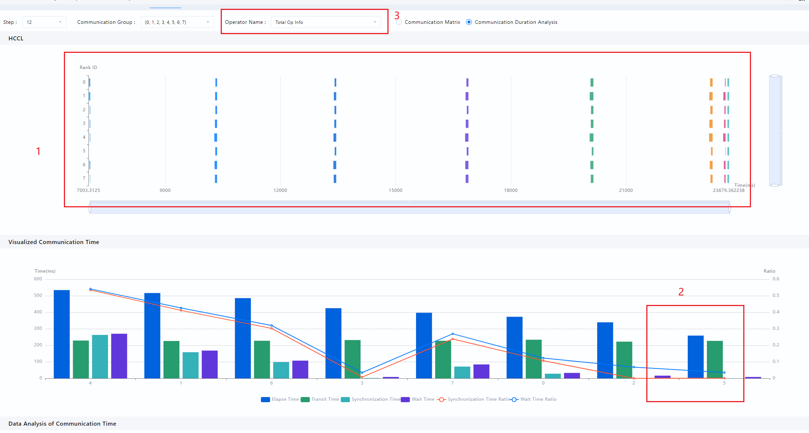
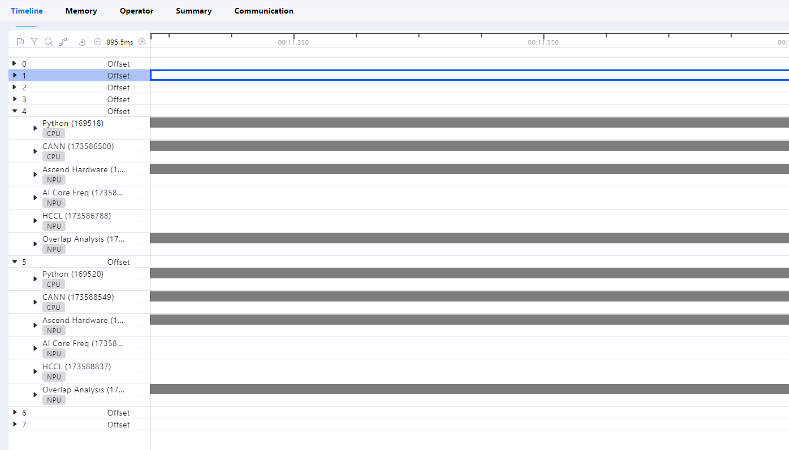
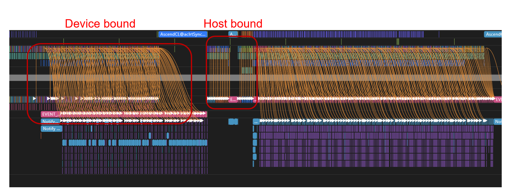
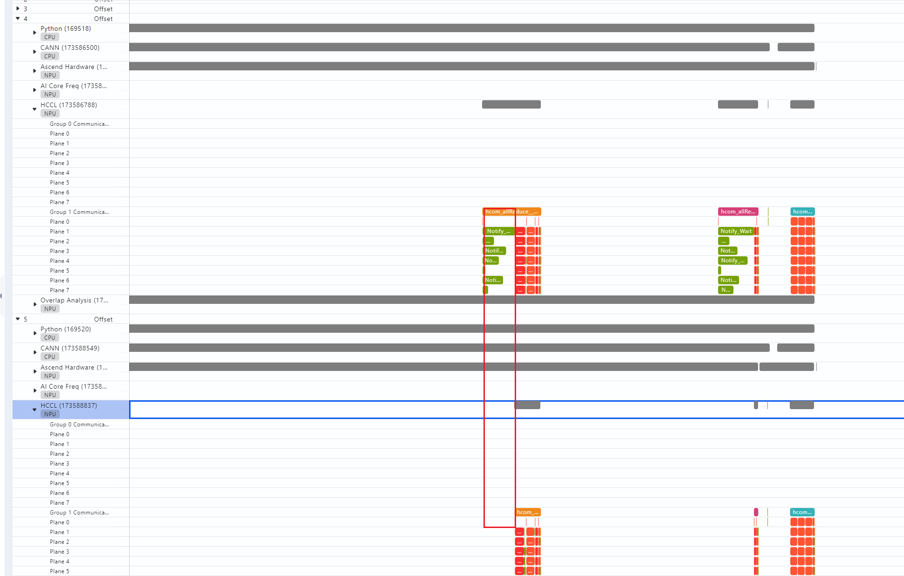
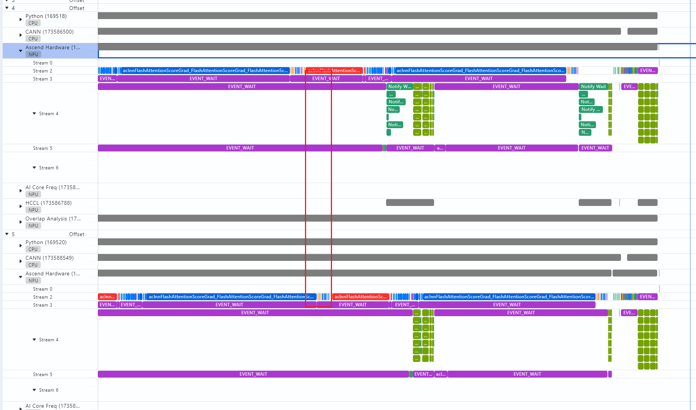
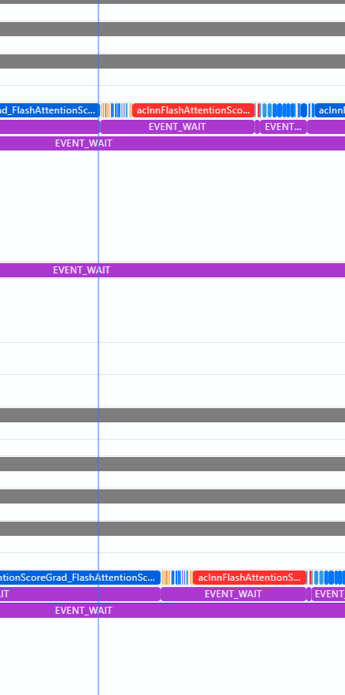
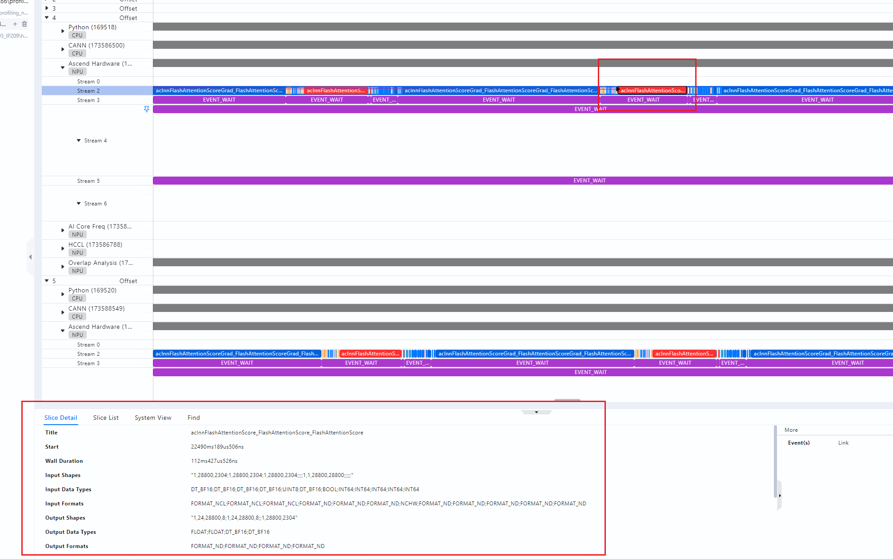
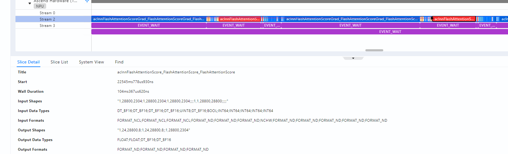

# 深入排查思路

深入排查的思路核心在于抓住优化的对象和重点。本章节以快慢卡为例，进行具体分析。

首先，我们要能定界当前性能问题所出现的位置，如[工具分析](tool_analysis.md)中提及的，可以分为计算、通信和下发（调度）三大板块。需要注意的是，这三大板块是相互交织的，要结合观察的性能问题现象和对应的实验来准确判断问题。本章节介绍深入排查的通用方法。首先获取性能数据，通过MindStudio Insight工具打开数据，以下操作以8卡的性能数据为例。

1. 算子是模型性能的基石。在打开性能数据后，优先排查“Operator“，看是否存在算子耗时的波动问题（注意确认每张卡的shape在当前step是否相同），若存在，找到对应算子，进行算子性能分析。
2. 选择“Communication（通信）”，查看相关通信信息，如下图所示：

    **图 1** “Communication“界面  
    

    - 图中“1”处，选择“Communication Matrix（通信矩阵）“，直接看总体通信情况。
    - 图中“2”处，选择具体的通信行为（如AllReduce，reduce scatter等），查看带宽是否正常。
    - 对于异常的地方，可以通过图中“3”处的“Communication Matrix Type（通信矩阵类型）“选择“Transit Size（传输大小）”，查看当前通信算子的总通信量，从而可以估计出当前通信所占的总时间。

3. 图2中“1”处，选择“Communication Duration Analysis（通信耗时分析）“，如下图所示：

    **图 2** “Communication Duration Analysis“界面  
    

    - 图中“1”处，表示每个通信域中各个卡在通信上所花费的时间。
    - 图中“2”处，蓝色部分代表端到端的总时间。通信是双工的，但通信总花费时间是通信时间+等待时间（即notify wait）。因此，蓝色部分越高的卡，代表通信等待的时间越高，而蓝色越矮的卡，代表通信等待的时间越低，而等待最少的卡，说明是最慢的卡，其他快卡已经进入到通信的准备阶段，而此慢卡依然在进行通信之前的工作，造成了其他卡漫长的等待。等待的原因很多，在RDMA场景，通信等待还会造成RDMA带宽计算错误。
    - 为了确定慢卡慢的原因，从“3”处，结合“1”处，找到某个差异较大的时间节点，然后回到timeline（时间线），找到慢卡慢的原因。对于本示例中，可以选取最慢卡5卡和相邻的快卡4进行对比，同时结合“1”，选择最后一个通信行为进行分析。

4. 选择“timeline（时间线）“，如下图所示：

    **图 3** “timeline“界面  
    

    从图中可以看出，需要对比的种子选手4卡和5卡，每张卡从上至下（在标准L1模式的性能采集的情况下），可以分为Python（CPU）、CANN（CPU）、Ascend Hardware（NPU）、AI Core Freq、HCCL和Overlap Analysis几个栏目。其中我们将Python（CPU）、CANN（CPU）称为一级流水和二级流水（当然，在其内部，依然可以采用流水线并行的方法继续产生新的流水，这里以组件的维度简化描述），代表着模型PyTorch侧的操作和在CANN侧的操作，一般将这两级流水称为下发。在这里，介绍下host bound和device bound两个概念，如下图所示：

    **图 4**  host bound和device bound  
    

    图中的连线是host侧api和device侧执行算子之间的连线，异构算力之间时钟差异可以忽略时（一般在100us量级，绝大多数场景均无需考虑）。当连线为竖直线时，代表此时api下发算子无需等待device，下发即计算，代表着device在空转等着host下发，性能的瓶颈在host，即Host bound，反之，连线为斜线，代表为device bound。

5. Ascend Hardware即为用于计算的设备，会显示具体运算的算子，AI Core Freq则代表设备频率，一般而言，恒定而不会发生变化。HCCL则代表模型的通信情况。最后，Overlap Analysis代表计算和通信相互的掩盖情况，可以分为掩盖通信、未掩盖通信和Free，其中Free代表此时设备既没有在通信也没有在计算。回到快慢卡分析，对于4卡和5卡，首先通过HCCL找到差异较大的通信域，如下图所示：

    **图 5**  通信域  
    

6. 从此通信操作，在同一时间线，竖直向上找到Ascend Hardware，查看计算差异，如下图所示：

    **图 6**  计算差异  
    

7. 从红色方块算子（aclnnFlashAttention）可以发现，两者的差距不在计算本身，而在于这个算子的开始时间不一致。而之所以开始时间不一致，是因为5卡前序算子的计算尚未完成。因此，沿着水平向左的方向，继续寻找，找到最左边的aclnnFlashAttention，如下图所示：

    **图 7**  问题定位  
    

8. 可以发现，上面的aclnnFlashAttention的耗时要更长，我们选中4卡算子，可以从slice看到算子具体信息，如下图所示：

    **图 8**  4卡算子具体信息  
    

9. 然后选中5卡对应的算子，如下图所示：

    **图 9**  5卡算子具体信息  
    

    发现两者差距在8ms，波动在10%以内，比较合理。继续水平向左，慢慢地，我们发现，两张卡的耗时差距越来越小，因此，对于这个案例，可以说问题出在这个算子耗时的差距（当然，这个可以从op statistics中也可以看到，这里只是讲解如何寻找性能问题的方法）。如果发现Ascend Hardware上的差距来源于下发，即有张卡迟迟没有下发该算子，那则竖直向上，从CANN侧寻找问题，如此类推，通过竖直向上和水平向左，基本可以找到大部分问题点。
