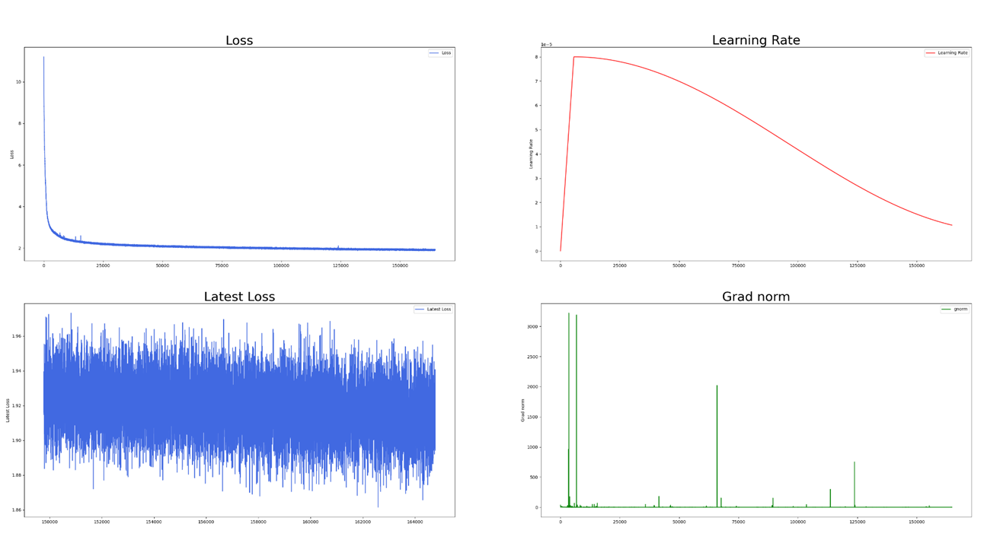

# 稠密模型调优案例

## 问题现象

客户预训练一个参数量为7B的稠密模型时，loss收敛约1.9，但是在MMLU评分上模型一直没有出现涌现能力。

## 问题定位

首先了解模型训练的大致情况。客户使用了多个预训练数据集，总共600B tokens。一些关键的超参如下所示：

**表 1**  超参数

|超参数|超参值|
|--|--|
|gbs|384|
|seq-length|8192|
|dp|24|
|micro batch size|1|
|lr|8e-5|
|min_lr|8e-6|

从关键的超参可以算出来每个dp rank一个迭代步处理的mini batch size是384/24=16。而micro batch size是1的话，那么需要梯度累积16次再做dp域的梯度同步。gbs换算成token数是384\*8192，大约是3M。

预训练的Loss曲线、Grad norm曲线和学习率调度曲线如下：

**图 1**  预训练曲线图  

从Loss收敛情况看，整个训练过程比较稳定，没有出现比较大的Loss尖刺。但在MMLU评分上，未复现出涌现能力，评分始终在25附近。因为MMLU是一个包含57个子任务的英文评测数据集，涵盖历史，法律等学科。每个问题是一个四选一的单项选择题，模型根据提示词补全回答。25分意味着模型在做盲猜，没有出现所谓的涌现能力。根据可参考资料显示，7B模型在训练完600B token的数据后，MMLU评分应该在40分以上。

## 优化方案

我们对比了公开资料里类似7B模型的训练超参数，发现此次无涌现能力的训练使用了较大的gbs和较小的学习率\(8e-5\)。客户之所以选择较小的学习率，是因为训练不稳定，需要频繁的训练看护，例如从训练正常的检查点拉起重新训练。在使用小的学习率后，600B token训练完loss可以稳定收敛到2以下的水平。通常情况下，对于7B模型来说3M\~8M token的gbs，使用3e-4的学习率是能够稳定训练的，而不应该使用8e-5的学习率。经过分析我们发现有问题的每个迭代步均做了16次梯度累积，梯度累积使用的是bf16，精度不够容易引起训练稳定问题。所以使用大gbs时，需要大dp，并且使用fp32做dp rank间的梯度同步，这样可以使用比较大的学习率而不会引起训练稳定性问题。

在加大dp，减小gbs后，我们避免了单步的多micro batch梯度累积（此案例未使用流水线并行，所以不需要多micro batch减少计算空泡），并且使用3e-4的学习率训练。训练能够稳定收敛，并且最终在训练300B token后开始产生涌现能力，在600B token后达到了40分以上的MMLU评分。

