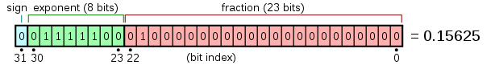
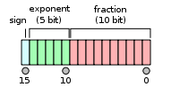
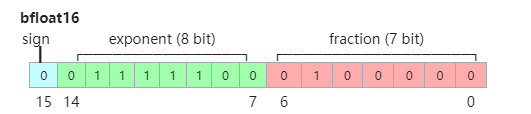

# 浮点数计算

浮点数计算的精度问题根源于计算机中使用特定格式的二进制数表示实数，而二进制只能表示有限数目的离散实数，对于某些十进制小数，只能近似表示。浮点数计算的精度问题只能消减而不能根除，所以理解不同浮点类型的差异对大模型训练至关重要。

在CPU计算场景中，经常使用双精度浮点类型double，也称为FP64或者float64。但是在机器学习和AI加速器计算场景下，由于参数规模巨大，很难也没有必要使用双精度数来存储和计算。单精度浮点数和半精度浮点数为大模型训练中常用的数据类型。

## 单精度浮点数

FP32或者float32是一种IEEE 754标准定义的浮点格式，它使用32个比特位表示一个浮点数，这些比特位包括一比特正负符号位，8个比特的指数位和23个比特的小数位。比特位结构布局如下：



当指数位不为0时，这32比特表示的浮点数V称为规格数，它由下列公式定义：


当exponent为0时，它表达的浮点数称为非规格数，由下列公式定义：


NPU或主流AI处理器在fast模式下都只能对规格数进行运算，非规格数将被转换为零，并且除法和平方根运算不会被计算到最接近真实值的浮点数值。

当exponent比特位全1时，表达的浮点数有特殊含义。如果此时fraction为0，则V为正负无穷大，如果fraction不为0，则V为NaN。

FP32格式能表示的绝对值最小规范浮点数为2<sup>-126</sup>，约等于1.18e-38。绝对值最大规范浮点数为2<sup>127</sup>  \* \[1 +\(2<sup>23</sup>  - 1\)/2<sup>23</sup>\]，约等于3.4e38。在1附近，两个相邻浮点数差距为2<sup>-23</sup>，约为1.2e-7。所有位置上相邻浮点数的相对差距大约为1.2e-7。可见FP32的浮点精度很高。

## 半精度浮点数

由于大模型参数规模巨大，对AI加速器设备内存要求很大，所以使用16位半精度格式比32位单精度更有优势。另外半精度运算速度更快，精度对机器学习模型往往也能够满足要求。和主流AI处理器一样，最新的昇腾AI加速器也支持两种半精度浮点格式即FP16和BF16。

- **FP16格式**

    FP16或者float16是一种IEEE 754标准定义的半精度浮点格式，它使用16个比特位表示一个浮点数，这些比特位包括1个比特的正负符号位（sign），5个比特的指数位（exponent）和10个比特的小数位（fraction）。比特位结构布局如下：

    

    和FP32一样，如果指数位非0，则能表示一个规格浮点数V，公式如下：

    

    FP16非规格数这里不再赘述。

    在1附近，相邻两个浮点数的间隔是2<sup>-10</sup>。任意位置的两个相邻浮点数的相对间隔也是2<sup>-10</sup>，大约是千分之一。FP16的精度误差带来的严重问题就是加法的大数吃小数。例如：

    ```python
    x = torch.tensor(1, dtype=torch.float16)
    y = torch.tensor(0.0001, dtype=torch.float16)
    ```

    x+y仍然是1.0，因为1.0001 FP16没法表示，1后面FP16能表达的最小数为1.0009765625。

    FP16能表达的最大绝对值规范浮点数为2<sup>15</sup>  \* \(1+1023/1024\)=65504，最小绝对值规格浮点数为2<sup>-14</sup>，约为6.1e-5。这意味着超出65504和小于6.1e-5的数FP16都没法表示，而这些数在大模型训练中都很常见。为了避免下溢，FP16需要结合Loss scale才能用于大模型训练。

- **BF16格式**

    为了解决FP16表达范围偏小的问题，谷歌大脑研究组提出了bfloat16浮点格式，或者叫BF16。BF16的比特位结构布局如下：

    

    BF16相对于FP16，增大指数位宽到8（与FP32一样），将小数位宽减小到7。这样可以增大浮点表达范围，但同时牺牲了表达精度。当exponent不为0时，BF16浮点值公式如下：

    

    在1.0附近，BF16可表示的相邻浮点数的间隔为1/128。任意位置的相邻浮点数相对间隔是1/128，可见BF16的精度是很低的，只是FP16的十分之一精度。BF16最大可表示的规范浮点数为2<sup>127</sup>  \* \(1+127/128\)，约为3.4e38, 绝对值最小的规范浮点数为2<sup>-126</sup>，约为1.176e-38。

    BF16的精度在大部分大模型训练场景下仍然是足够的，但要注意某些特定运算，例如涉及累加，需要用更高精度的FP32完成。

综上所述，选择合适的浮点数精度对于优化模型训练过程至关重要，尤其是在处理因浮点精度引起的收敛问题时，需要结合文献研究成果和实践经验，并通过大量的对比实验进行调试和优化。
