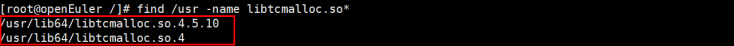
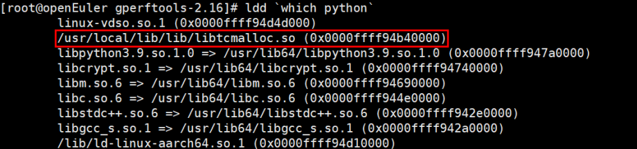

# 高性能内存库替换

tcmalloc（即Thread-Caching Malloc）是一个通用的内存分配器，通过引入多层次缓存结构、减少互斥锁竞争、优化大对象处理流程等手段，在保证低延迟的同时也提升了整体性能表现。这对于需要频繁进行内存操作的应用来说尤为重要，尤其是在高并发场景下能够显著改善系统响应速度和服务质量。

## 使用方法

1. 安装tcmalloc。
    - 方法一：通过系统自带的安装命令安装。（**推荐采用此方式安装**，避免兼容性问题，若当前系统的软件源无对应的软件包，则请尝试方法二）

        ```shell
        # openeuler
        yum install gperftools
          
        # centos
        yum install gperftools gperftools-devel
          
        # ubuntu
        sudo apt update
        sudo apt install libgoogle-perftools4 libgoogle-perftools-dev
        ```

    - 方法二：通过源码安装。（源码安装依赖libunwind，请确保系统已安装该依赖包）

        ```shell
        wget https://github.com/gperftools/gperftools/releases/download/gperftools-2.16/gperftools-2.16.tar.gz
        tar -xf gperftools-2.16.tar.gz && cd gperftools-2.16
        ./configure --prefix=/usr/local --with-tcmalloc-pagesize=64
        make
        make install
        ```

2. 确认动态库的位置。

    openeuler：安装完成后确认tcmalloc的动态库文件位置。

    ```shell
    rpm -ql gperftools-libs
    ```

    其他安装方式可以尝试搜索文件，一般安装在/usr/lib64或者/usr/local目录下。

    ```shell
    find /usr -name libtcmalloc.so*
    ```

    找到对应路径下的动态库文件，libtcmalloc.so或者libtcmalloc.so.版本号都可以使用。

    

    - 设置tcmalloc为优先加载，LD\_PRELOAD环境变量的值为tcmalloc动态库文件的路径。

        ```shell
        export LD_PRELOAD="$LD_PRELOAD:/usr/local/lib/libtcmalloc.so"
        ```

        export环境变量后，当前终端执行的所有程序都会优先使用tcmalloc，如果只想在某个程序使用tcmalloc，可以通过如下方式执行命令。

        ```shell
        LD_PRELOAD="/usr/local/lib/libtcmalloc.so" python train_script.py
        ```

3. 确认当前终端环境是否优先使用tcmalloc。

    如果发现动态库中包含libtcmalloc的动态库路径，则说明配置已生效，以Python为例，可以看到当前Python命令均使用了libtcmalloc动态库，后续执行Python脚本时，底层均使用了tcmalloc进行内存分配。

    ```shell
    ldd `which python`
    ```

    

4. 执行需要运行的脚本程序。

    ```shell
    python train_script.py
    ```
