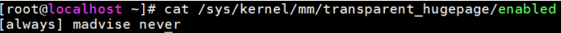
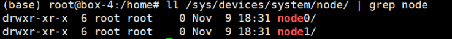
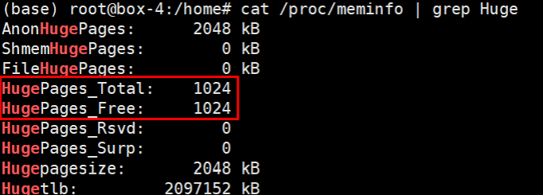
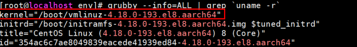
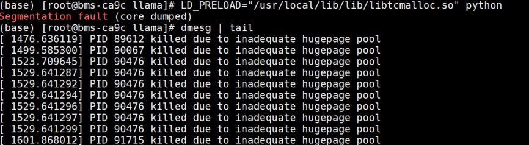
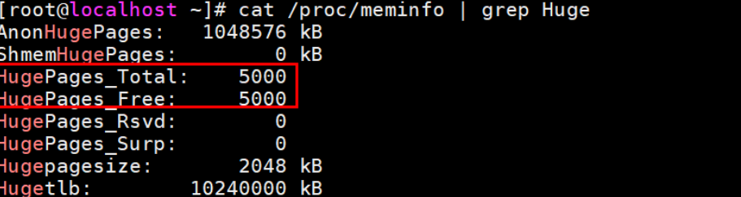
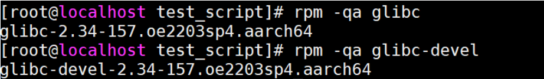
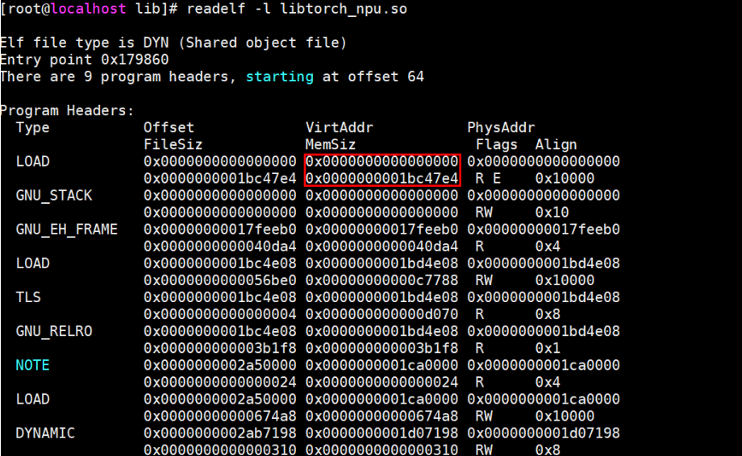

# 大页内存相关优化

## 开启大页内存池

在Linux操作系统上运行内存需求量较大的应用程序时，由于操作系统采用的默认页面大小为4KB，因而将会产生较多TLB Miss和缺页中断，从而大大影响应用程序的性能。当操作系统使用大页内存时，将会大大减少TLB Miss和缺页中断的数量，显著提高应用程序的性能。大页内存分为两种，一种是标准大页，标准大页适合那些需要高性能和细粒度控制的应用程序，适用于对内存管理和性能有严格要求的场景。另一种是透明大页，透明大页适合那些希望简化配置并自动优化内存使用的应用程序，尤其适用于大多数通用场景，可根据需要来选择开启哪种大页。

> [!NOTICE]
> 
> malloc使用大页和tmpfs使用大页特性已在openEulerOS、CentOS场景下验证，由于不同OS命令使用上存在差异，无法保证在其他操作系统均能支持。glibc动态库大页特性为openEulerOS自研特性，仅支持openEulerOS，其他操作系统暂不支持。

以下为各优化手段对大页内存支持的情况，各优化手段可搭配使用：

**表 1** 大页内存优化手段

|优化手段|支持透明大页|支持标准大页|是否需要重启物理机|
|--|--|--|--|
|malloc使用大页|支持，（glibc低版本不支持，高版本支持，参考[malloc使用大页](#malloc使用大页)）|支持|否|
|tmpfs使用大页|支持|不支持|否|
|glibc动态库大页|不支持|支持|否|

> [!CAUTION]
>
> 标准大页（HugePages）技术于Linux Kernel 2.6版本被引入到内核，可通过`uname -r`命令确认当前内核版本是否大于2.6。

### 使能OS开启透明大页内存

> [!CAUTION]
>
> 开启透明大页前使用“getconf PAGESIZE”检查当前Linux操作系统页大小，若显示“4096”则表明当前操作系统默认使用的4K页内存，建议开启透明大页；若显示“65536”则表明当前操作系统使用的是64K页内存，此时透明大页2MB仅能覆盖32个基础页，无法有效缩小页延迟或者减少TLB miss，建议关闭透明大页。

1. 确认透明大页是否开启：

    执行命令cat /sys/kernel/mm/transparent_hugepage/enabled确认透明大页是否启动，若回显结果为[always]则表明已开启透明大页。一般透明大页是默认开启的。

    

2. 执行以下命令，开启透明大页：

    ```shell
    echo always > /sys/kernel/mm/transparent_hugepage/enabled
    ```

    需要注意的是采用这种方式开启透明大页，重启服务器后会失效。

### 使能OS开启标准大页内存

- 临时启用标准大页内存池。

    方法一（推荐采用此方法，不需要重启机器）：

    ```shell
    # vm.nr_hugepages的值即为2M标准大页的数量，申请标准大页会导致OS内存相应减少，建议按需设置对应大小。
    sysctl -w vm.nr_hugepages=1024
    ```

    方法二：

    ```shell
    # 首先确认当前环境有几个node节点。
    ls /sys/devices/system/node/ | grep node
    ```

    

    每个NUMA节点都写入对应数量的值，这个值表示各个节点待分配的2M标准大页的数量，建议每个节点分配内存为：待申请2M标准大页内存池总数量/node数量。

    ```shell
    echo 512 > /sys/devices/system/node/node0/hugepages/hugepages-2048kB/nr_hugepages
    echo 512 > /sys/devices/system/node/node1/hugepages/hugepages-2048kB/nr_hugepages
    ```

    > [!NOTE]
    > - 采用方法二配置标准大页时，x86和Arm标准大页的配置方式有所不同，Arm机器需要针对NUMA各个节点都配置大页才能保证各个CPU能够访问大页内存池。
    > - Arm机器若已经确定需要使用哪几个node（例如通过绑核等手段限定使用哪几个node时），可以仅设置需要使用的node节点。

    申请完成后使用如下命令确认大页已完成分配。

    ```shell
    cat /proc/meminfo | grep Huge 
    ```

    

- 永久启用标准大页内存池。

    > [!CAUTION]
    > 
    > 修改启动项配置属于危险操作，请谨慎修改启动项配置，建议采用临时分配大页的方式申请大页内存池。

    - 执行以下命令，查看Linux启动项信息，确认当前系统启动项名称。（一台机器可以安装多个内核版本，请先确认当前正在运行的内核版本对应的是哪个启动项）

        ```shell
        grubby --info=ALL | grep `uname -r`
        ```

        kernel对应的值就是当前系统启动项内核名称，也就是我们需要设置大页内存的内核。

        

    - 更新系统启动项参数。

        ```shell
        grubby --update-kernel=/boot/vmlinuz-4.18.0-193.el8.aarch64 --args="default_hugepagesz=2M hugepagesz=2M hugepages=5000" 
        ```

        > [!NOTE]
        >- 更新对应启动项参数，update-kernel后面的参数即上一步获取的kernel后面对应的字符串。
        >- default_hugepagesz表示系统默认的大页内存大小，hugepagesz表示系统可选哪些大小的大页，hugepages表示设置每种size的大页最多可申请多少个。
        >- 一般推荐选择2M大小作为大页size，可申请大页内存数量一般建议设置5000以上，内核版本越高需要的大页内存可能也会更高。

    - 重启物理机。

        ```shell
        reboot
        ```

        > [!NOTE]
        >- 申请一定大小的大页内存，相应的OS可用内存大小也会等量减少，建议选取合适的大小，一般设置5000个2M大页即可（申请大页内存大小为各种size的大页内存 \* 大页内存数量之和，以上述例子为例，hugepagesz=2M仅设置了一种size的大页，且hugepages=5000，因此系统会预分配5000 \* 2M = 9.7G）。
        >- 若大页内存数量过小，而开启相关优化手段后，程序可能引起大页内存池内存不够导致进程coredump，可以通过`dmesg | tail`检查系统日志是否有`PID xxx killed due to inadequate hugepage pool`。
        > 
        >- 上述大页内存配置方法仅支持在物理机上，不适用于虚拟机配置标准大页。
        >- 设置完启动项参数之后，必须重启系统才能生效。

    - 删除启动项参数。

        ```shell
        grubby --update-kernel=/boot/vmlinuz-4.18.0-193.el8.aarch64 --remove-args="hugepages hugepagesz default_hugepagesz"
        ```

        > [!CAUTION]
        >
        > 删除启动项之后同样需要重启系统才能生效。

    - 确认配置是否生效。

    重启系统之后，可以通过命令cat /proc/cmdline确认当前系统启动时是否带有大页相关参数。也可使用cat /proc/meminfo | grep Huge来查看当前系统可用的大页内存大小。其中HugePages_Total表示总共可用大页数量，HugePages_Free表示当前系统可用大页数量。若HugePages_Total为你所设置的数量，则表明大页内存启用成功；若这个数量为0，则表明未启用大页内存。

    

## malloc使用大页

glibc可以通过Tunables参数来设置malloc使用大页，注意该特性对glibc的版本有要求，可通过ldd --version命令确认当前glibc版本。

**表2** glibc版本及启动方式

|glibc版本|启用方式|
|--|--|
|2.28到2.34之间（不包括2.34）|1. 首先需要额外安装libhugetlbfs库。<br>2. 安装完成后通过命令`find /usr -name "libhugetlbfs.so*"`寻找对应动态库路径。一般在`/usr/lib64/libhugetlbfs.so`路径下，然后执行以下命令：<br>`export HUGETLB_MORECORE=yes`<br>`export LD_PRELOAD=/usr/lib64/libhugetlbfs.so`<br>glibc版本低于2.34（不包括2.34）只能通过libhugetlbfs库的能力使用标准大页。|
|大于等于2.34|&#8226; 导入环境变量`export GLIBC_TUNABLES=glibc.malloc.hugetlb=1`，其中1表示glibc的malloc函数会使用透明大页。<br>&#8226; `export GLIBC_TUNABLES=glibc.malloc.hugetlb=2`，2表示glibc的malloc函数会使用标准大页。|

> [!NOTE]
>
> - 如果训练模型场景下，使用标准大页出现报错：`Bus error. It is possible that dataloader's workers are out of shared memory. Please try to raise your shared memory limit.`，可以尝试使用透明大页规避这个问题。
> - 若在容器中使用，请先确保容器环境有权限申请大页内存池；低版本glibc（glibc版本低于2.34）采用libhugetlbfs申请大页的方式。

## tmpfs使用大页

tmpfs大页（也称为临时文件系统大页）是指在临时文件系统（tmpfs）中使用的大页内存。tmpfs是一种驻留在内存中的文件系统，用于存储临时数据。使用大页内存可以显著提高某些类型工作负载的性能，特别是那些需要频繁访问大量内存的应用程序。内存文件系统tmpfs可以使用透明大页，使用后程序和动态库会自动在代码段使用大页映射，提升运行性能。

> [!CAUTION]
>
> 在容器中使用时，需保证容器环境具有挂载tmpfs的权限，或者可以先在宿主机配置好后，容器环境挂载对应tmpfs目录到docker中即可。

### 使用方法

- 创建待挂载tmpfs的目录：

    ```shell
    mkdir -p /mnt/temp
    ```

- 挂载tmpfs时使用透明大页：

    ```shell
    mount -t tmpfs -o huge=always tmpfs /mnt/temp
    ```

- PyTorch使能tmpfs大页：

    ```shell
    export TMPDIR=/mnt/temp
    ```

- 关闭tmpfs使用大页：

    ```shell
    umount /mnt/temp
    ```

## glibc动态库大页

在应用程序执行过程中，许多动态库默认使用4KB小页，进程iTLB miss高，导致CPU执行效率低下。开源的代码段大页方案需要浪费额外的内存，同时影响进程启动速度，而OpenEuler提供的glibc加载动态库方案默认映射大页则可以减少内存开销，同时加快进程启动速度，最终能达到降低iTLB cache miss以提升性能的结果。该方法需要预先分配标准大页内存池，请先参考[使能OS开启标准大页内存](#开启大页内存池)，确保有足够的标准大页内存空间。

### 安装方法

1. 该特性需安装对应版本的glibc和glibc-devel包，详细对应版本要求见如下表格说明。
2. glibc为Linux核心软件包，不推荐直接安装，容易造成软件兼容性问题，建议安装OpenEuler后使用，也可以通过OpenEuler的docker镜像使用（openeuler源地址：[https://repo.openeuler.org/](https://repo.openeuler.org/)，选择下面表格中符合要求的OpenEuler版本，例如：openEuler-22.03-LTS-SP4/docker_img/aarch64/openEuler-docker.aarch64.tar.xz）。

3. EulerOS使用该特性需要额外配置启动项参数exec_hugepages，具体修改启动项配置可参考“[使能OS开启标准大页内存](#开启大页内存池)”中的“永久启用标准大页内存池”章节。

    **表 3** 软件版本要求

    |操作系统名称|软件版本要求|
    |--|--|
    |OpenEuler|操作系统版本：openEuler-22.03-LTS-SP1、openEuler-22.03-LTS-SP3、openEuler-22.03-LTS-SP4<br>上述OS版本对应软件版本要求均为，glibc版本和glibc-devel版本大于等于2.34-h157。|
    |EulerOS|操作系统版本：eulerosv2r10、eulerosv2r11、eulerosv2r12、eulerosv2r13<br>&#8226; eulerosv2r10对应glibc和glibc-devel的版本号为大于等于2.28-63.h52。<br>&#8226; eulerosv2r11对应glibc和glibc-devel的版本号为大于等于2.34-70.h8。<br>&#8226; eulerosv2r12对应glibc和glibc-devel的版本号为大于等于2.34-105.h1。<br>&#8226; eulerosv2r13对应glibc和glibc-devel的版本号为大于等于2.34-143.h3。|

> [!CAUTION]
> 
> 建议采用**rpm -qa glibc**或者**rpm -qa glibc-devel**命令查询当前glibc版本，使用**ldd --version**只能看到glibc上游社区的版本，无法看到OpenEuler发行的h版本号。

### 使用方法

确认glibc和glibc-devel是否安装，版本是否符合要求。

```shell
rpm -qa glibc
rpm -qa glibc-devel 
```



若glibc-devel未安装，可以使用下面命令安装：

```shell
yum install glibc-devel 
```

若glibc版本低于要求，可通过如下命令更新glibc版本：

```shell
yum upgrade glibc glibc-devel
```

- 方法一（推荐使用）：

    使用`LD_HUGEPAGE_LIB`环境变量，会让可执行程序依赖的所有动态库都尝试映射大页。变量值为动态库的大页模式（当前仅支持0或1，其他值未定义）：

    - 配置为1，使用动态库大页模式。
    - 配置为0，动态库不使用大页。

    该环境变量不会被复制到子进程，建议在运行程序入口配置，在外部shell脚本（非程序入口）设置不会生效，例如脚本训练入口：

    ```shell
    export LD_HUGEPAGE_LIB=1
    torchrun --nnodes=1 --nproc_per_node=8 --master-port 61888 scripts/train.py \
    configs/opensora-v1-1/train/stage1.py 
    ```

- 方法二（不推荐使用，使用方法较复杂，需要细粒度控制标准大页分配时可以尝试此方法）：本方法支持更细粒度地控制哪些动态库使用标准大页，并且支持标记指定的段。
    1. 首先确认当前待运行程序会使用到的动态库。

        使能动态库大页，并非动态库的所有PT_LOAD段的映射都会使用大页，只有PT_LOAD段映射的区间覆盖了至少一个完整的2MB大页，才会尝试映射2MB大页。

        可以通过readelf -l xxx.so来判断当前动态库LOAD段是否超过2M，下面以libtorch_npu.so为例：

        

        上面图中，LOAD段对应VirtAddr和MemSiz分别为0x0000000000000000和0x0000000001bc47e4，段大小即MemSize为十六进制的0x0000000001bc47e4，转换为十进制之后为29116388字节，进一步计算为27M，超过了2M，因此libtorch_npu.so使用动态库大页可生效。

        >[!NOTE]
        >- libtorch\_npu.so为Python软件包torch\_npu提供，请先确认当前应用程序是否会使用到该动态库。
        >- conda环境下，请确保标记的动态库文件为应用程序所使用的动态库文件。

    2. 标记动态库。

        > [!CAUTION]
        >
        > hugepageedit工具为glibc-devel包提供的二进制程序，若无此命令请参考上面使用方法中安装glibc-devel包命令。

        - 标记所有段。

            ```shell
            hugepageedit &lt;file>
            ```

        - 只标记代码段。

            ```shell
            hugepageedit -x &lt;file>
            ```

        - 标记动态库中的指定段。

            ```shell
            hugepageedit -i &lt;index> &lt;file>
            ```

            - index：类型为LOAD的段在ELF格式文件中的索引，从0开始，可以通过readelf -l file查看ProgramHeaders表，索引值对应表中段的顺序。
            - hugepageedit -i选项一次只能指定一个段，可以执行多次。
            - hugepageedit -i选项不能指定非LOAD段，索引值不能超过ELF可执行文件的段的数量。

        - 清除所有标记。

            ```shell
            hugepageedit -d &lt;file>
            ```

    3. 使能HUGEPAGE\_PROBE环境变量，仅支持配置为1，其他值未定义。该环境变量支持在外部shell脚本中使用，环境变量的值会传递到程序中。配置为1时动态库中被hugepageedit工具标记的段使用大页。

        ```shell
        hugepageedit libtorch_npu.so
        export HUGEPAGE_PROBE=1
        ```
