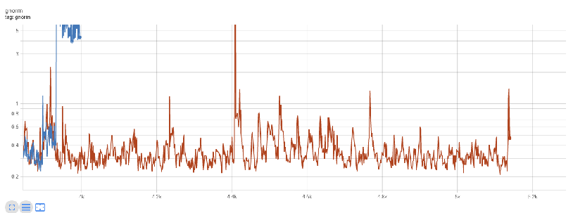

# 超参数配置

超参数对大模型训练收敛有关键性影响，这里说的超参数主要包括：**优化器选择、学习率设定、梯度裁剪阈值、Loss scale**等。

- **优化器与学习率**：优化器的选择直接影响到模型训练过程中的更新策略，而学习率作为核心超参数之一，若设置不当，可能导致训练过程中出现诸如全局梯度范数（GNorm）突变、Loss曲线无法收敛、上升甚至剧烈波动等问题。因此，在训练大型模型时，需细致地搜索合适的学习率以保证收敛性能。
- **梯度裁剪阈值**：梯度裁剪对大模型训练稳定性也至关重要，使用过高的梯度裁剪阈值可能会导致GNorm如图1中蓝线那样持续保持在高位。梯度裁剪在反向传播完成后能够降低某些张量的梯度值，这样可以阻止梯度爆炸，并使训练过程更加稳定。裁剪范围值可以通过试验配置，也可以使用文献中的常用值，也可以通过实验观察范围然后选择一个合理值。网络中的所有层通常都使用相同的梯度裁剪配置，一般来说输出层相比隐藏层允许更大范围的梯度。

    **图 1**  过高的梯度裁剪阈值  
    
    

- **Loss Scale动态调整**：在训练期间，Loss Scale作为一个动态调节的超参数，其大小变化同样反映着训练的稳定性状态。若Loss Scale长期低于1，这意味着有一些梯度值大到很容易上溢，同时存在的那些小梯度值会下溢为0，这些情况都使得训练将持续处于不稳定状态。
- **Batch尺寸的影响**：Batch尺寸是另一个显著影响训练效果的超参数，它在满足内存需求与提升训练效率间寻求平衡。在大模型的分布式训练场景中，用户倾向于选择较大的Batch尺寸以缩短训练时长，然而过大的Batch尺寸也可能导致Loss曲线呈现上升趋势。因此，在调整Batch尺寸时，需综合考虑其对训练效率和收敛性的影响，实现最优配置。
