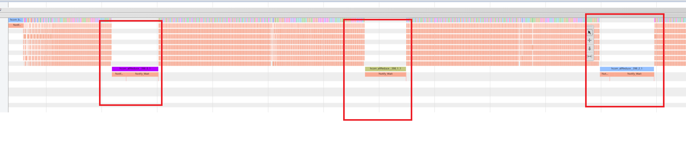
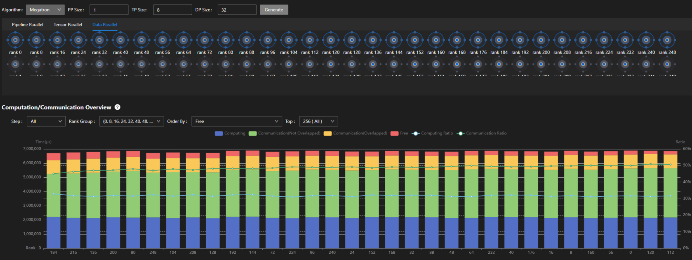
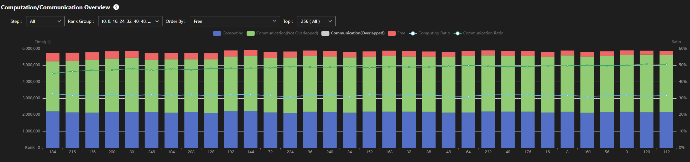
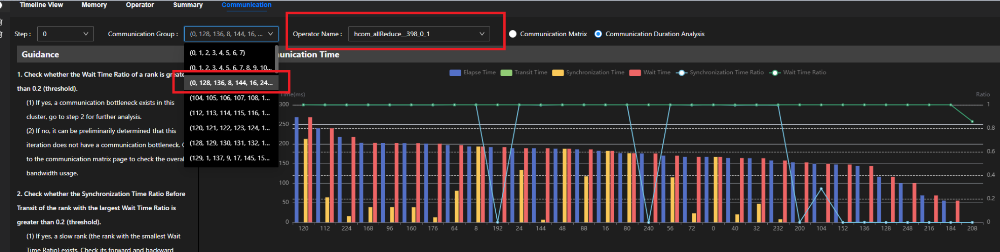
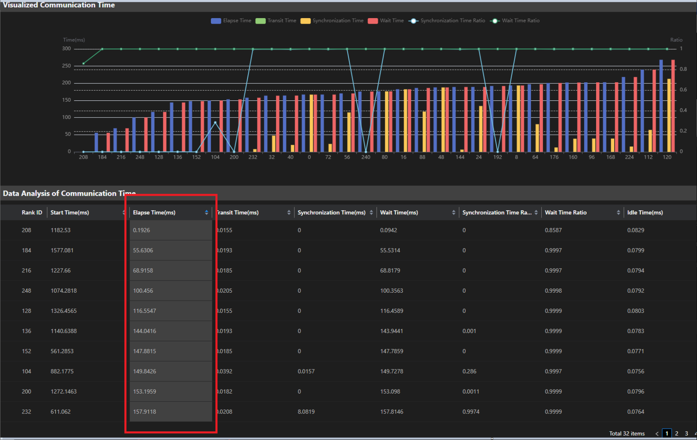
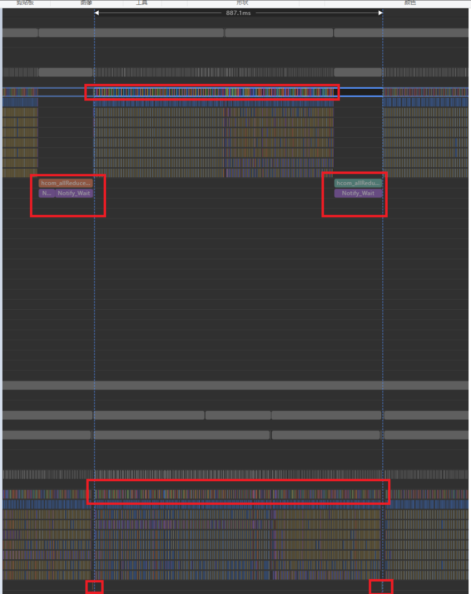
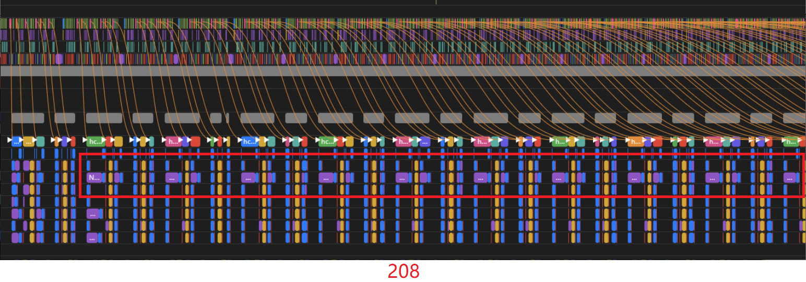
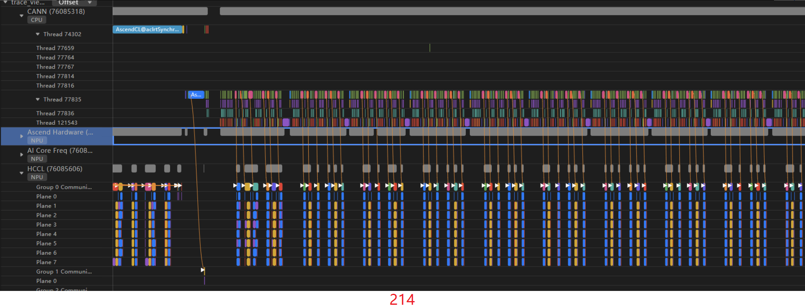
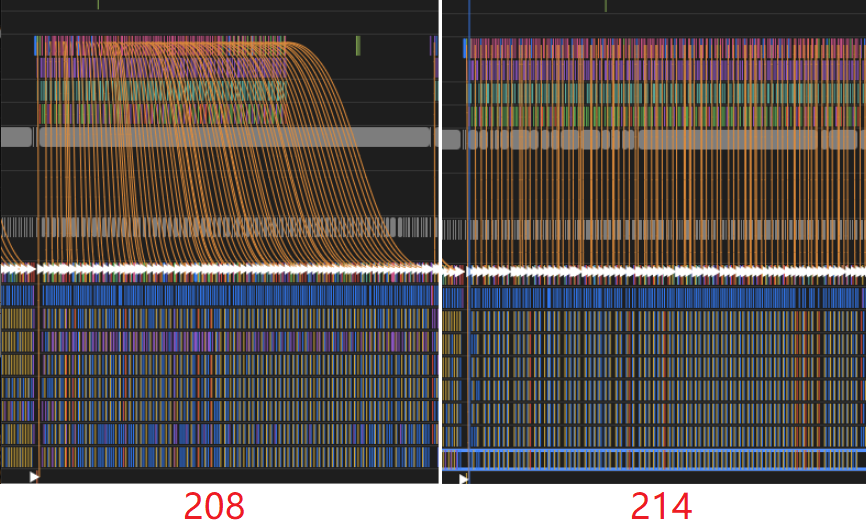
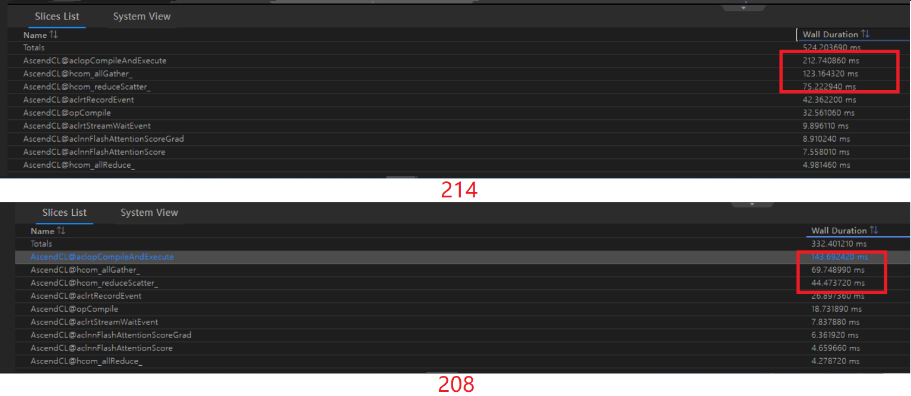

# Llama模型集群等待时间过长分析

## 问题现象

Llama13B模型，在TP Size为8、DP Size为32输入的256卡集群上，当每个micro batch的loss同步4字节时，AllReduce都会出现超长的Notify\_Wait现象，通过分析确定是因卡间不同步而导致的问题。

以0卡的Trace展示为例，如图1所示。

**图 1** 第0卡的profiling信息图  

## 分析定位

1.  由于卡数较多，先用MindStudio Insight工具导入256卡集群分析后的结果，具体可参见《[MindStudio Insight 用户指南](https://www.hiascend.com/document/detail/zh/mindstudio/830/GUI_baseddevelopmenttool/msascendinsightug/Insight_userguide_0002.html)》。

    根据TP Size和DP Size的输入，可以获取到所需allReduce通信域内各卡的计算/通信概览信息，如图2所示。

    **图 2** MindStudio Insight的allReduce通信域图  
    

2.  观察0卡相关的通信域。

    从图3中可观察到，此通信域的rank id为8间隔，如0，8 ，16 ，...，256，并且通信域内各卡的计算、通信和下发耗时并不均匀。

    **图 3** MindStudio Insight的0卡所在通信域图  
    

3.  统计下发和计算耗时。

    下发耗时最大0.5s，最小0.23s，差值0.27s。

    计算耗时最大3.2s，最小3.11s，差值0.09s。

    耗时的差距（总和300ms+）远小于allReduce的等待时间（800ms+），需要根据特定的allReduce算子进行单点分析。

4.  在通信界面找到allReduce对应通信域，在Trace上找到Notify\_Wait的通信算子。

    通信算子是hcom\_allReduce\_\_398\_0\_1，如图4所示。

    **图 4** MindStudio Insight的hcom通信算子信息图  
    

    其rank间的Elapse Time差距巨大，最快卡和最慢卡差距200ms+，如图5所示。

    **图 5** MindStudio Insight的hcom通信算子通信时间信息图  
    

5.  找到最突出的rank 208，查看造成208卡速度缓慢的原因。

    观察第208卡的profiling信息，如图6所示。

    **图 6** 第208卡的profiling信息图  
    

6.  同时打开0卡和208卡，进行对比分析。

    分析得出，208卡速度缓慢是由HCCL的TP通信导致。208卡在一次micro batch计算中的TP耗时为494ms，而0卡的TP耗时为340ms。

    通过查看通信矩阵，发现通信传输速度基本一致，主要还是由TP域内的慢卡导致，如图7所示。

    **图 7** 第208卡TP域通信信息图  
    

7.  观察208卡的TP通信算子。

    观察得出，某些流的通信算子的Notify\_Wait总是较长，通过对端卡的dst rank可以看出是214卡，于是比较这两张卡的下发情况。

8.  比较214卡和208卡的下发情况。

    通过查看214卡的通信算子执行情况，可以看到通信算子在执行中没有任何等待，是因为它本身就是最慢卡，所以无需任何等待，可以直接执行，如图8所示。

    通过214卡的CANN侧下发，可以看到下发连线比较直，说明214卡是由下发导致通信算子的执行最晚。208卡相比214卡来说，下发就弯曲很多，说明没有下发影响通信算子的执行。

    **图 8** 第214卡TP域通信信息图  
    

    宏观来看，相比208卡，214卡的下发也明显更慢，如图9所示。

    **图 9** 208卡和214卡的下发对比图  
    

9.  对比这一块下发的CANN侧接口。

    图10中可观察到214卡的下发接口明显耗时增长。

    **图 10** 214卡和208卡的二级流水对比图  
    

## 优化方案

在出现allReduce等待时间过长的现象时，通过allReduce算子可以发现不同TP域的micro batch执行时间差距大。找出其中较慢的TP域，并排查出是由其中某一张卡下发慢而导致此TP域慢。进一步分析发现，此卡下发慢的原因是某些ACL接口的耗时增加所导致。

定位与接口相关的下发问题，请联系华为工程师解决。

