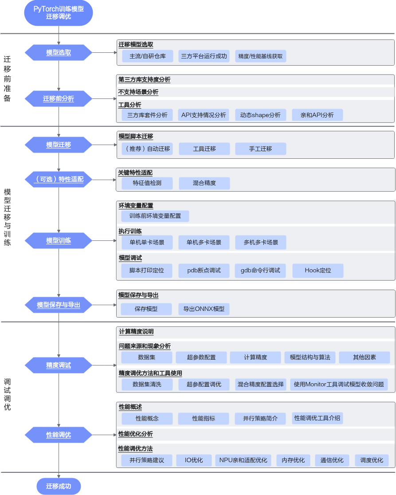

# 迁移流程

未适配传统模型迁移适配方法，可以分为四个阶段：**迁移分析、模型迁移、精度调试与性能调优**，总体流程如下图所示。

本手册的内容章节是根据迁移阶段与其对应任务设计的，如表1所示。

**表 1**  迁移阶段任务表

<table>
  <thead align="left">
    <tr>
      <th>迁移阶段</th>
      <th>迁移任务</th>
      <th>任务描述</th>
    </tr>
  </thead>
  <tbody>
    <tr>
     <td rowspan="2">迁移前准备</td>
     <td><a href="model_selection.md">模型选取</a></td>
     <td>
      <ol>
       <li>调研业务需求场景，选取主流仓库模型。</li>
       <li>保证选定的模型能在三方平台（如GPU）上运行。</li>
       <li>明确迁移前模型运行的硬件型号、精度、性能基线。从权威网站或数据平台获取源模型的性能值基线，或在三方平台实测性能基线。</li>
      </ol>
     </td>
    </tr>
    <tr>
     <td><a href="pre-migration_analysis.md">迁移前分析</a></td>
      <td>
       <ul>
        <li>借助PyTorch Analyse工具采集目标网络中的模型/算子清单，识别第三方库及目标网络中算子支持情况，分析模型迁移的可行性。</li>
         <ul>
          <li>在迁移支持度分析中如果存在平台未支持的算子，需进行算子替换或者开发适配。</li>
          <li>是否调用模型套件或第三方库，关注NPU的支持情况。</li>
         </ul>
        <li>确认是否存在目前已知未支持场景。</li>
       </ul>
      </td>
    </tr>
    <tr>
     <td rowspan="4">模型迁移与训练</td>
     <td><a href="mig_methods_comp.md">模型迁移</a></td>
     <td>提供三种迁移方式，实现GPU至NPU的接口替换、NPU分布式框架改造。</td>
    </tr>
    <tr>
     <td><a href="optional_feature_adaptation.md">（可选）特性适配</a></td>
     <td>
      <ul>
       <li>数据类型为BF16或FP32的模型在训练过程中出现的收敛异常，可开启特征值检测，用于检测在训练过程中激活值的梯度特征值是否存在异常，具体可参考<a href="eigenvalue_detection.md">特征值检测</a>。</li>
       <li>在训练时如需混合使用单精度（float32）与半精度（float16）数据类型，可参考<a href="adaptation_introduction.md">混合精度适配</a>。</li>
      </ul>
     </td>
    </tr>
    <tr>
     <td><a href="env_config.md">模型训练</a></td>
     <td>
      <ol>
       <li>配置训练相关环境变量，以保证模型训练可以在NPU上正常运行，可参考<a href="env_config.md">环境变量配置</a>。</li>
       <li>根据实际场景选择相应操作完成模型脚本配置和拉起训练，可参考<a href="standalone_gpu.md">执行训练</a>。</li>
       <li>提供训练过程中常见问题的调试方法，便于用户确认问题发生位置及原因等，可参考<a href="model_debug.md">模型调试</a>。</li>
      </ol>
     </td>
    </tr>
    <tr>
     <td><a href="save_model.md">模型保存与导出</a></td>
     <td>
      
保存与导出模型用于在线或离线推理。
 
       <ul>
        <li>保存模型文件（pth文件和pth.tar文件）用于在线推理。</li>
        <li>使用模型文件（pth文件和pth.tar文件）导出ONNX模型，通过ATC工具将其转换为适配昇腾AI处理器的.om文件，用于离线推理。</li>
       </ul>
     </td>
    </tr>
    <tr>
     <td rowspan="2">调试调优</td>
     <td><a href="precision_tuning_process.md">精度调试</a></td>
     <td>
      <ol>
       <li>训练过程中的模型精度问题分析，及时处理训练不稳定问题。</li>
       <li>分析并评估迁移前后模型在loss/ppl和模型下游评测的任务得分，评估迁移前后的精度差异。</li>
       <li>确保迁移前后模型精度差异在可接受范围之内，数据无异常溢出；如果出现精度相关问题，需要借助精度问题分析工具分析。</li>
      </ol>
     </td>
    </tr>
    <tr>
     <td><a href="performance_tuning_process.md">性能调优</a></td>
     <td>
      
性能数据采集与评测：

      <ol>
       <li>在NPU环境上，参考<a href="introduction_to_performance_tuning_tools.md">性能调优工具介绍</a>章节对模型进行性能拆解。</li>
       <li>基于性能拆解得到的数据，分析瓶颈模块，模块分类参考<a href="performance_concepts.md">性能概念</a>，明确性能优化方向。</li>
      </ol>
      
模型性能优化实施：

      
依据性能瓶颈模块的类型，从<a href="par_strat_prop.md">性能调优方法</a>寻求优化方法，具体方法包括数据加载优化、NPU亲和适配优化、内存优化、通信优化和调度优化。

      
此外，本章节还提供了通信优化的建议和可以使能的通信算法，以及调度优化方法。

     </td>
    </tr>
  </tbody>
</table>
