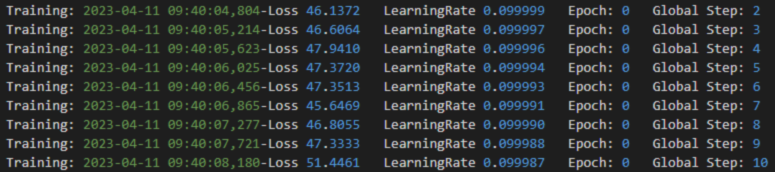
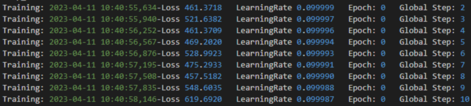

# 混合精度问题调测

## 问题发现

使能混合精度后，由于数值表示范围和最小间隔发生变化，可能导致极少部分网络出现精度掉点甚至无法收敛的情况。如下图所示。

**图 1**  正常loss情况


**图 2**  异常loss情况


在以上样例情况中，loss值由于未正确使能混合精度，导致梯度上溢，进而loss出现异常。

## 调优思路

用户可以参考以下方案进行精度调优尝试。如果用户在<term>Atlas A2 训练系列产品</term>/<term>Atlas A3 训练系列产品</term>遇到此问题，也可以选择回退到全精度计算规避此问题。

1. 修改混合精度级别。

    用户可以尽可能让更多算子使用float32计算，弥补精度损失。具体方法如下：

    - 使用APEX模块：若原本opt\_level=O2，则可尝试修改为O1，具体模式说明可参见[APEX](https://gitcode.com/ascend/apex)。
    - 使用AMP：无需修改。AMP相当于APEX的O1模式，因此无需修改。

2. 使能静态loss scale。

    APEX和AMP默认使用了动态loss scale，部分网络可能对频繁变化的scale值较敏感，影响收敛。可尝试切换至静态loss scale训练。具体方法如下：

    - 使用APEX模块：在**amp.initialize**时传入loss\_scale，可设置为128、256、512、1024、2048等值，举例如下：

        ```python
        model, optimizer = amp.initialize(model, optimizer, combine_grad=True, opt_level='O1', loss_scale=128.0)
        ```

    - 使用AMP：通过在amp.GradScaler参数中配置growth\_factor=1.0、backoff\_factor=1.0且growth\_interval设置为较大值的方式，使能静态loss scale，示例如下：

        ```python
        scaler = amp.GradScaler(init_scale=2.**10, growth_factor=1.0, backoff_factor=1.0, growth_interval=100000, enabled=True)
        ```

3. 梯度裁剪。

    由于float16计算精度不如float32，可能导致部分网络梯度计算不稳定，进而导致梯度爆炸。可尝试使用梯度裁剪，按范数进行裁剪**torch.nn.utils.clip\_grad\_norm\_\(\)**或按值进行裁剪**torch.nn.utils.clip\_grad\_value\_\(\)**。具体方法如下：

    - 使用APEX模块：梯度计算完成并退出上下文管理器后，调用梯度裁剪函数。

        ```python
        output = model(input)
        loss = criterion(output, target)
        with amp.scale_loss(loss, optimizer) as scaled_loss:     
        scaled_loss.backward()
        torch.nn.utils.clip_grad_norm_(parameters=model.parameters(), max_norm=10)
        optimizer.step()
        ```

    - 使用AMP：梯度计算完成并在优化器更新前，手动unscale梯度并调用梯度裁剪函数。

        ```python
        with autocast():
        output = model(input)
        loss = criterion(output, target)
        scaler.scale(loss).backward()
        scaler.unscale_(optimizer)
        torch.nn.utils.clip_grad_norm_(parameters=model.parameters(), max_norm=10)
        scaler.step(optimizer)
        scaler.update()
        ```

    若精度问题好转，用户可通过调整梯度裁剪超参进行调优；若未好转，则建议尝试其他调优方法。
