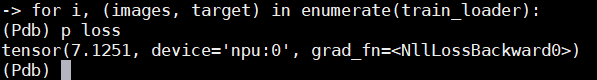
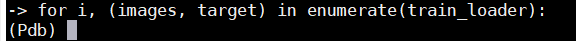
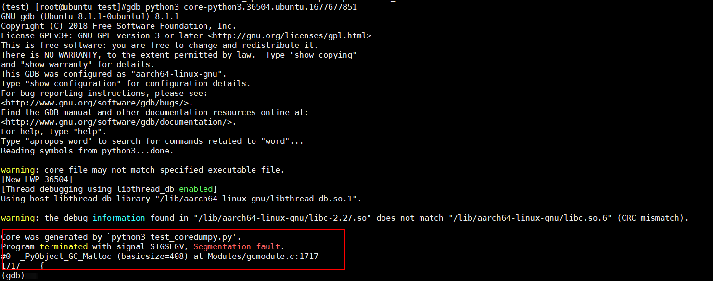
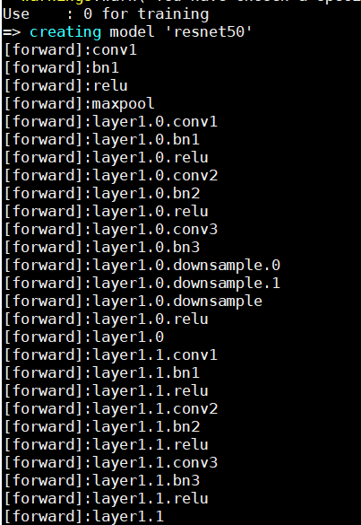

# 模型调试

在训练过程中，如果遇到问题，可以使用以下方法进行调试，确认问题代码发生的位置以及原因。

其他常见报错问题和解决方法可参见《[故障案例](https://www.hiascend.com/document/caselibrary)》。

- **脚本打印定位**：使用print打印，判断模型发生问题的代码位置。由于PyTorch框架是异步执行框架，直接打印可能位置不准确，需要添加流同步逻辑辅助打点。

    ```python
    print(torch.npu.synchronize(),"debug message")
    
    print(inputs.shape, inputs.dtype) #所需打印参数可根据实际情况变更
    ```

    > [!NOTE]
    >
    > 该方法适用于问题定位场景，正式训练可删除。

- **pdb断点调试**：在需要设置断点的部分添加函数。
    - 方法一：在代码中引入pdb模块，在需要设置断点的部分添加set\_trace函数触发调试器。

        ```python
        import pdb
        pdb.set_trace()
        ```

        脚本运行至**pdb.set\_trace\(\)**处会暂停，通过在命令行中输入命令操作，例如输入**n**可以执行下一行代码，输入**p \{变量名\}**可打印当前变量的值，更多参数介绍请参见[常用pdb参数说明](common_pdb_args.md)。

        下图展示了在执行训练的循环中设置pdb并尝试打印变量loss的值的效果。

        

    - 方法二：在需要设置断点的部分添加breakpoint函数，脚本运行至此处会停留。

        ```python
        breakpoint()
        ```

        下图是在执行训练的循环中设置断点的效果。

        

- **gdb命令行调试**：gdb调试工具的主要功能为在程序中设置断点、监视变量、单步骤运行、运行时改变变量值、跟踪路径、线程切换。此方法主要针对coredump场景，执行目录下会生成core dump文件，使用gdb调试该文件并打印堆栈，方法如下：
    1. 参考[GDB官方文档](https://sourceware.org/gdb/)安装GDB。
    2. 设置生成coredump文件（ulimit设置）。

        ```shell
        ulimit -c    # 查看当前设置，0表明不生成coredump文件，需要更改ulimit设置
        ulimit -c unlimited    # unlimited将生成coredump文件大小设置为无限制，此时如果进程崩溃就会生成coredump文件
        ```

    3. 设置coredump文件存储位置和名称。

        ```shell
        # 临时修改生成的coredump文件的名称，加粗命令为文件名称的变量，可自行设置
        sysctl -w kernel.core_pattern=core-%e.%p.%h.%t
        # 设置coredump生成目录，加粗命令为文件名称的变量和生成目录，可自行设置
        echo "/pathtocoredump/core.%e.%p" >/proc/sys/kernel/core_pattern
        ```

        可以在core.pattern模板中使用的变量见表1。

        **表 1**  core.pattern模板可使用变量

        |变量名称|说明|
        |--|--|
        |%%|单个%字符|
        |%p|所有dump进程的进程ID|
        |%u|所有dump进程的实际用户ID|
        |%g|所有dump进程的实际组ID|
        |%s|导致本次core dump的信号|
        |%t|core dump的时间（由1970年1月1日计起的秒数）|
        |%h|主机名|
        |%e|程序文件名|

    4. 生成coredump文件。

        运行模型脚本，若模型报错、进程崩溃，即可在当前目录下生成coredump文件。

    5. 调试coredump文件。

        执行如下命令进入gdb模式，调试coredump文件。

        ```shell
        gdb python3 core*.*    # coredump文件名请根据实际情况自行修改
        ```

        执行命令后，gdb工具会将发生异常的代码、其所在的函数、文件名和所在文件的行数打印到屏幕，方便定位问题。样例回显如下图。

        

        gdb模式中常用的调试命令如表2。

        **表 2**  gdb模式常用调试命令

        |命令|功能说明|
        |--|--|
        |l|列出代码|
        |break *num*|在某行设置断点，*num*为样例行号|
        |info break|查看断点信息|
        |r|运行程序|
        |n|单条命令执行|
        |c|继续执行|
        |p *paramname*|打印变量|
        |bt|查看函数堆栈|
        |finish|退出函数|
        |q|退出gdb|

        更多调试命令请参考[官方文档](http://www.sourceware.org/gdb/documentation/)。

- **Hook定位**：该方法主要针对定位模型中某个module的报错，通常适用于正反向module的报错定位。

    在脚本中添加如下代码，定义hook。

    ```python
    def hook_func(name, module):
        def hook_function(module, inputs, outputs):
            print(name)
        return hook_function
    ```

    在代码执行模型计算之前添加如下hook代码，打印模型正反向执行过程中的module名。定位到具体问题后，打印所有shape、dtype、format后配合host日志辅助排查问题。

    ```python
    for name, module in model.named_modules():
        if module is not None:
            module.register_forward_hook(hook_func('[forward]:' + name, module))
            module.register_backward_hook(hook_func('[backward]:' + name, module))
    ```

    下图展示了添加hook函数后的日志打印内容，可以看到模型的每个模块名被打印出来，用户也可以通过修改hook\_func函数，自定义想打印的内容。

    
