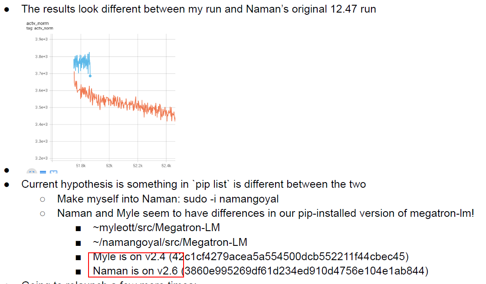
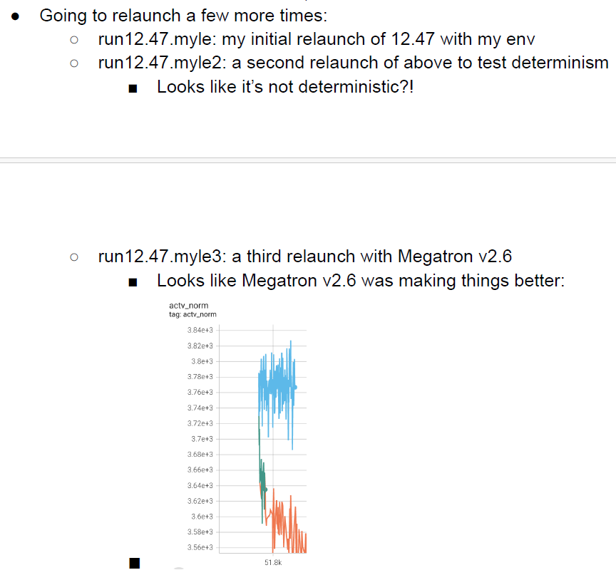
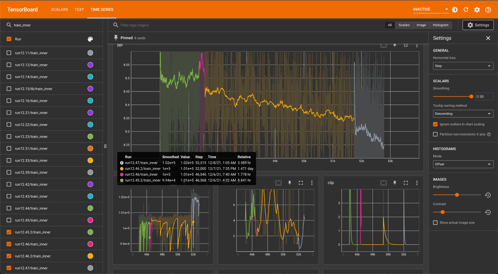
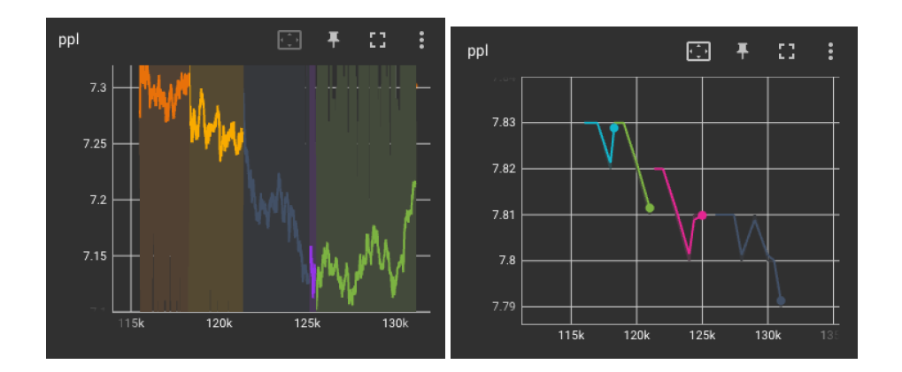

# 其他因素

-   Megatron版本可能会影响训练精度。

    Megatron作为开源社区，代码有bug是难以避免的，OPT训练过程中发现Megatron  v2.4导致了训练不收敛，而v2.6训练状态明显改善。

    **图 1** v2.4训练  
    

    **图 2** v2.6训练
    

    有些训练异常现象可能是很难解释的，下图展示了OPT在四段训练过程中的training PPL曲线，这四段曲线分别是在四组不同的主流AI处理器节点上训练得到的，在绿色和红色的两端ppl上升，而到黄色这段突然下降。

    **图 3** training PPL曲线  
    

    OPT训练过程中还发现了training PPL上升而validation PPL下降这样难以解释的现象。下边左图是training PPL，右边是validation PPL。在他们的实验中，没有人工干预这个现象。

    **图 4** training PPL与validation PPL对比  
    

-   在启用FSDP训练模型的场景中，偶现Loss正常下降到某一step时出现精度跳变为NaN（算子计算溢出的特征）。

    此问题当前分析与allgather通信算子相关。在数据与计算并行度较大时，allgather算子可能受调度影响而出现数据异常，影响后续的计算。

    该问题有如下两种方案可以进行处理：

    -   通过降低计算和通信的并行度来进行处理，在allgather算子后增加同步接口，参考如下代码。

        ```python
        torch.npu.synchronize()
        ```

    -   如果服务器连接交换机，可尝试通过配置HCCL环境变量来处理该问题。

        ```shell
        export HCCL_INTRA_ROCE_ENABLE=1
        export HCCL_INTRA_PCIE_ENABLE=0
        ```

