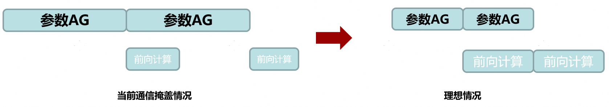

# 并行策略建议

## 并行策略通用建议

并行策略的调试与设计需要对具体模型进行详细分析，没有一个通用的万能法则可以适用于所有情况。然而，借鉴以往的调优经验，可以总结出一些相对通用的建议。

1. 在面临显存不足、模型过大无法完全加载以及需要进行切分的情况下，优先考虑使用TP（Tensor Parallelism）进行切分，并确保切分的数量小于等于机器内的计算卡数。例如，在一台服务器上有8张计算卡，那么TP的最大设置不应超过8。这样可以充分利用计算资源，减少显存占用。
2. 如果在TP切分达到最大显存容量仍然不足的情况下，可以考虑在机器之间使用PP（Pipeline Parallelism）进行切分。理论上，PP的数量应该越小越好，以尽可能减少空闲计算资源的浪费。
3. 在机器资源富裕的情况下，可以开启DP（Data Parallelism）并行，将计算任务分配给多个机器进行并行处理，从而提高处理效率。然而，在机器资源有限的情况下，如果开启TP+PP切分后显存仍然不足，可以考虑使用ZeRO-1和重计算技术。ZeRO-1可以将模型优化器状态划分到更多的设备上，并通过集合通信进行同步。同时，重计算技术可以通过选择性重计算来提高显存的使用率，从而提高模型训练效率。
4. 此外，即使在模型能够成功运行的情况下，也可以尝试主动地使用降低内存占用的手段，例如ZeRO-1和重计算等，然后增大batch size。这样有时也会取得令人意外的效果。

综上所述，通过技术能力和合理选择并行策略，可以在资源有限的情况下优化模型训练效率，并充分利用计算资源。然而，对于具体的模型和环境，仍需要进行详细分析和实验，以找到最佳的并行策略和优化方法。

以下通过具体案例进行说明。

上图中左图的状态是常见情况。此图表示在模型运行中，模型前向计算和模型的参数AG（AllGather）在并行，是一种常见的通信计算掩盖。

理论上，用户都期望模型能够达到右图的状态，即除了启动阶段，在中间时刻，前向计算和参数AG是可以并行的。但实际上，由于计算时间不足，前向计算时间小于参数AG时间，造成左图的现象。这种情况在大集群场景，会造成极大的线性度劣化。若采用上文介绍的并行策略，通过增大micro batch size提高计算时间，或者减少单次AG的通信数据量，增加通信次数，可保证前向计算和参数AG的并行。
