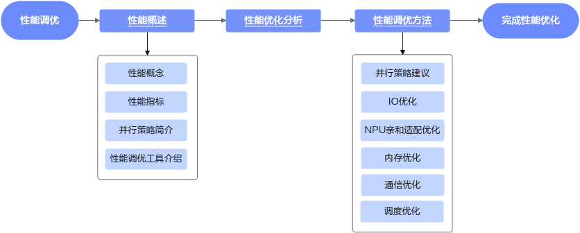

# 性能调优流程

在计算越来越重要的今天，以GPU（Graphics Processing Unit）和NPU（Neural Network Processing Unit）为代表的并行计算设备，在人工智能和其他行业，都扮演着重要角色。计算的效率，或者称之为计算的性能，越来越得到广泛关注。

本章节以性能的含义以及性能工具等基础概念介绍为出发点，介绍了训练模型在昇腾设备上的通用性能调优方法。对应的性能调优流程如下图所示。

