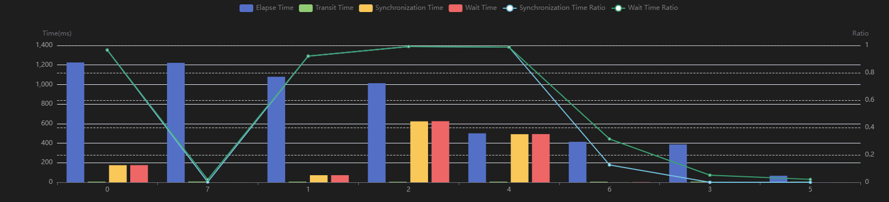
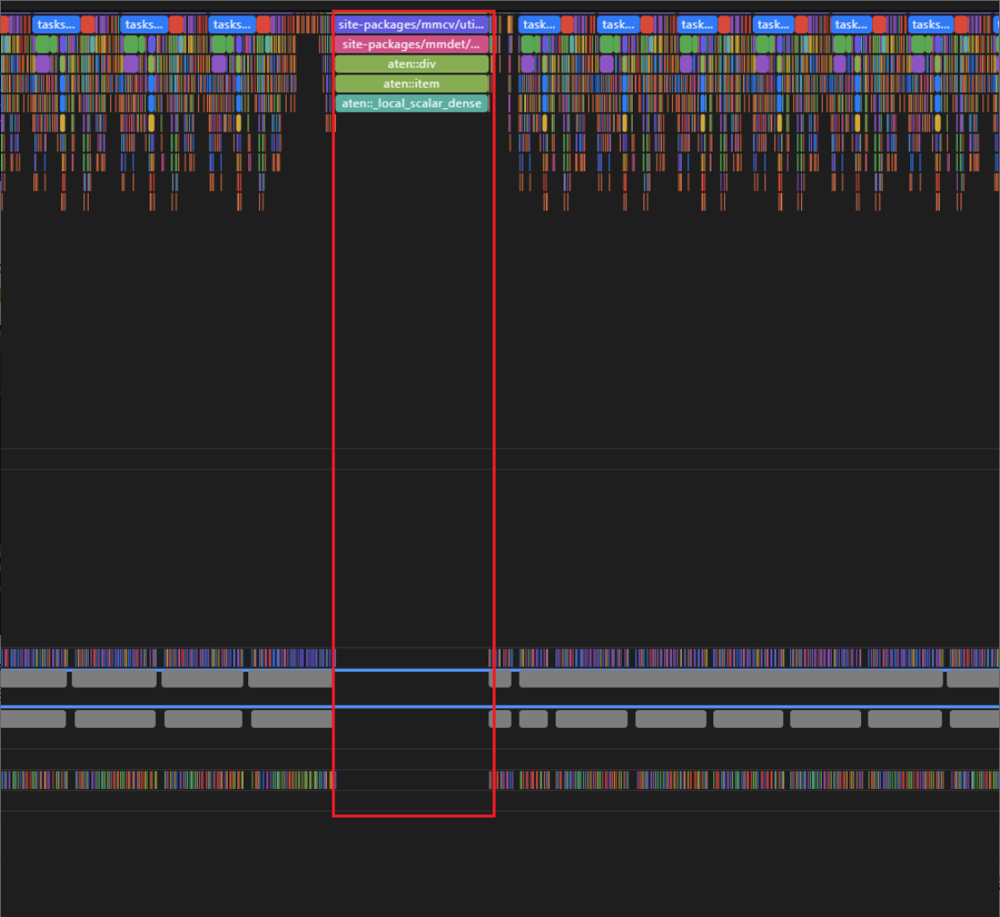

# PETR模型多节点性能下降分析

## 问题现象

Stream PETR模型，DP Size为8，在节点数量提高后，多任务训练耗时均匀变慢，如表1所示。

**表 1** 节点数量与训练耗时

|节点数量|耗时|
|--|--|
|2 nodes|2.964s|
|5 nodes|3.646s|
|10 nodes|4.533s|
|15 nodes|5.320s|
|20 nodes|5.693s|

## 分析定位

1. 初步分析
    - 单节点内性能劣化问题，从单步时间看，单节点劣化的核心原因是SyncBatchNormBackwardElement导致算子耗时劣化。
    - 单节点到多节点存在性能劣化问题。

2. 根因解析
    - **1节点到5节点性能明显劣化的原因（从上至下，重要性递减）**

        1. 总差距为693ms，算子耗时差距310ms。

           算子调用次数从47k增加到61k，memset增加10k，padv3增加6.7k。
        
           平均单步算子耗时增加70ms，主要来自vector算子劣化。

        2. 快慢卡问题。

           差距从Python CPU开始，随着API的调用，差距慢慢拉大，造成影响的API为aten。

    - **1节点性能问题的原因（从上至下，重要性递减）**
        1. 总差距为390ms，算子耗时差距占了240ms。
        2. 模型原本就存在严重的快慢卡问题，syncbn的大量同步导致了大量同步等待时延。

            不加syncbn的不同卡Elapse Time示意图，如图1所示。

            **图 1** Elapse Time示意图
        

    - **快慢卡原因分析**
        1. 差距从Python CPU侧开始，随着API的调用，差距慢慢拉大，造成影响的API为aten。
        2. Python侧存在部分函数耗时异常，如图2所示，与之前某些用户存在的现象类似，疑似CPU资源被抢占。

           产生这一空隙之前的算子是“site-packages/mmdet/models/losses/utils.py\(29\): weight\_reduce\_loss”29行，算子为aclnnReduceSum。

           **图 2** 慢卡profiling示意图
        

        3. 不同卡的batchmatmulv2耗时差距巨大，从170ms到240ms波动。

## 优化方案

20节点的共网任务，截止到目前的syncbn优化措施，单步时延已从5.693s优化到3.866s，优化效果明显。

表2为具体的优化措施，请用户根据实际情况来选择优化。

**表 2** 优化类型与措施

<table>
  <thead align="left">
    <tr>
      <th>优化类型</th>
      <th>分析</th>
      <th>优化措施</th>
      <th>实验结果</th>
    </tr>
  </thead>
  <tbody>
    <tr>
      <td rowspan="2">算子优化</td>
      <td>syncbn基于torch原生代码，为使能路径3，加入过patch；若去掉patch，在当前版本上会走到路径5。</td>
      <td>去掉syncbn上为NPU适配的patch</td>
      <td>
        <ul>
          <li>1节点，单步耗时 2.25s -> 2.165s</li>
          <li>5节点，单步耗时从3.03s -> 2.68s</li>
        </ul>
      </td>
    </tr>
    <tr>
      <td>消除transdata。</td>
      <td>torch_npu.config.allow_internal_format = False</td>
      <td>2.55s -> 2.53s</td>
    </tr>
    <tr>
      <td rowspan="3">模型优化</td>
      <td>资源抢占问题。</td>
      <td>建议关闭gc</td>
      <td>5节点，2.68s -> 2.6s</td>
    </tr>
    <tr>
      <td>小算子太多，下发频繁，性能不好。当前NUMA为8，需要额外尝试绑核。</td>
      <td>绑核</td>
      <td>5节点，2.6s -> 2.555s</td>
    </tr>
    <tr>
      <td>融合优化器。</td>
      <td>使能融合优化器</td>
      <td>2.53s -> 2.49s</td>
    </tr>
  </tbody>
</table>
