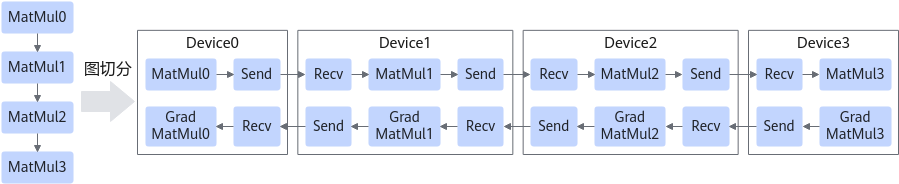
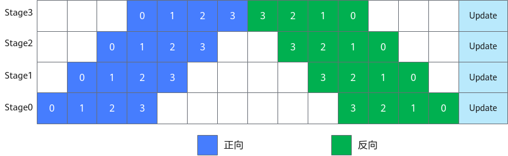
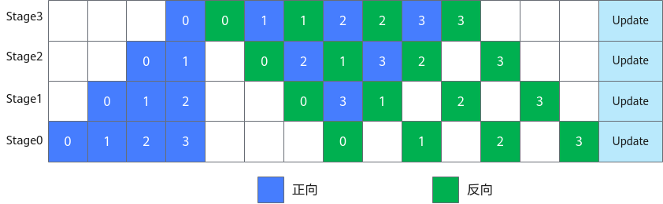

# Pipeline并行效率指标

流水线（Pipeline）并行是将神经网络中的算子切分成多个阶段（Stage），再把阶段映射到不同的设备上，使得不同设备去计算神经网络的不同部分。

流水线并行适用于模型是线性的图结构。如图1所示，将4层MatMul的网络切分成4个阶段，分布到4台设备上。正向计算时，每台设备在算完本台设备上的MatMul之后将结果通过通信算子发送（Send）给下一台设备，同时，下一台设备通过通信算子接收（Receive）上一台设备的MatMul结果，开始计算本台设备上的MatMul；反向计算时，最后一台设备的梯度算完之后，将结果发送给上一台设备，同时，上一台设备接收最后一台设备的梯度结果，并开始计算本台设备的反向。

**图 1** 流程图  

简单地将模型切分到多设备上并不会带来性能的提升，因为模型的线性结构使得在同一时刻只有一台设备在工作，而其他设备在等待，造成了资源的浪费。为了提升效率，流水线并行进一步将小批次（MiniBatch）切分成更细粒度的微批次（MicroBatch），在微批次中采用流水线式的执行序，从而达到提升效率的目的，如图2所示。将小批次切分成4个微批次，4个微批次在4个组上执行形成流水线。微批次的梯度汇聚后用来更新参数，其中每台设备只存有并更新对应组的参数。其中白色序号代表微批次的索引。

**图 2** 流水线结构图  

1F1B（1 forward 1 backward，一次前向，一次反向）的流水线并行实现中对执行序进行了调整，来达到更优的内存管理。如图3所示，在编号为0的MicroBatch的正向执行完后立即执行其反向，这样做使得编号为0的MicroBatch的中间结果的内存得以更早地（相较于图2）释放，进而确保内存使用的峰值比图2的方式更低。

**图 3** 流水线结构图  

假设MicroBatch Num是**m**，pipeline stage是**p**，流水线并行的效率是：

