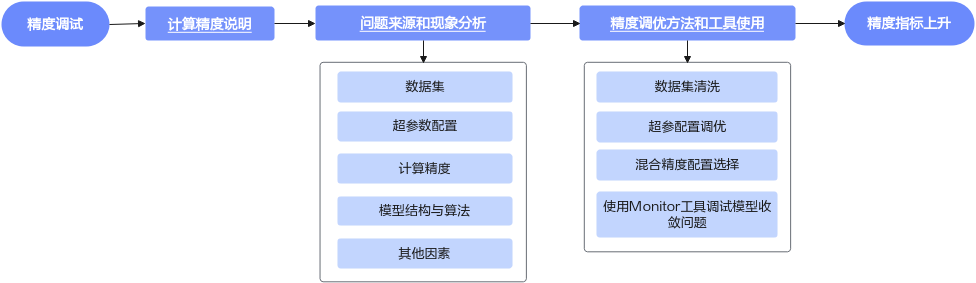

# 精度调试流程

训练一个大模型，往往涉及到高额的成本投入与复杂的技术难题。例如，MetaAI公开了OPT-175B大模型的训练日志，披露了从2021-10-20到2022-01-06之间75天内训练大模型遇到的各种问题以及应对方案。这些问题非常有代表性：例如大量硬件失效，需要移除出错节点、排查软件栈错误后重启训练；再比如出现Loss上扬、梯度范数异常等棘手的问题，需要调整学习率、batch尺寸，或者跳过异常训练语料来解决或规避。从上述示例中可以看出，即使在最先进、最主流的AI加速器上，训练大模型仍需克服诸多难关。除了OPT-175B，AI2发布了OLMo系列模型的技术报告、数据、权重、超参数，甚至公开了处理数据、评估模型的代码以及训练日志。OLMo即便只是7B参数的语言模型，涉及到的细节仍然非常繁杂，例如混合精度配置、数据处理、大量训练内部状态监控等。

总的来说，训练本身是一种研发行为，受数据集、模型结构、并行策略、超参等影响，模型训练过程中可能出现NaN、溢出、Loss发散等情况，这时需要对模型进行精度调试。在昇腾处理器上训练模型时，一般而言Loss总体呈现下降收敛趋势，即使出现偶尔的尖刺现象也可以通过跳过数据集、断点续训等方式规避。最终，当使用训练后得到的权重，采用常规数据集评估模型分数是否符合社区实践评分预期，即可视为精度调试已完成。

本文总结了大模型训练过程中常见的问题及其调试方法，力求帮助用户将问题消除在训练开始之前，以及缩短模型精度问题定位的时间。精度调试流程如下图所示。

