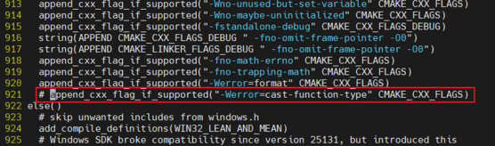

# 编译优化（PyTorch）

以PyTorch 2.7.1为例进行编译优化。

1. 依赖安装。

    PyTorch推荐在容器里进行编译，参考[使用源代码进行安装](https://gitcode.com/Ascend/pytorch#%E4%BD%BF%E7%94%A8%E6%BA%90%E4%BB%A3%E7%A0%81%E8%BF%9B%E8%A1%8C%E5%AE%89%E8%A3%85)章节拉取镜像。

    毕昇环境变量配置，详情请参见[安装毕昇编译器](install_bisheng_comp.md)。

2. 获取源码。
    - Git下载：

        ```shell
        git clone -b v2.7.1 https://github.com/pytorch/pytorch.git pytorch-2.7.1
        cd pytorch-2.7.1
        git submodule sync
        git submodule update --init --recursive
        ```

    - 安装requirements：

        ```shell
        pip install -r requirements.txt
        ```

3. 修改CMakeLists.txt文件，屏蔽告警错误。

    需注释掉下图中红框处标注的内容“append\_cxx\_flag\_if\_supported\("-Werror=cast-function-type" CMAKE\_CXX\_FLAGS\) ”，屏蔽告警错误。

    

4. 根据需要的优化类型进行相应编译参数设置并进行编译，LTO和PGO优化可以单独使用也可以叠加一起使用。
    - LTO优化
        1. 配置编译参数，设置环境变量。

            ```shell
            export CMAKE_C_FLAGS="-flto=thin -fuse-ld=lld"
            export CMAKE_CXX_FLAGS="-flto=thin -fuse-ld=lld"
            export CC=clang
            export CXX=clang++
            export USE_XNNPACK=0
            ```

        2. 执行编译命令。

            ```shell
            cd pytorch-2.7.1
            git clean -dfx
            python3 setup.py bdist_wheel
            ```

        3. 执行`ls dist`命令，查看编译成功的whl包。
        4. 安装whl包。

            ```shell
            pip3 install /path/to/*.whl --force-reinstall --no-deps
            ```

    - LTO+PGO优化
        - 第一次编译（插桩编译）
            - 配置编译参数，设置环境变量。

                ```shell
                export CMAKE_C_FLAGS="-flto=thin -fuse-ld=lld -fprofile-generate=/path/to/profile"
                export CMAKE_CXX_FLAGS="-flto=thin -fuse-ld=lld -fprofile-generate=/path/to/profile"
                export CC=clang
                export CXX=clang++
                export USE_XNNPACK=0 
                ```

                > [!NOTE]
                >
                > "/path/to/profile"指后续运行PyTorch时要存储的profile数据文件的路径。

            - 执行编译命令。

                ```shell
                cd pytorch-2.7.1
                git clean -dfx
                python3 setup.py bdist_wheel
                ```

        - 运行需要优化的模型，采集Profile信息。
            - 执行如下命令，将OMP\_PROC\_BIND环境变量设置为false。

                ```shell
                export OMP_PROC_BIND=false
                ```

                > [!NOTE]
                >
                > OMP\_PROC\_BIND会影响模型运行时的性能，无论是采集还是优化，运行模型前都需确保将该环境变量设置为false。

            - 安装一次编译后的PyTorch的whl包，执行如下命令：

                ```shell
                pip3 install /path/to/*.whl --force-reinstall --no-deps
                ```

                根据实际情况操作，正常跑模型即可，基于插桩的二进制在运行时会比正常二进制性能差，无需关注。

                > [!NOTE]
                > 
                > 毕昇编译的PyTorch须与毕昇编译的torch\_npu配套使用，其他兼容性可参考[表1](comp_opt_intro.md#custom-anchor)。

            - 模型跑完之后，程序停止执行，在一次编译时指定的对应目录下可以生成profraw格式文件。亦可通过在运行机器上配置环境变量LLVM\_PROFILE\_FILE指定profraw文件生成位置，参考命令中%m允许在线合并profile数据，改为%p将按pid记录数据。

                参考命令：

                ```shell
                export LLVM_PROFILE_FILE=/tmp/profile/default_%m.profraw
                ```

        - Profile数据格式转换。

            执行如下命令：

            ```shell
            llvm-profdata merge /path/to/profile -o default.profdata
            ```

            该命令可以合并/path/to/profile目录下所有的profraw文件，profile数据文件不受机器环境影响，可以迁移到其他机器上使用。

        - 二次编译（使用Profile数据）
            - 配置编译参数，设置环境变量。

                ```shell
                export CMAKE_C_FLAGS="-flto=thin -fuse-ld=lld -fprofile-use=/path/to/profile/default.profdata"
                export CMAKE_CXX_FLAGS="-flto=thin -fuse-ld=lld -fprofile-use=/path/to/profile/default.profdata"
                ```

            - 执行编译命令。

                ```shell
                cd pytorch-2.7.1
                git clean -dfx
                python3 setup.py bdist_wheel
                ```

                二次编译后PyTorch的whl包为正式使用的高性能包。

            - 在安装高性能包后，运行模型之前，请再次确认已将OMP\_PROC\_BIND环境变量设置为false。

                ```shell
                export OMP_PROC_BIND=false
                ```
