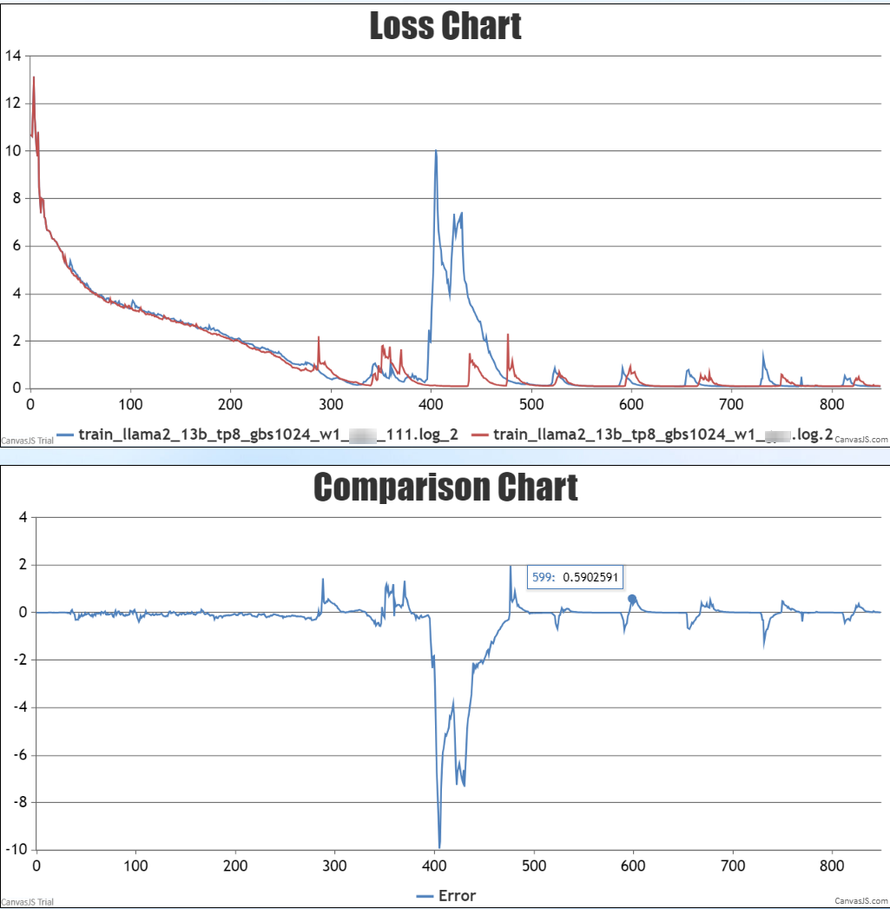
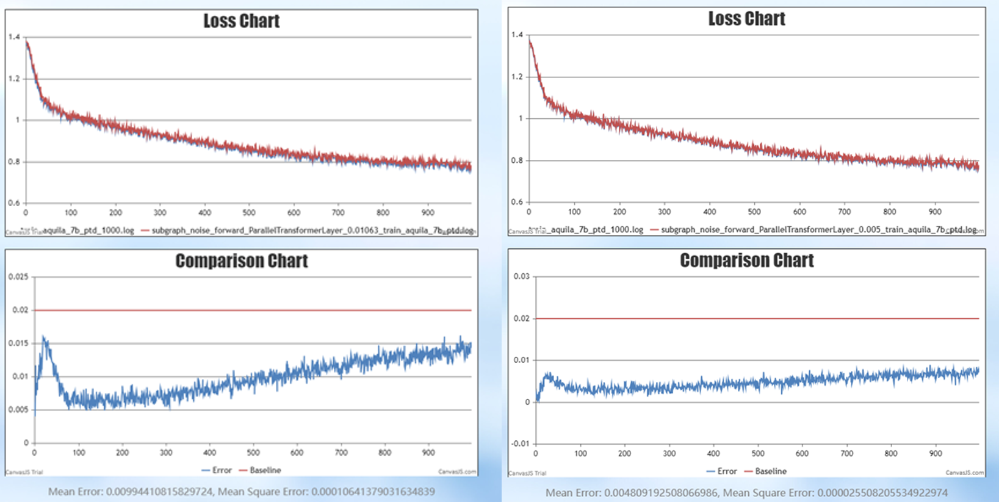
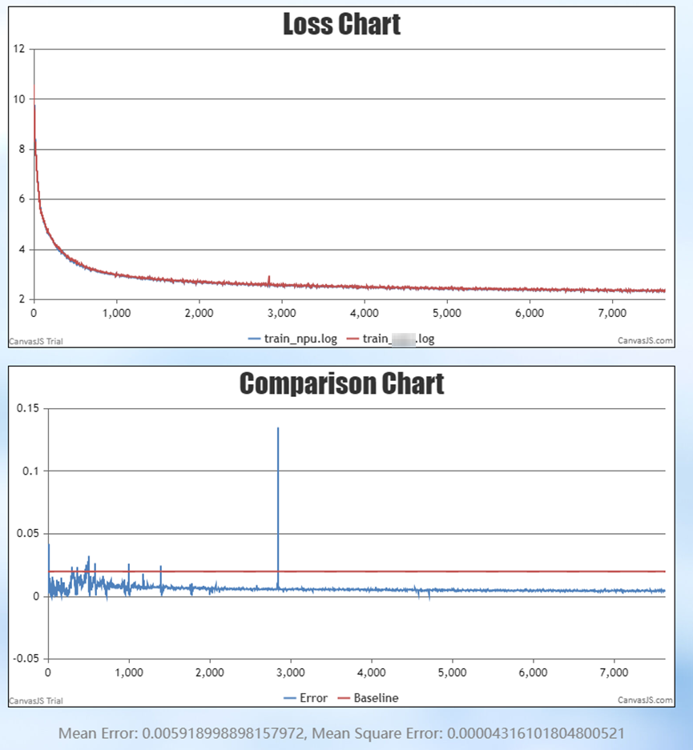
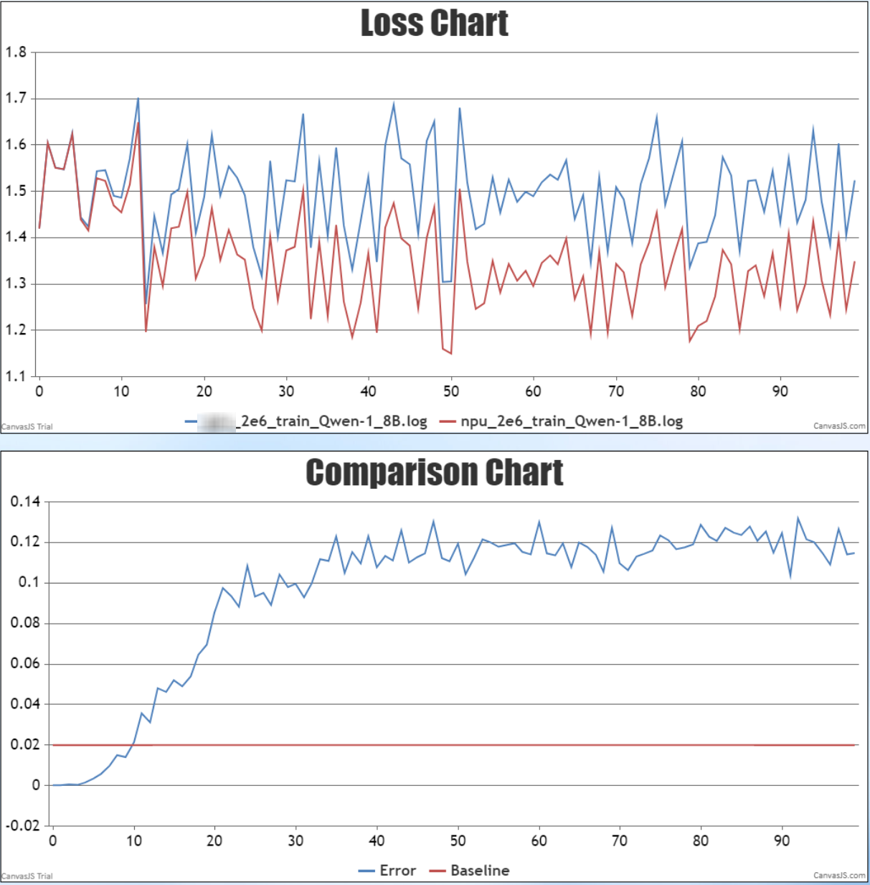
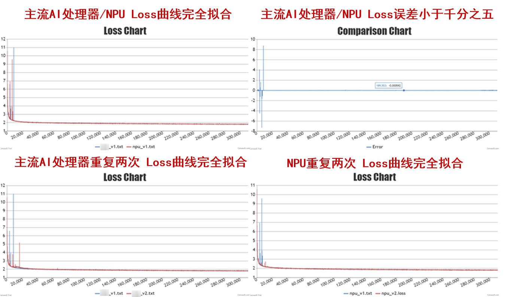
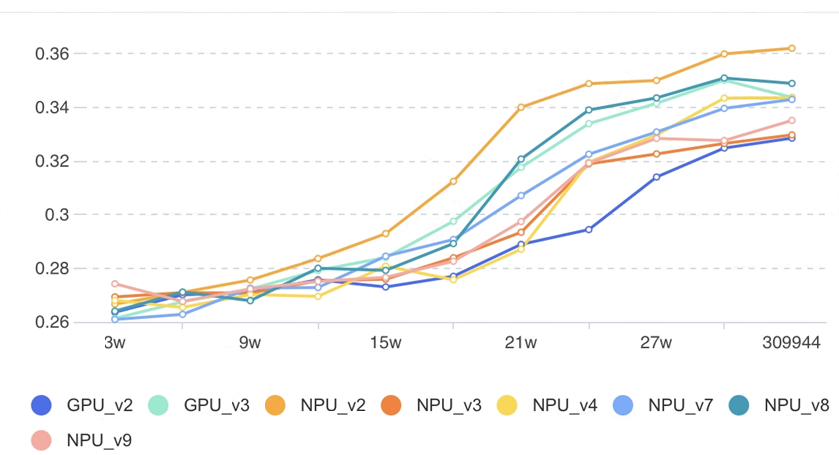

# 计算精度说明（必读）

随着昇腾AI处理器（以下简称为NPU）在深度学习中的广泛应用，用户在使用NPU训练各种深度学习模型尤其是训练大语言模型时可能会遇到各种问题和困惑。NPU在AI处理器领域属于后来者，并且NPU与主流AI处理器在硬件、指令计算过程和浮点舍入截断模式方面存在差异。因此客户遇到问题和困惑时，往往会将原因归咎于这些天然差异，并且对这些差异存在很深的疑虑和担心。

本文中我们将介绍[NPU与主流AI处理器之间的计算差异](#custom-anchor01)，并通过一些实验证明计算差异对训练结果没有显著影响，参见[计算差异对训练结果的影响](#custom-anchor02)。大规模分布式训练所遇到的问题和困难也并非昇腾平台独有，[精度调试过程案例](#custom-anchor03)中将介绍问题的来源、现象以及解决问题的思路和方法。

## NPU与主流AI处理器之间的计算差异 

NPU与主流AI处理器之间的计算差异主要为浮点舍入模式差异和计算过程差异。

- **浮点舍入模式的差异**

    在浮点舍入模式方面，主流AI处理器支持四种舍入模式，而NPU在主流AI处理器的四种模式基础上，增加了A模式和O模式。尽管所有舍入模式都会带来数值精度误差，但NPU通过增加舍入模式的选择，为用户提供了更多灵活性以适应不同的计算需求。相比主流AI处理器，NPU的舍入模式更丰富。

    - A模式：最近舍入并在尾数为五时选择远离零舍入（正数选择更大数的方向，负数选择更小数的方向）。
    - O模式：最近舍入并在尾数为五时向奇数舍入。
    - 向最接近的可表示的值。
    - 当有两个最接近的可表示的值时首选“偶数”值。
    - 向负无穷大（向下）。
    - 向正无穷大（向上）以及向零（截断）。

    默认模式是最近舍入（Round to Nearest），它与四舍五入只有一点不同，对.5的舍入上，采用取偶数的方式。最近舍入模式：Round\(0.5\) = 0；Round\(1.5\) = 2；Round\(2.5\) = 2。四舍五入模式：Round\(0.5\) = 1；Round\(1.5\) = 2；Round\(2.5\) = 3。

- **计算过程的差异**

    计算过程的差异包括计算使用的浮点精度、累加运算的顺序等。计算过程中的细微差异都能引起最终输出结果的不同，从而产生跟标杆比对程度不一的误差。

## 精度调试的前提条件

小的计算差异在某些超参配置下（例如大学习率、大adam\_beta1、大adam\_beta2）以及某些场景下（例如浅层参数中极小数值的梯度）会被放大，从而在训练稳定性的表现上出现很大差异。例如主流AI处理器或NPU其中一方不稳定（很多loss尖刺），或者双方都不稳定，这在大规模训练和训练对比实践中都非常常见。

小的计算差异会引起AI处理器（主流/NPU）训练的模型参数位于不同的loss landscape位置。因为loss landscape的复杂性，主流AI处理器/NPU的某一方可能处于地形图中非常陡峭的位置，从而在对比中比较不利。特别是当超参不合理时（如大学习率），这种对比的不确定性就更强。LLaMA2-13B模型在1e-3基础学习率下，主流AI处理器运行两次训练得到的loss曲线，如图1所示。图1中可见主流AI处理器运行两次训练得到的loss也很难对齐，尖刺发生的位置有很大不确定性。期望在训练不稳定情况下完全对齐，在主流AI处理器上也是不可能完成的任务。因此，精度调试特别是精度对齐的前提条件是要能稳定训练。

**图 1** LLaMA2-13B模型上主流AI处理器的loss曲线图  

## 计算差异对训练结果的影响

- [Google TPU上的实验](https://dl.acm.org/doi/abs/10.1145/3579371.3589105)证明了计算精度和模型精度的复杂关系。

    实验中，将82.3%\~90.3%的比特翻转故障注入实验，发现训练loss不会有显著差异，其中还有65.5%\~86.3%的loss甚至略微优于无故障基准。故障产生了噪声，相当于在模型结构中引入了正则层。所以计算或者通信的某些精度差异，并不一定会导致训练更不稳定。

- 针对计算差异，进行了大量的计算精度误差模拟实验。
    - 实验一，在LLaMA2  -1B模型上，对一些算子或者torch模块（正向和反向）注入各种程度不一的无偏误差（误差均值为0），实验结果证明可控的计算误差对最终的loss收敛没有影响。

        实验步骤和结果如下：

        1. 开启确定性计算，在NPU上两次训练loss误差很小，反向传播时权重梯度方向对比相似度也在99%，以此正常训练作为基准。
        2. 在基准实验设置基础上，对ParallelTransformerLayer的每层输出，每步都加入正负1%的无偏误差（实际的计算误差远小于1%），训练1000步的loss差异大约在1.5%，如果注入正负0.48%的无偏误差，训练1000步的误差小于1% ，如图2所示。

            **图 2**  实验一中NPU的loss曲线对比图  
            

        3. 对比正常训练时和注入误差训练时，迭代1000步的最终模型参数，发现两者的余弦相似度几乎为1。注入误差训练的模型只是在优化路径上落后于正常训练的模型。
        4. 以上实验证明，即便人为注入一个很大的无偏误差，对训练结果的影响仍然在可接受范围内，并且对训练稳定性不会造成影响，即loss尖刺跟计算误差无关。对反向过程中的激活值梯度与权重梯度注入误差，也会有非常类似的结果。

    - 实验二，在LLaMA2  （7B，32层transformer）模型上，对主流AI处理器和NPU进行对比实验，为保证计算差异实验中未开启确定性计算。实验在一个能够保持训练稳定性的合理超参配置下，从同一个初始权重训练，能精确对齐loss，并且在检查点的模型参数对比结果显示，两者相似度很高。

        实验设置和结论如下：

        - **实验设置：**
            - 数据集设置：C4 real news-like，9B token数。
            - 并行设置：dp为4，tp为1，pp为2。
            - 优化器设置：使用开启overlap\_grad\_reduce通信并行的分布式优化器，关键超参参见表1。

                **表 1**  优化器关键超参表

                |超参名|说明|超参值|
                |--|--|--|
                |adam_beta1|adam优化器梯度动量参数|0.9|
                |adam_beta2|adam优化器梯度方差参数|0.95|
                |adam_eps|adam优化器极小值参数|1e-8|
                |weight_decay|权重衰减|0.1|
                |clip_grad|修剪梯度|1.0|
                |lr|学习率|5e-5|
                |lr_warmup_fraction|学习率预热步数占比|0.01|
                |global_batch_size|全局批大小|256 (1M token)|

        - **实验结果：**

            训练8000步，loss平均收敛差异小于0.6%，最终收敛差异小于0.1%。训练到2000步时主流AI处理器和NPU模型参数的余弦相似度在0.998，到8000步时的余弦相似度在0.965。此实验可以证明在主流AI处理器和NPU上训练LLM，不仅两者在loss上很接近，而且收敛的位置也非常接近，如图3所示。

            **图 3**  实验二中主流AI处理器和NPU的loss曲线对比图  
            

## 用户使用案例

- NPU在用户使用的过程中，其训练结果优于主流AI处理器的情况也很常见。用户的Qwen-1.8B模型在小学习率下进行训练，NPU的loss表现比主流AI处理器更好。更高的蓝线为主流AI处理器的loss，更低的红线为NPU的loss，如图4所示。

    **图 4**  Qwen-1.8B模型上NPU与主流AI处理器的loss曲线对比图  
    

- 用户在昇腾千卡平台上训练LLaMA2-7B模型，已经做到了loss完全一致（训练不稳定状态的前1万步除外），如图5所示，并且每3万步MMLU评估精度，得分波动在4%以内，如图6所示。

    **图 5** LLaMA2-7B模型上NPU与主流AI处理器的loss曲线图  
    
    

    **图 6**  MMLU评分对比图  
    

## 精度调试过程案例

用户在实际使用时遇到的一些典型性能问题及其根因和解决方法：

- **案例一：主流AI处理器/NPU的loss对齐**

    用户使用高学习率1e-3训练LLaMA2-13B模型，在主流AI处理器和NPU上都发生训练不稳定问题，两者在loss尖刺处始终不能对齐。后来改为低学习率1e-4后，训练稳定性得到极大提升，并且两者的loss也能很好对齐。

- **案例二：DeepSpeed  bug引起的偶发loss尖刺**

    DeepSpeed分布式优化器中存在计算通信同步bug，会导致脏数据进入，从而引起训练不稳定。这在主流AI处理器和NPU表现是等同的。

- **案例三：LLaMA2-1B，7B和13B的训练稳定性问题和下游评测不达标问题**

    一开始使用了错误的adam\_beta2导致训练不稳定，修复后在13B语言模型上又遇到训练稳定性问题，调低学习率到1e-4并且关闭dropout后成功训练13B大语言模型，并且在各种下游评测任务上超出预期，实现了业务目标。
