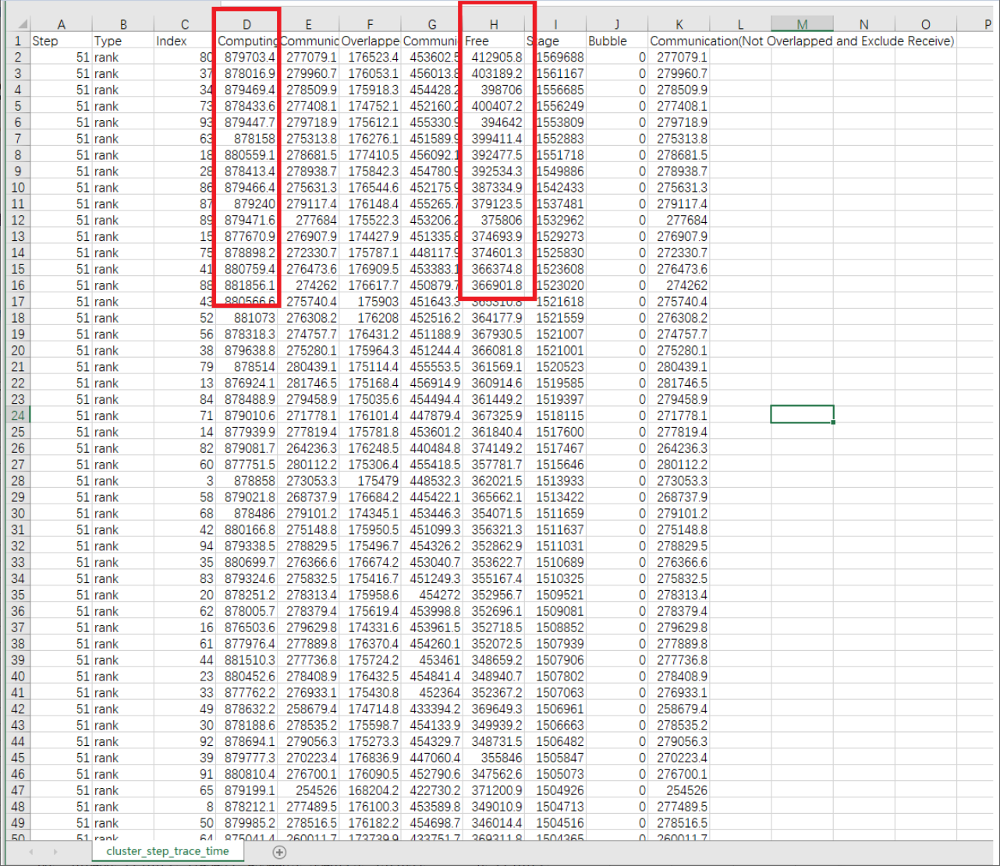
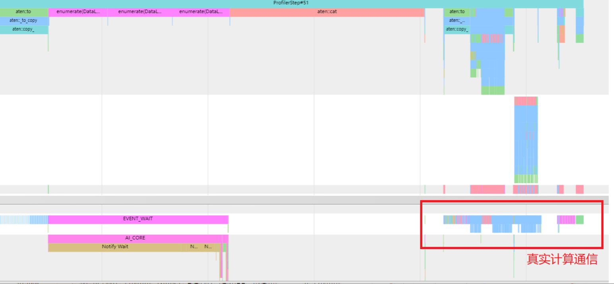
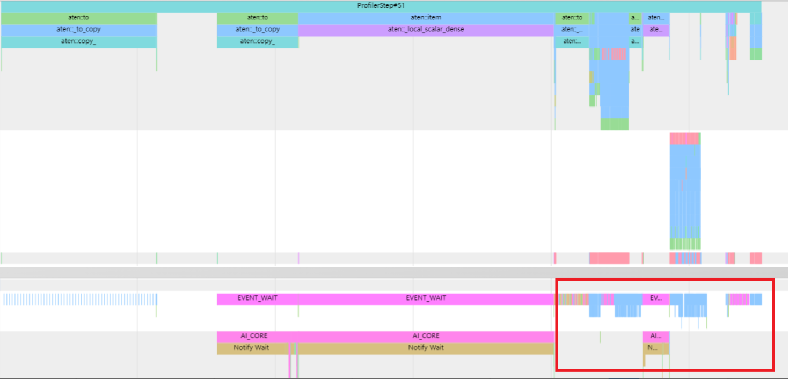
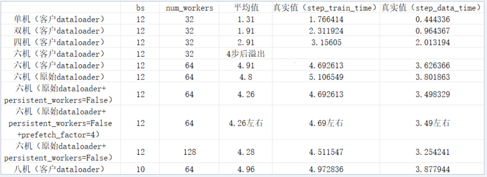

# SDXL模型多机线性度下降分析

## 问题现象

SDXL模型，从单机切换到6机上运行后，线性度大幅度下降。

## 分析定位

1. 获取cluster\_step\_trace\_time.csv数据。

    由于是6机16卡（总共96卡）的profiling数据，因此需要使用集群分析工具（[cluster\_analyse](https://gitcode.com/ascend/mstt/tree/master/profiler/msprof_analyze/cluster_analyse)）定位问题，获取cluster\_step\_trace\_time.csv数据，如图1所示。

    **图 1** 集群通信信息图
    

2. 检查各卡间的计算时间和空闲时间，比较最大和最小时间之间是否存在较大差距。
    - 计算时间：\(879703.4-878369\) / 879703.4小于1%，基本无差距。

    - 空闲时间：除了0卡外，其他时间比较均衡（300ms-400ms左右），不是主要瓶颈所在。

3. 分析总耗时。

    总耗时只有1.5s左右，而用户给出的Step迭代打印耗时在4s左右，两者之间差距极大，这种情况首先怀疑是迭代间隙的数据预处理时间。

4. 打开一张卡（一般先选0卡）的trace\_view.json进行分析。

    观察0卡的profiling，发现只有小半时间在进行计算通信，其余时间均在数据加载，数据处理等操作，如图2所示。

    **图 2**  第0卡的profiling图
    

5. 观察其他卡的profiling。

    通过观察，发现其他卡也基本上是相同现象，如图3所示。但在其他卡的profiling中，却没有DataLoader的操作，如图4所示，反而是执行了broadcast等通信较长的算子。因此，怀疑是各卡的数据预处理操作都在一个卡上执行，导致耗时长。

    **图 3** 其他卡的profiling图
    

    **图 4** DataLoader相关接口示意图
    

6. 查看不同机器数量的DataLoader耗时。

    根据用户测试不同机器数量所获取的DataLoader耗时数据，观察到随着机器增多，数据加载所需的时间也成比例增长，如图5所示。

    **图 5** 多机实验汇总图
    

## 优化方案

1. **前期排查思路**
    1. 发现数据在HDD盘上，非NVMe盘，因此排查磁盘问题，发现没有收益。
    2. 检查机器频率和NUMA，均正常。
    3. 通过profiling和代码进行查看，模型通过accelerate代码进行broadcast，具体从主卡0卡开始，向其他所有机器的所有卡进行broadcast。
    4. 通过profiling以及对NPU硬件特性的了解，怀疑是这种数据加载方式导致的性能劣化。

2. **优化数据加载以及后续遇到的问题**

    从accelerate框架中找到dispatch\_batch参数。通过将dispatch\_batch参数设置为False，实现每张卡加载数据时性能的显著提升。后续6机出现内存问题，主要表现为内存明显增加以及内存在训练过程中持续增长。

3. **解决思路**
    1. 简化代码，通过排除法可以发现是数据集加载出现问题，因此去掉模型前反向逻辑。
    2. 通过代码梳理，从DataLoader开始，到collate\_fn再到dataset，先后排查了算子cat和内存池溢出等，均正常。
    3. 最后，发现dataset使用的是IterableDataset，dataset需要按行读取数据，而数据集是gzip格式。gzip在被IterableDataset的生成器（generator）打开后，每次只读一行，在读完前无法释放gzip。

4. **解决方法**

    通过将gzip解压缩、IterableDataset替换为标准的torch.utils.data.Dataset以及用get item的方式去读取数据，解决了多机线性度下降问题。
