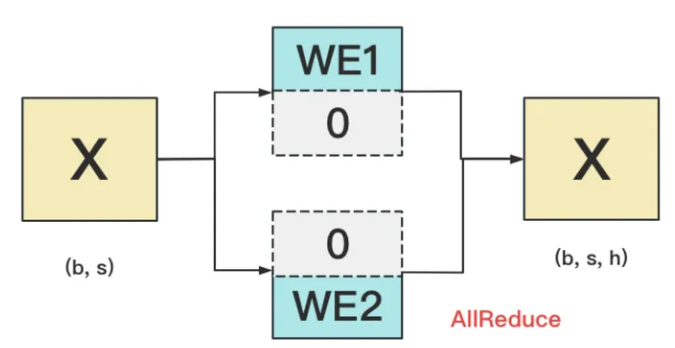
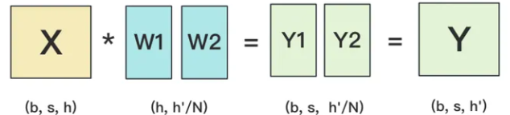
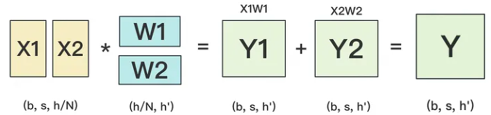

# 张量分布式并行计算

大模型参数规模大，存储并优化这些参数需要的内存显著超出设备的上限，超大的训练数据和参数规模也使得训练时间非常长。所以模型参数必须要能分割到多个AI处理器设备上，利用大量设备分布式地完成大模型的训练。分布式训练必然带来通信开销，另外这些通信算子也会引起计算精度问题，进而影响模型收敛。

本节将介绍Megatron-LM（一个用于大规模语言模型的分布式训练框架）的模型分割和计算并行算法，以及这些算法可能引起的计算精度问题。

模型并行主要有两种方式，即流水线并行和张量并行。

- 流水线并行将模型的不同层放置到不同的设备上。这种方式可以在不同设备上并行执行不同的模型阶段，从而提高效率。
- 张量并行将模型的层内部进行分割，将某一层的计算分配到不同的设备上，再通过集合通信拿到完整的计算结果。

需要注意的是，流水线并行是伪并行，需要结合数据微批次（micro-batch）使用才能减少NPU或主流AI处理器的空闲等待时间（空泡），而张量并行是真并行，不会引起空泡，但两者都会带来很大的通信开销。

## 词嵌入输入层embedding张量并行

embedding层的作用是为给定一个长度为s的输入token id序列，输出这个序列对应s个h维向量。token所在的词汇表长度一般记为v，v大约在3万到5万。h一般是一万以上。所以词嵌入层的参数量为v\*h，大约在亿量级。因为embedding层的运算是查表，它的切割比较直接明了，只需要将词汇表分成连续的段，每段的词向量存放在一个AI处理器上即可。例如token id为0\~3999的词向量存在NPU0上，4000\~7999的词向量存在NPU1上。给定token id输入序列，分别在NPU0、NPU1上查找词向量，找不到的词向量置为0。查找完毕后每个NPU设备做一次TP组的AllReduce即可在每个NPU设备上获得完整的s\*h维词embedding矩阵。如下图所示：

**图 1**  词嵌入层张量并行  

并行词嵌入层的前向AllReduce累加本质上是拼接，所以不会引起浮点精度问题。X是输入id序列，反向过程也不需要计算X的梯度。

## 线性层张量并行

Transformer中会将输入向量通过线性层转成QKV矩阵。线性层是一个h\*h权重矩阵，如果h是一万，那么此权重矩阵规模也是亿级。线性层权重矩阵有两种切分方式，行切分和列切分。

列切分后输入矩阵X分别在NPU0和NPU1上与切分后的子矩阵W1、W2相乘，得到Y1、Y2，将Y1、Y2简单合并就得到最终结果Y。列切分后的反向传播过程这里略过。列切分后的前向计算过程如下：

列切分的前向只涉及结果的简单合并，所以不会引起精度问题。但是反向过程X的梯度，涉及W1、W2两个（实际情况下张量并行度一般是8）传播路径，需要做AllReduce通信算子计算，需要考虑精度问题。例如OLMo-7B就使用FP32进行梯度reduce，而Falcon-7B使用BF16进行梯度reduce。一般来说，参数越多，TP并行度越高，使用BF16做梯度reduce的难度越大。

如果权重矩阵按行切分成W1、W2，则输入X需要按列切分成X1、X2到各NPU设备，否则维度不一致无法做矩阵乘法。各个设备矩阵乘法的结果Y1=X1\*W1和Y2=X2\*W2需要做AllReduce同步将Y1、Y2加起来才能得到X\*W的最终结果，正向过程有累加运算，需要考虑是否会引起精度误差。如下图所示：

## MLP层切分

MLP层有一个线性层A将输入向量维度扩大四倍（或其他倍数），再经过一个激活层GELU，最后通过一个线性层B再降维到输入的维度。通过如下公式表示：

其中X尺寸为s\*h，A尺寸为h\*4h，B尺寸为4h\*h。最优切分方案是对A采用列切分，对B采用行切分，这样可以简化计算过程并降低集合通信量。MLP的切分正向过程有AllReduce矩阵累加，反向过程需要将X的梯度做AllReduce，需要考虑累加带来的浮点精度问题。

## 流水线并行

流水线并行在水平方向上将模型的Transformer层放在不同的NPU上，一份训练数据的完整计算在多个NPU上完成。因为后一层的输入需要依赖前一层的输出，如果仅有一个batch数据，那么NPU大部分时间都在等待，不能达到加速计算的目的。为了解决NPU设备的空等（计算空泡）问题，一个大的batch会被切分成多个小的微batch，通过精心设计的流水线调度算法减小计算空泡时间，例如1F1B虚拟流水线并行算法。流水线并行在一个数据批次结束时需要在NPU之间同步累积各层的梯度信息（flush），需要考虑累加带来的浮点精度问题。
