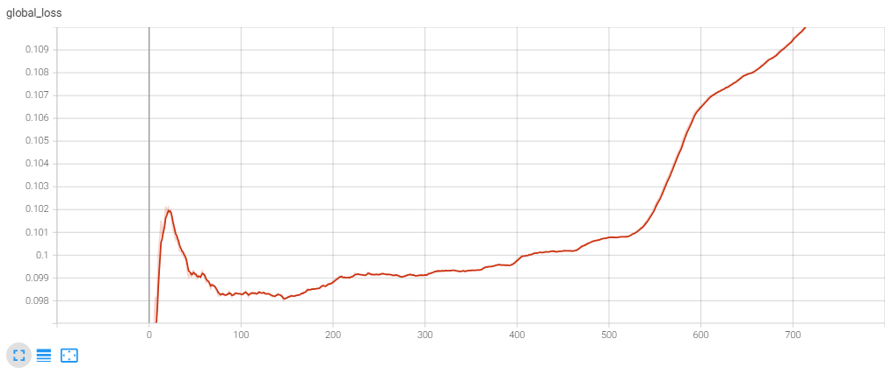
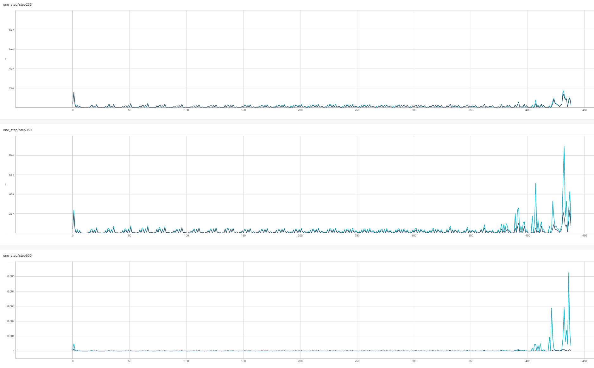

# 文生图调优案例

## 问题现象

使用DeepSpeed ZeRO-1配置训练Open Sora类模型时，将GPU卡从64卡增大到128卡时遇到loss突然起飞，并且在loss起飞前，输出的图像质量就已经下降。当在128卡下使用Torch DDP训练时，则没有loss起飞的问题，并且出图质量也没有问题。

## 问题定位

首先检查优化器的超参，未发现明显的不合理，然后将分布式优化器关闭后，即将ZeRO-1降到ZeRO-0，发现问题仍然存在。因为ZeRO-0基本等价于Torch DDP，所以需要去理解DeepSpeed ZeRO-0和Torch DDP实现的差异。

经过对比发现DeepSpeed的ZeRO-0使用的梯度同步dtype是BF16，而Torch DDP默认是FP32。所以在DeepSpeed中改成用FP32做梯度同步，但loss起飞现象仍然存在。通过进一步研究发现Torch DDP反向计算梯度buffer用的dtype是FP32，在DeepSpeed训练中将反向计算dtype改为FP32后，训练可以正常收敛。

可以确定DeepSpeed下的loss跑飞是因为反向传播用的dtype是BF16。但是BF16低精度的梯度为什么会导致loss跑飞，并且如何才能在BF16下正常收敛。

**图 1**  BF16下的loss曲线  

从图中可以发现350步左右开始loss逐步上扬。所以分别采集了训练稳定的235步，loss跑飞前的350步，跑飞后的600步时各层的FP32和BF16梯度，如下图所示：

**图 2**  梯度采集图  

上图中x轴为层的编号，编号越大说明此层越靠近输入（早期层），越小越靠近loss。在235步的时候（图中第一行），早期层的梯度有轻微上扬，FP32（黑色）和BF16（蓝色）基本处于正常范围内。当在loss跑飞早期的第350步（图中第二行），BF16的早期层gnorm达到了8e-4，基本是FP32早期层gnorm最大值的两倍。而到loss跑飞的600步，BF16下的早期层gnorm相比FP32就更大了。因为反向传播梯度计算的链式法则，误差会逐层放大。所以BF16的低精度会引起早期层梯度的更大范围的波动（类似于钟摆的尾端有更大的波动幅度）。

## 优化方案

为了解决BF16混合精度导致的收敛问题，需要避免在早期层进行大幅度的权重更新。在上述例子中，控制梯度裁剪的max gnorm参数使用的缺省值是1.0，而Open Sora的gnorm通常只有1e-3量级。这意味着即使出现loss跑飞的情况，梯度裁剪也不会被触发。为了解决这个问题，用户可以将控制梯度裁剪的max gnorm参数调整为5e-3，通过这种方式，loss曲线只会产生一个小的鼓包，之后又能恢复到稳定的训练状态。
