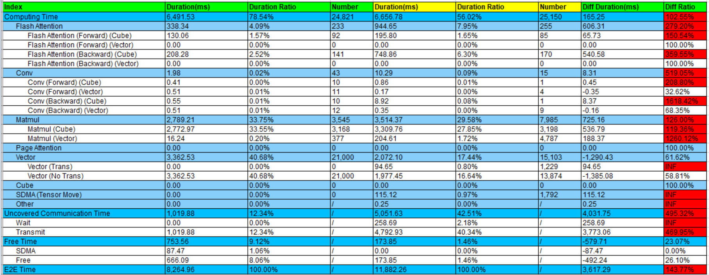

# 工具分析

单机优化分析方法，不在于限制设备数量到一台设备，而是注重解决非规模性训练的性能问题，其所使用的性能优化方法，是可以沿用到集群中的。不过对于集群场景，需要有更快速、更宏观的定位方法，若定位到具体的慢节点或慢链路时，解决方法还是回归到单机优化分析方法。

首先，从[基础优化流程](basic_opt_process.md)章节已知，单机场景下的性能问题主要表现为两类：性能不及预期和性能波动。以下针对这两种情况进行具体案例分析。

性能优化分析的核心思想是抓大放小，根据场景进行针对性优化。对于性能不及预期的场景，普遍有竞品作为标杆，因此，对于问题场景，可以通过性能分析识别出性能较差的组件。在比对分析时，会进行性能的自动拆解和比对，拆解和比对方法可参考性能比对工具（[compare\_tools](https://gitcode.com/ascend/mstt/tree/master/profiler/msprof_analyze/compare_tools)），结果如图1所示。

**图 1**  拆解对比结果

查看图1，可以从最右列（Diff Ratio）找到问题组件，问题可能出现在计算（Flash Attention、Conv、Matmul）、调度（Free Time），或者出现在更为复杂的通信场景（Uncovered Communication Time）。同时，我们使用专家建议功能（advisor），提供性能调优建议，使用方法可参考[advisor](https://gitcode.com/ascend/mstt/tree/master/profiler/msprof_analyze/advisor)。当前专家建议不断总结性能调优经验，能迅速识别并解决大部分常见性能问题。

针对性能波动场景，可采集波动较大的计算步骤进行针对性分析，通过拆解得到比对表格，定位到具体问题部分。

但对于以下复杂情况需要特殊处理：

- 若问题来源于下发（拆解中的Free）阶段：问题来源于Host，因此需要利用”火焰图”等相关工具，对CPU相关性能进行分析。
- 若问题来源于未掩盖通信（Uncovered Communication Time）：问题可能来自于快慢卡或者通信网络的阻塞，需结合具体现象做进一步分析。
