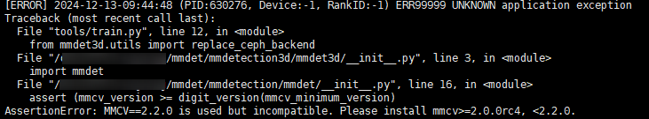

# 套件与三方库支持清单

## 概述

本手册主要介绍昇腾设备支持的模型套件与加速库、昇腾已原生支持的第三方库和昇腾自研插件。

- 昇腾已原生支持的第三方库，用户需要关注NPU目前对库中特性的支持情况；
- 昇腾自研插件，用户需要额外安装自研插件适配第三方库，并关注其适配情况。

## 昇腾模型套件与加速库

### 昇腾模型加速库

|名称|介绍|版本要求|适配说明|
|--|--|--|--|
|MindSpeed Core|MindSpeed Core是针对华为昇腾设备的大模型加速库。大模型训练是一种非常复杂的过程，涉及到许多技术和挑战，其中大模型训练需要大量的显存资源是一个难题，对计算卡提出了不小的挑战。为了在单个计算卡显存资源不足时，可以通过多张计算卡进行计算，业界出现了类似Megatron、DeepSpeed等第三方大模型加速库，对模型、输入数据等进行切分并分配到不同的计算卡上，最后再通过集合通信对结果进行汇总。昇腾提供MindSpeed Core加速库，使能客户大模型业务快速迁移至昇腾设备，并且支持昇腾专有算法，确保开箱可用。|Python版本：3.10<br>CANN版本：CANN 9.0.0<br>PyTorch版本：2.7.1<br>torch_npu版本：26.0.0|具体使用方法请参考[LINK](https://gitcode.com/Ascend/MindSpeed/tree/26.0.0_core_r0.12.1)。|

### 昇腾模型套件

|名称|介绍|版本要求|适配说明|
|--|--|--|--|
|MindSpeed LLM|MindSpeed LLM旨在为华为昇腾AI处理器上的大语言模型提供端到端的解决方案，包含模型，算法，以及下游任务。|Python版本：3.10<br>CANN版本：CANN 9.0.0<br>PyTorch版本：2.7.1<br>torch_npu版本：26.0.0|具体使用方法请参考[LINK](https://gitcode.com/Ascend/MindSpeed-LLM/tree/26.0.0)。|
|MindSpeed MM|MindSpeed MM是面向大规模分布式训练的昇腾多模态大模型套件，同时支持多模态生成及多模态理解，旨在为华为昇腾AI处理器提供端到端的多模态训练解决方案, 包含预置业界主流模型，数据工程，分布式训练及加速，预训练、微调、在线推理任务等特性。|Python版本：3.10<br>CANN版本：CANN 9.0.0<br>PyTorch版本：2.6.0、2.7.1<br>torch_npu版本：26.0.0|具体使用方法请参考[LINK](https://gitcode.com/ascend/MindSpeed-MM/tree/26.0.0)。|
|MindSpeed RL|MindSpeed RL基于昇腾生态的强化学习套件，支持超大昇腾集群训推共卡/分离部署、多模型异步流水调度、训推异构切分通信等核心加速能力。|Python版本：3.10<br>CANN版本：CANN 9.0.0<br>PyTorch版本：2.5.1<br>torch_npu版本：26.0.0|具体使用方法请参考[LINK](https://gitcode.com/ascend/MindSpeed-RL/tree/2.3.0/)。|
|Driving SDK|Driving SDK是基于昇腾NPU平台开发的适用于自动驾驶场景的算子和模型加速库，提供了一系列高性能的算子和模型加速接口，支持PyTorch框架。|PyTorch版本：2.1.0、2.6.0及以上<br>Python版本：3.8及以上|具体使用方法请参考[LINK](https://gitcode.com/Ascend/DrivingSDK/tree/branch_v26.0.0)。|

### 昇腾模型库

<table style="undefined;table-layout: fixed; width: 731px"><colgroup>
<col style="width: 129px">
<col style="width: 317px">
<col style="width: 146px">
<col style="width: 139px">
</colgroup>
<thead>
  <tr>
    <th>名称</th>
    <th>介绍</th>
    <th>版本要求</th>
    <th>适配说明</th>
  </tr></thead>
<tbody>
  <tr>
    <td>ModelZoo-PyTorch</td>
    <td rowspan="2">ModelZoo，昇腾旗下的开源AI模型平台，涵盖计算机视觉、自然语言处理、语音、推荐、多模态、大语言模型等方向的AI模型及其基于昇腾机器实操案例。平台的每个模型都有详细的使用指导。</td>
    <td rowspan="2">各个模型版本要求不同，具体参考各模型库。<br></td>
    <td>具体使用方法请参考<a href="https://gitcode.com/Ascend/ModelZoo-PyTorch" target="_blank" rel="noopener noreferrer">LINK</a>。</td>
  </tr>
  <tr>
    <td>ModelZoo-GPL</td>
    <td>具体使用方法请参考<a href="https://gitcode.com/Ascend/modelzoo-GPL" target="_blank" rel="noopener noreferrer">LINK</a>。</td>
  </tr>
</tbody>
</table>

## 昇腾自研插件

为扩展Ascend Extension for PyTorch能力，昇腾自研的插件清单如下所示。

|名称|介绍|版本要求|适配说明|
|--|--|--|--|
|TorchAir|TorchAir是为torch_npu提供图模式能力的扩展库，支持用户使用PyTorch和torch_npu在昇腾设备上进行图模式的训练和推理。TorchAir对外提供昇腾设备的图模式编译后端，对接PyTorch的dynamo特性，将PyTorch的FX计算图转换为昇腾的GE计算图，并提供在昇腾设备上启动GE计算图编译和执行的能力。|PyTorch版本为2.6.0及以上。<br>Ascend Extension for PyTorch插件版本为26.0.0。|具体使用方法请参考《PyTorch 图模式使用指南(TorchAir)》。|
|OpPlugin|OpPlugin插件提供了将PyTorch算子映射到昇腾AI处理器的功能，为使用PyTorch框架的开发者提供了便捷的NPU算子库调用能力。|OpPlugin的版本为26.0.0。|请参考[LINK](https://gitcode.com/Ascend/op-plugin/tree/26.0.0)安装该库，基于OpPlugin插件进行自定义算子的适配开发流程和使用样例具体可参考《PyTorch 框架特性指南》中的“基于OpPlugin算子适配开发”章节。<br>PyTorch官方提供了C++ extensions的方式供用户编写并调用自定义算子，用户可选择使用C++ extensions进行自定义算子开发适配，具体可参考《PyTorch 框架特性指南》中的“基于C++ extensions算子适配开发”章节。|
|Torchvision Adapter|Torchvision Adapter插件用于昇腾适配Torchvision框架。目前该框架增加了对Torchvision所提供的常用算子的支持，基于cv2和昇腾NPU的图像处理加速后端提供图像处理加速能力。|Torchvision版本为0.21.0，PyTorch版本为2.6.0；<br>Torchvision版本为0.22.1，PyTorch版本为2.7.1。|请参考[LINK](https://gitcode.com/ascend/vision)安装该库的昇腾适配版本和了解其适配情况。|
|Apex Patch|Apex Patch以代码patch的形式发布，用户通过对原始Apex进行patch，可以在华为昇腾AI处理器上，使用Apex的自动混合精度训练功能进行模型训练，提升AI模型的训练效率，同时保持模型的精度和稳定性。此外，Apex Patch额外提供了如梯度融合、融合优化器等，以提升部分场景下模型在昇腾NPU上的训练效率，供用户选择使用。|-|请参考[LINK](https://gitcode.com/ascend/apex)安装该库的昇腾适配版本和了解其适配情况。|

## 昇腾原生支持的第三方库

### 三方库清单列表

昇腾NPU已原生支持的第三方库如下表所示，目前对库中特性的支持情况可参考适配说明。用户可以依据第三方库提供的官方指导文档，在NPU上直接使用这些库，无需额外的适配工作。

|名称|介绍|版本要求|适配说明|
|--|--|--|--|
|DeepSpeed|DeepSpeed是一个用于优化分布式训练的深度学习第三方库。DeepSpeed大幅提高了存储空间使用效率和通信效率，可以让用户在最小代码改动的基础上支持更长的输入数据、对更大规模的模型进行更快速的训练。|推荐最新版DeepSpeed。|<term>Atlas A2 训练系列产品</term>原生支持昇腾NPU，使用方法请参考[LINK](https://github.com/microsoft/DeepSpeed)。|
|Transformers|Hugging Face核心套件Transformers提供了便于快速下载和使用的API，用户可以对预训练模型进行微调，已原生支持昇腾NPU。现已支持在昇腾NPU上对Transformers进行单机单卡、单机多卡的BF16、FP16格式训练、APEX模块下的混合精度进行训练。|推荐Transformers版本为4.37.1，PyTorch版本为2.1.0。<br>该推荐版本为昇腾NPU自验证的版本，其余版本用户需自行验证。|<term>Atlas A2 训练系列产品</term>已原生支持昇腾NPU，使用方法请参考[LINK](https://huggingface.co/docs/transformers/index)。|
|Accelerate|Hugging Face核心套件Accelerate是一个用于加速PyTorch训练的库。它提供了一种简单易用的方法来并行化和分布式训练，同时还提供了许多其他的优化技术，已原生支持昇腾NPU。|推荐Accelerate版本为0.26.1，PyTorch版本2.1.0。<br>该推荐版本为昇腾NPU自验证的版本，其余版本用户需自行验证。|<term>Atlas A2 训练系列产品</term>已原生支持昇腾NPU，使用方法请参考[LINK](https://huggingface.co/docs/accelerate/index)。|
|TRL|TRL（Transformer Reinforcement Learning）是一个全栈库，提供了一组工具，用于使用强化学习来训练Transformer语言模型，已原生支持昇腾NPU。|推荐TRL版本为0.7.11，PyTorch版本2.1.0。<br>该推荐版本为昇腾NPU自验证的版本，其余版本用户需自行验证。|<term>Atlas A2 训练系列产品</term>已原生支持昇腾NPU，使用方法请参考[LINK](https://huggingface.co/docs/trl/index)。|
|MMCV|MMCV是一个主要用于计算机视觉研究的第三方库。|当前只支持main分支，版本随社区演进。main分支支持PyTorch2.1版本、2.5及以上版本。mmcv的tags版本只支持v2.2.0及以上版本，如需使用其他版本可自行修改version.py里的版本号进行编译，具体可参考[LINK](https://mmcv.readthedocs.io/zh-cn/v2.0.1/get_started/build.html#npu-mmcv)。|已原生支持昇腾NPU，使用方法请参考[LINK](https://mmcv.readthedocs.io/zh-cn/v2.0.1/get_started/build.html#npu-mmcv)，昇腾NPU支持的算子列表请参考[昇腾支持的MMCV算子列表](#昇腾支持的mmcv算子列表)。|
|MMEngine|MMEngine是一个基于PyTorch框架用于训练深度学习模型的第三方库。MMEngine是OpenMMLab 2.0的基础库，用于基础runner搭建，兼容当前流行的模型库（例如Torchvision、Detectron2）并可以用更小的代码量完成训练任务。|要求MMEngine版本为0.5.0及以上。|已原生支持昇腾NPU，使用方法请参考[LINK](https://mmengine.readthedocs.io/en/latest/)。|
|MMDetection|MMDetection是一个基于PyTorch的开源对象检测工具箱，提供了已公开发表的多种流行的检测组件，通过这些组件的组合可以迅速搭建出各种检测框架。|要求MMDetection版本为2.26.0及以上。<br>当使用MMDetection时出现“AssertionError: MMCV==2.2.0 is used but incompatible.”报错，具体处理方法请参考[当使用MMDetection或MMDetection3D时出现“AssertionError: MMCV==2.2.0 is used but incompatible.”报错](#当使用mmdetection或mmdetection3d时出现assertionerror-mmcv220-is-used-but-incompatible报错)。|已原生支持昇腾NPU，使用方法请参考[LINK](https://mmdetection.readthedocs.io/en/latest/)，昇腾NPU支持的模型列表请参考[昇腾支持的MMDetection模型列表](#昇腾支持的mmdetection模型列表)。|
|MMDetection3D|MMDetection3D是通用三维目标检测算法平台，面向自动驾驶、室内等多场景，包含（深度）相机、激光雷达等多模态传感器，支持三维目标检测/语义分割等多任务，是自动驾驶领域较为重要的模型库。|要求MMDetection3D版本为1.4.0及以上，PyTorch版本2.1.0。<br>当使用MMDetection3D时出现“AssertionError: MMCV==2.2.0 is used but incompatible.”报错，具体处理方法请参考[当使用MMDetection或MMDetection3D时出现“AssertionError: MMCV==2.2.0 is used but incompatible.”报错](#当使用mmdetection或mmdetection3d时出现assertionerror-mmcv220-is-used-but-incompatible报错)。|已原生支持昇腾NPU，使用方法请参考[LINK](https://github.com/open-mmlab/mmdetection3d)，昇腾NPU支持的模型列表请参考[昇腾支持的MMDetection3D模型列表](#昇腾支持的mmdetection3d模型列表)。|
|TorchData|TorchData是一个包含常用模块化数据加载原语的beta库，用于轻松构建灵活且高性能的数据管道。|推荐使用的TorchData版本为v0.11.0，推荐的PyTorch版本为2.6.0。|已原生支持昇腾NPU，使用方法请参考[LINK](https://pytorch.org/data/beta/index.html)。昇腾NPU支持的特性列表请参考[昇腾支持的TorchData特性列表](#昇腾支持的torchdata特性列表)。|
|torchtune|torchtune是由PyTorch团队开发的一个专门用于LLM微调的库。它旨在简化LLM的微调流程，提供了一系列高级API和预置的最佳实践，使得研究人员和开发者能够更加便捷地对LLM进行调试、训练和部署。torchtune基于PyTorch生态系统构建，充分利用了PyTorch的灵活性和可扩展性，同时针对LLM微调的特点进行了优化和改进。|推荐使用的torchtune版本为0.6.0，推荐的PyTorch版本为2.6.0。|<term>Atlas A2 训练系列产品</term>/<term>Atlas A3 训练系列产品</term>产品原生支持昇腾NPU，使用方法请参考[LINK](https://pytorch.org/torchtune/0.6/overview.html)。昇腾NPU支持的特性列表请参考[昇腾支持的torchtune特性列表](#昇腾支持的torchtune特性列表)。|
|Xtuner|Xtuner是InternLM团队推出的一款高效、灵活且功能全面的大语言模型（LLM）和多模态模型（VLM）微调工具库。它旨在通过轻量级设计和简单配置，降低大模型微调的门槛，同时支持多种主流模型和数据格式。|推荐使用的Xtuner版本为v0.2.0rc0，推荐的PyTorch版本为2.6.0。|<term>Atlas A2 训练系列产品</term>/<term>Atlas A3 训练系列产品</term>原生支持昇腾NPU，使用方法请参考[LINK](https://github.com/InternLM/xtuner/tree/main?tab=readme-ov-file#%EF%B8%8F-quick-start)。昇腾NPU支持的特性列表请参考[昇腾支持的Xtuner特性列表](#昇腾支持的xtuner特性列表)。|
|verl|verl是由Bytedance Seed团队开源的大模型强化学习训练库。支持PPO/GRPO/DAPO等主流强化学习算法，以及Async-RL、Agentic-RL、ReTool等前沿特性。基于HybridFlow思想，通过集成vLLM/SGLang推理后端，FSDP/FSDP2/Megatron-LM等训练后端，实现高效的强化学习分布式训练。|使用v0.5.0及以上版本。因新特性持续适配中，推荐基于main分支代码本地源码安装，体验最新特性。|部分特性已原生支持昇腾NPU，使用方法及已支持的场景请参考[LINK](https://github.com/verl-project/verl/blob/main/docs/ascend_tutorial/quick_start/ascend_quick_start.rst)。|
|ms-swift|ms-swift是ModelScope开源的大模型训练与微调框架，支持500+LLM与200+多模态模型，提供PEFT、全参微调、CPT、SFT、DPO、GRPO 等能力，帮助快速完成大模型训练、微调与对齐，适用于问答、代码、多模态等场景。|使用3.10.0及以上版本，因新特性持续适配中，推荐基于main分支代码本地源码安装，体验最新特性。|部分特性已原生支持昇腾NPU，使用方法请参考[LINK](https://github.com/modelscope/ms-swift/blob/main/docs/source/BestPractices/NPU-support.md)，已支持场景请参考[LINK](https://github.com/modelscope/ms-swift/blob/main/docs/source/BestPractices/NPU-support.md#%E6%94%AF%E6%8C%81%E7%8E%B0%E7%8A%B6)。|

### 特性支持度

#### 昇腾支持的MMCV算子列表

当前昇腾NPU支持的MMCV算子列表请参考下表。

> [!NOTE]
>
> - “-”代表不支持。
> - “√”代表支持。

|算子名称|CPU|昇腾设备|昇腾设备使用约束|
|--|--|--|--|
|ActiveRotatedFilter|√|√|&#8226; 参数feature要求shape为5维，[*,*, num_orientations, h, w]，支持fp16/fp32，不支持inf/nan等异常值<br>&#8226; 参数indices要求shape为4维，[num_orientations, h, w, *]，只支持int32，不支持inf/nan等异常值，取值生成方式请参考mmrotate/orconv.py|
|AssignScoreWithK|-|-|-|
|BallQuery|-|√|&#8226; xyz：输入3D Tensor，支持fp16/fp32，shape为[M, K, 3]，不支持inf/nan等异常值<br>&#8226; center_xyz：输入3D Tensor，支持fp16/fp32，shape为[ M, B, 3]，不支持inf/nan等异常值<br>&#8226; max_radius：输入最大半径，float<br>&#8226; min_radius：输入最小半径，float<br>&#8226; sample_num：输入最大采样点数，int<br>&#8226; idx：输出3D Tensor，支持int32，shape为[M, B, sample_num]，不支持inf/nan等异常值<br>&#8226; center_xyz和xyz的差值需要在147.0以内，否则在计算距离时将会发生溢出，导致计算结果不正确<br>&#8226; max_radius的取值需要大于等于0，sample_num的取值需要大于等于1|
|BBoxOverlaps|-|√|&#8226; bboxes1：Tensor，支持fp32，shape为[M, 4]，格式为<x1, y1, x2, y2>, <x1, y1>为左下角坐标，<x2, y2>为右上角坐标，小于1e8，不支持inf/nan等异常值<br>&#8226; bboxes2：Tensor, 支持fp32，shape为[N, 4]，格式为<x1, y1, x2, y2>, <x1, y1>为左下角坐标，<x2, y2>为右上角坐标，小于1e8，不支持inf/nan等异常值<br>&#8226; M > 0, N > 0, M与N不必相同<br>&#8226; x1 < x2, y1 < y2|
|BorderAlign|-|-|-|
|BoxIouRotated|√|√|&#8226; 输入bboxes1，shape为[N, 5]，支持fp32，框数N不建议过大，尾轴5表示(x_center, y_center, width, height, angle)，其中angle旋转角度采用弧度制，不支持inf/nan等异常值<br>&#8226; 输入bboxes2，shape为[M, 5]，要求同bboxes1<br>&#8226; mode属性支持iou，aligned属性支持False，clockwise属性支持True<br>&#8226; 算子实现涉及三角函数计算，小数位超4位或存在精度误差|
|BoxIouQuadri|√|-|-|
|BoxesOverlapBev|-|√|&#8226; 格式1：<br>boxes_a：Tensor支持fp32，shape为[M, 5]。其中5分别代表x1, y1, x2, y2, angle<br>boxes_b：Tensor支持fp32，shape为[N, 5]。其中5分别代表x1, y1, x2, y2, angle<br>&#8226; 格式2：<br>boxes_a：Tensor支持fp32，shape为[M, 7]。其中7分别代表x, y, z, w, h, d, angle<br>boxes_b：Tensor支持fp32，shape为[N, 7]。其中7分别代表x, y, z, w, h, d, angle<br>&#8226; angle的值在[-pi, pi]之间<br>&#8226; M和N在[1, 1024]之间<br>&#8226; 不支持inf/nan等异常值|
|CARAFE|-|-|-|
|ChamferDistance|-|√|&#8226; xyz1：支持fp16，fp32，shape为[B, N, 3]，不支持inf/nan等异常值<br>&#8226; xyz2：支持fp16，fp32，shape和xyz1保持一致<br>&#8226; 反向具有相同约束|
|CrissCrossAttention|-|-|-|
|ContourExpand|√|-|-|
|ConvexIoU|-|-|-|
|CornerPool|-|-|-|
|Correlation|-|-|-|
|Deformable Convolution v1/v2|√|√|&#8226; input：支持fp32，shape为[N, out_channels, H_in, W_in]，input中的值不支持inf、nan等异常值<br>&#8226; offset：支持fp32，shape为[N, deform_groups *2* kH *kW, H_out, W_out]，值域为[-1, 1]。其中，H_out = ( H_in - ( kH + ( kH - 1 )* ( dilation - 1 ) ) + 2 *padding ) / stride + 1，W_out = ( W_in - ( kW + ( kW - 1 )* ( dilation - 1 ) ) + 2 * padding ) / stride + 1<br>&#8226; weight：支持fp32，shape为[out_channels, in_channels, kH, kW]<br>&#8226; 参数deform_groups只支持等于1<br>&#8226; 反向具有相同约束|
|Deformable RoIPool|-|√|&#8226; x：Tensor，支持fp32，shape为[N, C, H, W]，不支持inf/nan等异常值<br>&#8226; rois：Tensor，支持fp32，shape为[num_rois, 5]，不支持inf/nan等异常值<br>&#8226; offset：Tensor，仅支持None<br>&#8226; spatial_scale：float属性，值域范围[0, 1]，默认值1.0<br>&#8226; pooled_height和pooled_width：int属性，值域范围[0, 50]<br>&#8226; sampling_ratio：int属性，值域范围[0, 20]，默认值0<br>&#8226; gamma：float属性，值域范围[0, 1]，默认值0.1<br>&#8226; 反向具有相同约束|
|DiffIoURotated|-|√|&#8226; boxes_a：Tensor支持fp32，shape为[B, N, 5]；其中5代表x_center, y_center, dx, dy, angle<br>&#8226; boxes_b：Tensor支持fp32，shape为[B, N, 5]；其中5代表x_center, y_center, dx, dy, angle<br>&#8226; angle的值在[-pi, pi]之间<br>&#8226; B在[1, 1024]之间<br>&#8226; N在[1, 1024]之间<br>&#8226; 不支持inf/nan等异常值|
|DynamicScatter|-|√|&#8226; feats(Tensor)：点云特征张量[N, C]，仅支持两维，数据类型为float32，特征向量C长度上限为2048，不支持inf/nan等异常值<br>&#8226; coors(Tensor)：体素坐标映射张量[N, 3]，仅支持两维，数据类型为int32，此处以x, y, z指代体素三维坐标，其取值范围为0 <= x, y <= 2048, 0 <= z <= 256<br>&#8226; reduce_type(str)：压缩类型。可选值为'max', 'mean', 'sum'。默认值为'max'|
|FurthestPointSample|-|√|&#8226; points：仅支持fp32，shape为[B, N, 3]，不支持inf/nan等异常值<br>&#8226; numPoints：int，表示需要采样的点，个数严格小于N<br>&#8226; 第一个输入points_xyz的shape(batch, N, 3)的维度的总大小（batch x N x 3）不应该超过383166|
|FurthestPointSampleWithDist|-|√|&#8226; points：支持fp32，shape为[B, N, N]，值需要满足points[b, i, i] = 0，points[b, i, j] = points[b, j, i]，不支持inf/nan等异常值<br>&#8226; 参数num_points：支持int32，代表采样点个数，需要小于N|
|GatherPoints|-|√|&#8226; features输入shape为[B, C, N]，不支持inf/nan等异常值<br>&#8226; indices输入shape为[B, M]，取值不能超过N，不支持inf/nan等异常值<br>&#8226; features和indices的B需要相同|
|GroupPoints|-|√|&#8226; features：支持数据类型fp32，shape为[B, C, N]，其中C小于等于1024，不支持inf、nan等异常值<br>&#8226; indices：数据类型为int32，shape为[B, npoints, nsample]，值域[0, N)<br>&#8226; 反向具有相同约束|
|Iou3d|-|√|&#8226; boxes：shape必须为两维，且第二维必须为7，(N, 7)，N < 10000，7个维度分别代表([x, y, z, dx, dy, dz, heading])，其中dx, dy, dz代表长宽高，必须大于0，不支持inf/nan等异常值<br>&#8226; scores：Shape必须为一维，且第一维必须和boxes第一维相等，(N)，只支持fp32，值域范围[0, 1]<br>&#8226; iou_threshold：float类型的属性，值域范围[0, 1]|
|KNN|-|√|&#8226; xyz：仅支持fp32, shape为[B, N, 3]或[B, 3, N]，由transposed控制，每个batch中的任意一个点到center_xyz对应batch中的任意一个点的距离必须在1e10f以内，不支持inf/nan等异常值<br>&#8226; center_xyz：仅支持fp32, shape为[B, npoint, 3]或[B, 3, npoint]，由transposed控制<br>&#8226; transposed：bool，当transposed=True，xyz的shape为[B, 3, N]，center_xyz的shape为[B, 3, npoint]<br>&#8226; k：int，返回最近邻的个数，必须小于xyz中的数据量的大小N，必须大于0且小于100|
|MaskedConv|-|√|&#8226; input：支持fp32，shape为[N, C, H, W]，其中N仅支持等于1，不支持inf/nan等异常值<br>&#8226; mask：支持fp32，shape为[N, H, W]，其中N仅支持等于1，不支持inf/nan等异常值<br>&#8226; weight：支持fp32，shape为[C, C, kernel_size, kernel_size]，不支持inf/nan等异常值<br>&#8226; bias：支持fp32，shape为[C]，不支持inf/nan等异常值<br>&#8226; 参数bias默认为True，暂时不建议使用bias=False的情况<br>&#8226; 参数stride仅支持等于1<br>&#8226; 若卷积输出shape为[N, C, H_out, W_out]，卷积参数需要满足H_out = H且W_out = W。其中，H_out = ( H - ( kernel_size + ( kernel_size - 1 ) *( dilation - 1 ) ) + 2* padding ) / stride + 1，W_out = ( W - ( kernel_size + ( kernel_size - 1 ) *( dilation - 1 ) ) + 2* padding ) / stride + 1|
|MergeCells|-|-|-|
|MinAreaPolygon|-|-|-|
|ModulatedDeformConv2d|√|√|&#8226; input：支持fp32，shape为[N, out_channels, H_in, W_in]，input中的值不支持inf、nan等异常值<br>&#8226; offset：支持fp32，shape为[N, deform_groups *2* kH*kW, H_out, W_out]，值域为[-1, 1]。其中，H_out = ( H_in - ( kH + ( kH - 1 )* ( dilation - 1 ) ) + 2 *padding ) / stride + 1，W_out = ( W_in - ( kW + ( kW - 1 )* ( dilation - 1 ) ) + 2 *padding ) / stride + 1<br>&#8226; mask：支持fp32，shape为[N, deform_groups* kH * kW, H_out, W_out]<br>&#8226; weight：支持fp32，shape为[out_channels, in_channels, kH, kW]<br>&#8226; bias：支持fp32，shape为[out_channels]<br>&#8226; 参数deform_groups只支持等于1<br>&#8226; 反向具有相同约束|
|MultiScaleDeformableAttn|-|√|&#8226; 输入value(bs, num_keys, num_heads, embed_dims)：支持数据类型fp16，fp32，不支持inf/nan等异常值，其中参数num_keys = sum((H * W).item() for H, W in value_spatial_shapes)，参数num_heads当前支持取值范围在4~8，参数embed_dims当前支持取值范围在32~256，且为8的倍数<br>&#8226; 输入value_spatial_shapes(num_levels, 2)：支持数据类型int32，int64，为特征图宽和高，取值需要为正<br>&#8226; 输入value_level_start_index(num_levels, )：支持数据类型int32，int64，其构造逻辑为：value_level_start_index = torch.cat((value_spatial_shapes .new_zeros((1, )), value_spatial_shapes.prod(1).cumsum[0]\(:-1\)))<br>&#8226; 输入sampling_locations(bs, num_queries, num_heads, num_points, 2)：支持数据类型fp16，fp32，为缩放系数，合理取值为大于0小于1.0，参数num_points当前支持取值范围在4~8<br>&#8226; 输入attention_weights(bs, num_queries, num_heads, num_points)：支持数据类型fp16，fp32，不支持inf/nan等异常值，为加权权重|
|NMS|√|√|&#8226; boxes：Shape必须为两维，第二维必须为4，(N, 4)，N < 10000，只支持float32，不支持inf/nan等异常值，且4维(x1, y1, x2, y2)必须满足x1<x2，y1<y2<br>&#8226; scores：Shape必须为一维，且第一维必须和boxes第一维相等，(N)，只支持float32，不支持inf/nan等异常值，并且不包含重复值<br>&#8226; iou_threshold：float类型的属性，值域为[0, 1]<br>&#8226; offset：int类型的属性，只能是0或者1<br>&#8226; score_threshold：float类型的属性，值域为[0, 1]<br>&#8226; max_num：int类型的属性，大于等于0|
|NMSRotated|√|√|&#8226; boxes：Tensor，支持fp32，shape为[N, 5]，不支持inf/nan等异常值<br>&#8226; scores：Tensor，支持fp32，shape为[N]，不支持inf/nan等异常值<br>&#8226; labels：Tensor，支持fp32，shape为[N]，默认None<br>&#8226; iou_threshold：float属性，值域范围[0, 1]<br>&#8226; 角度处理存在精度损耗，临界场景存在一定概率取框偏差|
|NMSQuadri|√|-|-|
|PixelGroup|√|-|-|
|PointsInBoxes|√|√|&#8226; boxes输入shape为[B, M, 7]，不支持inf/nan等异常值<br>&#8226; pts输入shape为[B, npoints, 3]，不支持inf/nan等异常值<br>&#8226; 输入数据类型仅支持fp32，boxes参数的最后一维的第7个数据（索引从1开始）是旋转角，需要计算cos和sin，接口约束取值范围必须在(-65504，65504)之间，boxes和pts只支持batch=1，且boxes的个数在200以内|
|PointsInPolygons|-|√|&#8226; points：Tensor，支持fp32，shape为[N, 2]，N不超过2800，值域范围[10^(-10), 10^10]<br>&#8226; polygons：Tensor，支持fp32，shape为[M, 8]，值域范围[10^(-10), 10^10]，保证输入的四个点数据顺序是顺时针或者逆时针排列<br>&#8226; 不支持inf、nan等异常值|
|PSAMask|√|√|&#8226; input：输入shape为4维[M, N, P, Q]，数据类型为float32/float64，不支持inf/nan等异常值<br>&#8226; psa_type：值为collect/distribute<br>&#8226; mask_size：数据类型为tuple:(i, j)，其中满足i * j == N<br>&#8226; 反向具有相同约束|
|RotatedFeatureAlign|√|√|&#8226; x输入shape为[N, C, H, W]，输入数据类型仅支持fp32，不支持inf/nan等异常值<br>&#8226; bboxes输入shape为[N, H, W, 5]，5表示中心点坐标、旋转框宽高与旋转角，输入数据类型仅支持fp32，不支持inf/nan等异常值<br>&#8226; spatial_scale为0-1之间，points取值1或5，默认值为1<br>&#8226; 反向具有相同约束|
|RoIPointPool3d|-|√|&#8226; num_sampled_points：int属性，值域范围(0, N)<br>&#8226; points：Tensor，支持fp16/fp32，shape为[B, N, 3]，值域范围[2^(-63), 2^64]，不支持inf/nan等异常值<br>&#8226; point_features：Tensor，支持fp16/fp32，shape为[B, N, C]，其中C等于3，值域范围[2^(-63), 2^64]，不支持inf/nan等异常值<br>&#8226; boxes3d：Tensor，支持fp16/fp32，shape为[B, M, 7]，第三维前六个取值范围[2^(-63), 2^64]，第七个值取值范围[0, π]，不支持inf/nan等异常值<br>&#8226; 数据类型为float32时，建议B小于100、N小于等于2640、M小于等于48、num_sampled_points小于等于48，个别shape值略微超过建议值无影响，但所有shape值均大于建议值时，算子执行会发生错误<br>&#8226; 数据类型为float16时，建议B小于100、N小于等于3360、M小于等于60、num_sampled_points小于等于60，个别shape值略微超过建议值无影响，但所有shape值均大于建议值时，算子执行会发生错误<br>&#8226; N/M的值越大，性能劣化越严重，建议N小于M的六百倍，否则性能可能会严重下降|
|RoIPool|-|√|&#8226; input输入shape为[N, C, H, W]，aicore目前只支持C轴为16倍数的情况，其余情况走aicpu，不支持inf/nan等异常值<br>&#8226; roi输入为（batch_id, x1, y1, x2, y2），其中H>x2>x1, W>y2>y1, N>batch_id保证框是有效的，不支持inf/nan等异常值<br>&#8226; spatial_scale为0-1之间<br>&#8226; 输入数据类型仅支持fp32，反向具有相同约束。由于fp32只能表示小数点后6位，因此部分场景存在精度问题，且支持输入的feature_map内不存在相同值，如果输入的feature_map内存在相同值，则无法保证输出的最大值索引唯一<br>&#8226; 反向具有相同约束|
|RoIAlignRotated|√|-|-|
|RiRoIAlignRotated|-|-|-|
|RoIAlign|√|√|&#8226; input：Tensor，fp32，shape为[N, C, H, W]，不支持inf/nan等异常值<br>&#8226; rois：Tensor，fp32，shape为[B, 5], 其中，每一行的5个值中的第一个为对input首轴的索引，因此在[0, N-1]，其余四个为<x1, y1, x2, y2>, <x1, y1>为左下角的值，<x2, y2>为右上角的值，因此x1 < x2， y1 < y2<br>&#8226; output_size：int32二元组，表示h, w, 大于0<br>&#8226; spatial_scale：fp32值，大于0，默认为1.0<br>&#8226; sampling_ratio：int32值，默认为0|
|RoIAwarePool3d|-|-|-|
|SAConv2d|-|-|-|
|SigmoidFocalLoss|-|√|&#8226; pred：Tensor，支持fp32，shape为[N, M]，需要满足M>1，输入值域范围[0, 1]，不支持inf/nan等异常值<br>&#8226; target：Tensor，支持int64，shape为[N, ]，值域范围[0, M]，不支持inf/nan等异常值<br>&#8226; weight：Tensor，可选输入，支持fp32，shape为[M, ]，值域范围[-1, 1]，默认为None<br>&#8226; reduction：str属性，可选输入none, mean或sum，默认为mean，不支持inf/nan等异常值<br>&#8226; alpha：float属性，值域范围[0, 1]，默认为0.25<br>&#8226; gamma：float属性，值域范围[0, 5]，默认为2.0<br>&#8226; 反向增加如下约束：pred的shape为(N,M)，需要满足，当N>1时，reduction取值不能为None|
|SoftmaxFocalLoss|-|√|&#8226; pred：Tensor，支持fp32，shape为[N, M]，需要满足M>1，输入值域范围[0, 1]，不支持inf/nan等异常值<br>&#8226; target：Tensor，支持int64，shape为[N, ]，值域范围[0, M]，不支持inf/nan等异常值<br>&#8226; weight：Tensor，可选输入，支持fp32，shape为[M, ]，值域范围[-1, 1]，默认为None<br>&#8226; reduction：str属性，可选输入none, mean或sum，默认为mean，不支持inf/nan等异常值<br>&#8226; alpha：float属性，值域范围[0, 1]，默认为0.25<br>&#8226; gamma：float属性，值域范围[0, 5]，默认为2.0<br>&#8226; 反向增加如下约束：pred的shape为(N,M)，需要满足，当N>1时，reduction取值不能为None|
|SoftNMS|-|-|-|
|Sparse Convolution|-|-|-|
|Synchronized BatchNorm|-|-|-|
|ThreeInterpolate|-|√|&#8226; features：支持fp16和fp32，shape为[B, C, M]，不支持inf/nan等异常值<br>&#8226; indices：支持int32，shape为[B, N, 3]，值域为[0, M)<br>&#8226; weight：支持fp16和fp32，shape为[B, N, 3]，值域为[0, 1]<br>&#8226; features, indices, weight三个参数数据大小请勿超过2^24|
|ThreeNN|-|√|&#8226; source：支持fp32和fp16, shape为[B, N, 3]，不支持inf/nan等异常值<br>&#8226; target：支持fp32和fp16， shape为[B, npoint, 3]，不支持inf/nan等异常值|
|TINShift|-|-|-|
|Voxelization|√|√|&#8226; input：Tensor，fp32类型，代表KITTI Points，shape为[N, F]，其中F>=3，前三个值代表点云的x,y,z坐标，不支持inf/nan等异常值<br>&#8226; voxel_size：fp32，体素大小，3元组，代表x,y,z轴的体素大小<br>&#8226; point_cloud_range，fp32，点云范围，6元组，[coor_x_min, coor_y_min, coor_z_min,coor_x_max, coor_y_max, coor_z_max]，并且，coor_x_min < coor_x_max, coor_y_min < coor_y_max, coor_z_min < coor_z_max<br>&#8226; max_num_points：int32，为-1或正整数<br>&#8226; max_voxels：int32，为-1或正整数<br>&#8226; 注意（coor_x_max-coor_x_min）/voxel_size_x <= 2048, （coor_y_max-coor_y_min）/voxel_size_y <= 2048, （coor_z_max-coor_z_min）/voxel_size_z <= 256<br>&#8226; 极少数场景因硬件指令ULP差异而精度无法与竞品对齐|
|PrRoIPool|-|-|-|
|BezierAlign|√|-|-|

#### 昇腾支持的MMDetection模型列表

昇腾NPU支持的MMDetection模型列表请参考下表。更多模型验证结果和说明可参考[LINK](https://mmdetection.readthedocs.io/zh_CN/v2.28.2/device/npu.html)。

|模型|是否支持|
|--|--|
|ssd300|是|
|ssd512|是|
|ssdlite-mbv2|是|
|retinanet-r18|是|
|retinanet-r50|是|
|yolov3-608|是|
|yolox-s|是|
|centernet-r18|是|
|fcos-r50|是|
|solov2-r50|是|

#### 昇腾支持的MMDetection3D模型列表

昇腾NPU支持的MMDetection3D模型列表请参考下表。

|模型|是否支持|昇腾设备使用约束|
|--|--|--|
|pgd|是|-|
|fcos3d|是|-|
|centerpoint|是|-|
|ssn|是|-|
|regnet|是|-|
|dgcnn|是|依赖于[MMCV昇腾适配分支](https://github.com/momo609/mmcv/tree/rc4main)|
|groupfree3d|是|依赖于[MMCV昇腾适配分支](https://github.com/momo609/mmcv/tree/rc4main)<br>因foreach优化器原理，param_group小粒度场景下走foreach分支会造成性能劣化；当前版本默认开启foreach，建议在优化器配置中添加foreach=False以关闭foreach优化器。|
|paconv_ssg|是|依赖于[MMCV昇腾适配分支](https://github.com/momo609/mmcv/tree/rc4main)|
|pointnet2_msg|是|依赖于[MMCV昇腾适配分支](https://github.com/momo609/mmcv/tree/rc4main)|
|pointnet2_ssg|是|依赖于[MMCV昇腾适配分支](https://github.com/momo609/mmcv/tree/rc4main)|
|votenet|是|依赖于[MMCV昇腾适配分支](https://github.com/momo609/mmcv/tree/rc4main)|

#### 昇腾支持的TorchData特性列表

昇腾NPU支持的TorchData特性列表请参考下表。

|特性类型|特性|是否支持|备注|
|--|--|--|--|
|Stateful DataLoader|Map-Style Datasets|是|推荐使用v0.11.0版本，使用方法参见[LINK](https://pytorch.org/data/0.11/stateful_dataloader_tutorial.html#saving-custom-state-with-map-style-datasets)|
|Stateful DataLoader|Iterable-Style Datasets|是|推荐使用v0.11.0版本，使用方法参见[LINK](https://pytorch.org/data/0.11/stateful_dataloader_tutorial.html#saving-custom-state-with-iterable-style-datasets)|
|torchdata.nodes|Generator|是|推荐使用v0.11.0版本，使用方法参见[LINK](https://pytorch.org/data/0.11/getting_started_with_torchdata_nodes.html#generator-example)|
|torchdata.nodes|Sampler|是|推荐使用v0.11.0版本，使用方法参见[LINK](https://pytorch.org/data/0.11/getting_started_with_torchdata_nodes.html#sampler-example)|
|torchdata.nodes|NodesDataLoader|是|推荐使用v0.11.0版本，使用方法参见[LINK](https://pytorch.org/data/0.11/migrate_to_nodes_from_utils.html)|

#### 昇腾支持的torchtune特性列表

昇腾NPU支持的torchtune特性列表请参考下表。

|特性|模型|是否支持|
|--|--|--|
|单卡LoRA低参微调（lora_finetune_single_device）|Llama-3.2-3B-Instruct|是|
|单卡全参微调（full_finetune_single_device）|Llama-3.2-3B-Instruct|是|
|模型评测（eleuther_eval）|Qwen2-0.5B-Instruct|是|

#### 昇腾支持的Xtuner特性列表

昇腾NPU支持的Xtuner特性列表请参考下表。

|特性|模型|是否支持|备注|
|--|--|--|--|
|LoRA低参微调|internlm3-8b-instruct|是|使用方法参见[LINK](https://github.com/InternLM/InternLM/blob/main/ecosystem/README_npu_zh-CN.md#lora-%E5%BE%AE%E8%B0%83)|

## 附录

### 当使用MMDetection或MMDetection3D时出现“AssertionError: MMCV==2.2.0 is used but incompatible.”报错

**问题描述**

当安装的MMDetection版本为3.2.0及以上，MMDetection3D版本为1.3.0及以上，安装的MMCV版本为2.2.0时，使用MMDetection或MMDetection3D产生如下报错。

- 报错截图

    

- 报错文本

    ```python
    ……
    AssertionError: MMCV==2.2.0 is used but incompatible. Please install mmcv>=2.0.0rc4, &lt;2.2.0.
    ……
    ```

**问题分析**

mmdetection3d/mmdet3d/\_\_init\_\_.py和mmdetection/mmdet/\_\_init\_\_.py文件中限定mmcv\_maximum\_version = '2.2.0'，但是断言检查当前安装的MMCV版本需要小于mmcv\_maximum\_version，因此安装2.2.0版本的MMCV，使用MMDetection或MMDetection3D会出现报错。

**处理方法**

按照如下操作修改MMCV版本的判断条件。

- MMDetection

    ```python
    将mmdetection/mmdet/__init__.py中
            and mmcv_version &lt; digit_version(mmcv_maximum_version)), \
    修改为：
            and mmcv_version &lt;= digit_version(mmcv_maximum_version)), \
    ```

- MMDetection3D

    ```python
    将mmdetection3d/mmdet3d/__init__.py中
            and mmcv_version &lt; digit_version(mmcv_maximum_version)), \
    修改为：
            and mmcv_version &lt;= digit_version(mmcv_maximum_version)), \
    ```
