# 性能工具的使用

## 性能工具总体介绍

本章将系统介绍如何在训练和推理任务中高效利用调优工具链，实现从性能数据收集到问题定位的完整闭环流程。训练场景主要聚焦于模型调优，推理场景同时包括模型调优与服务化调优。本章节将重点围绕**模型调优**和**服务化调优**两个方面进行介绍。

**模型调优**

| 调优步骤       | 使用工具                                                     | 详细说明                                                     |
| -------------- | ------------------------------------------------------------ | ------------------------------------------------------------ |
| 性能数据采集   | 按照使能方式可以分为msprof命令行采集和AI框架Profiler接口采集两大类。具体介绍请参见[模型调优性能采集工具](#模型调优性能采集工具)。 AI框架Profiler接口采集 &#8226; PyTorch场景：Ascend PyTorch Profiler &#8226; MindSpore场景：MindSpore Profiler msprof命令行采集 msprof命令行工具无AI框架层数据。 | 选择合适的性能数据采集工具，记录模型运行过程中必要的AI框架与昇腾软硬件数据。详细介绍请参见[模型调优性能采集工具](#模型调优性能采集工具)。 msprof命令行工具主要采集CANN层与NPU层性能数据，是其它采集接口的底座。 AI框架Profiler接口封装了msprof命令行工具，进一步增加了对AI框架层性能数据的采集与解析，是训练或在线推理场景中最常用的采集方式。AI框架Profiler接口按照功能特性，可进一步分为常规采集（即静态采集）、动态采集、在线监测三种模式。 此外，部分训练或推理套件会对AI框架Profiler接口进行进一步封装，可直接通过套件内接口调用，例如[MindSpeed-MM](https://gitcode.com/Ascend/MindSpeed-MM/blob/26.0.0/docs/zh/tools.md#profiling%E9%87%87%E9%9B%86%E5%B7%A5%E5%85%B7)、[MindFormers](https://www.mindspore.cn/mindformers/docs/zh-CN/r1.3.2/perf_optimize/perf_optimize.html#profiler工具)等。 |
| 性能数据分析   | 模型调优快速分析工具： &#8226; 集群分析（cluster_analyze） &#8226; 专家建议（advisor） &#8226; 性能拆解比对（compare） 详细介绍请参见[模型调优快速分析（msprof-analyze命令行工具）](#模型调优快速分析msprof-analyze命令行工具) | 初步快速分析，可使用msprof-analyze提供的一系列功能，其中： &#8226; cluster_analyze：集群场景下，如千卡、万卡等无法直接分析全部数据的场景，可通过此工具来提取集群迭代耗时和通信数据， 快速定位慢卡、慢节点以及慢链路问题。建议结合MindStudio Insight可视化工具的Summary（概览）与Communication（通信）页签使用，具体使用方法请参考MindStudio Insight的[集群性能分析](#集群性能分析)章节。 &#8226; advisor：将常见问题的识别和优化建议工具化，快速定界、定位典型性能问题，或为下一步分析指明方向。 &#8226; compare：通过对训练耗时和内存占用的比对分析，定位到具体劣化的算子/API，帮助用户提升性能调优的效率；支持比较GPU与NPU之间、NPU与NPU之间的单卡性能差异，更推荐在GPU迁移NPU性能劣化、性能抖动等有基线比对数据的场景使用。 |
| 性能数据可视化 | 模型调优深入分析工具，具体分析请参见[模型调优深入分析（MindStudio Insight）](#模型调优深入分析（MindStudio Insight）)。 | MindStudio Insight可视化工具能够将以图形化方式展示完整的Profiling数据，助力用户深入理解和准确定位问题根源。该工具采用Top-Down分析方法，即从宏观到微观、从整个集群到单一节点逐步深入。若要详细了解其使用策略和具体操作，请参考[模型调优深入分析（MindStudio Insight）](#模型调优深入分析（MindStudio Insight）)。 |

**服务化调优**

仅推理场景涉及服务化调优，具体服务化调优工具的使用请参见[服务化工具](#服务化工具)。

| 调优步骤 | 使用工具                                                     | 详细说明                                                     |
| -------- | ------------------------------------------------------------ | ------------------------------------------------------------ |
| 环境预检 | 推理预检工具（msprechecker）                                 | 属于广泛的性能调优范畴，来检查是否因系统、环境变量或配置文件等问题影响了服务的整体性能。 |
| 快速分析 | &#8226; 服务化专家建议工具（msserviceadvisor） &#8226; 自动寻优工具（modelevalstate） | &#8226; 服务化专家建议工具适用于快速提升服务化性能的场景，但不支持细粒度调优。 &#8226; 自动寻优工具适用于针对性提升服务性能，能够实现接近手工调优最佳性能的95%效果。 |
| 深入分析 | 服务化调优工具（msServiceProfiler）                          | 进行深入分析，适合具备丰富服务化运作经验的用户。             |

## 模型调优工具

### 使用步骤

模型调优可以分为性能采集和性能分析两个步骤，具体介绍如下：

1. **采集性能日志**：建议先分析Profiling日志，工具使用方法请参见[模型调优性能采集工具](#模型调优性能采集工具)。

   > [!NOTE] 说明
   >
   > - 首次采集性能数据时，建议仅采集L1、不开启堆栈（即with_stack为False），可以设置warmup为1，并设置active为2，采集两个step的数据。
   > - 若涉及竞品分析，建议在相同条件下（包括但不限于采集的step数、超参数设置以及使用数据等）同步收集竞品的性能指标。

2. **分析性能瓶颈**：收集到Profiling日志后，可使用性能分析工具进行瓶颈分析。

   1. 使用msprof-analyze工具初步分析，粗粒度定位性能问题，并为后续的深入分析提供明确的方向，具体请参见[模型调优快速分析（msprof-analyze命令行工具）](#模型调优快速分析msprof-analyze命令行工具)。
   2. 通过MindStudio Insight工具进一步识别瓶颈点，深入剖析问题根源。具体请参见[模型调优深入分析（MindStudio Insight）](#模型调优深入分析（MindStudio Insight）)。

### 模型调优性能采集工具

MindStudio提供多种灵活的系统级性能数据采集方式，可根据实际需求选择合适的方案，以精准定位性能瓶颈并提升训练效率。

按照使能方式可以分为命令行采集（msprof）和AI框架Profiler接口采集（Ascend PyTorch Profiler，MindSpore Profiler）两大类。

msprof命令行工具主要采集CANN层与NPU层性能数据，是其它采集接口的底座。

> [!NOTE] 说明
>
> msprof命令行工具无AI框架层数据。

AI框架Profiler接口封装了msprof命令行工具，进一步增加了对AI框架层性能数据的采集与解析，是**最常用的采集方式**。AI框架Profiler接口按照功能特性，可进一步分为常规采集（即静态采集）、动态采集、在线监测三种模式。

此外，部分训练或推理套件会对AI框架Profiler接口进行进一步封装，可直接通过套件内接口调用，例如[MindSpeed-MM](https://gitcode.com/Ascend/MindSpeed-MM/blob/26.0.0/docs/zh/tools.md#profiling%E9%87%87%E9%9B%86%E5%B7%A5%E5%85%B7)、[MindFormers](https://www.mindspore.cn/mindformers/docs/zh-CN/r1.3.2/perf_optimize/perf_optimize.html#profiler工具)等。

**图1** 性能采集框架

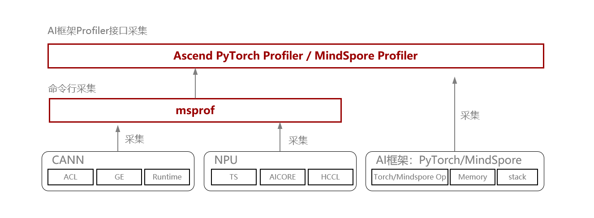

**表1** 采集方式说明

| **采集方式**                    | **特点**                                                     | **推荐使用场景**              | 文档参考链接                                                 |
| ------------------------------- | ------------------------------------------------------------ | ----------------------------- | ------------------------------------------------------------ |
| msprof命令行采集                | msprof命令行工具提供了AI任务运行性能数据、昇腾AI处理器系统数据等性能数据的采集和解析能力。 msprof命令行工具无AI框架层数据。 | 训练、推理场景下均可使用。    | 《[MindStudio Profiler](https://gitcode.com/Ascend/msprof/blob/master/README.md)》 |
| Ascend PyTorch Profiler接口采集 | 完全对标PyTorch GPU场景下的使用方式，支持采集PyTorch框架和昇腾软硬件数据。 | 基于PyTorch的常规性能分析。   | 《[Ascend PyTorch调优工具](https://gitcode.com/Ascend/pytorch/tree/v2.7.1/docs/zh/ascend_pytorch_profiler/ascend_pytorch_profiler_user_guide.md)》 |
| MindSpore Profiler接口采集      | 支持采集MindSpore框架和昇腾软硬件数据。                      | 基于MindSpore的常规性能分析。 | 《[MindSpore调优工具](https://www.hiascend.com/document/detail/zh/mindstudio/830/T&ITools/Profiling/atlasprofiling_16_0118.html)》 |

使用AI框架Profiler采集时，可以参考[表2](#ZH-CN_TOPIC_0000002504087082__table3829mcpsimp)信息配置参数。

**表2** 参数配置

| 使用场景                    | 配置参数                                                     |
| --------------------------- | ------------------------------------------------------------ |
| 常规性能分析场景            | &#8226; profiler_level=Level1 &#8226; aic_metrics保持默认，取值PipeUtilization &#8226; activities设置采集CPU和NPU &#8226; 其他开关根据需要开启 |
| NPU/GPU对比场景             | 该配置用于对比NPU和GPU端到端耗时： &#8226; profiler_level=Level0 &#8226; activities设置仅采集NPU或CPU和NPU（根据需要） &#8226; 其他开关关闭 |
| 定位代码位置场景            | 如果需要定位异常算子代码位置，可在常规场景下开启with_stack或with_modules开关，用以开启调用栈（非必要不开启，性能会膨胀）。 |
| 分析算子NPU片上内存申请情况 | profile_memory=True                                          |
| 分析集群通信情况            | profiler_level=Level1                                        |

[表1](#ZH-CN_TOPIC_0000002504087082__table38291mcpsimp)的采集方式按照功能特性区分，可以区分为常规采集、动态采集、轻量化性能数据在线监测三大类，如[表3](#ZH-CN_TOPIC_0000002504087082__table1893295514719)所示。

**表3** 采集分类

| **采集方式**            | **特点**                                                     | **推荐使用场景**                   |
| ----------------------- | ------------------------------------------------------------ | ---------------------------------- |
| 常规采集                | 预先设置采集周期或全量采集，落盘详细性能数据。               | 常规性能分析                       |
| dynamic_profile动态采集 | 在执行模型训练过程中可以**随时开启采集进程**、**动态修改配置采集项**，无需频繁改动脚本代码。 | 启停成本高的场景（如超大规模训练） |

### 模型调优快速分析（msprof-analyze命令行工具）

针对AI作业中的性能瓶颈，[msprof-analyze工具](https://gitcode.com/Ascend/msprof-analyze)提供快速分析的命令行工具，包含三个核心能力，如[表1](#ZH-CN_TOPIC_0000002535887119__table2845mcpsimp)所示。

**表1** msprof-analyze工具的核心能力

| **工具名称**                | **功能**介绍                                                 |
| --------------------------- | ------------------------------------------------------------ |
| cluster_analyze（集群分析） | 提供慢节点、慢卡、慢链路定位的能力，可结合MindStudio Insight可视化工具使用。 |
| compare（性能拆解比对）     | 提供NPU与GPU以及两个NPU之间，算子在时间和内存维度上的比对能力，帮助用户快速定位问题算子。 |
| advisor（专家建议）         | 结合性能调优专家经验和昇腾软硬件对算子的亲和适配，提供自动化调优能力，帮助用户识别性能瓶颈，并给出优化建议。 |

- cluster_analyze（集群分析）

  cluster_analyze（集群分析）结果通过MindStudio Insight可视化工具展示，辅助进行通信矩阵与通信耗时分析。

  **图1** 利用MindStudio Insight可视化集群分析结果示意图

  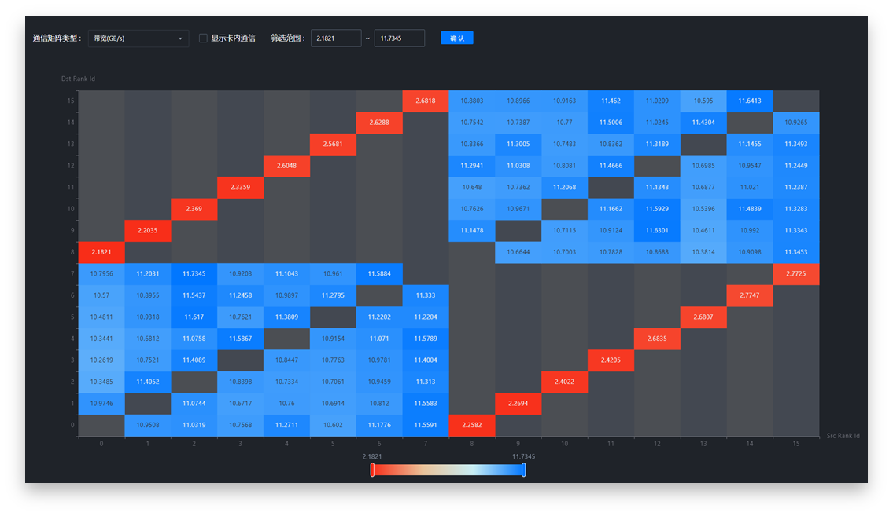

- compare性能比对

  compare工具将耗时拆解为**算子执行、通信（非计算掩盖部分）、调度开销、内存占用**四大核心维度，帮助精准定位性能瓶颈。

  **图2** compare工具分析结果报告示意图

  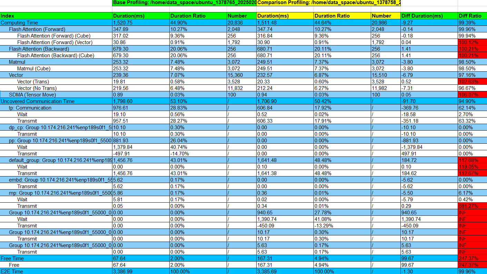

- advisor专家建议

  advisor专家建议工具自动化识别性能瓶颈点，并给出优化建议。覆盖集群和单卡场景的下发、计算、通信等维度，端到端帮助用户分析Profiling数据。

  **图3** advisor专家建议工具主要功能

  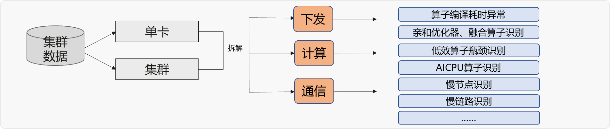

  advisor工具将优化建议按紧急程度分级，其中红色标注代表最高优先级，需优先处理。

  **图4** advisor专家建议工具分析结果报告示意图

  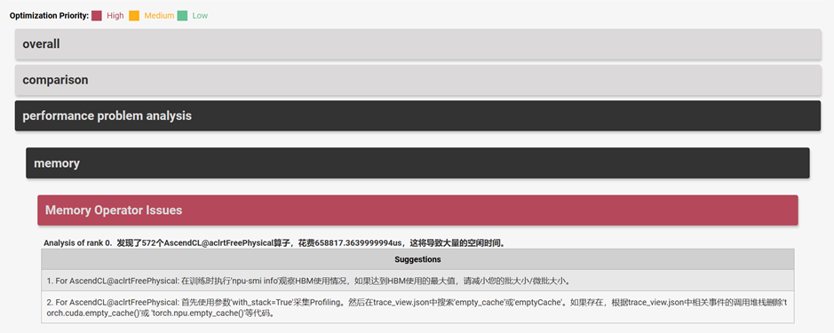

### 模型调优深入分析（MindStudio Insight）

#### 总体介绍

MindStudio Insight工具能够将全量Profiling数据进行可视化呈现，帮助用户进一步分析并确认问题。

使用MindStudio Insight工具分析问题的流程如[图1](#ZH-CN_TOPIC_0000002535807093__fig71814018265)所示。

**图1** 使用MindStudio Insight工具分析流程图

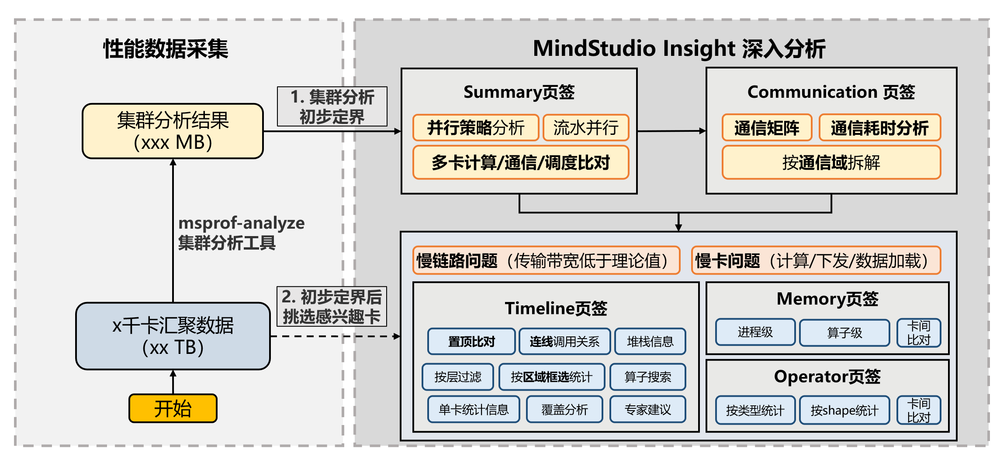

1. 使用集群分析功能初步定界

   1. 先进入概览（Summary）界面，通过多卡计算、通信、调度比对，初步确认问题分类。具体定界过程，详见[概览（Summary）](#概览summary)。

   2. 再进入通信（Communication）界面，按通信域拆解，进一步定位慢卡或慢链路问题；确认异常卡或异常链路后，可直接根据通信算子跳转至时间线（Timeline）具体定位，详见[通信（Communication）](#通信communication)。

      > [!NOTE] 说明
      >
      > - 卡数较少时，可直接导入原始性能数据，自动生成集群分析结果（由可视化工具调用msprof-analyze命令行工具）。
      > - 卡数过多、全量性能数据过于笨重时，推荐您以命令行方式手动调用msprof-analyze工具，用MindStudio Insight打开cluster_analysis_output集群分析结果交付件，更加轻便快捷。

2. 初步定界后，选择所需卡，从单卡维度进一步分析

   - 时间线（Timeline）界面：将训练或推理过程中Host、Device上的运行详细情况平铺在时间轴上，直观呈现Host侧的API耗时以及Device侧的Task耗时，具体使用思路详见[时间线（Timeline）](#时间线timeline)。
   - 内存（Memory）界面：以内存折线图呈现整体内存趋势，可以框选放大折线图中峰值区域，精准定位到内存消耗大的进程或算子，具体使用思路详见[内存（Memory）](#内存memory)。
   - 算子（Operator）界面：计算算子和通信算子的耗时统计，可按类型、Shape统计，同时支持两卡间比对功能，可更直观的查看算子详情，具体使用思路详见[算子（Operator）](#算子operator)。

#### 获取软件包

MindStudio Insight工具的软件包及资料获取方式如[表1](#ZH-CN_TOPIC_0000002535887061__table4505318193511)所示，请根据需求选择合适的版本下载。

**表1** 软件包及资料获取方式

| 类别   | 获取链接                                                     |
| ------ | ------------------------------------------------------------ |
| 软件包 | &#8226; 社区版：[获取链接](https://www.hiascend.com/developer/download/community/result?module=pt%2Bsto%2Bcann) &#8226; 商发版：[获取链接](https://www.hiascend.com/developer/download/commercial/result?module=sto) &#8226; POC版本（非商用版本，不定期发布，可抢先体验最新功能）：[获取链接](https://www.hiascend.com/forum/thread-0246172897155253267-1-1.html) |
| 资料   | [获取链接](https://www.hiascend.com/document/detail/zh/mindstudio) |

#### 集群性能分析

##### 概览（Summary）

概览（Summary）界面常用功能有**并行策略分析，流水并行分析，多卡计算、通信、调度比对，MoE大模型专家负载均衡分析等**。

**初步定性**

首先通过多卡计算、通信、调度时间比对，确认是否有哪一部分占比过高，或者存在严重卡间不同步、各卡间通信时间波动较大现象（快慢卡问题），初步定性问题。概览界面展示如[图1](#ZH-CN_TOPIC_0000002503927234__fig135675411608)所示。

**图1** 概览界面

常用操作步骤如下：

1. 配置正确的并行策略，即保证并行策略参数值与模型实际训练/推理时的并行参数配置一致。具体的并行参数，可与模型开发人员确认。
2. 卡数较少时，推荐选择全展开维度，即“DP + PP + TP”维度。
3. 可选择感兴趣的性能指标进行热力图渲染，快速横向比对性能指标。快慢卡分析时，一般关注特定并行域下的通信时间。
4. 查看并行策略排布图，可通过热力渲染效果快速横向比对
5. 并行策略正确配置时，可得到慢卡专家建议分析。
6. 在下方的”计算/通信概览”页面，查看各卡计算、通信、调度耗时对比，初步确认是否存在计算、通信、下发问题和快慢卡问题。

**典型案例**

- 典型Case1：如[图2](#ZH-CN_TOPIC_0000002503927234__fig1879412319517)所示，可以看到各卡间通信时间波动较大，存在严重卡间不同步，且计算、空闲（即下发）与通信所占比例成反比。通信时间占比低，计算、空闲（即下发）时间占比高的卡即为慢卡。可以初步确认此集群存在快慢卡问题。进一步定位快慢卡问题，可参考

  [快慢卡定位Timeline操作案例](solution_to_top1.md #快慢卡定位Timeline操作案例)。

  **图2** 典型Case1

  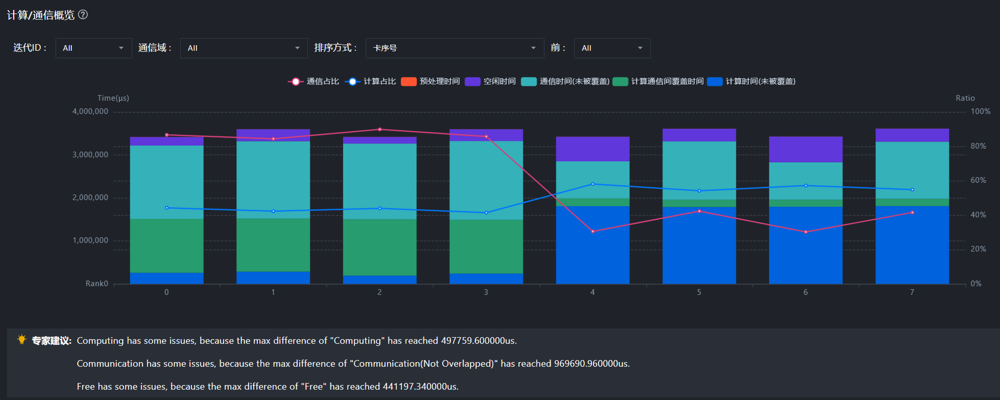

- 典型Case2：如[图3](#ZH-CN_TOPIC_0000002503927234__fig1531948185114)所示，可以看到空闲时间占比较高，说明此集群存在较高的下发瓶颈，可参考[Host Bound问题定位及解决方法](solution_to_top3.md)进一步定位优化；通信时间占比也较高，且各卡通信时间有波动，可参考[通信问题优化方案](solution_to_top1.md)进一步定位优化。

  **图3** 典型Case2

  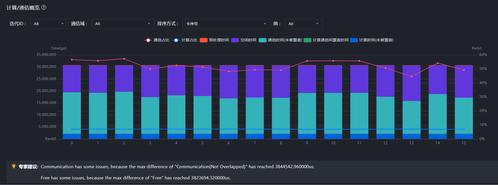

  卡数较多时，呈现的全量数据过多，不利于查看分析，如[图4](#ZH-CN_TOPIC_0000002503927234__fig18983117211)所示。需要通过合理的方式，**精简拆分**数据，让分析方向更加明确。

  **图4** ”计算/通信概览”页面全量数据展示

  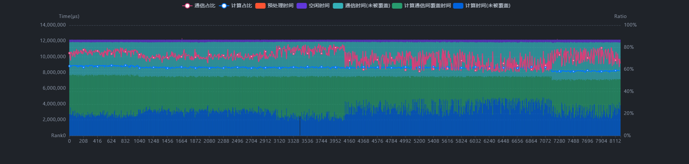

  精简方式1：左键点击通信域连线（例如[图5](#ZH-CN_TOPIC_0000002503927234__fig189831172111)中①），单独查看某个通信域，得到按通信域拆解后的概览图。点击框也有类似效果（同一根连线代表同一个通信域、同一个框内代表并行分组）。

  **图5** 按通信域拆解后的计算/通信概览

  

  精简方式2：先查看折叠视图，由整体至局部逐渐定位。以一个并行策略为DP8、PP8、TP8的512卡集群为例，其全展开维度（即“DP + PP+ TP”维度）有512张卡，折叠TP维度（即“DP + PP”维度）后，每8张TP域卡合并为1个节点，即折叠为64个节点。可先选择“DP + PP”维度，初步定位慢分组，再进一步进入“DP + PP+ TP”维度定位慢卡。

  1. 在“DP + PP”维度下，“性能指标”选择“DP-平均通信时间”，观察到dpIndex=4、7存在慢分组，如[图6](#ZH-CN_TOPIC_0000002503927234__fig17985111822)所示。

     **图6** DP+PP维度（TP被折叠）

     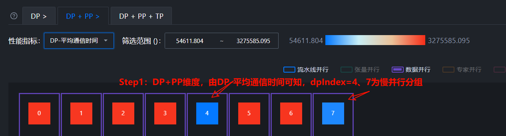

  2. 以dpIndex=4这一并行分组为例，在4上单击鼠标右键，选择“展开”，跳转至“DP + PP + TP”维度下，如[图7](#ZH-CN_TOPIC_0000002503927234__fig3995119219)所示。此时，可将“性能指标”切换至“TP-通信时间”，看到慢卡为38卡，即38卡影响了TP域（32-39），进而影响了[图6](#ZH-CN_TOPIC_0000002503927234__fig17985111822)中的dpIndex0-dpIndex7。

     **图7** DP+PP+TP维度（全展开维度）

     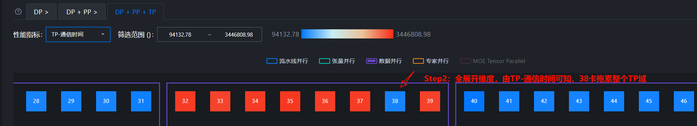

  3. 定位到慢卡后，可右键点击感兴趣的通信域连线（如此处的绿色连线，代表TP通信域），查看通信耗时分析，前往通信（Communication）界面进一步分析慢卡的通信过程，如[图8](#ZH-CN_TOPIC_0000002503927234__fig12999111628)和[图9](#ZH-CN_TOPIC_0000002503927234__fig199171113216)所示。

     **图8** 右键连线，查看通信耗时分析

     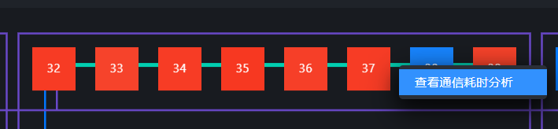

     **图9** 通信（Communication）界面-通信耗时分析

     

##### 通信（Communication）

通信（Communication）页签将通信指标按通信域拆解。如果在概览（Summary）界面中显示通信时间过长，可在通信（Communication）界面进一步确认是否存在慢卡或慢链路问题。可在[图1](#ZH-CN_TOPIC_0000002503927296__fig667414820578)红框所示位置切换**通信矩阵**视图或**通信耗时分析**视图。

**图1** 切换通信矩阵或通信耗时分析视图

**操作步骤**

1. 在通信（Communication）界面，选择“通信耗时分析”，查看“通信时长”图，确认传输时间在通信时间中的占比是否过高，如[图2](#ZH-CN_TOPIC_0000002503927296__fig1125010131226)所示。

   其中**传输时间过长为慢链路问题**，**同步时间过长**为**慢卡**问题。

   **图2** 通信时长

   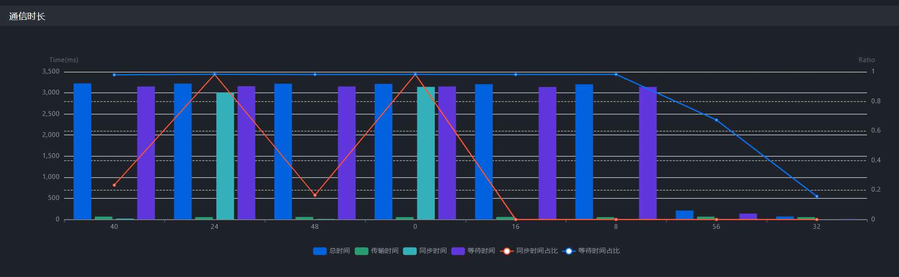

2. 如果传输时间占比过高，再选择“通信矩阵”，查看通信矩阵图，分析传输带宽是否远低于经验带宽，如[图3](#ZH-CN_TOPIC_0000002503927296__fig136271632185319)所示。在传输数据量足够的前提下，如果带宽明显低于预期带宽, 可以认为存在优化空间。常见慢链路原因包括通信重传、通信小包、数据包字节未对齐等，具体可参考[通信问题优化方案](solution_to_top1.md)中相关案例。

   **图3** 通信矩阵

   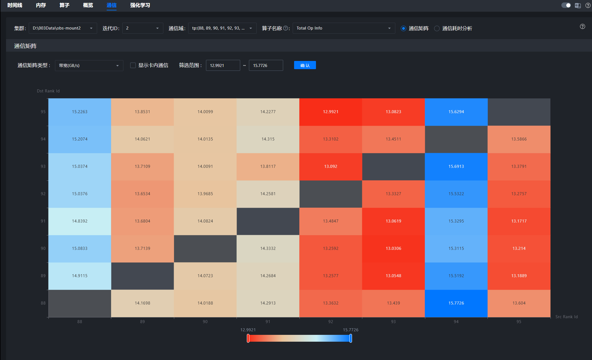

3. 如果传输时间占比低，等待或同步时间占比高，则为“快慢卡问题”，需选择“通信耗时分析”。通过通信算子横向平铺，查看“通信算子缩略图”锁定慢卡，如[图4](#ZH-CN_TOPIC_0000002503927296__fig2429143613918)所示。针对绿色的hcom allGather集合通信算子，时长较短的4卡、5卡、13卡为慢卡，而时长较长的卡（例如11卡、14卡等）为相对的快卡。接下来需要分析慢卡在空白时间做什么。需前往时间线（Timeline）界面，查看具体差异点，详细可参考[快慢卡定位Timeline操作案例](solution_to_top1.md #快慢卡定位Timeline操作案例)。

   **图4** 锁定慢卡

   

**通信与时间线相互跳转**

- 支持通信（Communication）界面与时间线（Timeline）界面，根据通信算子互相跳转，如[图5](#ZH-CN_TOPIC_0000002503927296__fig16998195192919)和[图6](#ZH-CN_TOPIC_0000002503927296__fig368718341305)所示。

  若在通信界面定位到异常卡与异常通信算子，可跳转至时间线视图，进一步确认问题根因；若在时间线界面观察到耗时异常长的通信算子，也可跳转至通信界面，寻找是否有同一通信域内的慢卡拖累了此卡，导致长时间的等待耗时。

  **图5** 通信界面算子跳转至时间线界面

  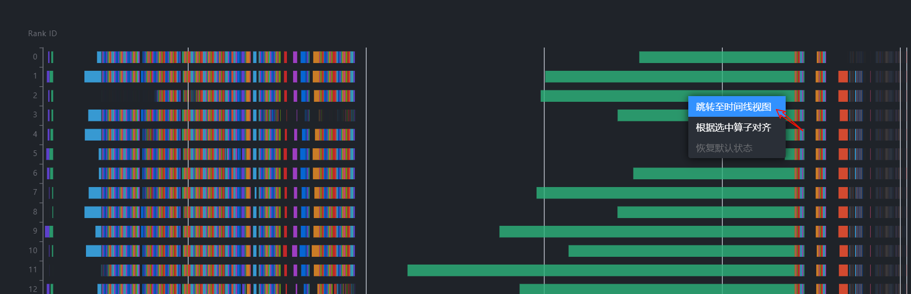

  **图6** 时间线界面通信算子跳转至通信界面

  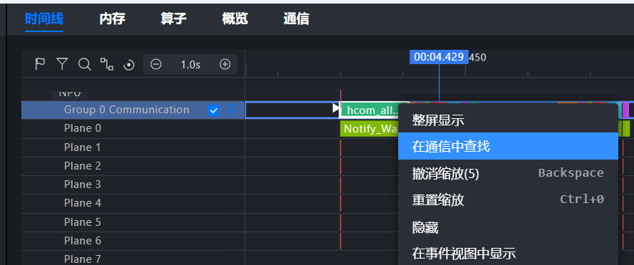

#### 单卡性能分析

##### 时间线（Timeline）

时间线（Timeline）是将训练或推理过程中的Host、Device上的运行详细情况平铺在时间轴上，直观呈现Host侧的API耗时以及Device侧的Task耗时。常用泳道与界面如[图1](#ZH-CN_TOPIC_0000002535807019__fig1128122615409)所示，界面信息说明如[表1](#ZH-CN_TOPIC_0000002535807019__table9307154914018)所示。

**图1** 时间线常用泳道与界面

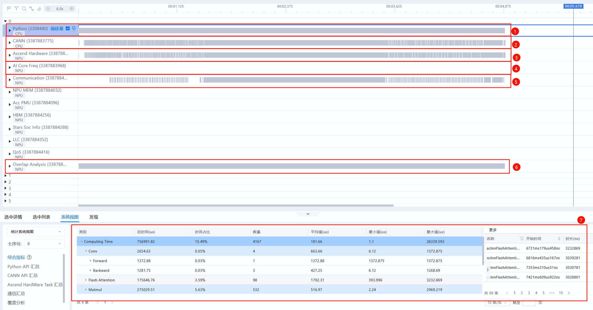

**表1** 时间线常用泳道与界面信息说明

| 序号 | 名称                          | 说明                                                         |
| ---- | ----------------------------- | ------------------------------------------------------------ |
| 1    | Python泳道（一级流水）        | 查看Python层代码，采集时开启with stack开关可查看代码调用栈。 |
| 2    | CANN泳道（二级流水）          | 收集ACL接口执行、GE融合、Runtime等数据。Python侧算子从一级流水下发至此二级流水，任务从二级流水出队后被下发至NPU层。 |
| 3    | Ascend Hardware（NPU层）      | 也称Device侧，记录发生在NPU上计算、通信等任务的执行时序。    |
| 4    | AI Core Freq（AI Core频率）   | AI Core频率，可用于观察降频问题。                            |
| 5    | Communication（通信）         | 旧称HCCL泳道。记录NPU层通信事件，与Ascend Hardware的通信子泳道一一对应，此处由HCCL等组件上报。定位通信细节时可查看此泳道。 |
| 6    | Overlap Analysis（覆盖分析）  | 将Ascend Hardware（NPU层）的计算、通信任务垂直投影至此，得到计算、通信、空闲时间的拆分。常用于快速比对不同卡间计算、通信、空闲差异来源。 |
| 7    | Stats System View（统计视图） | 单卡维度统计汇总信息，可通过左侧“卡序号”下拉框切换不同卡。   |

此处列举了定位过程中Timeline最常用的泳道与界面，每条泳道可展开查看具体细节，如[图2](#ZH-CN_TOPIC_0000002535807019__fig7728122216162)所示。完整界面介绍请参见《[MindStudio Insight系统调优](https://gitcode.com/Ascend/msinsight/blob/master/docs/zh/user_guide/system_tuning.md)》的"[时间线（Timeline）](https://gitcode.com/Ascend/msinsight/blob/master/docs/zh/user_guide/system_tuning.md#%E6%97%B6%E9%97%B4%E7%BA%BF%EF%BC%88timeline%EF%BC%89)"章节。

**图2** 泳道展开查看具体细节

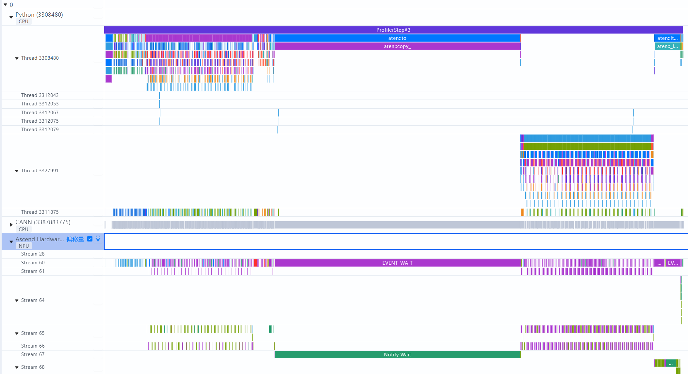

**常用操作**

想要快速查看或了解当前所有快捷键操作，可单击界面右上角的问号按钮，在下拉菜单中选择“键盘快捷键”，即可打开快捷键说明的弹窗。

Timeline常用操作包括**通信与时间线相互跳转、置顶比对、覆盖分析、旗帜标记重点区域、框选统计、下发连线关系查看**等功能。详情请参见《[MindStudio Insight系统调优](https://gitcode.com/Ascend/msinsight/blob/master/docs/zh/user_guide/system_tuning.md)》的"[时间线（Timeline）](https://gitcode.com/Ascend/msinsight/blob/master/docs/zh/user_guide/system_tuning.md#%E6%97%B6%E9%97%B4%E7%BA%BF%EF%BC%88timeline%EF%BC%89)"章节。

**定位快慢卡具体差异来源**

时间线（Timeline）常用于进一步定位快慢卡具体的差异来源。理想情况下，每张卡的计算用时相对接近，不应存在某张卡提前完成计算，长时间等待另一张卡的情况。当出现某些卡存在时长较长的通信算子，且通信算子主要时长来源于等待（例如Notify Wait事件）时，优先考虑是否出现了快慢卡问题。

快慢卡是一个现象，背后原因多种多样，需要通过比对快慢卡在时间线上的差异，确认具体原因。慢卡常见原因包括负载不均衡、计算慢、下发慢、数据加载慢（存储问题）。具体定位过程如下：

1. 在通信（Communication）界面的通信算子缩略图中，查看差异较大的通信算子，并跳转至时间线界面。

2. 通过覆盖分析、置顶比对，确认Ascend Hardware层（NPU层）差异来源。

3. 在时间线（Timeline）界面选择async_npu下发连线，通过连线关系，由NPU层向上寻找，确认Python层差异来源。确认差异来源于某处Python层代码后，可凭借此信息，与模型开发或运维人员进一步确认问题根因。

   > [!NOTE] 说明
   >
   > 时间线（Timeline）界面功能比较多，可以通过一个实际案例来具体感受下各种功能的作用，详细案例请参见[快慢卡定位Timeline操作案例](solution_to_top1.md #快慢卡定位Timeline操作案例)。

**观察下发瓶颈**

时间线（Timeline）是观察下发问题的有力工具，理想情况下NPU侧的计算流水线能不停运转，不会出现NPU等CPU的场景。一旦下发慢，将导致流水线无法运转，AI Core算力利用率降低。

> [!NOTE] 说明
>
> 理想Free Time占比约为10%以内。

下发瓶颈在时间线（Timeline）典型表现分别如下所示。具体定位方法论与优化思路请参考[下发异常分析](solution_to_top3.md#下发异常分析)。

- 覆盖分析Free Time占比远超Computing和Communication，如[图3](#ZH-CN_TOPIC_0000002535807019__fig029044141416)和[图4](#ZH-CN_TOPIC_0000002535807019__fig18956112318318)所示。

  **图3** 下发瓶颈典型表现1

  

  **图4** 下发瓶颈典型表现2

  

- HostToDevice连线接近垂直，如[图5](#ZH-CN_TOPIC_0000002535807019__fig12167922161)所示。

  **图5** 下发瓶颈典型表现3

  

- 频繁HostToDevice拷贝打断异步流水，造成下发瓶颈，如[图6](#ZH-CN_TOPIC_0000002535807019__fig113818131710)所示。

  **图6** 下发瓶颈典型表现4

  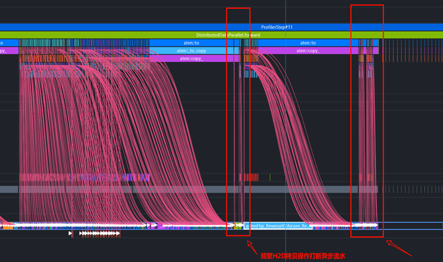

**单卡维度统计与搜索算子**

如果想在时间线（Timeline）中查看算子具体位置，可在底部数据窗格中选择“系统视图”，选择“统计系统视图”和相应“卡序号”，单击“算子详情”，可查看所有算子，并可按照名称、类型、加速器核、输入/输出Shapes过滤，按耗时排序，选择相应算子，单击“点击跳转Timeline”列的“点击”，可跳转至时间线的具体位置，如[图7](#ZH-CN_TOPIC_0000002535807019__fig12208010468)所示。此操作比全局搜索定位更快。

**图7** 算子详情

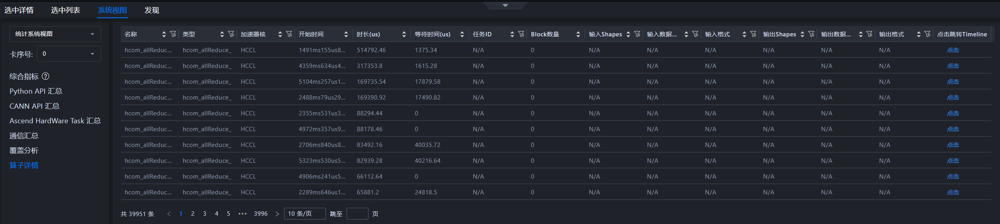

##### 内存（Memory）

以内存折线图呈现整体内存趋势，可以框选放大折线图中峰值区域，精准定位到内存消耗大的进程或算子。针对内存申请、释放异常的算子，跳转至时间线（Timeline），定位至具体代码。

> [!NOTE] 说明
>
> 内存优化思路：尽量增大Batchsize，最大化利用NPU内存。观察内存趋势，消除尖刺，削峰填谷。

查看[图1](#ZH-CN_TOPIC_0000002535807021__fig775318316219)，可以看到NPU利用率不足，观察到存在内存尖刺。

**图1** 典型Case

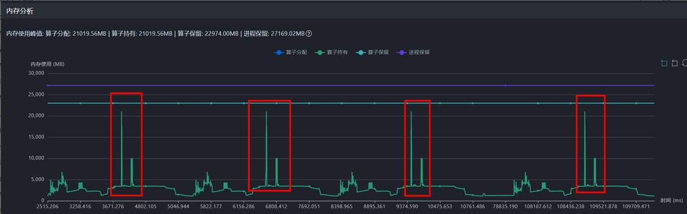

通过内存尖刺的时间点，框选锁定尖刺时间区域内算子。在内存申请/释放详情中，按内存申请大小降序排列，根据内存申请排名第一的算子跳转至时间线，定位至具体代码。如[图2](#ZH-CN_TOPIC_0000002535807021__fig256619222223)所示。随后，根据代码位置，和模型开发人员沟通确认有无优化空间。

**图2** 跳转至时间线

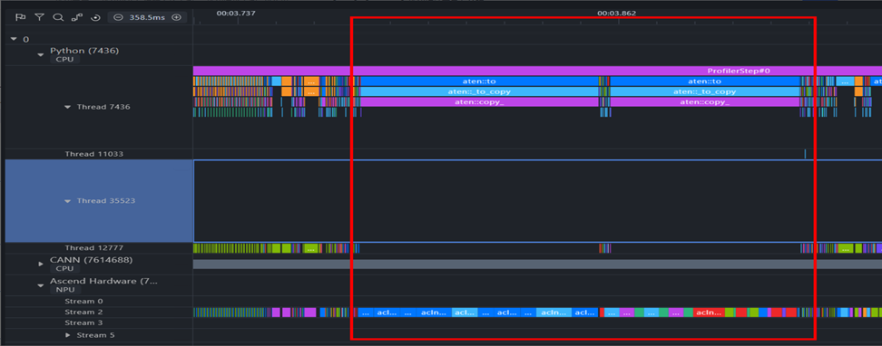

内存（Memory）界面还支持两卡间的比对功能，详情请参见《[MindStudio Insight系统调优](https://gitcode.com/Ascend/msinsight/blob/master/docs/zh/user_guide/system_tuning.md)》的"内存（Memory） > [使用说明](https://gitcode.com/Ascend/msinsight/blob/master/docs/zh/user_guide/system_tuning.md#%E4%BD%BF%E7%94%A8%E8%AF%B4%E6%98%8E-1)"章节。

##### 算子（Operator）

算子（Operator）界面展示计算算子和通信算子耗时统计，常用功能如下：

- 按类型统计，用于观察Top耗时算子占比，尤其是转换类等低效算子是否占比过高。
- 按加速器核分组统计，观察AI CPU类算子与vector类算子是否耗时占比过高。
- 按输入Shape统计计算算子，观察算子是否会在特定Shape下劣化。
- 可切换展示耗时Top15或全部算子，如[图1](#ZH-CN_TOPIC_0000002535807065__fig18956232172415)所示。

具体定位与优化方法，可参考[算子性能问题优化方案](solution_to_top2.md)。

**图1** 算子界面

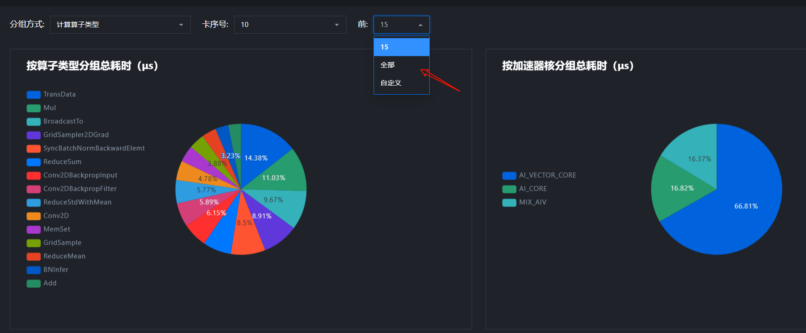

算子（Operator）界面还支持两卡间的比对功能，详情请参见《[MindStudio Insight系统调优](https://gitcode.com/Ascend/msinsight/blob/master/docs/zh/user_guide/system_tuning.md)》的"算子（Operator） > [使用说明](https://gitcode.com/Ascend/msinsight/blob/master/docs/zh/user_guide/system_tuning.md#%E4%BD%BF%E7%94%A8%E8%AF%B4%E6%98%8E-2)"章节。

**典型案例：利用算子比对功能快速定位计算性能劣化原因**

问题背景：相同模型在不同机器上部署，计算性能劣化（每step约80ms），需定位原因。

1. 将两卡的性能数据移动至同一父目录，使用MindStudio Insight打开该父目录。

2. 参见《[MindStudio Insight系统调优](https://gitcode.com/Ascend/msinsight/blob/master/docs/zh/user_guide/system_tuning.md)》的"算子（Operator） > [使用说明](https://gitcode.com/Ascend/msinsight/blob/master/docs/zh/user_guide/system_tuning.md#%E4%BD%BF%E7%94%A8%E8%AF%B4%E6%98%8E-3)"章节设置两卡间数据比对。

3. 已知慢卡相比快卡单Step计算耗时多出约80ms。开启比对模式后，在“算子详情”中，按照“总耗时”进行排序，如[图2](#ZH-CN_TOPIC_0000002535807065__fig459772715412)所示。观察可发现，计算时间差异主要来源是Matmul算子，在数量一致的前提下（数量差为0），总耗时相差约74ms，为主要耗时差异来源。

   **图2** 算子卡间比对

   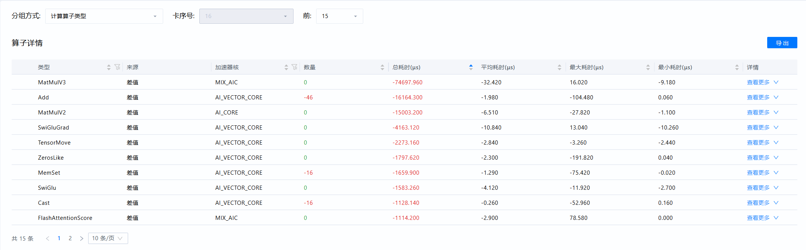

4. 进一步按相同Shape对比，可以看到，相同类型（MatmulV3）不同Shape算子有不同程度劣化，各个Shape下，慢卡Matmul稳定劣化于快卡，如[图3](#ZH-CN_TOPIC_0000002535807065__fig43061311115511)所示。

   **图3** 按Shape比对

   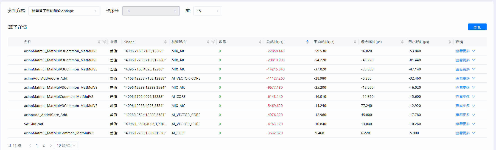

5. 经排查，最终确认是不同机器片上内存颗粒差异，Matmul是访存密集型算子，在不同机器上计算通信带宽抢占程度不同导致。

### 服务化工具

本章节主要介绍服务化工具使用场景和定位思路，具体问题的定位请参考[服务化性能调优定位案例](solution_to_top6.md#服务化性能调优定位案例)。

1. 广泛性调优：通过推理预检工具（msprechecker）对系统、环境变量及配置文件等方面进行检查，识别可能影响服务化性能的潜在问题。
2. 针对性地调优：通过调整当前需求的配置项（输入输出长度、并发数等）优化服务化的调度，有以下两种方法：
   1. 服务化专家建议工具（msserviceadvisor）：此工具能够快速提升服务化的性能，但不足以进行精细化的调优。
   2. 服务化自动寻优工具（modelevalstate）：适用于有针对性地提升服务化性能，能够达到人工调优所能实现的最佳性能的 95%。但该方法耗时较长，需要持续搜索参数以接近最优解。
3. 如果仍未达到预期，可以使用服务化调优工具（msServiceProfiler）进行深入分析，此工具适用于熟悉整个服务化运作方式的用户。

**表1** 服务化性能工具介绍

| 工具名称                                                     | 工具简介                                                     |
| ------------------------------------------------------------ | ------------------------------------------------------------ |
| [推理预检工具](https://gitcode.com/Ascend/msit/blob/master/msprechecker/README.md) | 支持推理前、推理中和推理后的全流程检测。 &#8226; 推理前，提供一键式预检功能，全面排查环境变量、系统内核、配置文件等可能导致服务部署失败或性能下降的问题。 &#8226; 推理过程中，支持将环境相关的所有数据完整落盘。 &#8226; 推理结束后，支持对落盘文件进行比对，帮助识别差异点，便于复现基线环境。 |
| [服务化专家建议](https://gitcode.com/Ascend/msserviceprofiler/blob/master/docs/zh/service_profiling_advisor_instruct.md) | 根据当前的Benchmark输出结果及MindIE service的config.json配置，结合理论分析性能上限，提出提升首令牌生成时间（TFTT）和吞吐量（Throughput）等关键指标的优化建议。 |
| [服务化自动寻优](https://gitcode.com/Ascend/msserviceprofiler/blob/master/docs/zh/serviceparam_optimizer_instruct.md) | 提供MindIE服务化和vLLM服务化的参数自动优化功能。利用先进的检索算法，在参数空间中高效寻找最优解，实现自动化调优。该功能同时支持轻量化设计，部署快速便捷，确保搜索结果更加准确。 |
| [服务化调优工具](https://gitcode.com/Ascend/msserviceprofiler/blob/master/docs/zh/msserviceprofiler_serving_tuning_instruct.md) | 提供推理服务化性能数据采集接口的解析和拆解能力。此接口专为服务化调优设计，能够采集关键流程的起止时间点，识别并记录关键函数调用、关键事件、服务化调度等信息，同时支持采集算子信息，助力快速定位性能问题。 |
