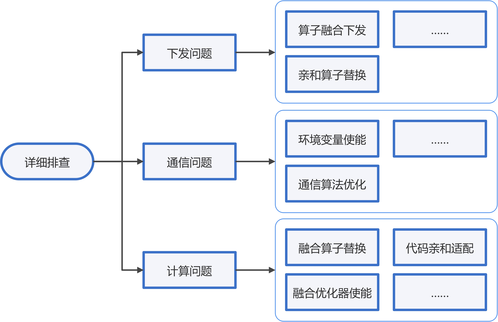
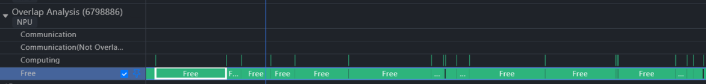
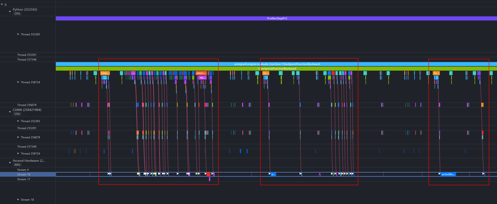
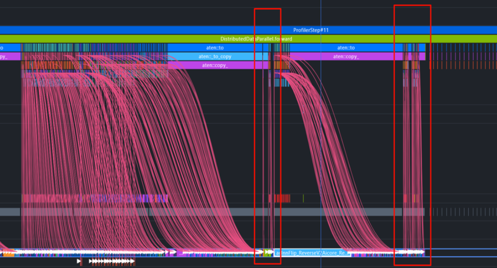
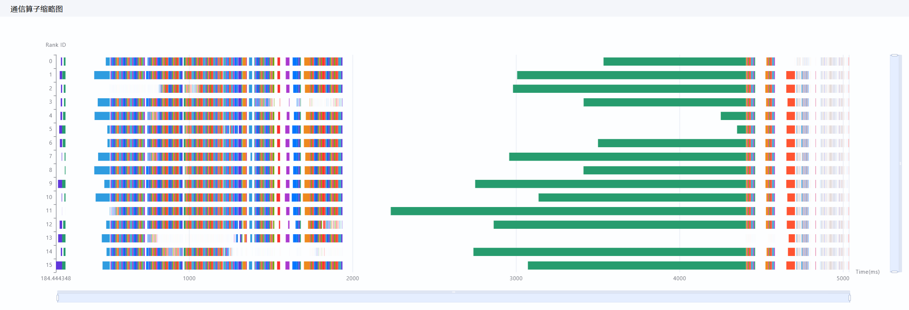
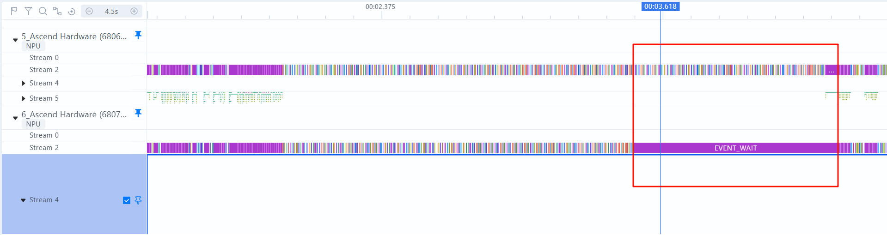
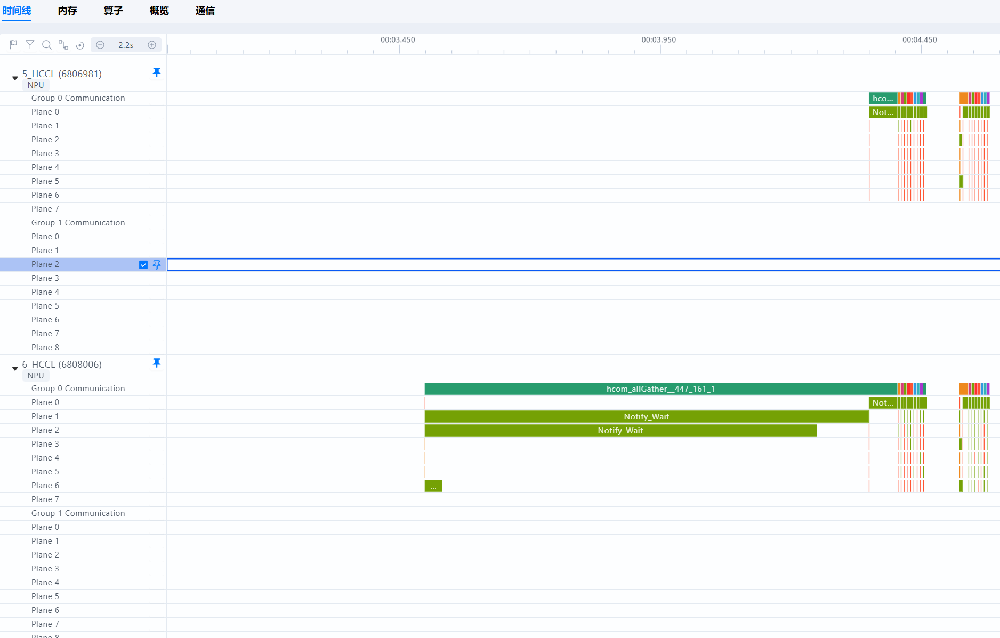
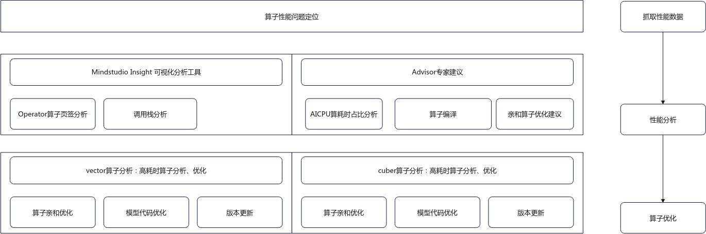

# 性能问题的定位流程

## 整体定位流程

性能优化总体思路围绕[性能优化方向](overview.md#性能优化方向)展开，具体步骤如下。

> [!NOTE] 说明
>
> 性能优化的前提是不造成精度劣化，特殊情况下，需要对齐精度劣化是否能接受。

1. 问题明确：请参考[问题信息收集](#问题信息收集)章节，收集必要信息。
2. 性能问题排查：排查思路请参见[排查思路介绍](#排查思路介绍)。
3. 实验验证：在进行多次实验时，应严格控制变量，确保除了改变的策略外，其他参数和数据保持一致。

## 问题信息收集

在定位问题之前，务必收集准确的问题信息，包括[基本信息](#ZH-CN_TOPIC_0000002503927266__table8794114914506)、[关键问题描述](#ZH-CN_TOPIC_0000002503927266__table8794114914507)和[优化目标](#ZH-CN_TOPIC_0000002503927266__table8794114914508)。

**表1** 基本信息

| 主要信息   | 说明                                                         |
| ---------- | ------------------------------------------------------------ |
| 模型类型   | 了解模型结构（类Llama、类GPT、是否是MoE等）。                |
| 作业规模   | 卡数、机器数。                                               |
| 并行策略   | 具体并行参数配置。                                           |
| 框架和版本 | &#8226; 明确CANN、MindSpore或PyTorch的版本。  &#8226; 需确认近期是否有版本变更，以确定问题出现在版本变更之前还是之后。 |

**表2** 关键问题描述

| 主要信息     | 说明                                                         |
| ------------ | ------------------------------------------------------------ |
| 问题场景     | 在模型训练或推理过程中，其表现未达到预期标准或竞品水平，或者出现了性能下降等异常情况。  &#8226; 性能不及预期，一般出现在模型迁移后，相较于竞品性能不及预期。  &#8226; 性能出现抖动，模型长稳训练过程中，随机或伴随特定事件出现性能波动。  &#8226; 集群线性度不足，集群规模扩大后，模型性能没有按照预期增长。  &#8226; 纯模型性能差，相同配置下纯模型性能异常，参考训练问题解决。 &#8226; 服务化调度调优。 |
| 当前性能指标 | 明确当前性能问题的状况，计算性能指标的优先级排序请参考《[PyTorch 训练模型迁移调优指南](https://www.hiascend.com/document/detail/zh/Pytorch/720/ptmoddevg/trainingmigrguide/PT_LMTMOG_0002.html)》中的“性能概述 > 性能指标 > [性能指标介绍](https://www.hiascend.com/document/detail/zh/Pytorch/720/ptmoddevg/trainingmigrguide/performance_tuning_0006.html)”章节。 |

**表3** 优化目标

| 主要信息       | 说明                                                         |
| -------------- | ------------------------------------------------------------ |
| 性能优化的目标 | 明确优化目标及来源，例如是否基于竞品对比，还是通过线性度推算等。 若优化中涉及增大batchsize等方法，尽量避免使用单step时间等指标进行衡量，需参考《[PyTorch 训练模型迁移调优指南](https://www.hiascend.com/document/detail/zh/Pytorch/720/ptmoddevg/trainingmigrguide/PT_LMTMOG_0002.html)》中的“性能概述 > 性能指标 > [性能指标介绍](https://www.hiascend.com/document/detail/zh/Pytorch/720/ptmoddevg/trainingmigrguide/performance_tuning_0006.html)”章节，选取合理指标替换。 |

## 排查思路介绍

### 快速排查

快速排查分为开箱和长稳两种场景，具体介绍如下：

1. 开箱场景：开箱性能问题场景一般指首次加载模型。此时需要明确性能优化目标，如果存在竞品性能参考，则可以通过Profiling等工具详细对比二者差异。建议在正式拉起任务前，先考虑并行策略寻优，确认最优并行策略。若无法解决问题，参考长稳场景定位方案。
2. 长稳场景：长期稳定性下的性能问题通常指的是系统在一段时间内表现良好且没有性能问题的情况下，突然出现性能下降或性能问题。
   1. 变更排查：明确近期是否进行过变更，包括但不限于集群重新规划、版本变更等。若性能问题在变更后出现，条件允许的情况下，可以尝试撤销近期变更，若确认问题由变更引起，建议优先考虑版本问题或变更涉及操作（如重启）等对集群可能的影响，具体请参见[版本升级性能劣化定位方法论](solution_to_top7.md)。
   2. 硬件排查：当性能出现波动时，应检查相应时间点是否有硬件问题，例如NPU降频、网络丢包等硬件告警。注意，这里的硬件排查仅指初步排查，主要关注硬件告警。若无硬件告警或如网络丢包等关键事件，则参考[详细排查](#详细排查)进行定位

### 详细排查

详细排查主要围绕下发、通信、计算三类常见问题开展，性能工具的使用请参见[模型调优工具](performance_tool_usage.md)。

> [!NOTE] 说明
>
> - 使用msprof-analyze工具初步分析，粗粒度定位性能问题，并为后续的深入分析提供明确的方向，具体请参见[模型调优快速分析（msprof-analyze命令行工具）](performance_tool_usage.md #模型调优快速分析（msprof-analyze命令行工具）)。
> - 通过MindStudio Insight工具进一步识别瓶颈点，深入剖析问题根源。具体请参见[模型调优深入分析（MindStudio Insight）](performance_tool_usage.md#模型调优深入分析（MindStudio Insight）)。

**图1** 详细排查流程图

#### 下发问题

下发问题是指算子下发过程耗时异常。下发指Graph Engine将算子执行请求下发至Runtime，Runtime判断算子的Task类型，根据类型将算子执行请求下发到Device上执行，详细说明请参考《[TBE&AI CPU算子开发指南](https://www.hiascend.com/document/detail/zh/canncommercial/850/opdevg/tbeaicpudevg/atlasopdev_10_0001.html)》中的[算子编译运行流程](https://www.hiascend.com/document/detail/zh/canncommercial/850/opdevg/tbeaicpudevg/atlasopdev_10_0012.html)章节。

理想情况下，NPU侧的计算流水不停运转，不会出现NPU等待CPU的场景，一旦出现下发延迟，将导致流水线阻塞，从而影响AI Core的算力利用率。此时即判定存在下发问题。下发问题主要通过MindStudio Insight工具中[时间线（Timeline）](performance_tool_usage.md #时间线（Timeline）)进行观察，若存在下列任一现象，请参考[下发异常分析](solution_to_top3.md#下发异常分析)进行分析。

- 覆盖Free Time占比过大：Overlap Analysis中Free Time占比远超Computing和Communication。理想的Free Time占比应在10%以内。

  **图2** 查看Free

  

- 红框中的HostToDevice连线接近垂直，且蓝框中的Device上相对空闲。

  **图3** 查看连线

  

- HostToDevice频繁拷贝打断异步流水，造成下发瓶颈。

  **图4** 寻找下发瓶颈

  

#### 通信问题

通信问题一般指NPU卡间通信存在异常，典型表现为快慢卡或通信带宽远不及预期，具体情况请参见MindStudio Insight的[集群性能分析](performance_tool_usage.md#集群性能分析)，解决方法请参考[通信问题优化方案](solution_to_top1.md)。

> [!NOTE] 说明
>
> 在大集群场景中，全量集群的Profiling可能会数据量过大，不利于分析，建议使用[模型调优快速分析（msprof-analyze命令行工具）](performance_tool_usage.md #模型调优快速分析（msprof-analyze命令行工具）)中的cluster_analyze（集群分析）工具先对全量Profiling做一遍集群分析，将交付件cluster_analysis_output目录导入MindStudio Insight，观察是否存在明显快慢卡或通信传输问题，再挑选部分感兴趣卡的Profiling，从单卡维度分析。

- **图5**为MindStudio Insight通信（Communication）界面中的“通信耗时分析”功能，其中每一个色块代表一个集合通信算子，其长度代表通信算子的执行时间。如果对于某个集合通信算子，不同卡间通信算子执行时间差距非常大，说明通信算子耗时最短的那张卡是慢卡（其他卡都在等此慢卡）。

  **图5** 利用MindStudio Insight的通信耗时分析查找慢卡

  

- 在Timeline中可以看到明显的卡间等待，如**图6**中红框所示，快卡Rank6已经计算完毕，在等待慢卡Rank5完成计算。

  **图6** Timeline对比快慢卡Profiling（Ascend Hardware层）

  

- 如**图7**所示，Communication泳道可观察到，快卡Rank6的hcom_allGather通信算子时长远大于慢卡Rank5的通信算子，且主要时长来源于同步等待。

  **图7** Timeline对比快慢卡Profiling（Communication泳道）

  

#### 计算问题

计算问题，即算子性能问题，是深度学习模型中的一个关键挑战，具体表现为部分基础计算单元的执行效率低下，从而影响整个模型的运行速度并造成资源浪费。这类问题需要借助专门的分析工具和代码优化技术来解决。例如，在评估融合算子性能时，可以通过对比不同配置下的计算时间、内存使用量等指标来进行综合判断。具体请参考[算子性能问题优化方案](solution_to_top2.md)来定位与解决。

**图8** 算子性能问题定位

