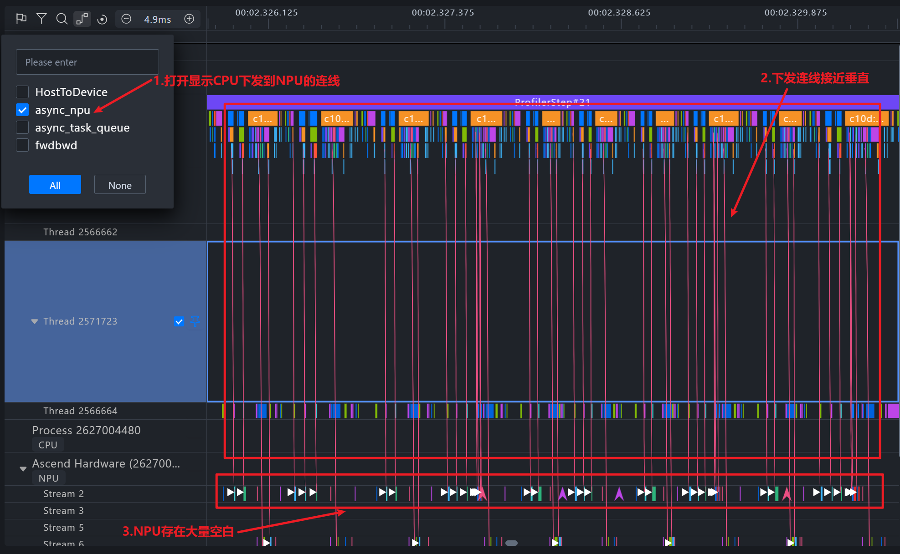
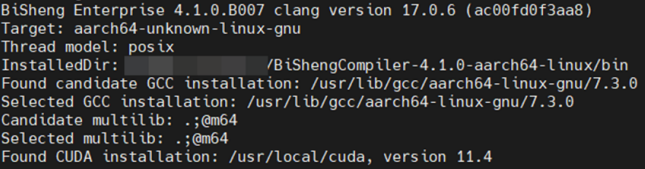
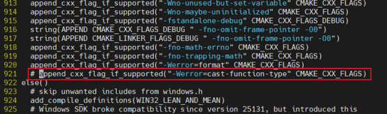
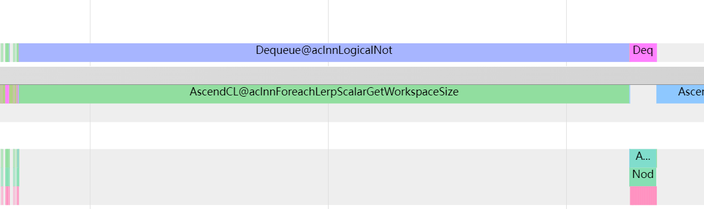
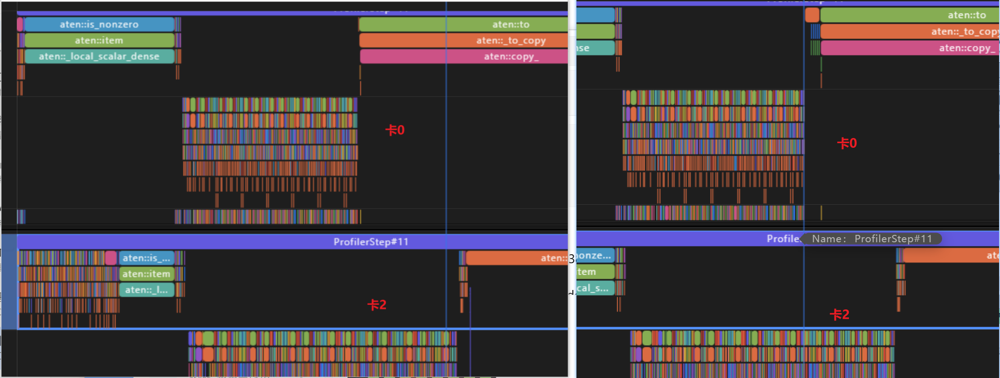
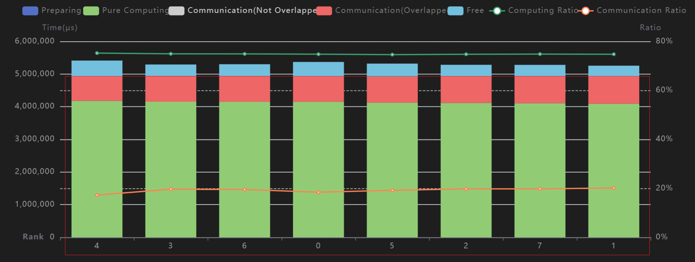
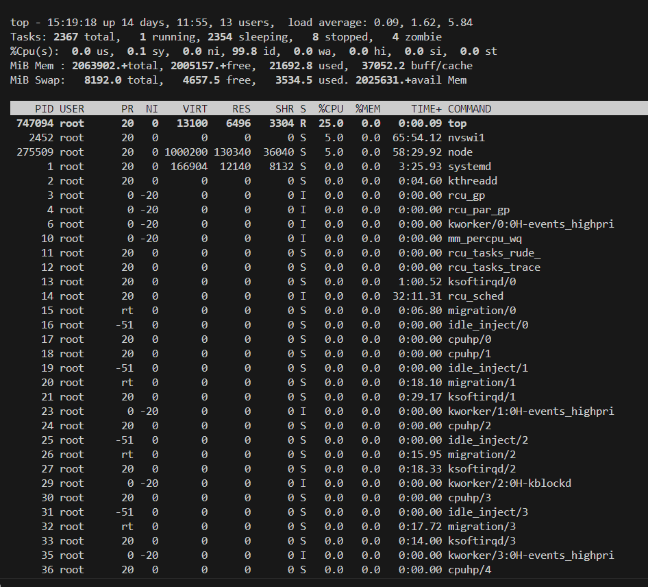
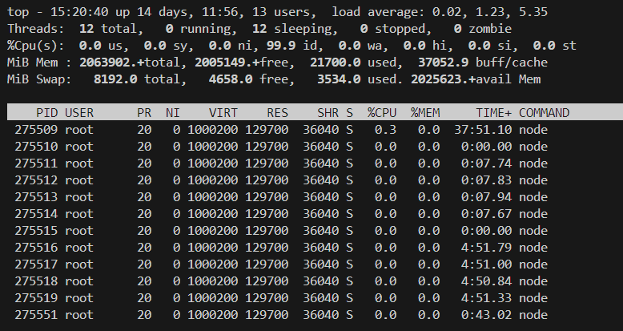
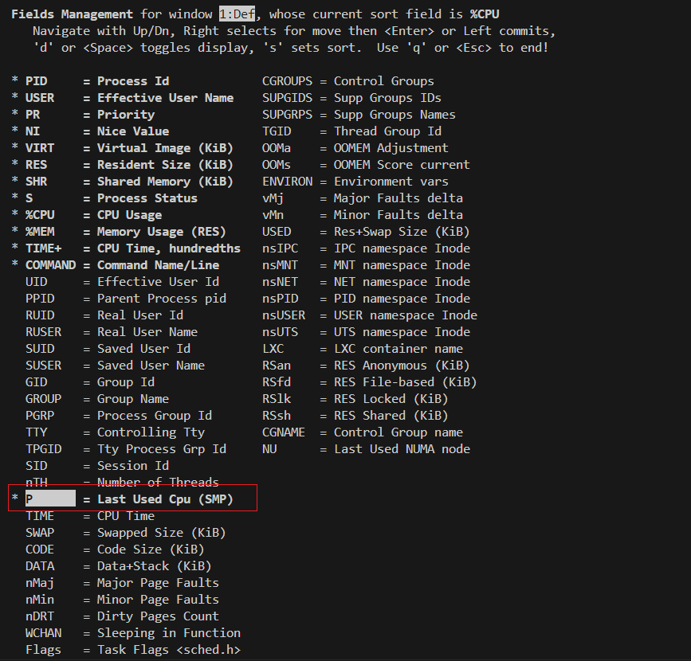
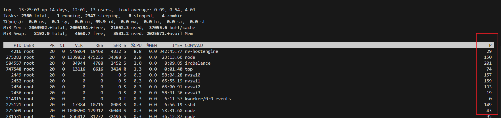

# Host Bound问题定位及解决方法

## Host Bound问题分类

### Host Bound问题简介

在torch_npu训练和推理场景中，Host侧（CPU）的任务下发（如算子调度、内存分配）与Device侧（NPU）的任务执行是异步进行的。当Host侧任务下发耗时超过Device侧任务执行耗时，Device会因等待新任务而处于空闲状态，形成性能瓶颈，即Host Bound问题。

### Host Bound问题表现

1. 算子下发连线呈现垂直密集状态，表明NPU在等待CPU下发任务。

2. 因等待导致NPU闲置时间（Free time）占比过高。

   **图1** 典型Host Bound场景性能数据

   

### Host Bound问题优化方法

Host Bound问题主要由算子下发延迟、CPU计算负载过重两个因素导致，可采用[表1](#ZH-CN_TOPIC_0000002503927258__table12690162612911)方法进行优化。

**表1** Host Bound常见优化手段<a name="ZH-CN_TOPIC_0000002503927258__table12690162612911"></a>

| 优化方法     | 优势             | 说明                                                         |
| ------------ | ---------------- | ------------------------------------------------------------ |
| 算子下发优化 | 减少算子下发次数 | 通过[快慢卡问题定位方法](solution_to_top1.md#快慢卡问题定位方法)识别瓶颈点后，采用逻辑优化、等价计算替换和算子融合等方法进行优化，可参考[亲和算子优化策略](solution_to_top2.md#亲和算子优化策略)。 |
|              | 提升算子下发速度 | &#8226; [流水优化](#流水优化)：是一种通用且高效的优化手段，其核心是将部分算子适配任务迁移至二级流水，从而均衡两级流水负载并降低任务出队唤醒耗时。<br>&#8226; [绑核优化](#绑核优化)：通过控制CPU端算子任务的处理器亲和性（即绑核），优化任务执行效率，避免跨NUMA（非统一内存访问架构）节点的内存访问，降低任务调度开销。<br/>&#8226; [编译优化](#编译优化)：通过应用毕昇编译器（BiSheng Compiler）的LTO（链接时优化）和PGO（配置文件引导优化）技术，对Python、PyTorch（torch）及其昇腾扩展（torch_npu/Ascend Extension for PyTorch）三个核心组件进行源码编译构建，可有效提升程序性能。 |
| CPU计算优化  | 发挥异构算力优势 | 尽量减少AI CPU算子的使用，优先选用亲和性更优的算子，可参考[亲和算子优化策略](solution_to_top2.md#亲和算子优化策略)。 |
|              | 发挥并行计算优势 | 促进CPU与NPU的异步并行处理（例如，将数据处理逻辑置于DataLoader中），并减少流同步操作（如谨慎使用item(), cpu(), npu() 等操作，尽量合并或避免使用）。 |

此外，存在一类属于下发异常问题，即算子下发过程因为资源抢占、操作系统调度策略冲突等因素导致耗时显著增加，参考[下发异常分析](solution_to_top3.md#下发异常分析)。

## 流水优化

**使能说明**

通过设置以下环境变量启用该特性，通常适用于Host Bound问题严重的网络场景。

```cfg
export TASK_QUEUE_ENABLE=2
```

**详细原理**

task_queue算子下发队列支持三个配置级别（以add算子为例），用户可以根据需要自行配置，详细介绍请参见《[Ascend Extension for PyTorch 环境变量参考](https://www.hiascend.com/document/detail/zh/Pytorch/730/comref/Envvariables/docs/zh/environment_variable_reference/env_variable_list.md)》的“[TASK_QUEUE_ENABLE](https://www.hiascend.com/document/detail/zh/Pytorch/730/comref/Envvariables/docs/zh/environment_variable_reference/TASK_QUEUE_ENABLE.md)”章节。

**注意事项**

- 当ASCEND_LAUNCH_BLOCKING设置为"1"时，task_queue算子队列将被强制关闭，此时TASK_QUEUE_ENABLE配置失效，ASCEND_LAUNCH_BLOCKING的配置可参见《[Ascend Extension for PyTorch 环境变量参考](https://www.hiascend.com/document/detail/zh/Pytorch/730/comref/Envvariables/docs/zh/environment_variable_reference/env_variable_list.md)》的“[ASCEND_LAUNCH_BLOCKING](https://www.hiascend.com/document/detail/zh/Pytorch/730/comref/Envvariables/docs/zh/environment_variable_reference/ASCEND_LAUNCH_BLOCKING.md)”章节。

- 配置 TASK_QUEUE_ENABLE=2 时，由于内存访问并发性增加，可能导致运行期间 NPU 内存峰值上升。

## 绑核优化

**使能说明**

通过设置以下环境变量启用该特性，适用于任务自主调度能力不足或快慢卡问题突出的网络场景。

```cfg
export CPU_AFFINITY_CONF=<mode>,npu<value1>:<value2>-<value3>
```

- **mode：绑核模式**。配置为 “0”或未配置时禁用绑核；配置为 “1” 启用粗粒度绑核；配置为 “2”启用细粒度绑核。
- **npu`value1`:`value2`-`value3`：自定义绑核区间**。当前仅在 mode 配置不为“0”时生效。`value1` 表示 NPU 卡编号，`value2`-`value3` 指定该卡进程的 CPU 核心绑定区间。

**详细原理**

- **粗粒度绑核**：将单张NPU卡关联的所有线程绑定至指定CPU核心区间。
- **细粒度绑核**：将单张NPU卡关联的主要线程绑定至指定CPU核心区间，每个线程独占一个核心，实现相互隔离。

**配置示例**

1. 启用粗粒度绑核。

   ```shell
   export CPU_AFFINITY_CONF=1
   ```

2. 启用细粒度绑核。

   ```shell
   export CPU_AFFINITY_CONF=2
   ```

3. 启用自定义绑核。

   ```shell
   export CPU_AFFINITY_CONF=1,npu0:0-1,npu1:2-5,npu3:6-6
   ```

4. 执行上述配置后，NPU卡绑定详情如下所示。

   - NPU 0 卡进程绑定至CPU核心 0-1。
   - NPU 1 卡进程绑定至CPU核心 2-5。
   - NPU 3 卡进程绑定至CPU核心 6。
   - 其他NPU卡进程使用默认核心区间。

## 编译优化

### 编译优化包获取

编译优化环境配置复杂，完整流程耗时较长，为提升部署效率，实现开箱即用的性能收益，用户可直接获取预构建的泛化编译优化包，包含Python编译优化后的压缩包，以及torch、torch_npu的whl安装包。Python压缩包可以直接配置[软连接](https://repo.oepkgs.net/ascend/pytorch/vllm/python/)使用，torch、torch_npu的whl安装包则是基于典型场景的模型数据优化生成，具有一定泛化性能收益，软件包获取链接请参见[表1](#ZH-CN_TOPIC_0000002503927236__table18319122153814)。

**表1** vLLM场景软件包获取<a name="ZH-CN_TOPIC_0000002503927236__table18319122153814"></a>

| 名称                       | 获取链接                                            |
| -------------------------- | --------------------------------------------------- |
| Python压缩包               | <https://repo.oepkgs.net/ascend/pytorch/vllm/python/> |
| torch、torch_npu whl安装包 | <https://repo.oepkgs.net/ascend/pytorch/vllm/torch/>  |
| 运行时依赖so               | <https://repo.oepkgs.net/ascend/pytorch/vllm/lib/>    |

### 毕昇编译器安装

Python编译优化以及torch、torch_npu的编译优化均需预先安装毕昇编译器。

1. 请从鲲鹏社区官网获取该编译器的安装包。以4.1.0版本为例，单击[获取链接](https://kunpeng-repo.obs.cn-north-4.myhuaweicloud.com/BiShengEnterprise/BiSheng Enterprise 203.0.0/BiShengCompiler-4.1.0-aarch64-linux.tar.gz)下载。

2. 下载后执行以下安装及配置命令。

   ```shell
   # 解压毕昇编译器安装包
   tar -xvf BiShengCompiler-4.1.0-aarch64-linux.tar.gz
   
   # 配置环境变量
   export PATH=$(pwd)/BiShengCompiler-4.1.0-aarch64-linux/bin:$PATH
   export LD_LIBRARY_PATH=$(pwd)/BiShengCompiler-4.1.0-aarch64-linux/lib:$LD_LIBRARY_PATH
   ```

3. 配置完成后，执行以下命令验证安装。

   ```shell
   clang -v
   ```

4. 若显示如下版本信息，则表明配置成功。

   **图1** 毕昇编译器配置成功打印信息

   

### Python编译优化

**安装依赖**

Python源码编译过程会尝试调用系统库。若编译时相关系统头文件缺失，虽可完成编译，但运行时调用到相应组件将触发错误。

- Fedora/RHEL/CentOS (dnf-based系统)

  ```shell
  sudo dnf install gcc gcc-c++ gdb lzma glibc-devel libstdc++-devel openssl-devel \
  readline-devel zlib-devel libffi-devel bzip2-devel xz-devel \
  sqlite sqlite-devel sqlite-libs libuuid-devel gdbm-libs perf \
  expat expat-devel mpdecimal python3-pip
  ```

- Debian/Ubuntu (apt-based系统)

  ```shell
  sudo apt-get install build-essential gdb lcov pkg-config \
  libbz2-dev libffi-dev libgdbm-dev libgdbm-compat-dev liblzma-dev \
  libncurses5-dev libreadline6-dev libsqlite3-dev libssl-dev \
  lzma lzma-dev tk-dev uuid-dev zlib1g-dev libmpdec-dev
  ```

**编译Python**

根据需求从以下地址下载对应版本的Python源码并解压：<https://www.python.org/downloads/source/>

以Python 3.8.17为例，参考以下命令编译安装。

```shell
# 解压源码文件并进入目录
tar -xvf Python-3.8.17.tgz
cd Python-3.8.17

# 配置编译环境（需预装毕昇编译器）
export CC=clang
export CXX=clang++

# 编译安装（install_path为Python安装目标绝对路径）
mkdir -p <install_path>
./configure --prefix=<install_path> --with-lto --enable-optimizations
make -j
make install
```

编译完成后，install_path/bin目录下将生成带有编译优化效果的python3及pip3可执行文件。

**配置软链接**

为了方便在环境中使能编译优化后的Python，可通过以下命令配置系统软链接。

```cfg
# <default_path>为系统默认Python路径（可通过`which python`查询）
cd <default_path>

# 备份原Python二进制文件
mv python python_bak

# 创建新Python软链接
ln -s <install_path>/bin/python3 python
```

按相同方式配置pip文件。配置完成后，建议检查pip文件首行Python路径是否正确。

```shell
vi pip
```

完成上述操作后，即可通过Python命令调用编译优化后的Python，并通过pip命令进行包管理。

**注意事项**

- 若模型运行时提示.so文件或模块缺失，需检查依赖是否安装完整。
- 编译完成的Python环境可跨服务器迁移，但需注意仅支持从低版本glibc环境向高版本迁移，反向迁移不可行。

### torch及torch_npu编译优化

**前置准备**

```shell
# 下载torch源码，以2.1.0版本为例
git clone -b v2.1.0 https://github.com/pytorch/pytorch.git pytorch-2.1.0
cd pytorch-2.1.0
git submodule sync
git submodule update --init --recursive

# 安装torch依赖
pip install -r requirements.txt

#下载torch_npu源码，要求和torch版本对应
git clone -b v2.1.0 https://gitee.com/ascend/pytorch.git torch_npu
```

需修改torch源码目录下的CMakeLists.txt文件，注释以下行以屏蔽告警（torch高版本已移除该行，无需注释）：

```text
append_cxx_flag_if_supported("-Werror=cast-function-type" CMAKE_CXX_FLAGS)
```

**图1** 代码注释示意



**首次编译（插桩编译）**

```shell
# 配置环境变量（/path/to/profile为默认的性能数据存储路径，后续可通过设置LLVM_PROFILE_FILE修改）
export CMAKE_C_FLAGS="-flto=thin -fuse-ld=lld -fprofile-generate=/path/to/profile"
export CMAKE_CXX_FLAGS="-flto=thin -fuse-ld=lld -fprofile-generate=/path/to/profile"
export CC=clang
export CXX=clang++
export USE_XNNPACK=0

# 编译torch
cd pytorch-2.1.0
git clean -dfx
python3 setup.py bdist_wheel

# 编译torch_npu（需先安装新编译的torch）
cd torch_npu
git clean -dfx
bash ci/build.sh --python=3.8 --enable_lto --enable_pgo=1
```

**采集Profiling数据**

```shell
# 安装插桩包
pip install pytorch-2.1.0/dist/torch-*.whl --force-reinstall --no-deps
pip install torch_npu/dist/torch_npu-*.whl --force-reinstall --no-deps

# 设置关键环境变量
export OMP_PROC_BIND=false
export LLVM_PROFILE_FILE=/tmp/profile/default_%m.profraw  # 确保/tmp/profile目录为空

# 执行实际训练任务采集性能数据，例如: bash run_model.sh
...
```

**二次编译（优化编译）**

```cfg
# 转换Profiling数据格式
llvm-profdata merge /tmp/profile -o default.profdata

# 配置优化编译环境
export CMAKE_C_FLAGS="-flto=thin -fuse-ld=lld -fprofile-use=/path/to/profile/default.profdata"
export CMAKE_CXX_FLAGS="-flto=thin -fuse-ld=lld -fprofile-use=/path/to/profile/default.profdata"
export CC=clang
export CXX=clang++
export USE_XNNPACK=0

# 编译优化版torch
cd pytorch-2.1.0
git clean -dfx
python3 setup.py bdist_wheel

# 编译优化版torch_npu（需复制default.profdata至torch_npu目录）
cd torch_npu
git clean -dfx
cp /path/to/profile/default.profdata .
bash ci/build.sh --python=3.8 --enable_lto --enable_pgo=2
```

编译生成的torch及torch_npu即为高性能优化包。

## 下发异常分析

### 问题背景

当前，下发异常是导致快慢卡问题的常见原因之一，典型表现如下。

- 单张计算卡的特定算子执行耗时显著增加（可通过MindStudio Insight的[时间线（Timeline）](performance_tool_usage.md#performance_tool_usage09)观测）。

  **图1** 单函数耗时异常增加

  

- 整体下发耗时延长，如[图2](#ZH-CN_TOPIC_0000002503927256__fig1918315395150)，对比发现0卡的下发耗时明显较长。

  **图2** 算子下发普遍变慢<a name="ZH-CN_TOPIC_0000002503927256__fig1918315395150"></a>

  

此类问题通常因场景复杂而定位困难，可归类为下发异常问题。

### 前置检查

执行深入分析前，需完成以下基础检查：

- **额外进程检查**：排查运行环境中是否存在影响CPU性能的后台进程或插件（通常由业务场景负责人确认，此因素较少成为主因）。

- **任务均衡检查**：通过Profiling工具分析各卡计算耗时。若各卡耗时接近且无明显快慢卡现象，可初步判定任务均衡（业务场景负责人可进一步确认）。如[图1](#ZH-CN_TOPIC_0000002503927280__fig0119124117159)所示。

  **图1** 多卡计算任务相对均衡<a name="ZH-CN_TOPIC_0000002503927280__fig0119124117159"></a>

  

- **绑核隔离检查（针对A+K场景）**：在服务器调度能力有限（可能出现CPU核切换或抢占）的A+K场景中，建议尝试绑核隔离任务。

  具体操作：使用**taskset**命令，或设置环境变量export CPU_AFFINITY_CONF=1、export CPU_AFFINITY_CONF=2。

  > [!NOTE]
  >
  > 环境变量CPU_AFFINITY_CONF的详细说明请参考《[PyTorch 训练模型迁移调优指南](https://www.hiascend.com/document/detail/zh/Pytorch/730/ptmoddevg/trainingmigrguide/PT_LMTMOG_0002.html)》的“性能调优 > 性能调优方法 > 调度优化 > [绑核优化](https://www.hiascend.com/document/detail/zh/Pytorch/730/ptmoddevg/trainingmigrguide/performance_tuning_0060.html)”章节。

### 正式分析

#### CPU运行状态

完成[前置检查](#前置检查)后，执行以下步骤检查CPU状态：

- **命令输入**：在命令行执行top命令，实时查看系统CPU运行状态。

  **图1** top命令执行界面

  

- **进程线程查看**：如需查看特定进程（PID）的所有线程，执行：top -H -p `pid`。

  **图2** top查看指定进程

  

- **界面操作说明**：

  - F键：进入字段选择模式
  - 方向键↑/↓：浏览字段
  - D键：选定/取消显示项
  - 方向键→：选中字段，通过方向键与其他字段交换排序位置
  - 方向键←：退出排序操作

  **图3** top界面选择展示参数

  

- **结果分析与处理**：

  - 按F键并添加P（Last used CPU）字段后，可观察各进程最后运行的CPU核编号。
  - 若发现进程CPU核存在异常切换，可能原因包括：虚拟机或容器内CPU拓扑结构差异，或绑核范围过大。
  - 针对后者，可设置export CPU_AFFINITY_CONF=2，尝试细粒度的绑核优化。

  **图4** 显示各进程最后使用CPU

  

#### 异常堆栈捕获

当检测到性能异常时，需及时捕获并分析相关堆栈信息：

- gdb 查看

  ```shell
  gdb -p <pid>
  #进入GDB命令行，打印进程/主线程调用栈
  bt
  #查看线程调用栈
  info threads
  thread<n>
  bt
  ```

- pstack 查看

  ```shell
  pstack <pid>
  ```

- cat 查看

  ```shell
  cat /proc/<pid>/stack
  ```
