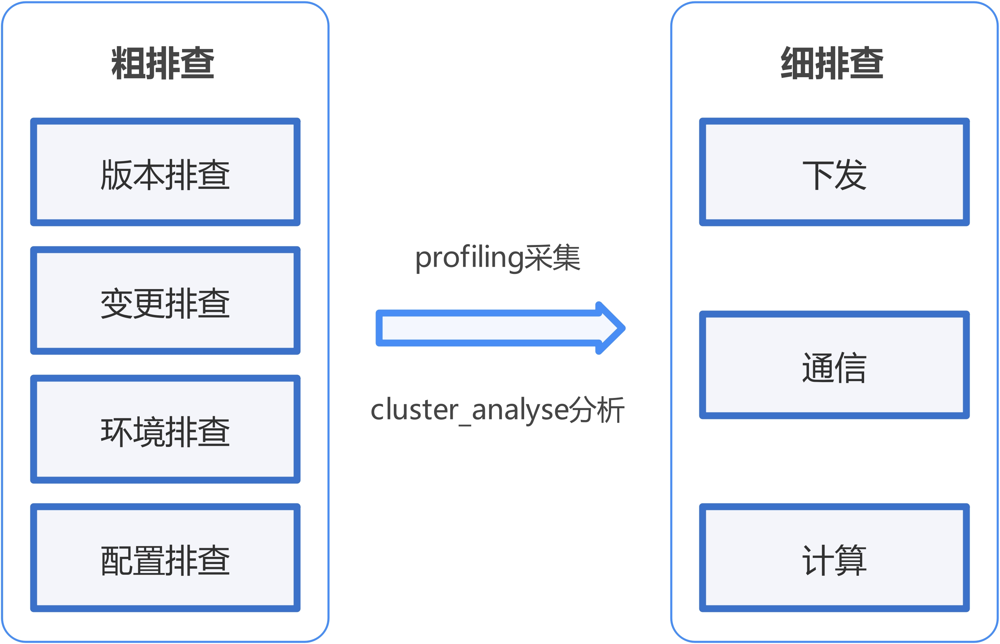

# 集群性能异常波动问题定位方法论

## 集群性能劣化分析思路

整体上，集群性能问题分析思路可以参考[排查思路介绍](./positioning_process_for_performance_issues.md#排查思路介绍)。

对于一般的长稳性能问题，即在正常训练过程中出现的性能波动，需要首先考虑近期变更，并进行硬件问题初步排查，再通过Profiling找到具体问题点进行详细定位。

为提高定位效率，建议采用粗-细两步定位法，如[图1](#ZH-CN_TOPIC_0000002535807059__fig1169003471618)所示。

**图1** 定位流程

粗、细两步定位法的核心思路是考虑到大规模集群训练Profiling采集分析困难，先粗粒度，聚焦近期集群变动（如配置变更、组件升级）及硬件指标（CPU/内存利用率、网络吞吐量等），快速锁定异常时段与可疑模块；未发现明显异常时，采用细定位的方法，通过Profiling工具深度剖析计算、通信、下发等底层细节，进一步从线程栈、I/O延迟、锁竞争等维度定位瓶颈根因。这一方法论强调变动信息与指标的联动分析，并借助Profiling、火焰图、调用链等可视化手段，实现从宏观异常定位到微观根因分析的闭环，为集群性能优化提供精准的分层诊断路径。

另外，为解决验证难的问题，在条件允许的情况下，建议采用N分、业务单机模型测试等方法，在小规模上复现问题，方便验证。

1. **粗定位**

   粗定位一般是在无Profiling的场景下展开。粗定位的方法主要来源于过去问题的分析与经验。显著问题主要集中在以下四类：

   - 资源累积：由于申请的资源没有及时释放，或异常申请，导致资源出现累积，影响性能。
   - 资源抢占：Host侧存在其他进程，或在未进行良好资源隔离的情况下，其他机器大压力读写共享存储等行为。
   - 通信重传：由于丢包等问题产生通信重传，影响性能。
   - 环境变更：近期进行了变更，包括但不限于升级、使用新集群、启动或停止某些服务。

   针对以上问题，可以通过以下方法进行Profiling分析前的粗定位：

   - 版本排查：收集当前使用版本，至少包括HDK、OS、CANN、框架，通过兼容性列表，确认是否版本上存在兼容性问题，同时确认是否存在版本已知性能相关问题。
   - 变更排查：明确近期是否进行过变更，包括但不限于版本升级、集群重划分等。
   - 环境排查：查看是否存在硬件告警、查看存储（io等）、网络（丢包等）等KPI是否正常。
   - 配置排查：参考[预检工具指南](https://gitcode.com/Ascend/msit/blob/26.0.0/msprechecker/README.md)中典型检查项是否配置正确。

   > [!NOTE]
   >
   > 粗定位的检查项来源于历史问题定位经验，可覆盖大多数常见性能波动问题。若存在粗定位无法处理的问题，则需要通过细定位详细排查。
   >
   > 另外，可以通过集群N分、单机模型测试等方法，最小化问题复现单元。若确认单机复现，则可以查看是否存在进程抢占、CPU利用率变化，messages或dmesg日志是否存在告警或报错等。

2. **细定位**

   细定位的过程，请参考[详细排查](positioning_process_for_performance_issues.md#详细排查)，使用模型调优工具进一步定位异常点，详细分析。

将粗、细定位过程的结论相互印证，得到最终问题根因及解决方案。

## 定位实操技巧

1. 在大规模场景下，若以规定时间内完成训练任务为目标，可以先明确优化目标，计算定位的收益（需要对比为定位问题在生产集群上实验、采集所造成的时间损耗，与完成优化后带来的收益）。
2. 针对大规模集群问题定位，首先需要考虑将大规模问题在小规模集群、甚至是单机环境上进行复现，方便实验，从而减小对生产任务的影响。方式包括但不限于N分、单机测试、预检等方式。
3. 实践中初次采集一般采用L1不带堆栈。在大规模集群场景下若直接写共享存储，可能会导致采集膨胀过大。另外，如果未进行良好资源隔离，可能会影响集群中其他作业。因此可以考虑首先将Profiling写到本地，再通过脚本分批收集至共享存储。
4. 若条件允许，可以在模型执行训练时就启动动态性能数据采集功能。
