# ONNX离线推理场景解决方案

## 信息收集

本文以Atlas 200I A2 加速模块为例，分析使用Atlas 200I A2推理场景通常需要收集如下信息。

**Profiling信息收集**

Profiling数据采集操作详情可参见《[msprof模型调优工具](https://gitcode.com/Ascend/docs/blob/master/MindStudio/26.0.0/menu/msprof_collecting_instruct.md)》。

1. 登录运行环境，进入msprof工具所在目录“/var”。

2. 执行如下命令，采集性能数据。其中application为用户程序。

   ```shell
   msprof --output={path} {application}
   ```

   命令示例：

   ```shell
   msprof --output=${HOME}/profiling_output ${HOME}/HIAI_PROJECTS/MyAppname/out/main
   ```

3. 命令执行完成后，在--output指定的目录下生成PROF_XXX目录，目录结构如下。

   ```text
   ├── device_{id}
   │├──data
   │└──...
   └──host
   │├──data
   │└──...
   ```

4. 将PROF_XXX目录上传到安装toolkit包的开发环境，执行以下命令进行数据解析。

   ```shell
   msprof --export=on --output=<dir>
   ```

   PROF_XXX目录下会新增数据文件，目录结构如下：

   ```text
   ├── device_{id}
   │├──data
   ├──host
   │├──data
   │└──...
   └──mindstudio_profiler_output
   │├──xx_*.csv
   │├──xx_*.json
   │└──...
   ...
   ```

**ONNX通过ATC转换OM的日志收集**

设置转换ONNX文件时的日志级别，并将日志的输出定向到文件，分析该问题，步骤如下：

1. 配置ATC运行环境变量。

   ```cfg
   export ASCEND_SLOG_PRINT_TO_STDOUT=1
   export ASCEND_GLOBAL_LOG_LEVEL=0
   ```

2. ATC命令加上--log=debug，收集转换日志。

   命令示例：

   ```shell
   atc --model=$modelPath/$onnxfile \
   --log=debug \
   --framework=5  \
   --input_shape="x:$batchsize,3,$height,$width" \
   --input_fp16_nodes="x" \
   --output_type=FP16 \
   --op_select_implmode=high_precision \
   --output=$outputPath/$outname  \
   --soc_version=Ascendxxxyy \  # xxxyy为用户实际使用的具体芯片类型
   ```

3. 重新执行ATC，将输出的信息重定向到一个日志文本文件连同ATC执行产生的fusion_result.jsonl一并获取，用于后续的性能分析。

**收集推理日志**

执行OM文件进行推理，收集推理输出的日志，采集步骤如下：

1. 配置OM模型运行环境变量。

   ```cfg
   export ASCEND_SLOG_PRINT_TO_STDOUT=1
   export ASCEND_GLOBAL_LOG_LEVEL=1
   ```

2. 然后执行OM文件，将输出的信息重定向到一个日志文本文件。

**返回ATC转换前后的ONNX文件和OM文件**

ONNX是业内目前比较主流的模型格式，广泛用于模型交流及部署，离线推理需要将ONNX文件转换为OM文件来进行推理。

需要将训练环境模型运行导出的ONNX文件和转换产生的OM文件一并采集，用于后续分析。

## 问题分析

### 分析性能数据文件

1. 将收集到的性能数据文件导入至MindStudio Insight工具中进行分析。

2. 分析Free占比，通常情况Atlas 200I A2 加速模块的Free占比应该比较小(<10%)。如[图1](#ZH-CN_TOPIC_0000002535807001__fig82447235328)所示，Free占比超过30%，明显存在异常。需要进一步分析该芯片的OS是否运行了其它业务导致资源占用，进而导致出现等待。

   **图1** 分析Free占比<a name="ZH-CN_TOPIC_0000002535807001__fig82447235328"></a>

   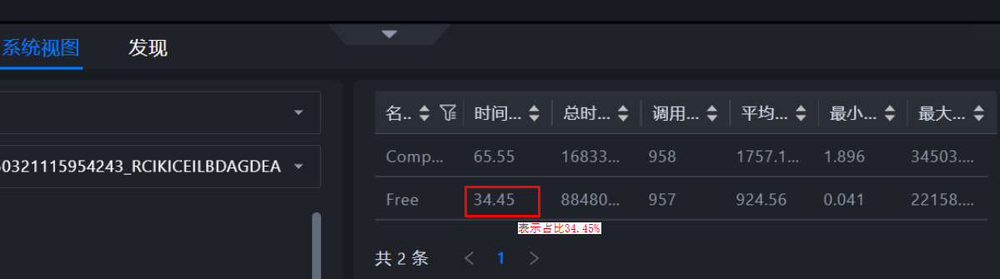

3. 分析运行在AI CPU的算子。如[图2](#ZH-CN_TOPIC_0000002535807001__fig722253853315)所示，GridSampler2D运行在AI CPU上。找到问题算子并联系相关责任人，判断该算子是否可以优化为AI Core上运行或进行下一步分析。

   **图2** 分析运行在AI CPU的算子<a name="ZH-CN_TOPIC_0000002535807001__fig722253853315"></a>

   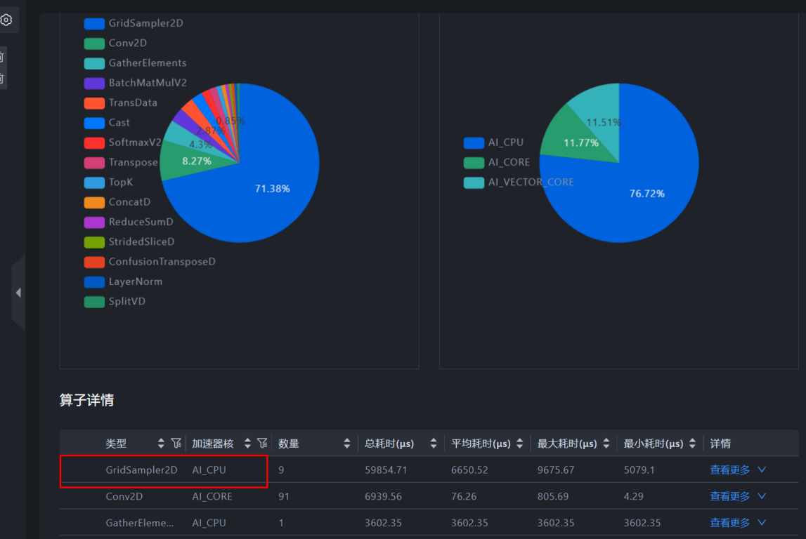

4. 分析运行在AI Core，但是耗时长的算子。如[图3](#ZH-CN_TOPIC_0000002535807001__fig1947769133520)所示，Conv2D算子，占据大部分耗时。找到问题算子并联系相关责任人，查看该算子是否可以进行下一步优化。

   **图3** 分析运行在AI Core且耗时长的算子<a name="ZH-CN_TOPIC_0000002535807001__fig1947769133520"></a>

   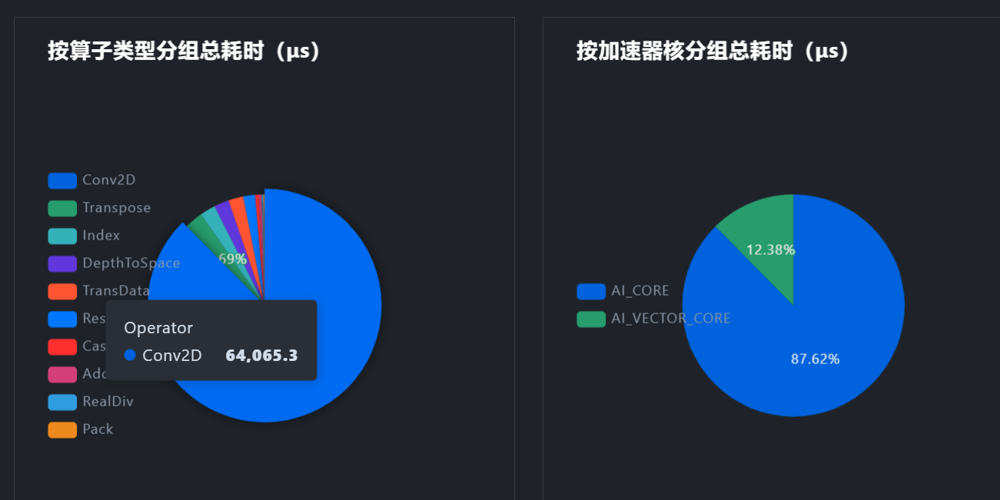

5. op_summary文件分析。

   建议以Task Duration降序排序，优先关注耗时较长的算子情况，此类算子为性能瓶颈算子。如果vec_ratio和mac_ratio均没有超过0.8，则说明算子仍有优化空间；如果mtex_ratio较高，则说明数据搬运耗时较高，可考虑与前后算子融合以减少搬运，参数说明如[表1](#ZH-CN_TOPIC_0000002535807001__table386705312365)所示。

   **表1** 参数说明<a name="ZH-CN_TOPIC_0000002535807001__table386705312365"></a>

   | 参数              | 说明                                                         |
   | ----------------- | ------------------------------------------------------------ |
   | aic_mte1_time(us) | 代表MTE1类型指令（L1->L0A/L0B搬运类指令）耗时，不包括搬运等待时间。 |
   | aic_mte1_ratio    | 代表MTE1类型指令（L1->L0A/L0B搬运类指令）的cycle数在total cycle数中的占用比。 |
   | aic_mte2_time(us) | 代表MTE2类型指令（GM->AICORE搬运类指令）耗时。               |
   | aic_mte2_ratio    | 代表MTE2类型指令（GM->AICORE搬运类指令）的cycle数在total cycle数中的占用比。 |
   | aic_mte3_time(us) | 代表MTE3类型指令（AICORE->GM搬运类指令）耗时。               |
   | aic_mte3_ratio    | 代表MTE3类型指令（AICORE->GM搬运类指令）的cycle数在total cycle数中的占用比。 |

### ATC转换日志分析

查耗时长的算子是否在日志中存在有未命中高性能知识库的记录：

- 搜索关键字1：does not hit the high-priority operator information library。

  日志示例：

  ```text
  INFO:root: 2025-02-10-12:52:23.694.284 Op[/backbone/stages.2/blocks.14/attn/Div_4] does not hit the high-priority operator information library, which might result in compromised performance.
  INFO:root: 2025-02-10-12:52:23.709.410 Op[/backbone/stages.2/blocks.15/attn/Div_1] does not hit the high-priority operator information library, which might result in compromised performance.
  ```

- 搜索关键字2：from cost_model

  日志示例：

  ```text
  [DEBUG] TBE(41403,python3):2025-03-20-15:08:44.009.430 [get_tiling_cube.py:147][get_auto_tiling_v2] [auto tiling] tiling is from cost model tiling, kernel name is :"te_fused_op_conv2d_fix_pipe_d637645277a21bcd6e83a554eeadce4e230fd724a51d46ed7c1ff600f7cddfc8_0"
  ```

### OM和ONNX文件

可以使用[netron](https://netron.app/)工具加载OM和ONNX查看模型结构，可以清晰的看到ONNX模型中算子的拓扑结构，输入和输出，方便后续改图。加载ONNX或者OM文件的示例如[图1](#ZH-CN_TOPIC_0000002535887041__fig9649164411478)所示。

**图1** 算子拓扑结构<a name="ZH-CN_TOPIC_0000002535887041__fig9649164411478"></a>

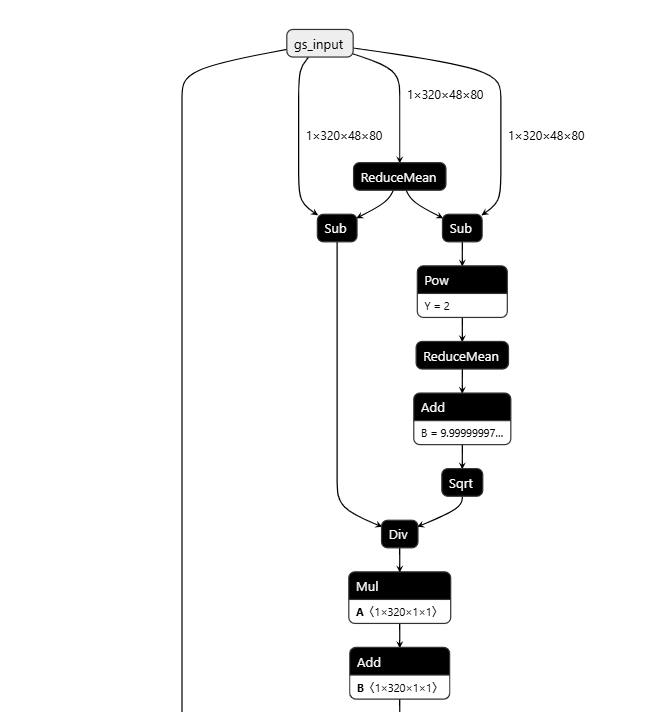

## 优化方法

### 模型压缩量化

量化可以使模型压缩，减少计算量。

> [!NOTE]
>
> - 昇腾仅支持对Cube算子（MatMul、Conv）的量化。
> - 由于量化会插入一些数据转换算子，可能会导致性能劣化，如果需要量化，建议量化后使用AOE等手段进行优化，对比量化前后的性能。AOE方法参考[ONNX模型调优](#onnx模型调优)章节。

量化方法包括以下几种：

- 通过ATC进行量化：进行ATC转换时使用--compression_optimize_conf参数，直接得到量化后的OM文件，使用方法详见《[ATC离线模型编译工具用户指南](https://www.hiascend.com/document/detail/zh/canncommercial/850/devaids/atctool/atlasatc_16_0031.html)》的“[参数说明](https://www.hiascend.com/document/detail/zh/canncommercial/850/devaids/atctool/atlasatc_16_0039.html)”章节。
- AMCT_ONNX：针对ONNX进行量化，需下载并安装“AMCT（ONNX）”，相当于ATC参数量化的ONNX版本。AMCT工具在CANN软件下载链接中获取，AMCT支持联合量化，在resnet结构上可能会有额外的性能提升。
- msModelSlim工具：针对ONNX进行量化，CANN包自带工具，无需安装，支持超2G的ONNX模型量化， 使用指导请参考[msModelSlim工具](https://gitcode.com/Ascend/msmodelslim/blob/26.0.0/docs/zh/getting_started/quantization_quick_start.md)。

### ONNX模型调优

#### 简化ONNX文件

ONNX Simplifier是一款开源工具，可以简化ONNX模型。通过推断整个计算图，用常量输出替换冗余运算符（也称为常量折叠）。

执行以下命令，使用ONNX Simplifier工具。

```shell
pip install onnx-simplifier
onnxsim -h  #查看参数说明
onnxsim  --overwrite-input-shape="1,3,224,24" efficient.onnx efficient_sim.onnx
```

如[图1](#ZH-CN_TOPIC_0000002535807047__fig1360715412575)所示，对导出的ONNX文件进行onnxsim后可以看到，减少了ONNX部分的操作。

**图1** 使用ONNX Simplifier工具<a name="ZH-CN_TOPIC_0000002535807047__fig1360715412575"></a>

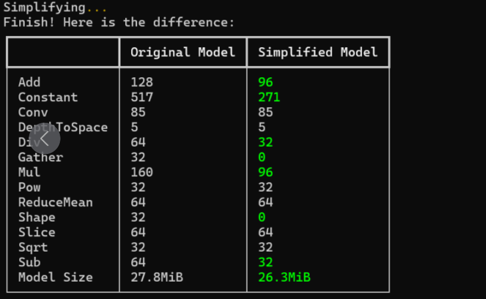

#### ATC调优

ATC工具运行命令参考如下：例：

```shell
atc --framework=5 \
--model=models/vit-b-16.img.fp32.bs${bs}.opt.onnx \
--output=models/vit-b-16.img.bs${bs} \
--input_format=NCHW \
--input_shape="image:${bs},3,224,224" \
--soc_version=Ascend${chip_name} \
--log=error \
--optypelist_for_implmode="Sigmoid" \
--op_select_implmode=high_performance \
--enable_small_channel \
--insert_op_conf=./insert_op.cfg
```

命令中的参数说明如[表1](#ZH-CN_TOPIC_0000002535807083__table698594314591)所示，更多参数说明可参考《[ATC离线模型编译工具用户指南](https://www.hiascend.com/document/detail/zh/canncommercial/850/devaids/atctool/atlasatc_16_0031.html)》。

**表1** 参数说明<a name="ZH-CN_TOPIC_0000002535807083__table698594314591"></a>

| 参数                      | 说明                                                         |
| ------------------------- | ------------------------------------------------------------ |
| --model                   | ONNX模型文件。                                               |
| --framework               | 5代表ONNX模型。                                              |
| --output                  | 输出的OM模型。                                               |
| --input_format            | 输入数据的格式。                                             |
| --input_shape             | 输入数据的Shape。                                            |
| --log                     | 日志级别。                                                   |
| --soc_version             | 处理器型号。                                                 |
| --optypelist_for_implmode | 指定算子。                                                   |
| --op_select_implmode      | 选择高性能/高精度模式，与--optypelist_for_implmode配合使用。 |
| --enable_small_channel    | 与--insert_op_conf配合使用。                                 |
| --fusion_switch_file      | 关闭/打开部分融合规则。                                      |

#### AOE调优

对于EP模式的产品，可以直接在OM模型运行的环境进行AOE调优。参考命令如下：

```shell
aoe --framework 5 --model ./model.onnx --output model --job_type 2 --ip xx.xx.xx.xx --aicore_num=1
```

参数的详细解释以及使用方法可参见《[AOE调优工具用户指南](https://www.hiascend.com/document/detail/zh/canncommercial/850/devaids/aoe/auxiliarydevtool_aoe_0001.html)》。

#### NCS调优

对于部分运行在RC模式的产品，产品普遍存在内存较小的特点。这就导致了模型无法通过本地AOE进行调优，这样就需要用到另一种调优方式，NCS调优。

##### 安装CANN包

- 环境准备

  一台常规的Linux服务器（后文描述为Host机）和一台装有昇腾NPU的服务器（后文描述为Device机）。服务器上需要安装toolkit包，以CANN 8.0.0版本为例，toolkit包的安装方法参考对应版本的[CANN安装指南](https://www.hiascend.com/document/detail/zh/canncommercial/800/softwareinst/instg/instg_0008.html?Mode=PmIns&OS=Ubuntu&Software=cannToolKit)。

  **图1** 环境准备

  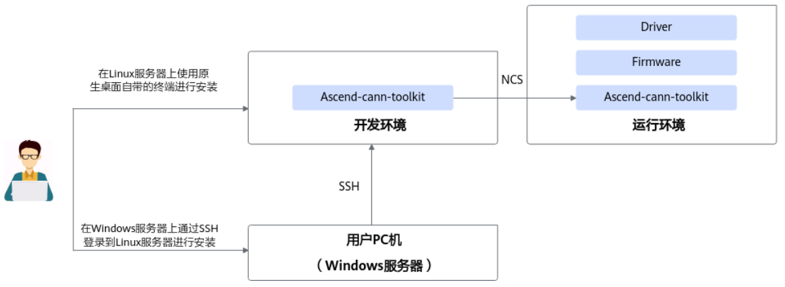

- 配置环境变量

  - Host机

    加载CANN安装路径的环境变量脚本set_env.sh, CANN安装路径以***${\****install_path****}\***为例。

    ```cfg
    source ${install_path}/ascend-toolkit/set_env.sh
    ```

  - Device机

    ```cfg
    export LD_LIBRARY_PATH=${install_path}/latest/tools/ncs/lib64/:${install_path}/latest/runtime/lib64/:$LD_LIBRARY_PATH
    export PATH=${install_path}/latest/tools/ncs/bin/:$PATH
    ```

    其中install_path请配置为CANN软件的实际安装路径。

##### 配置密钥证书

请先确认Host机和Device机处于同一主网段，可以互相ping通。

1. 在Host机中上传shell脚本，脚本如下：

   ```shell
   DEVICE_IP=10.x.x.196   # your device ip
   HOST_IP=10.x.x.66 # your host IP
   PASS_PHRASE=Ncx12345 # yourpassphrase
   KEY_LEN=3072 # [3072,4096]
   VALID_DAYS=365 # thecertwillexpireafterthevaliddays
   COUNTRY=CN # yourcountrynameabbr.(2lettercode)
   STATE=Zhejiang # yourprovincename
   LOCATION=Hangzhou # yourcityname
   ORGANIZATION=ABC # yourcompanyname
   ORGANIZATION_UNIT=DEF # yoursectionname
   COMMON_NAME_ROOT=www.aoe.com # yourdomainname
   ENCRYPT_MODE=aes256 # [aes256,aes128]
   
   ##########该分割线以上内容请根据实际情况修改，以下内容不建议修改。##########
   
   # generateconf
   rm-rfhost-ext.cnfdevice-ext.cnf
   echo"[ext]">>host-ext.cnf
   echo"subjectAltName=IP:${HOST_IP}">>host-ext.cnf
   echo"[ext]">>device-ext.cnf
   echo"subjectAltName=IP:${DEVICE_IP}">>device-ext.cnf
   
   # generaterootcert
   opensslreq-x509-newkeyrsa:${KEY_LEN}-days${VALID_DAYS}-nodes-keyoutca-key.pem-outca-cert.pem-subj"/C=${COUNTRY}/ST=${STATE}/L=${LOCATION}/O=${ORGANIZATION}/OU=${ORGANIZATION_UNIT}/CN=${COMMON_NAME_ROOT}"-addextkeyUsage=keyCertSign
   
   # generatedevicecertrequest
   opensslreq-newkeyrsa:${KEY_LEN}-nodes-keyoutdevice-key.pem-outdevice-cert.csr-subj"/C=${COUNTRY}/ST=${STATE}/L=${LOCATION}/O=${ORGANIZATION}/OU=${ORGANIZATION_UNIT}/CN=NCS"
   # generatedevicecert
   opensslx509-req-indevice-cert.csr-days${VALID_DAYS}-CAca-cert.pem-CAkeyca-key.pem-CAcreateserial-outdevice-cert.pem-extensionsext-extfiledevice-ext.cnf
   
   # generatehostcertrequest
   opensslreq-newkeyrsa:${KEY_LEN}-nodes-keyouthost-key.pem-outhost-cert.csr-subj"/C=${COUNTRY}/ST=${STATE}/L=${LOCATION}/O=${ORGANIZATION}/OU=${ORGANIZATION_UNIT}/CN=NCA"
   # generatehostcert
   opensslx509-req-inhost-cert.csr-days${VALID_DAYS}-CAca-cert.pem-CAkeyca-key.pem-CAcreateserial-outhost-cert.pem-extensionsext-extfilehost-ext.cnf
   
   # encrytprivatekey
   opensslrsa-inhost-key.pem-passoutpass:${PASS_PHRASE}-${ENCRYPT_MODE}-outhost-key.pem
   opensslrsa-indevice-key.pem-passoutpass:${PASS_PHRASE}-${ENCRYPT_MODE}-outdevice-key.pem
   ```

2. 将Device Ip和Host Ip改成对应的ip地址，在Host机上运行该shell脚本，生成密钥证书文件。

   **表1** 相关文件说明

   | 文件名          | 作用                                   |
   | --------------- | -------------------------------------- |
   | ca-cert.pem     | 根CA，需要拷贝到开发环境和运行环境上。 |
   | host-key.pem    | 开发环境端私钥，需要拷贝到开发环境上。 |
   | host-cert.pem   | 开发环境端证书，需要拷贝到开发环境上。 |
   | device-key.pem  | 运行环境端私钥，需要拷贝到运行环境上。 |
   | device-cert.pem | 运行环境端证书，需要拷贝到运行环境上。 |
   | ca-key.pem      | 中间过程文件，可忽略。                 |
   | ca-cert.srl     | 中间过程文件，可忽略。                 |
   | host-cert.csr   | 中间过程文件，可忽略。                 |
   | device-cert.csr | 中间过程文件，可忽略。                 |
   | host-ext.cnf    | 中间过程文件，可忽略。                 |
   | device-ext.cnf  | 中间过程文件，可忽略。                 |

3. 将device-key.pem 、device-cert.pem和ca-cert.pem三个文件拷贝到Device机上，在密钥证书所在路径执行如下命令。

   - Host机

     ```shell
     akt --private_key host-key.pem --public_cert host-cert.pem --ca_cert ca-cert.pem
     ```

   - Device机

     ```shell
     akt --private_key device-key.pem --public_cert device-cert.pem --ca_cert ca-cert.pem
     ```

     > [!NOTE] 说明
     >
     > 示例命令中的私钥文件名为：host-key.pem或者device-key.pem，设备证书文件名为：host-cert.pem或者device-cert.pem，根证书文件名为：ca-cert.pem。

4. 执行命令后，提示“Enter Password:”，请输入加密私钥的口令PASS_PHRASE（口令必须与生成私钥时的口令一致）。

   回显如下，表示证书导入成功。

   ```ColdFusion
   Load cert, password, and key successfully.
   ```

##### 执行调优

1. AOE调优前，在Host机上，使用如下命令可选配置部分环境。

   ```shell
   export TUNE_BANK_PATH={bank_path}  # 指定知识库保存地址
   
   export TE_PARALLEL_COMPILER=32     # 加速aoe调优
   ```

2. 执行以下命令，使用AOE调优。

   Device机侧：

   ```shell
   ncs &
   ```

   执行后查询NCS是否启动成功。

   ```shell
   ps -ef|grep ncs|grep -v "grep"
   ```

   回显信息如下所示，代表NCS服务启动成功。ID为257435的进程是ncs守护进程，ID为257440的进程是ncs运行进程。

   ```ColdFusion
   root257440257435007:54pts/300:00:01ncs--ipXX.XX.XX.XX--portXXXX--daemonfalse
   ```

   Host机侧：

   ```ColdFusion
   aoe --framework 5 --model ./model.onnx --output model --job_type 2 --ip xx.xx.xx.xx --aicore_num=1
   ```

   命令中的参数说明如[表2](#ZH-CN_TOPIC_0000002535807043__table12900141617195)所示。更多调优参数可以参考《[AOE调优工具用户指南](https://www.hiascend.com/document/detail/zh/canncommercial/850/devaids/aoe/auxiliarydevtool_aoe_0001.html)》。

   **表2** 参数说明<a name="ZH-CN_TOPIC_0000002535807043__table12900141617195"></a>

   | 参数         | 说明                                                         |
   | ------------ | ------------------------------------------------------------ |
   | --model      | 需要调优的模型。                                             |
   | --output     | 调优完成的模型的保存名字。                                   |
   | --job_type   | 子图调优或者算子调优，分别是2和1，需要先进行子图调优，再进行算子调优，先后执行一遍。 |
   | --ip         | Device机的Ip地址。                                           |
   | --aicore_num | AI Core数量。                                                |

3. 命令执行后，会有打印提示性能优化的比例，如[图2](#ZH-CN_TOPIC_0000002535807043__fig2438192682417)所示，性能优化提升53%。

   **图2** 调优回显<a name="ZH-CN_TOPIC_0000002535807043__fig2438192682417"></a>

   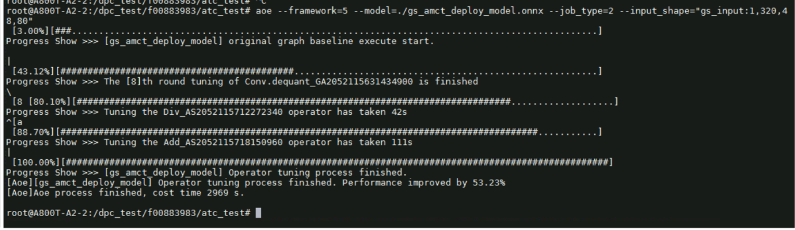

### msit debug surgeon自动优化ONNX

[surgeon（自动调优）工具](https://gitcode.com/Ascend/msit/blob/26.0.0/msit/docs/debug/surgeon/README.md)使能ONNX模型在昇腾芯片的优化，并提供基于ONNX的改图功能。

#### 使用方法

使用如下命令，进行调优，参数说明如[表1](#ZH-CN_TOPIC_0000002503927222__table12801810373)所示。

```shell
msit debug surgeon COMMAND 
```

**表1** 参数说明<a name="ZH-CN_TOPIC_0000002503927222__table12801810373"></a>

| 参数    | 说明                                                         |
| ------- | ------------------------------------------------------------ |
| COMMAND | COMMAND为surgeon工具提供的五个选项：list：列举当前支持自动调优的所有知识库。evaluate：搜索可以被指定知识库优化的ONNX模型。optimize：使用指定的知识库来优化指定的ONNX模型。extract：对模型进行子图切分。concatenate：对模型进行拼接。 |

> [!NOTE]
>
> 每个子任务下面的可选项和必选项不同。具体使用方法参考[msit debug surgeon功能使用指南](https://gitcode.com/Ascend/msit/blob/26.0.0/msit/docs/debug/surgeon/README.md)。

#### 优化实例

COMMAND参数取值的实例[图1](#ZH-CN_TOPIC_0000002503927222__fig1803112211443)和[图2](#ZH-CN_TOPIC_0000002503927222__fig10963143614443)所示。

**图1** 取值为list<a name="ZH-CN_TOPIC_0000002503927222__fig1803112211443"></a>

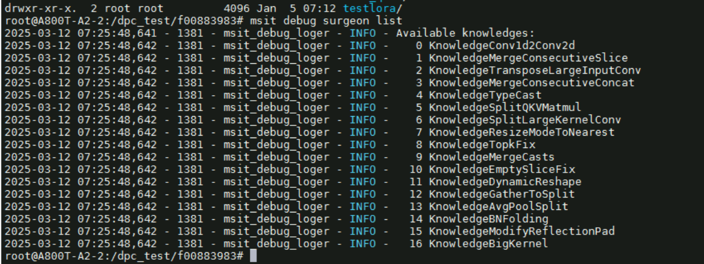

**图2** 取值为evaluate和optimize<a name="ZH-CN_TOPIC_0000002503927222__fig10963143614443"></a>

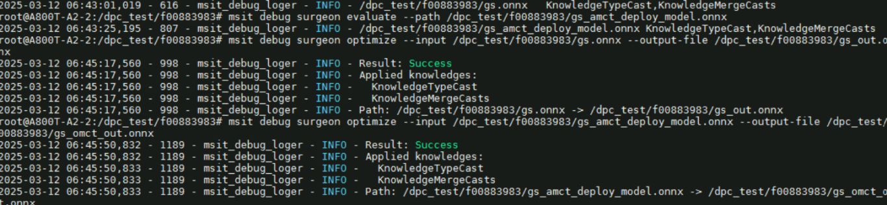

执行前后对比[图3](#ZH-CN_TOPIC_0000002503927222__fig837115534618)所示，可以看出执行后cast算子被消除了。

**图3** 执行前后对比<a name="ZH-CN_TOPIC_0000002503927222__fig837115534618"></a>

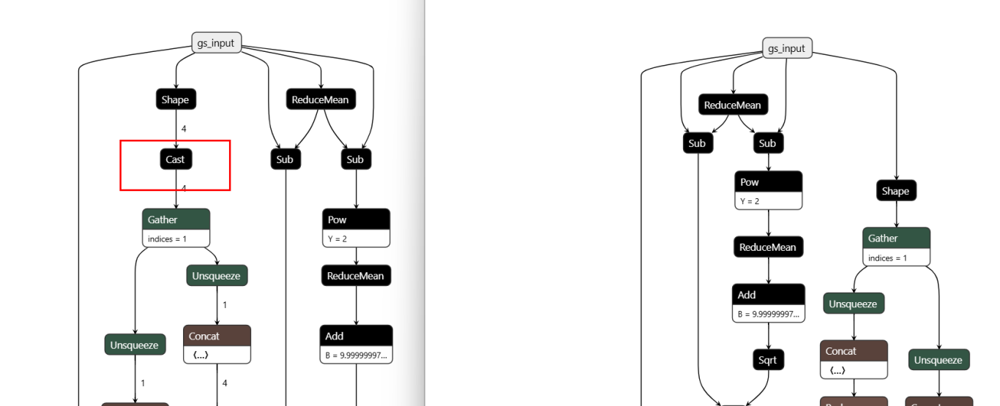

### 升级CANN版本

CANN版本每一次升级都会优化部分算子。如果发现部分算子的执行性能差，或者执行在AI CPU上，考虑升级CANN版本。需要注意toolkit和kernel都要升级。通常情况下，升级CANN版本不会带来负面影响。

下面通过GridSampler2D算子的两个案例来直观感受解决方案，如[图1](#ZH-CN_TOPIC_0000002535887077__fig7219165773312)所示，该算子在AI CPU上执行，性能较差；如[图2](#ZH-CN_TOPIC_0000002535887077__fig182522183417)所示，该算子虽然在vector_core上，但是执行效率也极低，这个案例的CANN版本比较旧。

**图1** 算子在AI CPU上执行<a name="ZH-CN_TOPIC_0000002535887077__fig7219165773312"></a>

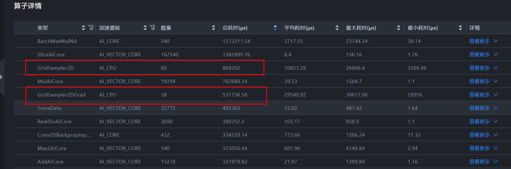

**图2** 算子在vector_core上执行<a name="ZH-CN_TOPIC_0000002535887077__fig182522183417"></a>

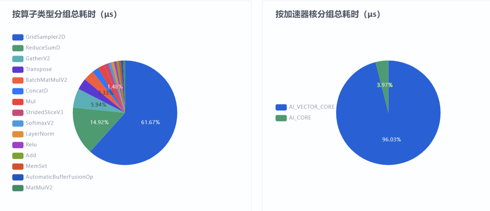

针对以上两个问题，可以判断出在当前的CANN版本中，该算子在AI CPU上，存在性能问题，解决方案为将版本升级至CANN 8.0.RC3及以上版本，升级后改善明显，GridSampler2D耗时几乎可忽略。

### 改图优化

如果自动优化无法满足目标，也已经识别到模型中存在一些冗余计算，或者需要通过调整数据类型使其从AI CPU运行切换到AI Core运行等场景时，可以通过改图的方式来进行性能优化。

以在GlobalAveragePool操作前加入Cast操作为例，改图脚本如下：

```python
import onnx
from onnx import helper, TensorProto
from onnx import shape_inference
model_path = "D:\\035-Code\\om_test\\resnet50.onnx"
model = onnx.load(model_path)
def create_cast_node(input_name, output_name, to_type):
    return helper.make_node(
        'Cast',
        inputs=[input_name],
        outputs=[output_name],
        to=to_type
    )
for i, node in enumerate(model.graph.node):
    if node.op_type == 'GlobalAveragePool':
        # 获取GlobalAveragePool节点的输入
        input_name = node.input[0]
        # 生成新的Cast节点的输出名称
        cast_output_name = f"{input_name}_cast"
        # 创建Cast节点
        cast_node = create_cast_node(input_name, cast_output_name, TensorProto.FLOAT)
        # 更新GlobalAveragePool节点的输入
        node.input[0] = cast_output_name
        # 将Cast节点插入到计算图中
        model.graph.node.insert(i, cast_node)
        break  # 只处理第一个找到的GlobalAveragePool节点
output_model_path = "D:\\035-Code\\om_test\\resnet50_new.onnx"  # 替换为你想要保存的模型路径
onnx.save(model, output_model_path)
```

脚本执行后，效果如[图1](#ZH-CN_TOPIC_0000002535807089__fig5767105374219)所示。

**图1** 执行后效果<a name="ZH-CN_TOPIC_0000002535807089__fig5767105374219"></a>

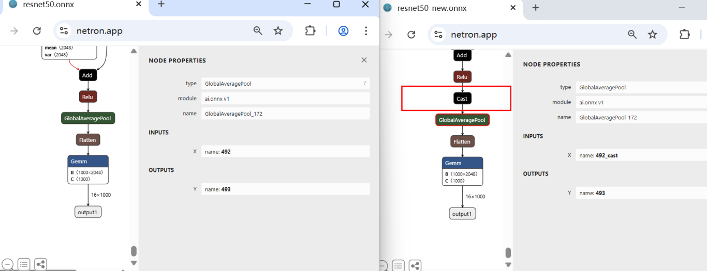
