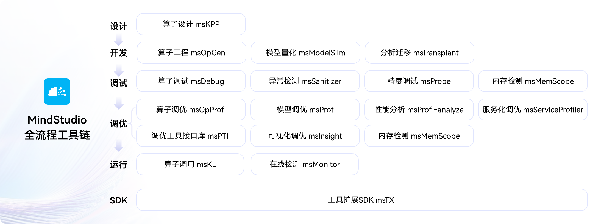
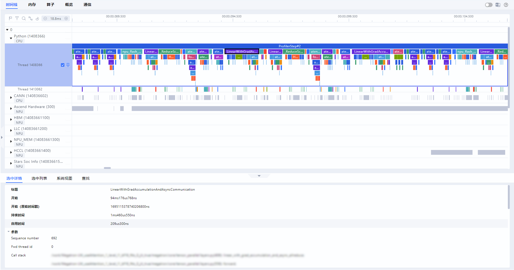

# MindStudio是什么

## 简介

MindStudio是华为面向昇腾AI开发者打造的全流程开发工具集，旨在提供高效、便捷的一站式开发体验。

## 功能架构

MindStudio提供一站式AI开发环境，助力开发者高效完成算子开发、训练开发和推理开发。MindStudio功能框架如图1所示。

**图1** 工具集功能架构

## 命令行工具开发场景

按照开发场景分类，MindStudio可以分为以下三种工具链：

- **算子开发工具：** MindStudio算子开发工具是面向Ascend C编程语言的系列能力集合，涵盖了算子设计、算子开发、异常检测、功能调试及性能优化的全流程，助力开发者自主完成高性能算子开发。
- **训练开发工具：** 聚焦用户在模型迁移、模型开发中遇到的痛点问题，提供全流程的工具链。通过提供分析迁移、精度调试和性能调优等工具包，帮助用户解决开发过程中迁移困难、精度调试门槛高、性能不达标或劣化等问题，让用户轻松解决精度和性能问题，开启乐趣十足的极简开发之旅。
- **推理开发工具：** 作为昇腾平台的统一推理开发工具链，为用户提供大模型与传统模型推理开发中常用的模型压缩、模型一站式调试调优等功能，并支持推理服务化场景下的性能调优能力，以及模型的精度、性能测评功能，帮助用户达到最优的推理性能。

## 可视化工具

MindStudio Insight：是一款用于模型、算子、服务化及内存性能调优的可视化工具，可显著提升开发者进行性能调优的效率。

- 模型调优场景：提供了多维度性能数据分析功能，包括内存定界、算子、调度、通信等方面的分析功能，帮助开发者高效定位问题。针对大模型集群场景，支持对集群性能Timeline数据并行分析，使开发者快速识别通信慢、卡顿和链路瓶颈等问题。
- 算子调优场景：支持算子内存和计算负载分析、Roofline瓶颈分析、代码性能度量及指令流水并行分析等功能，助力开发者快速实现算子性能调优。
- 服务化调优：通过Timeline视图和折线图来呈现推理服务化进程中各个关键阶段的执行情况和端到端的性能表现，帮助开发者快速识别请求调度、显存管理、批处理策略等系统级问题。
- 内存调优：支持Device侧可视化呈现内存的详细分配情况，并结合Python调用栈及自定义打点标签来标记各种内存申请与使用详情，从而实现内存问题的精准定位及调优。

**图2** MindStudio Insight界面

