# MindIE推理性能解决方案

## 整体思路

MindIE推理性能可以从纯模型和服务化两个角度进行优化。

首先确认当前纯模型的性能是否有调优空间：

1. 版本基线覆盖的场景，和版本基线的性能比较，检查配置。
2. 版本基线未覆盖，或检查配置后仍存在问题的场景，先进行相同输入输出的纯模型测试。
3. 如果纯模型测试结果未达到预期，进行纯模型性能调优；如果达到预期，则进行服务化性能调优。
4. 服务化调优时性能瓶颈定位思路如[图1](#ZH-CN_TOPIC_0000002535807067__fig294108141612)所示。

**图1** 服务化性能瓶颈定位流程图

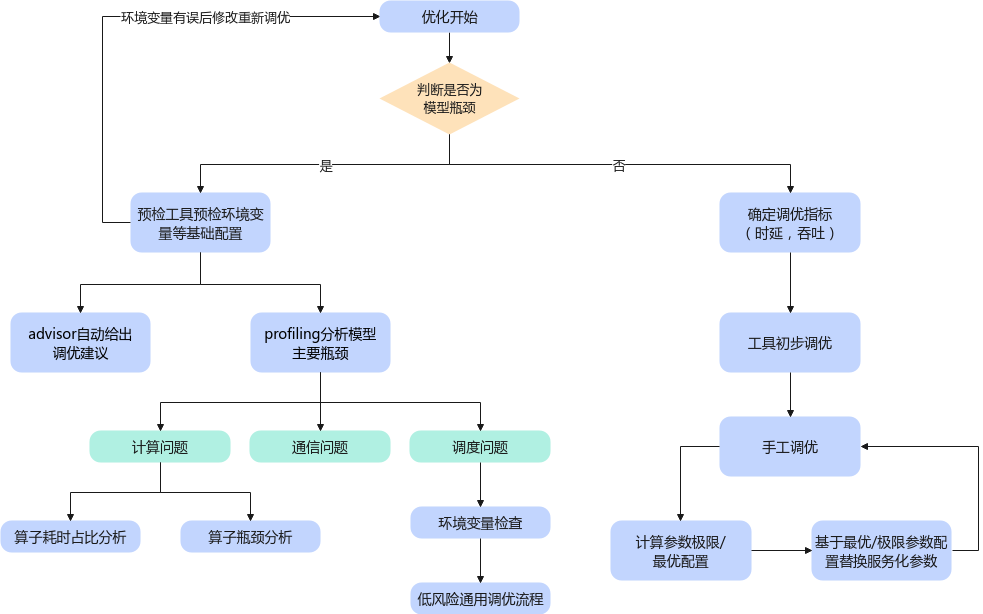

## 纯模型性能调优

常见的模型和使用场景下，如果采用了相同的权重、镜像、部署策略，理论上可以复现相似的性能。

因此出现性能问题后，可以优先对环境变量、涉及性能的开关进行检查，大概率问题在此处（例如没有绑核、内核版本低、日志等级等问题）。

纯模型性能测试可使用[AISBench工具的benchmark-mindie评测插件](https://gitee.com/aisbench/benchmark-mindie/blob/master/README.md#纯模型性能测评)评估。

如果纯模型测试结果已经出现性能劣化现象，可以进行详细的Profiling性能分析 ，分析方法见[模型调优深入分析（MindStudio Insight）](performance_tool_usage.md#模型调优深入分析（MindStudio Insight）)。

#### 纯模型初步测试

纯模型测试根据用户输入的--batch_size参数确定测试请求的大小，根据--case_pair确定请求输入长度和输出长度的组合，在推理时先处理所有请求的Prefill，再将所有请求组成同一个Decode Batch完成Decode推理。对于基线未覆盖的测试场景，特别是有TTFT或TPOT时延要求的场景，可以参考如下步骤进行纯模型测试。

1. 设置”--case_pair [[输入长度,1]]”, 即可模拟单个Prefill Batch的纯模型测试，此时指定的--batch_size参数记录为prefill_batchsize，测试结果中的”Total Time(s)”记录为prefill_time。

2. 按照实际输入输出长度设置--case_pair参数正常进行测试，此时指定的--batch_size参数记录为decode_batchsize，测试结果中的”Non-first token time(ms)”记录为decode_token_time。

3. 调整decode_batchsize和prefill_batchsize，找到满足要求的配置，如[表1](#ZH-CN_TOPIC_0000002504087066__table1511926121511)所示。

   **表1** 配置说明

   | 场景                                           | 配置方法                                                     |
   | ---------------------------------------------- | ------------------------------------------------------------ |
   | 不限时延基线吞吐                               | 调大decode_batchsize至OOM。（或选取增速放缓的decode_batchsize） |
   | 限制TPOT，不限制TTFT                           | 调整decode_batchsize至decode_token_time刚好满足TPOT限制。    |
   | 限制TPOT和TTFT；爬坡测试（限制Request Rate）   | 调整decode_batchsize至decode_token_time刚好满足TPOT限制，调整prefill_batchsize令prefill_time接近TTFT限制。 |
   | 限制TPOT和TTFT；固定并发（不限制Request Rate） | 调整decode_batchsize至decode_token_time刚好满足TPOT限制，设置prefill_batchsize=dp, 调小decode_batchsize直至接近平均TTFT限制。 |

4. 如需纯模型性能调优（并行策略，环境变量等），对不同的配置重复步骤1直到选取最优配置。

5. 将纯模型的Decode Batchsize和Prefill Batchsize转化为服务化参数maxBatchsize和maxPrefillBatchSize。

6. 设置其他服务化和测试参数，根据实际测试结果调整最大并发Requestrate/maxBatchSize/maxPrefillBatchsize。

## 服务化性能调优方法论

### 明确优化目标

用户通常关注首Token时延、吞吐等性能指标。测试时的并发、输入输出长度对性能影响较大，必要时可以进行引导。

- 低时延场景：实时交互（如对话系统），关注首Token生成速度（Prefill阶段优化）。

- 高吞吐场景：离线批量处理（如文档生成），关注Tokens/秒（Decode阶段优化）。

  > [!NOTE] 说明
  >
  > 有时性能目标和实际差异较大，可以根据纯模型性能简单评估性能上限，判断时延或吞吐的极限，从而判断目标是否有可能达成。

#### 服务化性能上限评估

按照估算场景和目标划分，基于纯模型测试结果，对于服务化性能上限的几种（乐观）估计方法如下：

- 单并发：与纯模型单并发性能接近。

- 大并发下平均首Token时延。

  - Prefill阶段推理是算力密集型场景，Prefill Batchsize增大后会触发算力瓶颈；触发瓶颈后，Prefill时延会随Batchsize增加接近线性增长。
  - 使用纯模型测试找到达到算力瓶颈的Prefill Batchsize，以这个Prefill Batchsize划分服务化的并发请求数，即基于纯模型结果计算首Token时延上限；假设纯模型测试找到瓶颈处Prefill Batchsize为，此时单个Prefill Batch的纯模型计算时间为，要估计的服务化实际并发为，则服务化此轮并发请求的Prefill总时间估计为，在先来先服务（FCFS）调度策略下，平均首Token时延约为。

- 大并发下吞吐、非首Token时延。

  - Decode是带宽瓶颈而非算力瓶颈，理论单个Decode的Batchsize越大，总吞吐越大，直至达到显存限制。
  - 服务化的输出吞吐和非首Token时延，可参考相同并发（即Decode Batchsize）下的纯模型结果作为理论估计的上限，考虑到服务化推理会有框架侧调度等额外的时间开销，服务化吞吐的乐观估计可折算为纯模型吞吐0.8~0.9倍。

- 显存瓶颈下的最大并发/maxBatchsize的理论上限：Decode阶段maxBatchSize主要受显存限制，可根据KV Cache Block数量和序列长度计算。

  - KV Cache缓存池以Block为单位分配，Block的大小通过MindIE服务化参数配置中的cacheBlockSize设置，一般使用默认值128，即每个Block可存储128个Token，根据使用场景的上下文长度计算每个请求需要占用的KV Cache Block数量：

    - 最大Block数量=Ceil(输入Token数/cacheBlockSize)+Ceil(最大输出Token数/cacheBlockSize)
    - 平均Block数量=Ceil(平均输入Token数/cacheBlockSize)+Ceil(平均输出Token数/cacheBlockSize)。

  - MindIE服务端NPU上KV Cache Block总可用数量 Total Block Num可通过实测获取。

    - 清空/root/mindie/log下的所有旧日志文件，通过使能环境变量MINDIE_LLM_PYTHON_LOG_LEVEL和MINDIE_LLM_PYTHON_LOG_TO_FILE，使MindIE LLM中Python程序运行时产生INFO级别日志并写入文件；

    - 在确定除maxBatchSize之外的其他服务化配置后，使用默认值拉起服务，在服务端拉起成功后，使用grep命令搜索MindIE LLM Python程序日志中的"npuBlockNum"关键字，根据使用的卡数不同会返回多个结果，其中的最小值即为MindIE服务端NPU上KV Cache Block总可用数量，以[图1](#ZH-CN_TOPIC_0000002535887093__fig19500185613447)为例，总可用数量为817。

      **图1** 获取MindIE服务端NPU上KV Cache Block总可用数量示例

      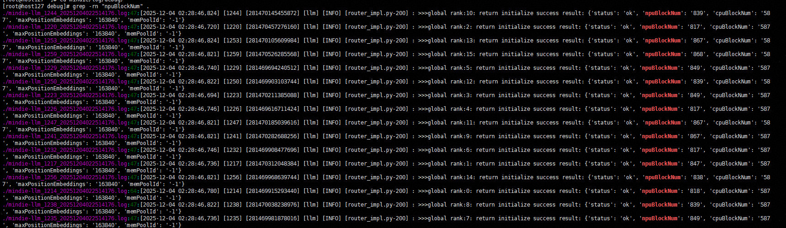

  - 为保持最佳性能，maxBatchSize一般不宜超过Floor[Total Block Num/最大Block数量]；若请求之间的上下文长度差距较大，则上限可适当提高至Floor[Total Block Num/平均Block数量]。

### 针对目标进行调优

明确优化目标后，再调整服务化参数，从而提升服务化性能。

**核心参数介绍**

核心参数请参见[表1](#ZH-CN_TOPIC_0000002535807049__table3617mcpsimp)，详细介绍请参见《MindIE LLM开发指南》。

**表1** 核心参数说明

| **优化方向** | **关键参数**                         | **推荐值/策略**                                              |
| ------------ | ------------------------------------ | ------------------------------------------------------------ |
| **低时延**   | maxPrefillBatchSize                  | 小批量（4-16），降低首Token计算量。                          |
|              | supportSelectBatch                   | false, 强制Prefill优先调度。                                 |
|              | maxQueueDelayMicroseconds            | ≤50ms（减少等待延迟）。                                      |
| **高吞吐**   | maxBatchSize（Decode阶段）           | 最大化（受显存限制）。                                       |
|              | maxPrefillBatchSize/maxPrefillTokens | 相对调高，按照实际平均输入折算，使maxPrefilltokens在10000上下。 |
|              | supportSelectBatch                   | 开启吞吐优先调度。                                           |
|              | maxQueueDelayMicroseconds            | 等待时间加大，让测试开始时尽量组成大的Batch。                |
|              | RequestRate（通过测试工具设定）      | 增加下发频率，提高至硬件上限。                               |
|              | Concurrency（通过测试工具设定）      | 同步逐步提升并发至吞吐饱和点。                               |
|              | 序列长度三件套                       | 根据实际场景和要求合理配置maxInputTokenLen，maxIterTimes，maxSeqLen。 |

**手动调优**

针对未达成目标的参数进行调优，例如时延不满足目标或吞吐不满足目标。

调优前可以先确认各个参数的理论上限和理论最优配置，比如计算理论maxBatchSize最优值等，具体计算方法可参考[服务化性能上限评估](#服务化性能上限评估)。

**工具调优**

手动调优需要一定的服务化基础。想要更便捷的调优，可以使用**服务化调优工具**（**msServiceProfiler**）的专家建议功能，请参见[服务化专家建议工具](https://gitcode.com/Ascend/msserviceprofiler/blob/master/docs/zh/service_profiling_advisor_instruct.md)。 使用专家建议工具需要先使用MindIE Benchmark进行服务化性能测试，专家建议工具会基于MindIE Benchmark测试结果落盘文件给出调优建议。

**疑难问题**

上边所述的服务化调优，均为黑盒状态下的调优。我们并不清楚请求具体的调度过程，比如哪些请求组成了一个Batch、一个Batch有多大、什么时间执行的Prefill、什么时间执行的Decode等。

某些问题无法仅靠黑盒调优完成，需要展开进一步分析。与纯模型的性能优化类似，需要借助**msServiceProfiler**进行分析。

## 服务化性能调优定位案例

### 框架调度耗时导致性能劣化

**问题现象**

同一个环境，其他配置都一样，MindIE 2.0.RC1相比MindIE 2.0.T3的服务化性能劣化了很多，需确认是否为版本问题。

如[图1](#ZH-CN_TOPIC_0000002504087096__fig31731419193712)所示，上半部分截图为纯模型测试结果，300并发下纯模型Decode阶段平均时延为36ms；下半部分为服务化测试结果，300并发下Decode阶段平均时延约为66ms。

**图1** MindIE 2.0.T3性能测试结果

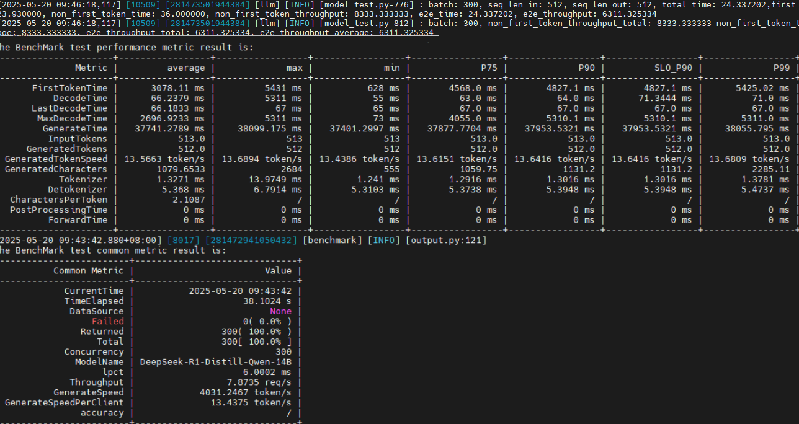

如[图2](#ZH-CN_TOPIC_0000002504087096__fig145925476375)所示，上半部分截图为纯模型测试结果，300并发下纯模型Decode阶段平均时延为35.44ms，与2.0.T3性能非常接近；下半部分为服务化测试结果，300并发下Decode阶段平均时延约为95ms，较2.0.T3版本性能劣化50%。

**图2** MindIE 2.0.RC1性能测试结果

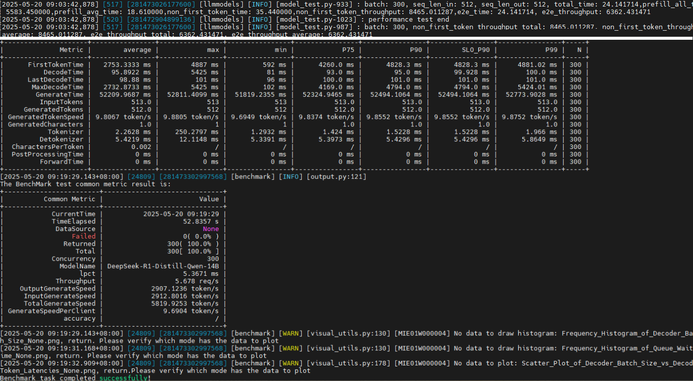

**解决方案**

1. 使用预检工具dump对比一下配置，如[图3](#ZH-CN_TOPIC_0000002504087096__fig2425144244017)所示，其中“ms_performance_prechecker_dump_20250520_152124.json”为MindIE 2.0.T3版本环境的落盘文件，“ms_performance_prechecker_dump_20250520_152138.json”为MindIE 2.0.RC1版本环境的落盘文件，除日志设置等不影响性能的环境变量外，没有看到明显的配置差异。

   **图3** 对比配置

   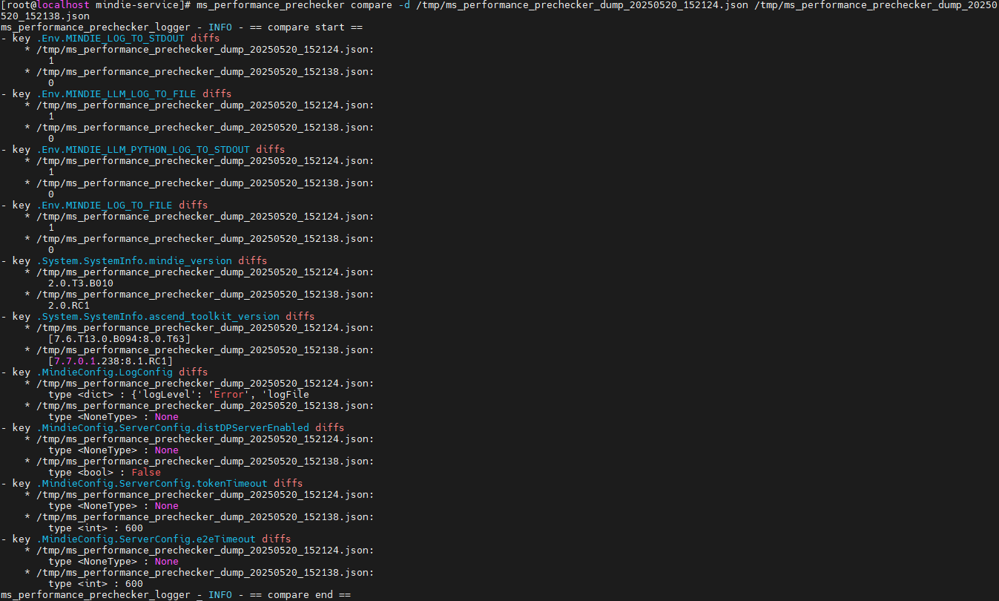

2. 采集MindIE 2.0.RC1的服务化性能数据进行对比，发现MindIE 2.0.RC1的Decode阶段forward之间的间隙过大，说明CPU侧的前后处理耗时长，如[图4](#ZH-CN_TOPIC_0000002504087096__fig8393010422)所示。

   **图4** 查看forward

   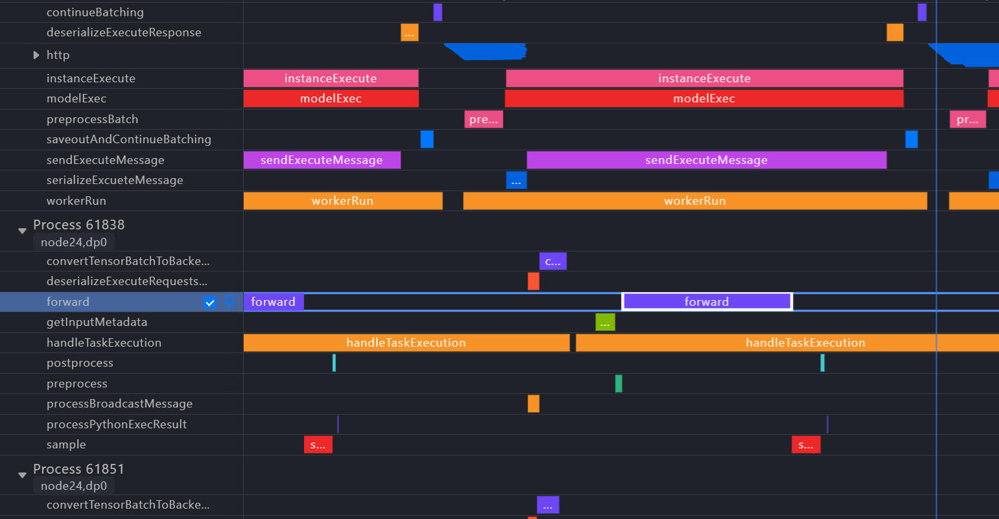

3. 开启异步调度，缩短forward间隙后，MindIE 2.0.RC1版本E2E输出吞吐2900->4500，较T3提升500token/s。异步调度的开启方式请参见《MindIE LLM开发指南》的异步调度章节。

   **图5** 开启异步调度

   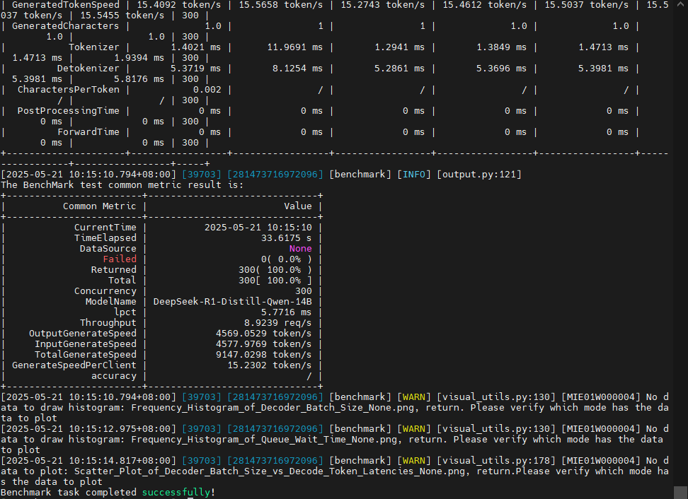

### 模型执行耗时优化案例

**问题现象**

DeepSeek PD分离大规模专家并行方案场景下，模型性能显著劣化。

**解决方案**

1. 使用msServiceProfiler采集D节点服务化性能数据。

2. 分析采集的性能数据，发现同一个D节点内的两台不同服务器，Decode阶段存在快慢卡现象。具体表现为来自两个服务器上的两张卡单个Decode执行时间分别为260ms和170ms，差距较大；一张卡的算子泳道出现很长的"MIX_AIC"字段，说明此时该卡在执行通算融合算子并且同步等待时间很长，可以认为此卡为快卡，另一张卡"MIX_AIC"较短，为慢卡。

   **图1** 快卡性能数据截图

   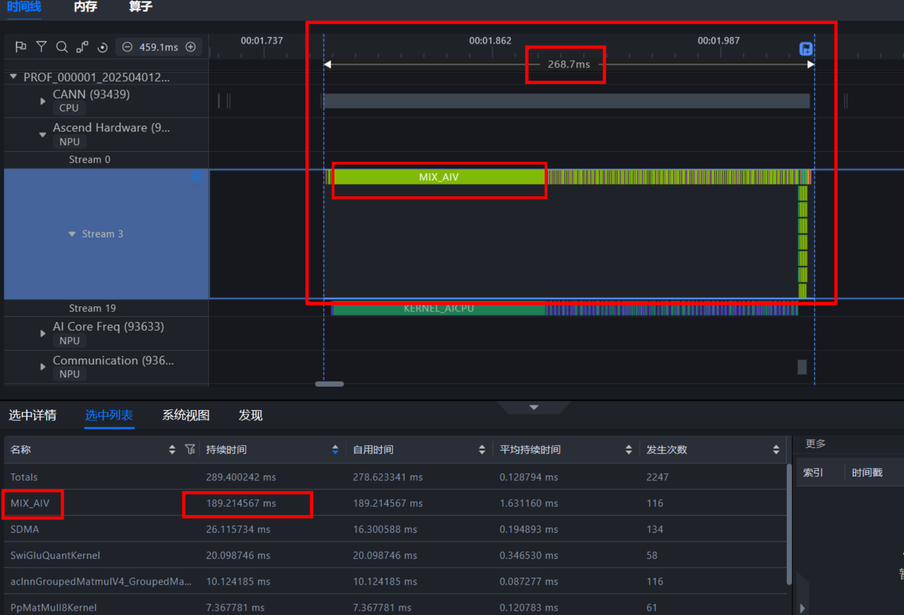

   **图2** 慢卡性能数据截图

   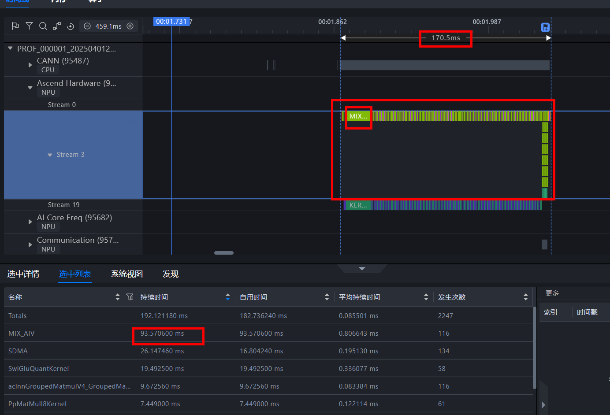

3. 从CANN CPU侧泳道（[图1](#ZH-CN_TOPIC_0000002535807061__fig193870541031)、[图2](#ZH-CN_TOPIC_0000002535807061__fig179374817410)中折叠为灰色）可以看出，每张卡启动任务的时间有差异，导致forward的第一个通算融合算子（moedispatch）时间不同，可以观察到90ms+的同步等待；去除第一个moedispatch后，剩余140ms左右的计算时间，两张卡算子性能接近——结合以上两点可以断定快慢卡是模型下发而非算子下发的时间差异导致的。

4. 通过在D节点开启分布式调度特性（使能环境变量MINDIE_ENABLE_DP_DISTRIBUTED，推理解决方案25.0.RC1之后的大规模专家并行方案已默认开启）后，性能恢复正常。

### 显存瓶颈分析案例

**问题现象**

DeepSeek双机服务化推理时，实际Batchsize无法达到192。

**分析**

1. 采集服务化性能数据。

2. 组到192 Batchsize时，随着Decode增加，Decode推理到185次时，可以看到KV Block即将用尽，剩余36（初始1747）；随后剩余的KV Block降低到0，Batchsize降为72，降低前最后的192 Batchsize推理到253长度。

   **图1** 查看数据

   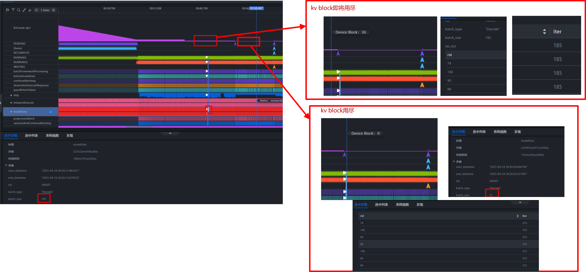

3. 从实际的执行来看，Batchsize=150的情况下，可以执行到Decode接近1000。

   **图2** 实际执行

   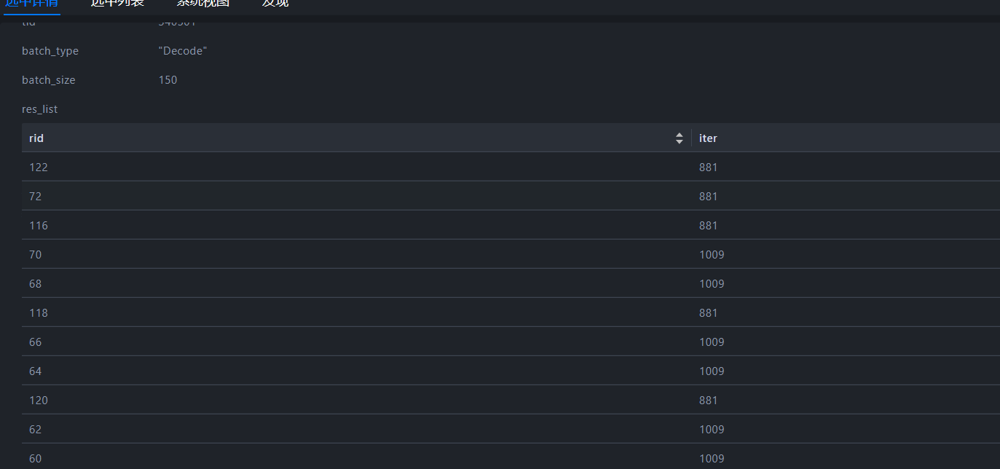

4. 估算显存瓶颈下的并发上限，Profiling显示可用的KV Cache block数量是1747，默认配置下每个Block大小是128个Token，根据1024输入2048输出的上下文要求，平均上下文为1536，KV Cache平均可容纳1747/[(1024+2048)/2/128]≈145。

   **图3** Block数量

   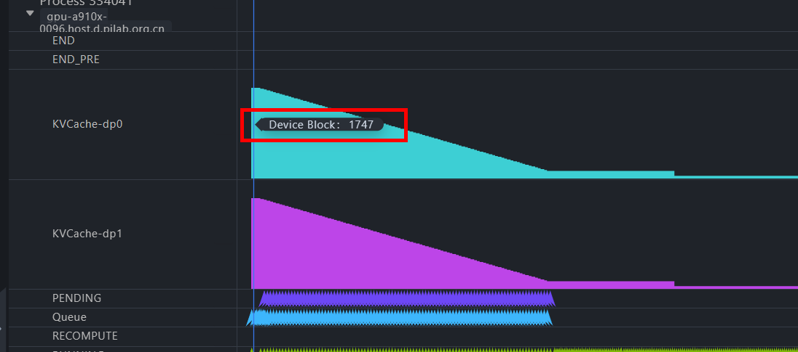

5. 调整服务化参数，export NPU_MEMORY_FRACTION=0.96，maxSeqLen降低到3K，达到最优效果。

### 服务化参数优化案例

**问题现象**

Qwen3-32B 单机4卡服务化部署，用户使用场景中并发较小且请求缓慢达到（最大并发40，实际使用情况接近请求速率9.4），PD混部的默认服务化配置下测试输入长度128输出长度100的性能，平均非首Token时延 48ms，但非首Token时延请求级别P99分位数（TPOT SLO P99）为157ms，导致个别请求流式输出卡顿，无法满足用户非首Token时延50ms的时延要求。

**解决方案**

1. 观察默认服务化配置下，性能测试的初步结果如[图1](#ZH-CN_TOPIC_0000002504087058__fig57131966516)所示，可以发现（1）默认的Prefill优先调度下，首Token时延远最大值也只有158ms，说明Prefill性能正常且未达到算力瓶颈（2）P75首Token时延小于50ms，说明大多数非首Token时延正常，说明实际Decode性能已符合预期（3）注意到非首Token的P90/P99/最大时延偏高，推测是因为请求缓慢达到，新请求的Prefill打断推理中请求的Decode，导致部分非首Token需等待新请求Prefill完成，非首Token时延激增。

   **图1** 性能测试初步结果

   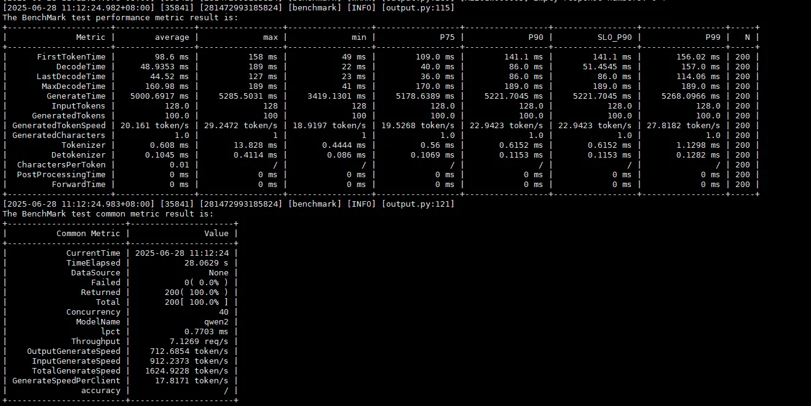

2. 在此场景下，可以开启SupportSelectBatch，通过设置prefillTimeMsPerReq和decodeTimeMsPerReq调整Prefill和Decode的优先级，使调度器允许在一定情况下Decode优先。此策略可以减少“新请求Prefill打断推理中请求的Decode“的情况，进而提高连续Decode的占比，降低非首Token时延，如[图2](#ZH-CN_TOPIC_0000002504087058__fig99048387485)所示；虽然此策略会导致部分请求Prefill等待，但此案例场景中模型Prefill性能已经足够好，即使首Token时延略有增加，仍可通过调整优先级参数，将首Token时延控制在用户可以接受的范围内。

   **图2** 非首Token时延劣化现象原理示意图

   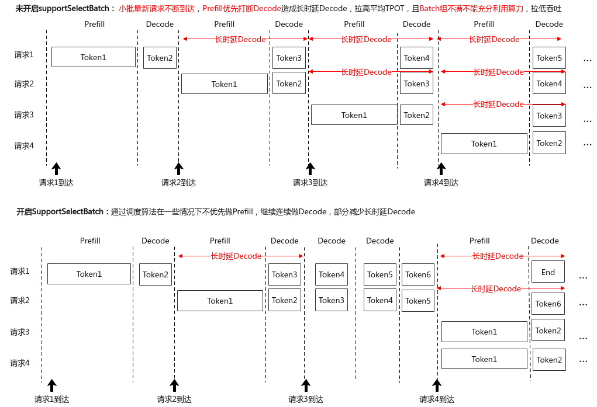

3. 调整优先级参数，prefillTimeMsPerReq越高，decodeTimeMsPerReq越低，则Decode优先级越高，反之则Prefill优先级越高；设置supportSelectBatch为true，prefillTimeMsPerReq为1000，decodeTimeMsPerReq为1，性能测试结果如[图3](#ZH-CN_TOPIC_0000002504087058__fig17560946184820)，此时首Token时延增加至1562ms，平均非首Token降低至31.7ms，P99非首Token时延降低至36ms，整体流式输出流畅，满足用户需求。

   **图3** 调优后性能测试结果

   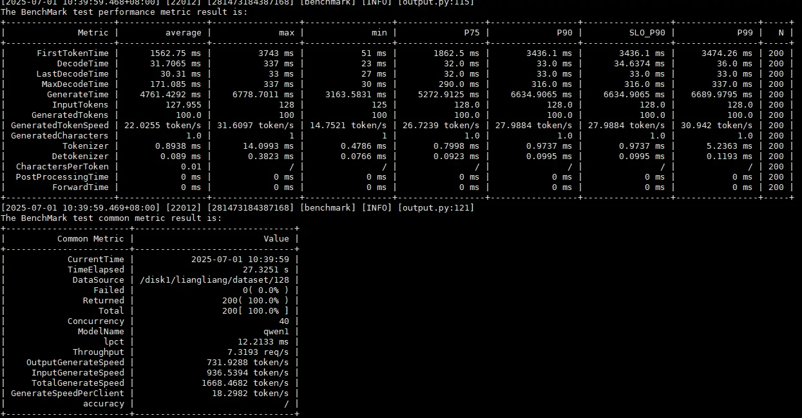

## DeepSeek进阶调优

进阶调优对于服务化和纯模型都有收益，暂不区分；部分进阶调优手段可能需要相关组件支撑。

#### 显存分析

优化达到瓶颈后，一个直观的方法是优化显存来使用更优的配置（例如并发数，并行策略等），可考虑采用量化来降低计算量和显存，目前适配最好方案为W8A8。

#### 并行策略调优

当前16卡推理场景，一般最优配置是TP=8，DP=2，MOE_TP=4，MOE_EP=4；但用户有不同的Host端（arm/x86），输入输出要求等，这会造成最优的并行策略发生变化，因此需要调整并行策略。

#### 通信策略优化

不同通信策略会产生的通信量不同，需要根据并行策略进行评估。

调优建议：

- Attention的TP尽量减小，增加DP，避免KV Cache复制，避免重复访问和存储。
- 纯DP通信可节省KV Cache，但模型权重需要占更多空间。
- 专家通信（EP）通过ATB-Models安装目录中配置文件config.json里的ep_level关键字配置，AlltoAll理论通信量会少一些。
- 通信可选择走LCCL或者HCCL，通常LCCL性能更优，但部分并行策略下适配可能有问题。

#### 其他优化方法

- 权重格式转换：权重转换为NZ格式，减少格式随路转换耗时。
- 总请求设置：由于Decode阶段性能存在爬坡（受限Request Rate，前期Batch较小，未达到瓶颈，Decode阶段的Batch在逐步提高），因此建议设置总请求数=并发数*10。
