# 通信问题优化方案

## 总体介绍

通信问题最直观的表现是，集群通信时间较长，通信时长占比远远大于计算，如[图1](#ZH-CN_TOPIC_0000002504087092__fig97371217617)所示；或者存在明显超长时间的通信算子，如[图2](#ZH-CN_TOPIC_0000002504087092__fig315152711916)所示，可以看到图中标注①与标注②是两个时间远大于计算流的reduceScatter算子。

**图1** 通信问题表现1：通信时长远大于计算时长

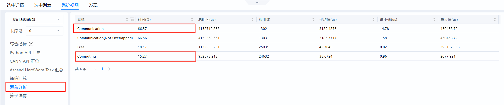

**图2** 通信问题典型表现2：存在明显超长时间的通信算子

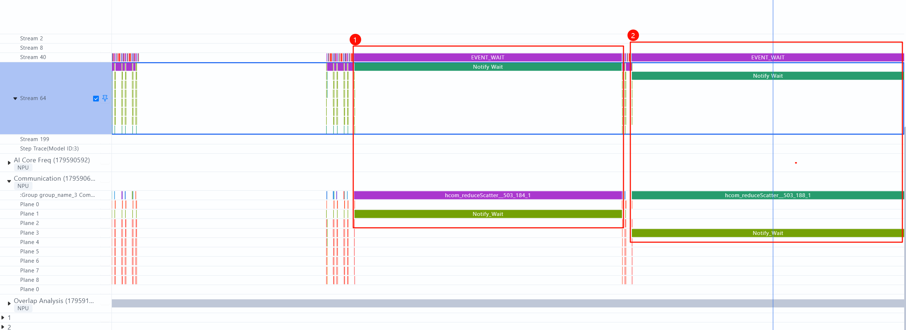

这里需要注意的是，某张卡的通信问题不一定是通信传输本身造成的，也可能是由于等待其它慢卡造成的，即快慢卡问题。

要排查某张卡的通信时长过长是通信传输本身的问题还是快慢卡问题，可通过如下方式：

- 按照[通信（Communication）](performance_tool_usage.md#通信（Communication）)介绍，进入MindStudio Insight的通信耗时分析页签，若该卡的**传输时间**占比较高，则可认为是通信传输本身存在问题；**同步时间**占比较高，则可认为是快慢卡问题。

  **图3** 通信时长分析

  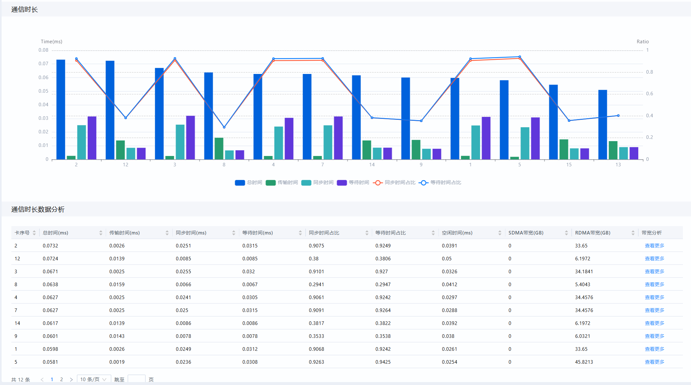

- 可通过[概览（Summary）](performance_tool_usage.md#概览（Summary）)页签对比多卡计算、通信、空闲时间，观察是否是快慢卡问题。以[图4](#ZH-CN_TOPIC_0000002504087092__fig1472719122113)为例，若观察到各卡的空闲时间和通信时间呈负相关（即空闲时间长的，通信时间短；空闲时间短的，通信时间长），则有较大概率可以判断，该集群存在下发性能波动导致的快慢卡问题。同理，也存在计算时间和通信时间呈负相关的计算快慢卡问题。

  **图4** 下发快慢卡问题

  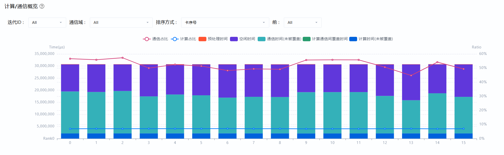

若确认为快慢卡问题，可参考[快慢卡问题定位方法](#快慢卡问题定位方法)进一步定位造成快慢卡差异的原因。

若确认不是快慢卡问题，则关注通信本身，可能原因包括[通信重传](#通信重传)、[通信小包](#通信小包)、[源地址与目的地址字节未对齐](#源地址与目的地址字节未对齐)、[计算通信带宽抢占](#计算通信带宽抢占)、[Profiling采集性能膨胀](#Profiling采集性能膨胀)等原因。

## 快慢卡问题定位方法

### 概述

快慢卡的快卡和慢卡是相对概念，快卡是在集群中首先完成计算任务的卡，慢卡是在集群任务中较慢完成计算任务的卡。在集群中往往需要完成集合通信，若不同卡完成任务的时间不同，则容易造成快卡等待慢卡完成计算的情况，从而使整个集群的性能劣化。

快慢卡是一种现象，背后的原因多种多样。通用的定位思路是，使用定点精确分析法，比对快卡和慢卡在MindStudio Insight时间线（Timeline）页签上的差异，确认具体原因。

形成慢卡的常见原因包括负载不均衡、计算性能波动、Host侧下发性能波动、数据加载性能波动等原因。

本节主要内容如下：

- [快慢卡定点精确分析法](#快慢卡定点精确分析法)：介绍了快慢卡分析的通用思路。
- [快慢卡定位Timeline操作案例](#快慢卡定位Timeline操作案例)：演示了如何利用MindStudio Insight的时间线（Timeline）页签定位快慢卡问题。
- [快慢卡定位算子比对操作案例](#快慢卡定位算子比对操作案例)：演示了如何利用算子比对功能定位计算快慢卡问题。
- [快慢卡案例补充](#快慢卡案例补充)：展示更多快慢卡典型案例。

### 快慢卡定点精确分析法

可以从MindStudio Insight时间线（Timeline）页签，快速定位快慢卡产生差异的根源。

**图1** 定点精确分析方法

#### 定位点

首先要找到产生快慢卡的问题点，进入通信页签的通信算子缩略图，迭代ID选择靠后的ID，并且首先观察差异最大的集合通信算子，从快慢卡影响最大的地方入手，右键跳转到对应的通信位置。以绿色算子为例，如[图2](#ZH-CN_TOPIC_0000002535807027__fig16785105671316)所示。

**图2** 定位点

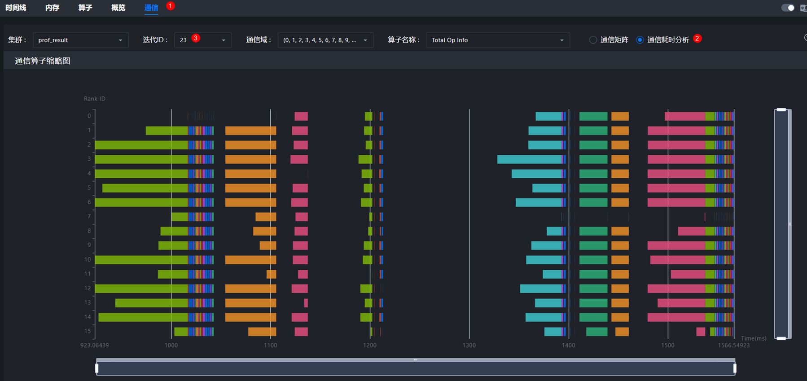

#### 定区间

1. 放大通信算子。找到需要对比的卡（找到耗时差距最大的卡，如0和3卡），如[图3](#ZH-CN_TOPIC_0000002535807027__fig1399855918136)所示。

   **图3** 定区间1

   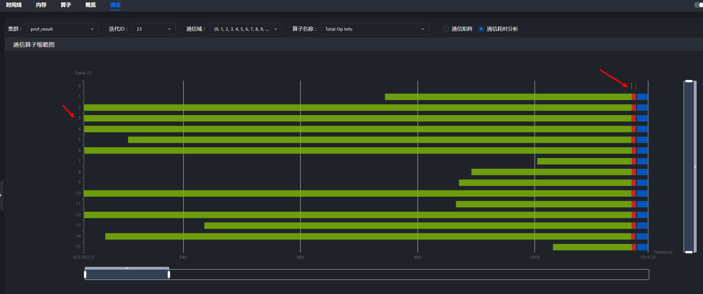

2. 在通信算子上单击鼠标右键，选择“跳转至时间线视图”，跳转到时间线（Timeline）的对应位置。建议在两张卡HCCL通信算子所对应Python侧下发API的开头做一个旗子标记。

   **图4** 定区间2

   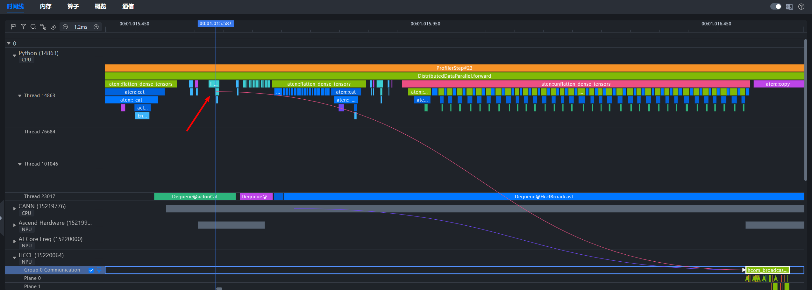

3. 找到开始产生快慢卡问题的地方（白线位置），作为对比区域的开始，以两张卡的旗子标记分别作为两张卡对比区间的结束，分别得到快卡区域和慢卡区域，如[图5](#ZH-CN_TOPIC_0000002535807027__fig11471433161010)所示。

   **图5** 查找产生快慢卡的地方

   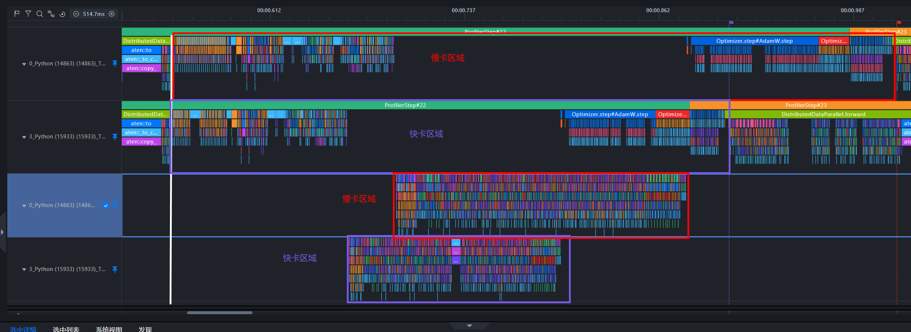

#### 找不同

分别在快卡区域和慢卡区域对比不同部分，从而进一步找到产生差异的具体原因。

以[图6](#ZH-CN_TOPIC_0000002535807027__fig15176410142)为例，造成快慢卡的地方主要有三块，分别是1和4、2和5以及3和6区域。

**图6** 示例图

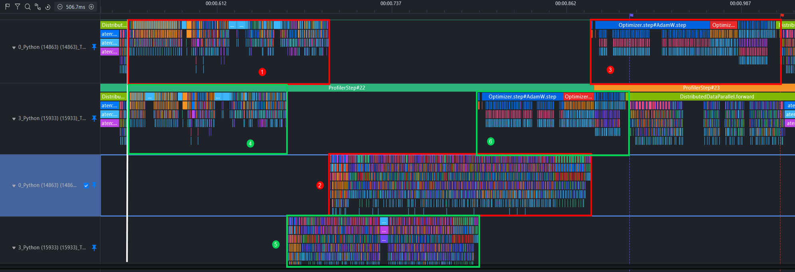

至此已经定位到快慢卡的问题点，下一步就需要根据算子和代码定位快慢卡的根因。

### 快慢卡定位Timeline操作案例

本节介绍利用MindStudio Insight进一步定位快慢卡问题的具体操作案例。

若我们通过[概览（Summary）](performance_tool_usage.md#概览（Summary）)已经初步锁定了集群中存在快慢卡不同步问题，并且通过[通信（Communication）](performance_tool_usage.md#通信（Communication）)确认，集群通信时间里，传输时间占比低，等待或同步时间占比高，则确认当前集群存在“快慢卡问题”，需查看“通信耗时分析”。通过通信算子横向平铺，确认慢卡具体慢在哪里。

如[图1](#ZH-CN_TOPIC_0000002504087044__fig145361328205714)所示，其中针对绿色的hcom allGather集合通信算子，时长较短的4卡、5卡、13卡为慢卡，而时长较长的卡（例如11卡、14卡等）为相对的快卡。

下一步定位目标为：分析慢卡在空白时间做什么？需前往时间线（Timeline）模块，查看具体差异点。

**图1** 通信算子平铺图

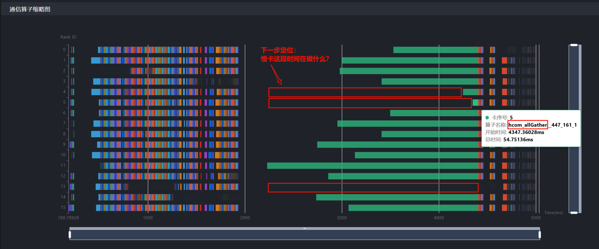

1. 选择通信算子，单击鼠标右键，选择“跳转至时间线视图”，由通信算子跳转至时间线视图，用旗帜标记大致范围，方便后续定位。

   **图2** 由通信算子跳转至时间线视图

   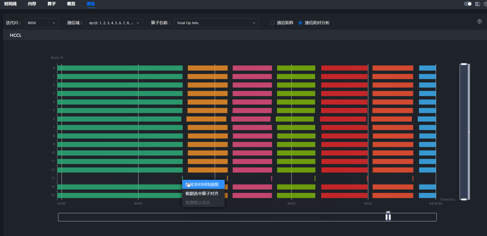

   **图3** 用旗帜标记大致范围

   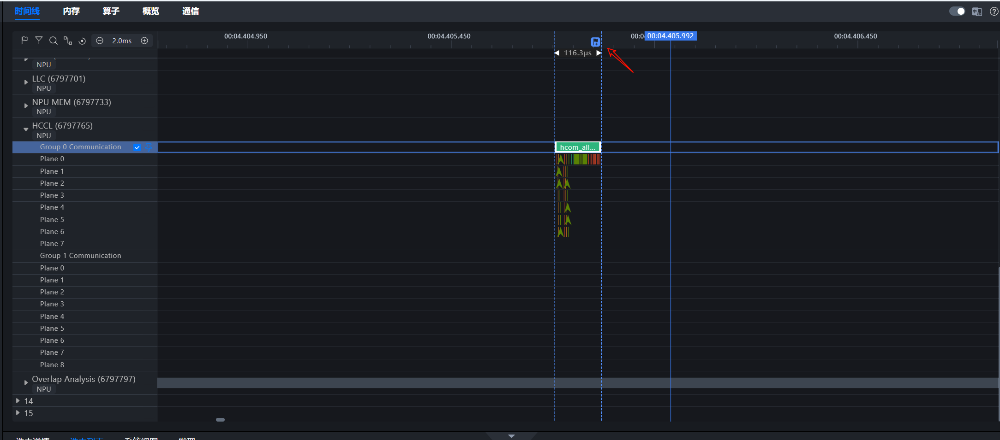

2. 选择一个Step（按Step整屏显示），置顶对比慢卡（13卡）与快卡（14卡）的Overlap Analysis泳道，确认差异来源（Overlap Analysis泳道将Ascend Hardware层计算、通信任务统一投影，比对更清晰）。

   **图4** 将研究区域限定在一个Step内（按Step整屏显示）

   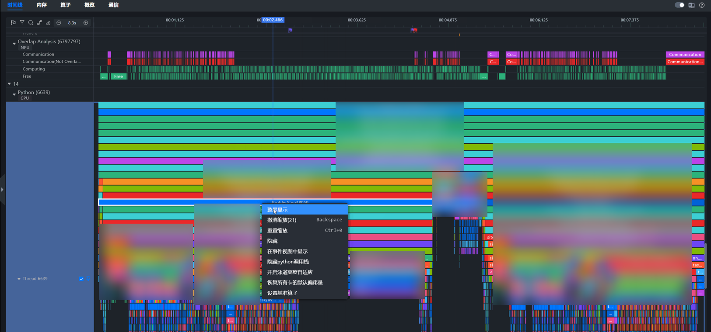

   **图5** 置顶对比慢卡（13卡）与快卡（14卡）的覆盖分析泳道，确认差异来源

   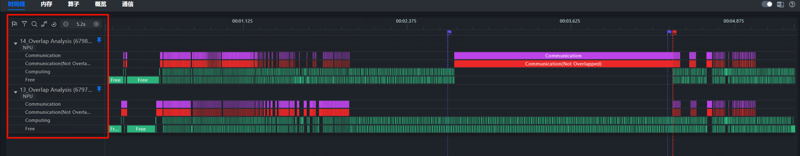

3. 框选统计可以看到，慢卡泳道计算任务次数明显多于快卡。

   **图6** 框选统计

   

   差异主要来源于后半段，说明是负载不均导致了快慢卡问题。

   **图7** 算子数差异对比

   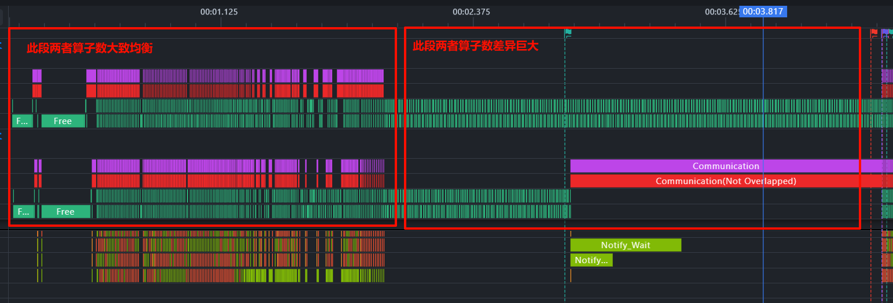

4. 根据async_npu下发连线，确认多出的算子由哪个Python API下发（锁定框选区域，可按照锁定区域展示连线，而不展示全量连线）。

   **图8** async_npu下发连线

   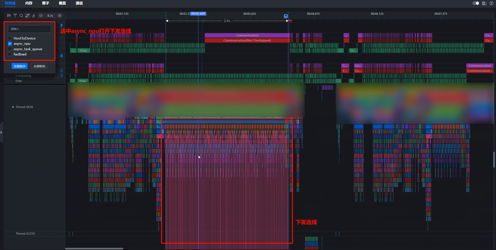

   对Ascend Hardware层框选统计得出，同样的Python侧某API，快卡下发1218个计算算子，慢卡下发3303个计算算子，所以是由于该Python侧某API负载不均导致快慢卡。

5. 和模型开发人员确认，该负载不均能否规避。

### 快慢卡定位算子比对操作案例

若在MindStudio Insight的概览界面发现集群的快慢卡是计算时间波动导致的，除了使用[快慢卡定点精确分析法](#快慢卡定点精确分析法)中提到的定点精确分析法以外，还可以尝试比对快慢卡算子耗时，快速锁定差异来源。

#### 从概览页确定快慢卡

在MindStudio Insight的概览界面查看计算/通信概览区域，可以看到，0-7卡为计算慢卡（计算时间长，通信时间短），8-15卡为计算快卡（计算时间短，通信时间长）后者通信时间长是等待前者所导致的。

**图1** 计算快慢卡概览页

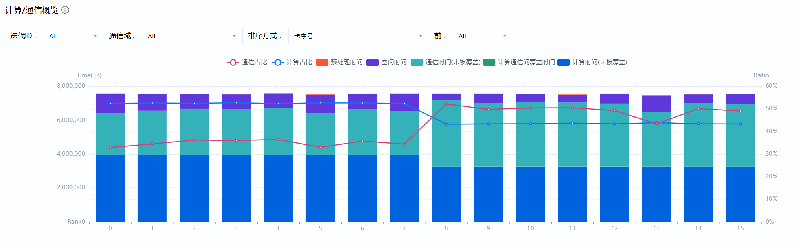

#### 对比算子差异

按照[算子（Operator）](performance_tool_usage.md#算子（Operator）)中描述，可以快速锁定造成耗时差异的算子，如[图2](#ZH-CN_TOPIC_0000002503927274__fig146751313103511)所示，首先设置7、8两卡进入卡间比对模式，随后按总耗时升序排列。若快慢卡存在较大算子数量差异，说明存在计算负载任务不均衡的问题，可与模型开发人员确认，该负载不均能否规避；若某类算子数量一致，但平均耗时存在差异，可求助相关算子开发负责人，或者结合[快慢卡定点精确分析法](#快慢卡定点精确分析法)中方法，通过时间线（Timeline）进一步确认问题根因。

**图2** 算子卡间比对

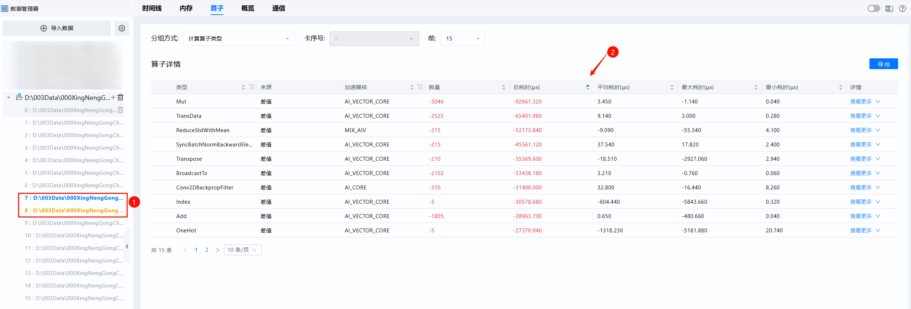

同理，也可使用[模型调优快速分析（msprof-analyze命令行工具）](performance_tool_usage.md#模型调优快速分析（msprof-analyze命令行工具）)工具中的compare工具，进入KernelCompare比对页，分析算子差异。

**图3** compare性能拆解比对工具KernelCompare比对页

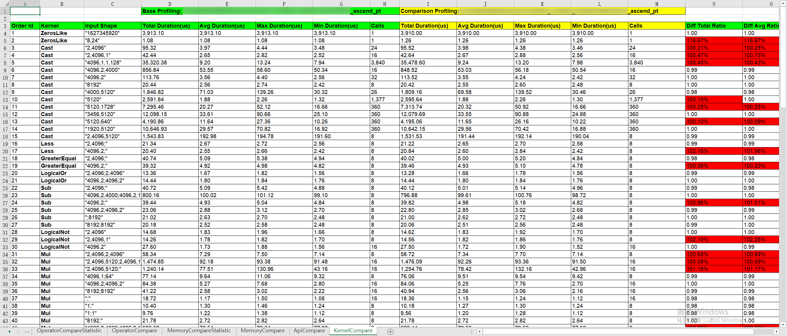

### 快慢卡案例补充

#### 案例一：集群保存checkpoint后性能持续劣化

**问题描述**

4机64卡，保存checkpoint后性能持续劣化。

**问题分析**

首先，如[图1](#ZH-CN_TOPIC_0000002503927272__fig175962111612)所示，利用[模型调优快速分析（msprof-analyze命令行工具）](https://www.hiascend.com/document/detail/zh/mindstudio/830/practicalcases/GeneralPerformanceIssue/toolsample6_014.html)中的msprof-analyze工具进行集群分析后，发现communication time和free time卡间波动趋势呈负相关（即同一张Rank中，communication耗时长的Free耗时短，communication耗时短的Free耗时长），推测出Free Time时间最短的0卡最先结束，等待其他卡，为快卡；Free Time时间最长的1卡最后结束，为慢卡。即此案例为Host侧下发性能波动导致的快慢卡问题。

**图1** cluster_step_trace_time.csv交付件

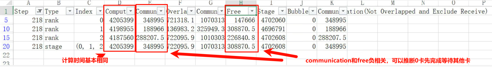

进入时间线（Timeline）视图，如[图2](#ZH-CN_TOPIC_0000002503927272__fig16619142217167)与[图3](#ZH-CN_TOPIC_0000002503927272__fig969067145819)所示，发现0卡通信等待发生在反向传播后的梯度汇总阶段。对比快慢卡时间线（Timeline）的相近位置，发现慢卡Rank1的Step末尾存在异常空洞，在此阶段卡顿，导致了快卡Rank0的等待。

**图2** Timeline视图（Rank0）

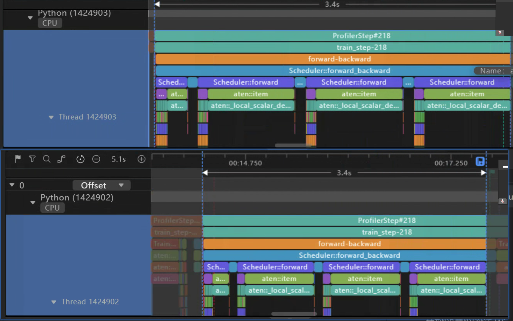

**图3** Timeline视图（Rank1）

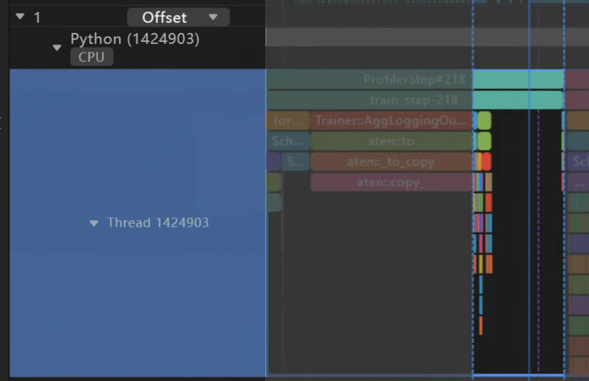

**定位完成**

该问题最终定位原因是代码在慢卡Step末尾存在未释放内存，手动清空后问题消失。

#### 案例二：集群AllReduce通信算子等待时间过长

**问题描述**

256p集群allreduce通信算子等待时间长，线性度不达标。

**问题分析**

问题直接表现是dp通信域存在耗时较长notify wait，如[图1](#ZH-CN_TOPIC_0000002535807039__fig9295127131610)所示。

**图1** dp通信域timeline分析

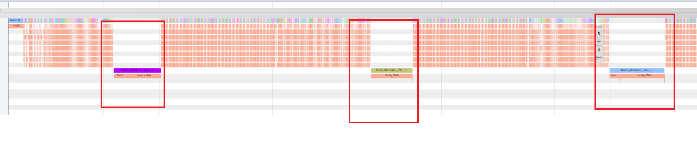

在通信界面找到此通信域，可以看到存在一个很长的notify wait，Elapse Time（通信总时间）差距巨大，最快卡和最慢卡差距200ms+。

**图2** 通信时长分析

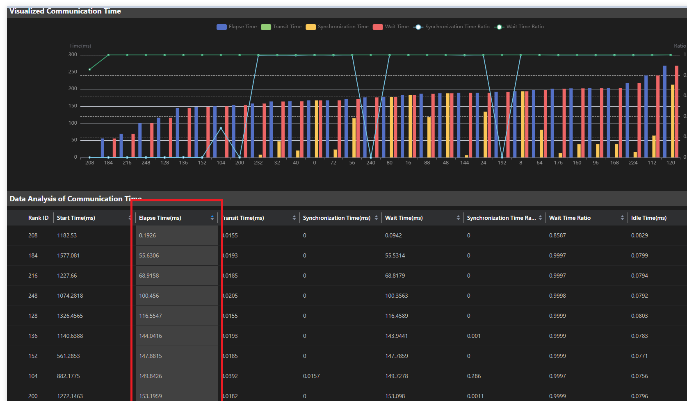

如[图3](#ZH-CN_TOPIC_0000002535807039__fig1010153111614)所示，同时打开快卡0卡和慢卡208卡的时间线（Timeline）界面，发现慢卡208主要是慢在tp通信上。慢卡208卡在一次micro的计算中tp域通信耗时494ms，快卡0卡tp域通信耗时340ms，差距较大。快慢卡的tp域通信传输速度基本一致，主要还是等待时间造成的差距。

**图3** 快卡0卡和慢卡208卡的Timeline界面

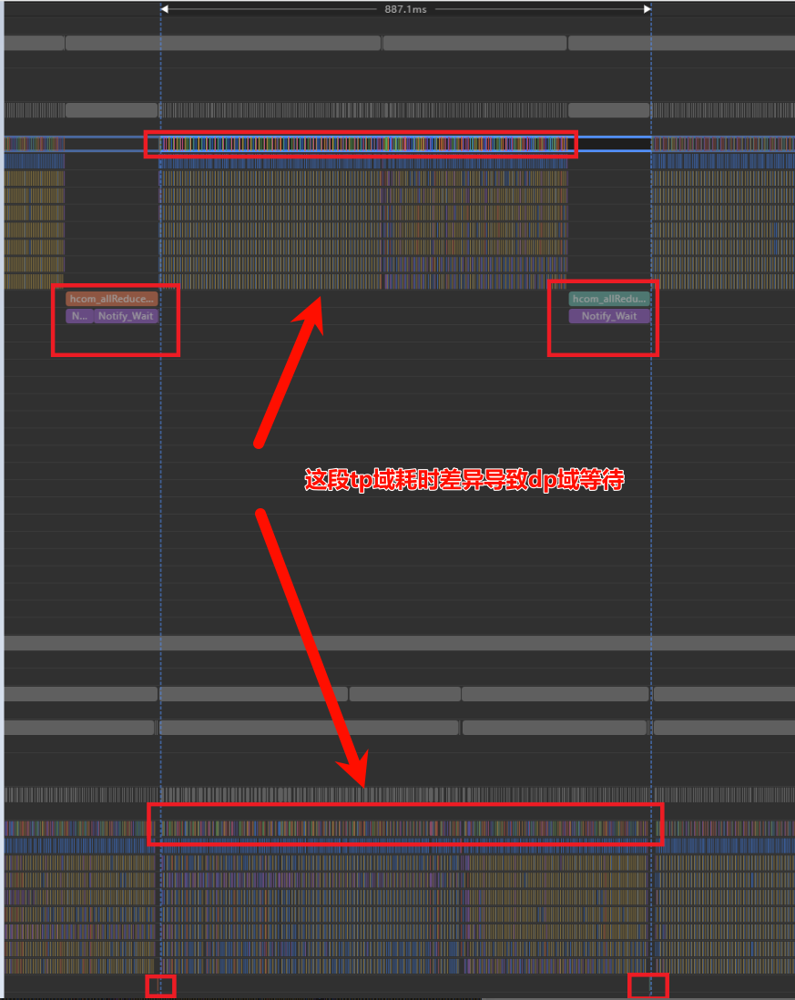

进一步观察和208卡同一个tp域的各卡，发现其中214卡是拖累整个tp域的慢卡。即214卡从tp域拖累了208卡，而208卡沿着dp域进一步拖累了0卡，214卡为其中真正的根因慢卡。如[图4](#ZH-CN_TOPIC_0000002535807039__fig43241642201912)所示，对比208卡和214卡的时间线（Timeline），可以看到214卡存在Host下发较慢的问题。

**图4** 208卡和214卡的Timeline

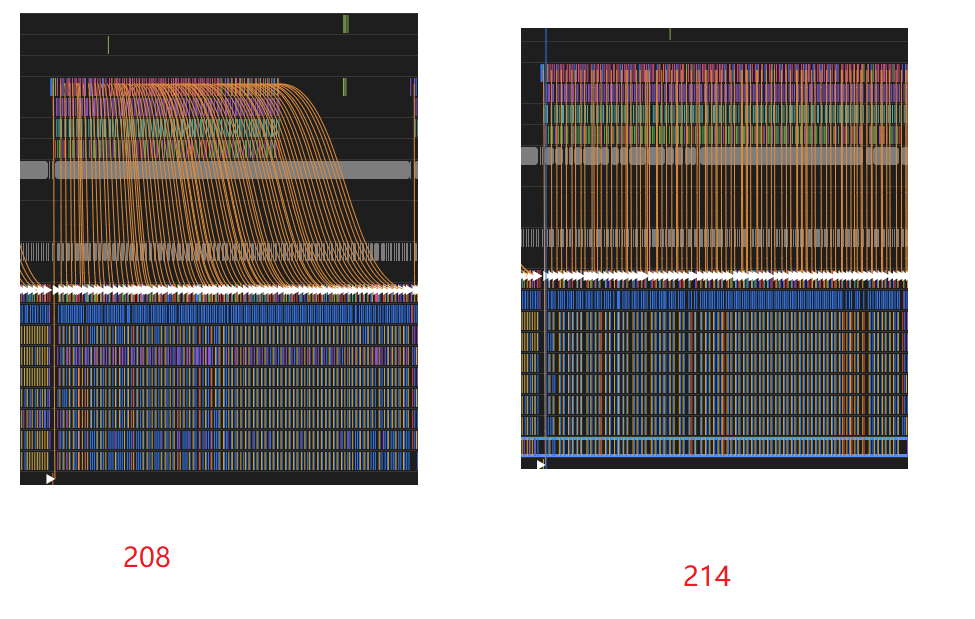

如[图5](#ZH-CN_TOPIC_0000002535807039__fig1646164615811)所示，通过时间线（Timeline）的框选统计功能，对比208卡与214卡的负责下发的CANN侧接口，可以看到214卡的CANN侧接口耗时明显高于208卡。

**图5** 208卡与214卡CANN侧接口框选统计

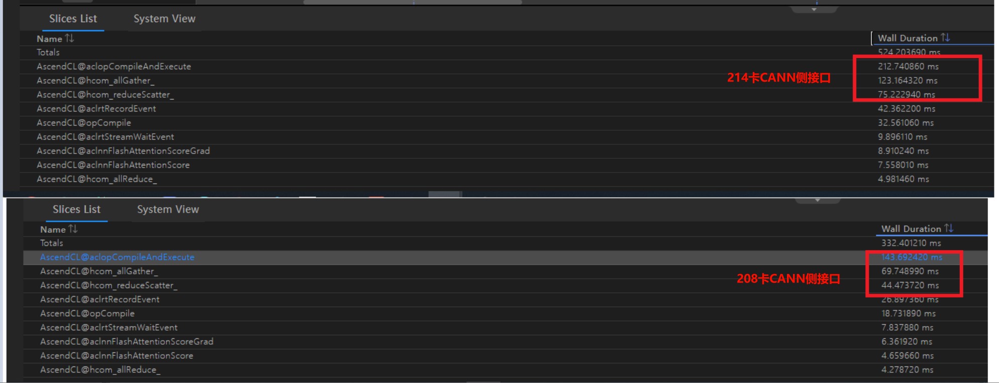

**定位完成**

通过快慢卡时间线（Timeline）定点比对分析，可以初步确认快慢卡差异是慢卡（214卡）的Host侧下发瓶颈导致的。进一步解决Host侧下发瓶颈，可参考[Host Bound问题定位及解决方法](solution_to_top3.md#Host Bound问题定位及解决方法)中内容。

## 通信重传

### 基于集群数据分析是否出现通信重传

在分布式训练中，如果发现某个通信算子耗时超过4秒（通信重传的典型阈值），在排除快慢卡问题的可能性后，可以怀疑是发生了数据包重传。仅凭单张卡的性能数据，很难直接区分这两种情况，可通过MindStudio Insight进一步排查。

通常通信重传多出现在集群间的性能抖动问题中，可以通过MindStudio Insight对比正常和异常Step的Profiling数据确认。

1. 在MindStudio Insight集群结果概览页，可以看到不同Step的耗时分布，如[图1](#ZH-CN_TOPIC_0000002504087090__fig13354164218130)所示。

   **图1** MindStudio Insight集群概览页

   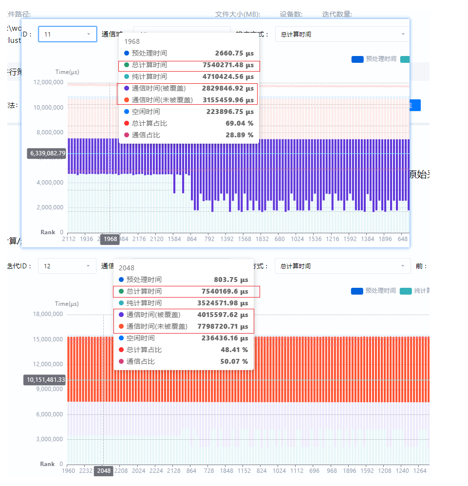

2. 对比两个Step的概览结果，可以发现各卡间的计算时间和空闲时间比较接近，说明没有明显的快慢卡问题，差异点主要体现在通信耗时（通信时间（被覆盖）+ 通信时间（未被覆盖））上。

3. 同时同步对比所有卡，发现Step11和Step12每一张卡的通信耗时差距都在4.7s左右。

4. 如[图2](#ZH-CN_TOPIC_0000002504087090__fig1049254151413)所示，观察320卡的时间线（Timeline）结果，算子为LinearWithGradAccumulationAndAsyncCommunication，该算子为用于同步的通信算子，后续任务下发时（AscendCL@aclnnTopK）被阻塞。

   **图2** Rank320的Timeline

   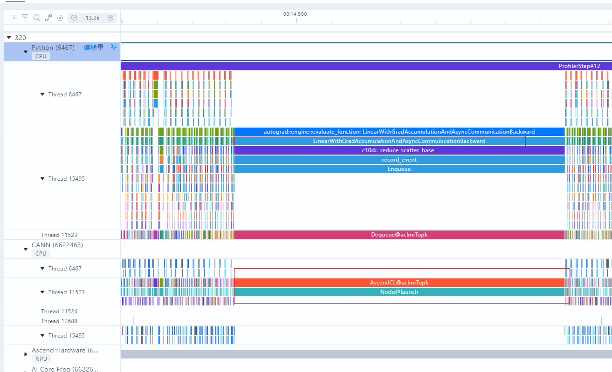

   结合各项数据分析，NPU（计算）和CPU（调度）均正常，各卡间通信时间的差异来源于点对点通信异常超时，大概率为网络异常导致的通信重传。

5. 发现通信重传问题后，建议排查交换机网络是否正常配置，例如，是否未添加PFC控制机制，导致PFC拥塞，进而导致通信重传。

### 通信重传典型案例

**问题描述**

LLaMA3-70B模型从4机迁移至32机集群时，发生线性度劣化。

**问题分析**

如[图1](#ZH-CN_TOPIC_0000002535807041__fig1423422518177)所示，利用[模型调优快速分析（msprof-analyze命令行工具）](performance_tool_usage.md#模型调优快速分析（msprof-analyze命令行工具）)分别对正常4机集群与异常32机集群进行分析，对比两者结果发现，耗时差异主要在通信上，32机集群整体通信耗时更长。

**图1** cluster_step_trace_time.csv交付件，正常4机与异常32机对比

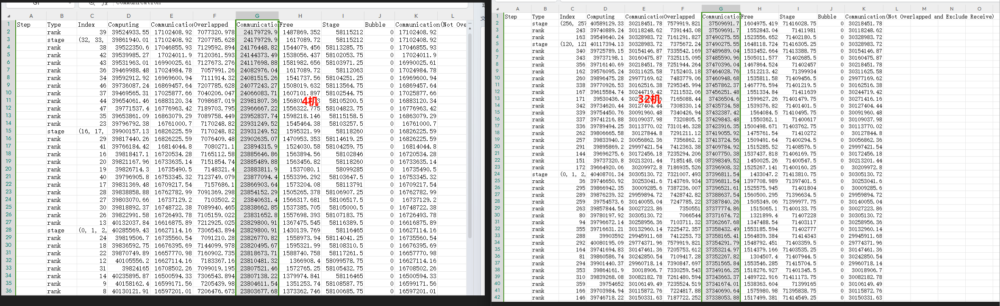

以0卡为例，对比正常集群与异常集群的0卡，发现问题出现在迭代末尾的allReduce和broadcast算子上，如[图2](#ZH-CN_TOPIC_0000002535807041__fig636142716175)所示。

**图2** 异常集群0卡Timeline

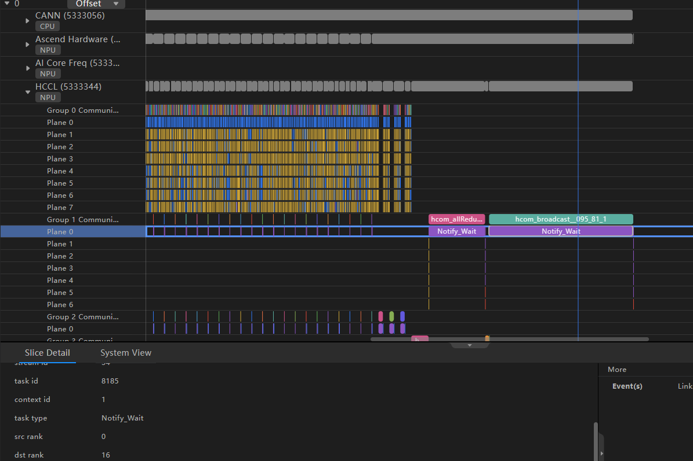

根据通信算子选中详情的dst rank（目标卡，在notify wait通信事件中一般代表被等待的慢卡）不断跳转，发现是440卡拖累了同一tp通信域内的其它卡，如[图3](#ZH-CN_TOPIC_0000002535807041__fig2023542961715)所示。

**图3** 异常集群440卡Timeline

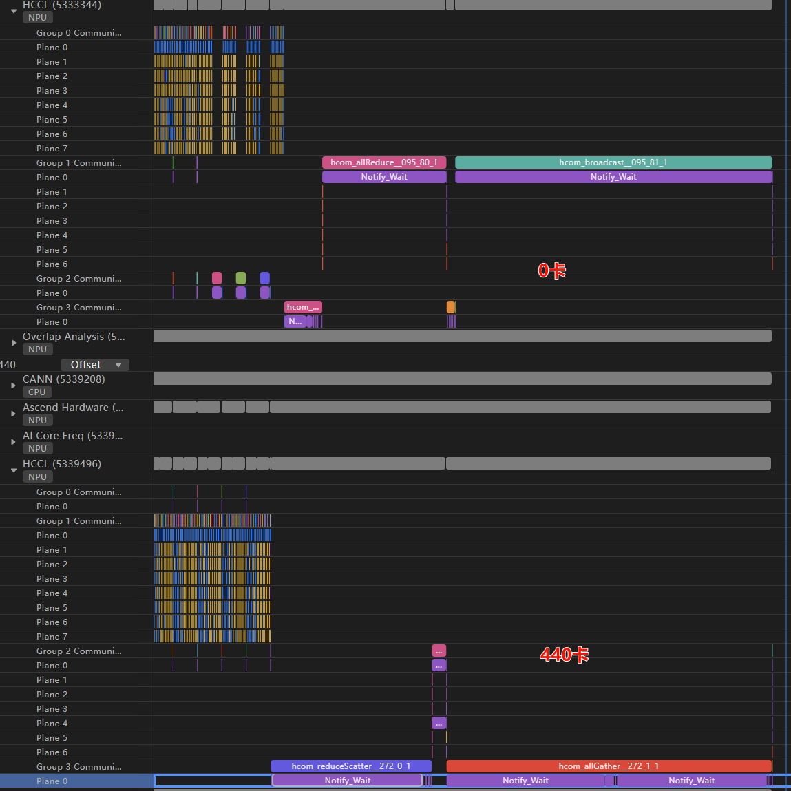

进入通信（Communication）页签，选择通信耗时分析，找到对应通信域。按等待时间（Wait Time）升序排列，找到该通信域内等待时间较短、传输时间较长的卡。如[图4](#ZH-CN_TOPIC_0000002535807041__fig1634973181714)所示。

**图4** 通信（Communication）页签 > 通信耗时分析

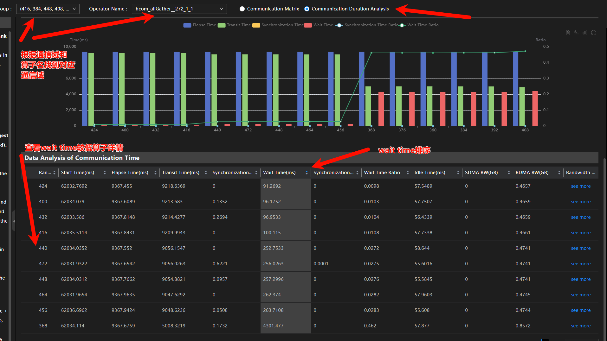

进一步查看传输时间较长卡的带宽分析，发现存在大量带宽极低的RDMA通信包，如[图5](#ZH-CN_TOPIC_0000002535807041__fig12279203317179)所示。怀疑存在网络传输问题，需要排查网络配置。

**图5** 带宽分析

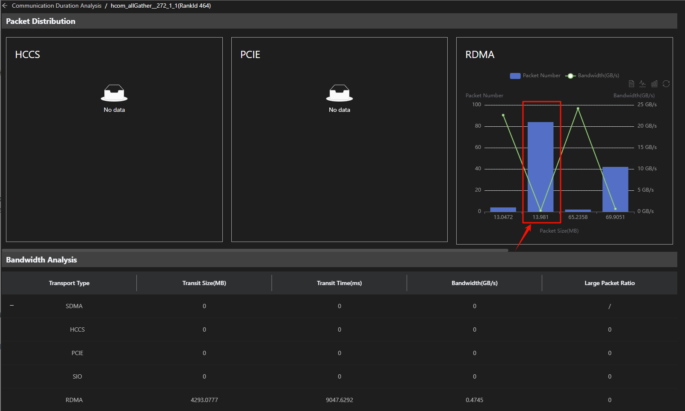

**问题解决**

排查网络配置后发现，交换机和计算节点服务器之间的流量走在了无PFC拥塞控制的队列上，导致相应队列上网络出现大量报文丢包，从而导致RDMA数据网络报文重传，正确配置相关环境变量后，该问题解决。

## 通信小包

### 案例：ZeRO3模式导致通信小包

**问题描述**

同一模型从NPU迁移至GPU，性能不达标。

**问题分析**

使用[模型调优快速分析（msprof-analyze命令行工具）](performance_tool_usage.md#模型调优快速分析（msprof-analyze命令行工具）)中的compare性能比对工具，对比基线GPU和迁移后的NPU的数据，发现通信未掩盖时间存在较大差距，如[图1](#ZH-CN_TOPIC_0000002535887091__fig18477143015137)所示。

**图1** compare对比GPU与NPU

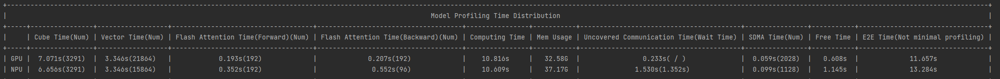

对比基线GPU与迁移后NPU的时间线（Timeline），发现差异主要来源于Step结尾的allGather通信部分，NPU耗时100ms左右，GPU耗时仅4ms左右，如[图2](#ZH-CN_TOPIC_0000002535887091__fig311914449169)所示。

**图2** GPU与NPU的Timeline对比

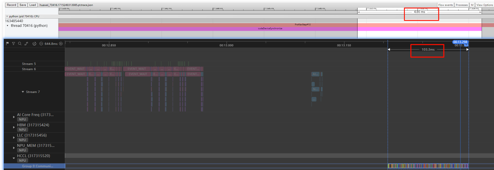

NPU这部分通信算子带宽仅0.2GB/s，观察到存在大量allGather通信算子，传输数据量仅256byte，通信建链占据大部分耗时，如[图3](#ZH-CN_TOPIC_0000002535887091__fig38716463229)所示。这部分算子主要在进行ZeRO3操作。

**图3** allGather通信小包算子

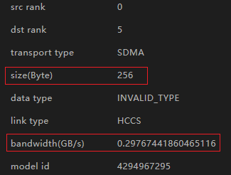

ZeRO（Zero Redundancy Optimizer，零冗余优化器）模式是一种节省内存的方法，ZeRO模式会带来通信策略的变化。ZeRO的主要原理是将优化器状态、梯度、权重等数据进行切分，在需要使用时再通过集合通信进行同步，来减少显存的使用峰值，是一种典型的时间换空间的办法。

**问题解决**

将ZeRO3算法修改为ZeRO2算法，即不再对模型权重进行切分，虽然会增加显存占用，但是减少了设备间的通信开销。替换为ZeRO2后，总体性能提升2.7%。

## 源地址与目的地址字节未对齐

字节未对齐，指的是在集群进行通信时，如果源地址或目的地址没有按照特定的字节对齐（例如512字节对齐），会导致传输带宽显著下降，进而影响通信性能。这种未对齐问题常见于SDMA传输（即节点内传输），多出现于ZeRO算法中。解决方法通常包括对数据进行适当的填充（padding），以确保地址对齐，从而优化通信性能。

**问题描述**

单机八卡性能低于预期。通过MindStudio Insight的通信矩阵分析，发现平均带宽很低，只有1-2GB/s，远低于经验值，如[图1](#ZH-CN_TOPIC_0000002504087072__fig5563919151714)所示。

**图1** 集群通信矩阵分析

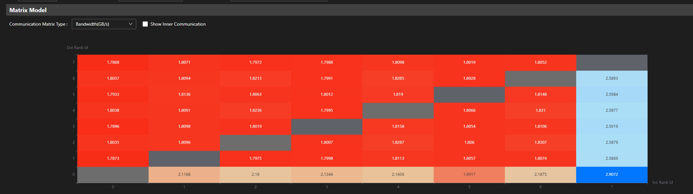

**问题分析**

进一步定位具体算子，发现是一个allGather算子带宽特别低，耗时300+ms，带宽只有0.1GB/，如[图2](#ZH-CN_TOPIC_0000002504087072__fig18242421111714)所示。

**图2** allGather算子Timeline选中详情

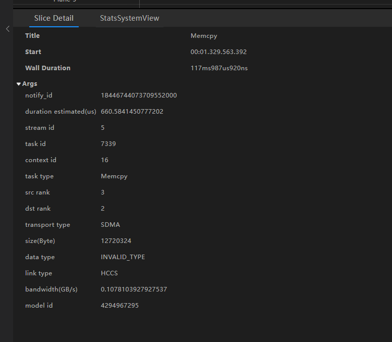

经HCCL专家分析，是DP通信域的allGather通信算子源地址与目标地址无法对齐，导致通信性能劣化严重。

**问题解决**

针对DP通信域的allGather入桶做字节对齐的padding，对齐字节。当前AscendSpeed已适配针对DP通信域的allGather入桶做了字节对齐的padding，DeepSpeed和Megatron还未修改，需要去DeepSpeed源码里改nccl_start_alignment_factor，如[图3](#ZH-CN_TOPIC_0000002504087072__fig1128582301711)所示，修改后，allgather耗时从350ms变成了50ms。

**图3** 修改nccl_start_alignment_factor令字节对齐

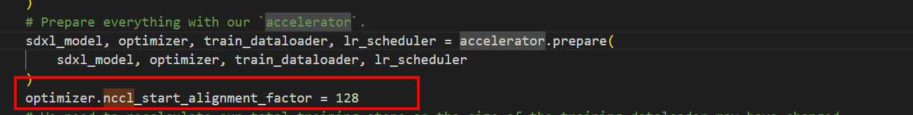

## 计算通信带宽抢占

MatMul、FA等算子属于访存密集型算子，容易发生mte bound。此类算子与通信算子并行时，如[图1](#ZH-CN_TOPIC_0000002504087110__fig10255174541713)所示，会发生计算通信对于内存带宽的抢占，导致通信传输带宽低于经验值（可能会下降1~2倍左右，但不会特别低），如[图2](#ZH-CN_TOPIC_0000002504087110__fig13417943141714)所示。

**解决方法**：若计算通信并行导致的带宽抢占现象较为严重，可以比较通算并行与未并行的性能数据，评估带宽抢占的影响是否超过了通算并行的收益，选择性能更优的方式。

**图1** Matmul算子与allGather通信算子并行

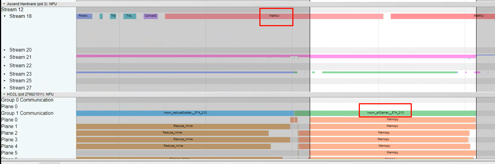

**图2** allGather算子发生计算通信带宽抢占

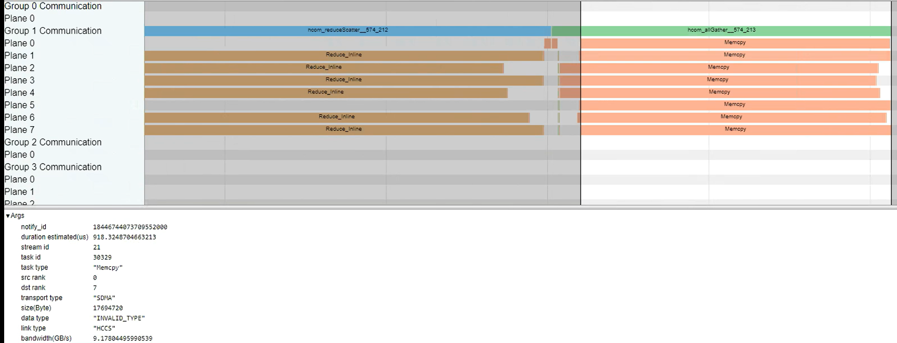

## Profiling采集性能膨胀

在按照[模型调优性能采集工具](performance_tool_usage.md#模型调优性能采集工具)采集Profiling数据的过程中，若开启了较高的采集等级，或者配置了较多采集项，性能数据采集打点时，可能会对Host侧造成较大压力，导致采集的性能数据膨胀失真。Profiling采集级别设置为Level2时，会造成通信调度膨胀，具体可能表现为，通信算子Host侧下发被阻塞，出现大段Free时长。

**解决方法**：适当降低采集等级，建议非必要不开启Level2。若一定要开启，需结合Level1数据对比分析，以排除性能膨胀对数据的干扰。

