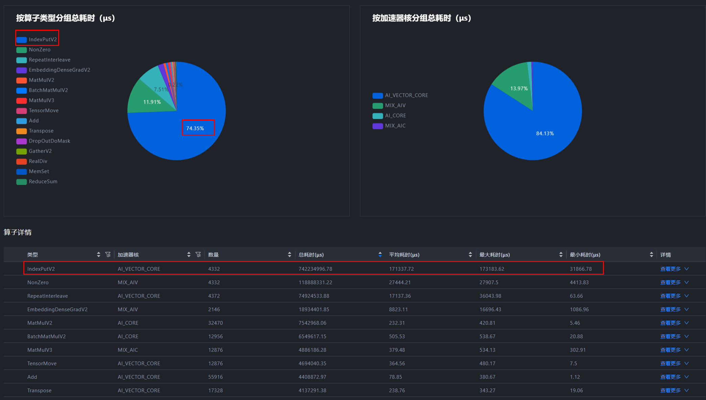
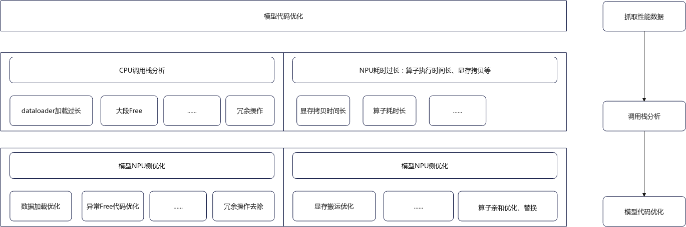
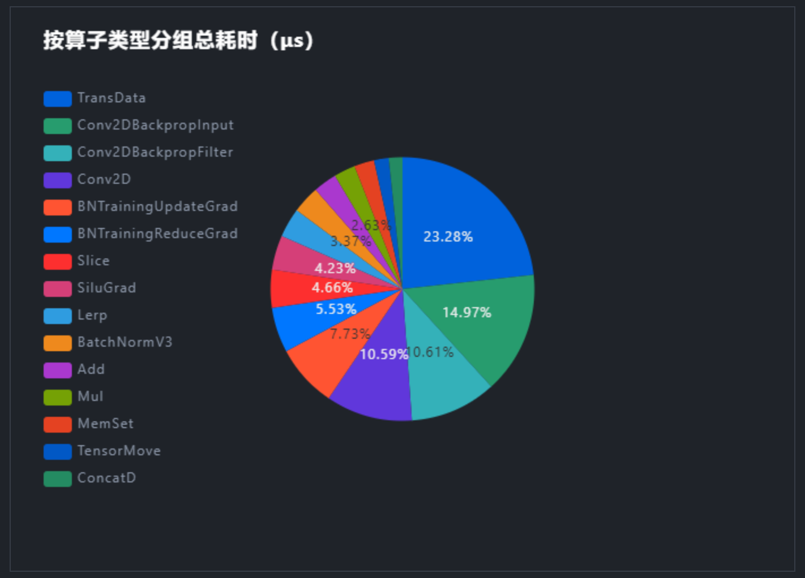
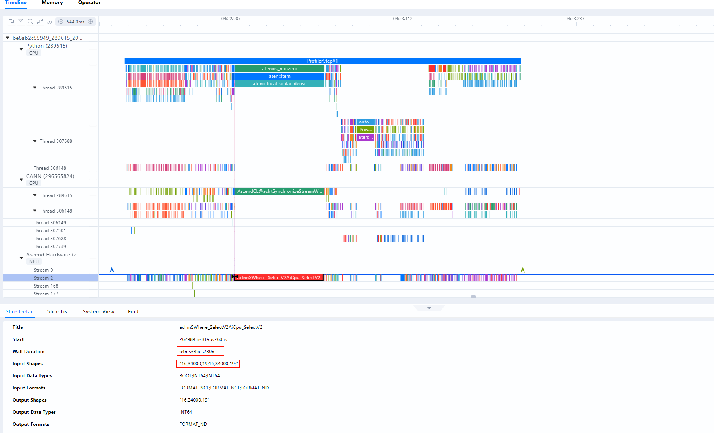

# 算子性能问题优化方案

## 算子性能问题定位方法

算子性能问题是深度学习模型中的一个关键挑战，具体表现为部分基础计算单元的执行效率低下，从而影响整个模型的运行速度并造成资源浪费。这类问题需要借助专门的分析工具和代码优化技术来解决。例如，在评估融合算子性能时，可以通过对比不同配置下的计算时间、内存使用量等指标来进行综合判断。

**图1** 算子性能问题定位

**表1** 算子性能问题定位方法

| 分析方式             | 分析目的                                                     | 处理思路                                                     |
| -------------------- | ------------------------------------------------------------ | ------------------------------------------------------------ |
| advisor分析          | AI CPU算子耗时占比问题。 降低AI CPU算子耗时。             | AI CPU算子首先基于算子名在时间线（Timeline）中定位算子位置，接着基于调用栈找到代码中的位置，然后尝试相同逻辑替换，如果无法替换，可记录算子shape、type等信息并联系算子负责人，确认是否支持该case。 |
| advisor分析          | 算子编译问题                                                 | 可尝试在Python训练开始前添加如下代码，指定二进制模式。如果无效则记录算子shape、type等信息并联系算子负责人，确认是否支持该case。 `torch_npu.npu.set_compile_mode(jit_compile=False)  torch_npu.npu.config.allow_internal_format = False` |
| 单算子分析           | vector算子分析                                               | vector算子优化方法是通过修改代码逻辑进行消减，优化逻辑如下： &#8226; 算子亲和优化：具体请参见[亲和算子优化策略](#亲和算子优化策略)。 &#8226; 模型代码优化：结合算子分析， 模型代码层面尝试对算子调用，如冗余消除、shape优化、等效替换等修改， 具体请参见[模型代码优化策略](#模型代码优化策略)。 &#8226; 版本更新：联系昇腾社区反馈，确认新版本是否有优化或后续优化的计划。根据advisor可融合算子分析，排查是否有设计融合算子的必要。若有必要，开发者也可尝试自行开发融合算子进行替换。 |
| 单算子分析           | cube算子分析                                                 | 基于[模型调优深入分析（MindStudio Insight）](performance_tool_usage.md#模型调优深入分析（MindStudio Insight）)中的operator页签，查看算子占比，选取最高耗时的TopN算子，并详细分析input shape下平均aicore性能，记录异常算子及shape，并联系算子负责人确认优化计划。 &#8226; MAC ratio：表示cube计算单元是否充分使用，一般理想情况是80%。 &#8226; MTE ratio：算子中内存搬运过程，若MTE ratio值过高，则表示内存搬运存在瓶颈。 当算子性能无法达成预期， 优化步骤如下： &#8226; 算子亲和优化：具体请参见[亲和算子优化策略](#亲和算子优化策略)。 &#8226; 模型代码优化：结合算子分析， 模型代码层面尝试对算子调用，如冗余消除、shape优化、等效替换等修改，具体请参见[模型代码优化策略](#模型代码优化策略)。 &#8226; 版本更新：联系昇腾社区反馈，确认新版本是否有优化或后续优化的计划。 |
| 融合算子/亲和API替换 | 使用融合算子/亲和API替换，可减少不必要的小算子下发，提高AI Core利用率。 | advisor中Affinity API Issues分析器可自动识别融合算子，结合调用栈可定位代码位置，进行融合算子/亲和API替换。 |
| 融合算子开发         | 如需进一步提升模型性能，可以考虑进行融合算子开发，融合算子主要为了减少小算子下发，进而减少空闲时间占比。 | advisor csv交付件中，针对Host瓶颈和MTE瓶颈的算子序列分析结果已充分展现，并清晰标注了算子序列存在Host瓶颈或MTE瓶颈。为了进一步提升性能，建议深入剖析代码逻辑，判断能否通过算子合并等手段缓解瓶颈现象。 |

## 亲和算子优化策略

**问题描述**

在B4训练BERT模型的时候发现和A100性能差距非常明显。训练相同的step，A100耗时45s，B4耗时1000s，NPU性能约为0.045GPU。

**案例分析**

1. 查看覆盖分析表，发现整个step基本都在计算，Free占比非常低，因此首先从计算入手优化。

   **图1** 覆盖分析表

   

   **图2** 查看计算算子

   

2. 查看算子耗时，发现IndexPutV2算子计算占了总耗时的75%，因此需要对该算子优化，具体优化方法请参考[表2](#ZH-CN_TOPIC_0000002503927292__table20724033121415)。

   > [!NOTE] 说明
   >
   > 本示例以IndexPutV2算子为例，其他算子情况类似，具体请参见[表1](#ZH-CN_TOPIC_0000002503927292__table990385911288)和[表2](#ZH-CN_TOPIC_0000002503927292__table20724033121415)。

   **表1** Linear、Reduce_Sum、BatchMatMulV2、RepeatInterleave及Gatherelement算子代码优化

   | 算子名称         | 代码优化前                                                   | 代码优化后                                                   | 说明                                                         |
   | ---------------- | ------------------------------------------------------------ | ------------------------------------------------------------ | ------------------------------------------------------------ |
   | Linear           | `###修改前###` `model=nn.Linear(K,N) input=torch.randn(M,K) res=model(input)` | `###修改后###` `res=torch.addmm(bias,input,weight.t())#此处的input为(M,K),weight为(N,K)---weight.t()为(K,N)` | 不区分场景，仅提供一种优化方案。                             |
   | Reduce_Sum       | `mask = torch.nn.functional.one_hot(indices, num_classes=self.num_experts).sum(dim=1)` | `temp_mask = torch.zeros(indices.shape[0], self.num_experts, device="npu", dtype=torch.bfloat16) mask=temp_mask.scatter_(-1,indices,1.0)` | mask创建方式从onehot+reducesum变成了zeros+scatter，局部计算时间从2.2ms优化到0.08ms，总时间优化306ms。 |
   | BatchMatMulV2    | `output = tf.matmul(a, b, transpose_a=True) #  a: [bs, n, 1], b: [n, 1]` | `a_ = tf.transpose(a, perm=[0, 2, 1]) a_=tf.reshape(a_,[-1,a_.shape[2]]) output=tf.matmul(a_,b,transpose_a=True)#a_:[bs,n],b:[n,1]` | 该算子在输入shape:[b, n, 1]与[n, 1]输出shape:[b, 1, 1]时性能会劣化，当bmm算子输出shape存在[1, 1]的情况时需要规避，将b与1进行合轴，tf.matmul在两个相乘矩阵为两维自动执行MatMul算子，当输入shape有[b, 1, 1]时，反向传播也会执行该算子，可替换为点乘。 |
   | RepeatInterleave | `valid_lens = torch.repeat_interleave(valid_lens, shape[1])` | `valid_lens = valid_lens.unsqueeze(-1).expand(-1, shape[1]).reshape(-1)` | 使用改变shape从而切换高性能分支的方法优化该算子。在输入第二个维度时，不直接传入shape[1]，而是将shape[1]替换为长度2048的1维tensor，形式为torch.tensor([shape[1],shape[1],shape[1],...,shape[1]])。 |
   | Gatherelement    | `pt = logit.gather(1.target).view(-1) + eps logpt=torch.log(pt) alpha=self.alpha.to(logpt.device) alpha_class=alpha.gather(0,target.view(-1))` | `pt = logit[torch.arange(logit.size(0)), target.squeeze(1)] + eps logpt=torch.log(pt) alpha=self.alpha.to(logpt.device) alpha_class=torch.index_select(alpha,0,target.view(-1))` | 当前NPU上调用Gatherelement算子会有性能劣化，使用torch.index_select函数替换torch.gather函数后，调用算子修改为GatherV2规避，修改时需要注意修改索引。 |

   **表2** 其他算子优化

   | 算子名称                                      | 官方链接                                                     |
   | --------------------------------------------- | ------------------------------------------------------------ |
   | IndexPutV2                                    | https://www.hiascend.com/document/detail/zh/Pytorch/60RC3/ptmoddevg/trainingmigrguide/performance_tuning_0033.html |
   | MatMul/hcom_allReduce                         | https://www.hiascend.com/document/detail/zh/Pytorch/60RC3/ptmoddevg/trainingmigrguide/performance_tuning_0026.html |
   | Nonzero                                       | https://www.hiascend.com/document/detail/zh/Pytorch/60RC3/ptmoddevg/trainingmigrguide/performance_tuning_0034.html |
   | where                                         | https://www.hiascend.com/document/detail/zh/Pytorch/60RC3/ptmoddevg/trainingmigrguide/performance_tuning_0035.html |
   | RotaryMul & RotaryMulGrad（融合算子）         | https://www.hiascend.com/document/detail/zh/Pytorch/600/ptmoddevg/trainingmigrguide/performance_tuning_0023.html |
   | RmsNorm & RmsNormGrad                         | https://www.hiascend.com/document/detail/zh/Pytorch/600/ptmoddevg/trainingmigrguide/performance_tuning_0024.html |
   | ScaledMaskedSoftmax & ScaledMaskedSoftmaxGrad | https://www.hiascend.com/document/detail/zh/Pytorch/600/ptmoddevg/trainingmigrguide/performance_tuning_0025.html |
   | MatmulAllReduce                               | https://www.hiascend.com/document/detail/zh/Pytorch/600/ptmoddevg/trainingmigrguide/performance_tuning_0026.html |
   | FlashAttentionScore                           | https://www.hiascend.com/document/detail/zh/Pytorch/600/ptmoddevg/trainingmigrguide/performance_tuning_0027.html |
   | SwiGlu                                        | https://www.hiascend.com/document/detail/zh/Pytorch/600/ptmoddevg/trainingmigrguide/performance_tuning_0100.html |
   | 融合优化器                                    | https://www.hiascend.com/document/detail/zh/Pytorch/600/ptmoddevg/trainingmigrguide/performance_tuning_0028.html |
   | 融合算子替换官方文档                          | https://www.hiascend.com/document/detail/zh/Pytorch/60RC3/ptmoddevg/trainingmigrguide/performance_tuning_0023.html |
   | 亲和算子替换官方文档                          | https://www.hiascend.com/document/detail/zh/Pytorch/60RC3/ptmoddevg/trainingmigrguide/performance_tuning_0033.html |
   | 亲和API替换官方文档                           | https://www.hiascend.com/document/detail/zh/Pytorch/60RC3/ptmoddevg/trainingmigrguide/performance_tuning_0036.html |

## 模型代码优化策略

基于Profiling性能数据， 结合NPU相关的特性， 能够进一步提升模型的性能，具体优化流程请参见[图1](#ZH-CN_TOPIC_0000002535807025__fig74933811561)，常见案例请参见[表1](#ZH-CN_TOPIC_0000002535807025__table487515564316) 。

**图1** 模型代码优化流程

1. 获取模型pr性能数据。
2. 定位到模型性能问题，此处一般是指单点CPU操作或算子执行的耗时过长，超出预期。
3. 基于性能数据中调用栈的关系，找到问题代码段。
4. 深入分析问题代码段，找出具体问题。
5. 采用相应的优化措施，例如通过消除冗余代码或用更亲和的实现方式来替代原有代码，从而提升性能。

**表1** 常见微调案例

| 问题类型   | 模型问题                                                     | 代码优化建议                                                 |
| ---------- | ------------------------------------------------------------ | ------------------------------------------------------------ |
| 格式转换   | 基于算子数据，若TransData算子耗时占比较高，具体请参见[图2](#ZH-CN_TOPIC_0000002535807025__fig1623417201456)。 | 尝试禁用自动格式转换。 `torch.npu.config.allow_internal_format = false` |
| 格式转换   | 变量x1为非连续性转换后的结果，在后续的每次调用都将引入transpose。 `def forward(self, x):` `x=self.fc1(x)` `x1=F.relu(x).transpose(1,2)#.contiguous()` `x2_1=self.fc2_1(x1)` `x2_2=self.fc2_2(x1)` `x3=torch.add(x2_1,x2_2)` `x4=self.fc3(x3)[:,0,]` `returnx4` | 消除调用产生的冗余Transpose，转换后，主动调用连续性转换函数。 `x1 = F.relu(x).transpose(1, 2).contiguous()` |
| 冗余代码   | 变量定义未使用，将会带来额外的内存操作开销。 `tasks = torch.tensor(tasks).to(self.device)    # 定义后变量不使用` | 消除冗余代码。                                               |
| 冗余代码   | 小批量多次内存搬运导致大量的memory算子，可通过合并后搬运提升性能。 `tasks = torch.cat([self.task_tokenizer(x["task"]).to(self.device).unsqueeze(0) for x in batched_inputs], dim=0)` | 在CPU上完成操作后，统一搬运到NPU上运行。 `tasks = torch.cat([self.task_tokenizer(x["task"]).unsqueeze(0) for x in batched_inputs], dim=0)` `tasks=tasks.to(self.device)` |
| 代码不亲和 | 算子在极端shape下，性能会发生较大的劣化，以SelectV2算子为例，具体请参见[图3](#ZH-CN_TOPIC_0000002535807025__fig2078518402537)。 `fg_scores_mask = fg_mask[;, ;, None].repeat(1, 1, self.num_classes)` `target_scores=torch.where(fg_scores_mask>0,target_scores,0)` | 规避调用此算子，使用矩阵运算替换。 `fg_scores_mask = fg_mask.unsqueeze(-1)` `target_sores*=(fg_scores_mask>0).float()` |

**图2** TransData算子耗时占比高

**图3** SelectV2算子在极端shape下的性能劣化

