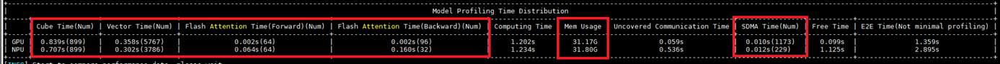
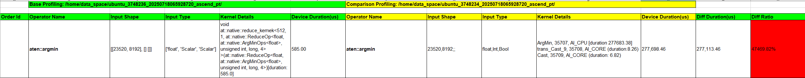
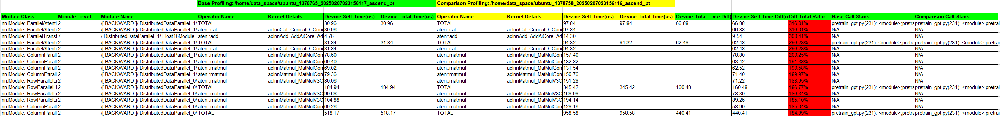
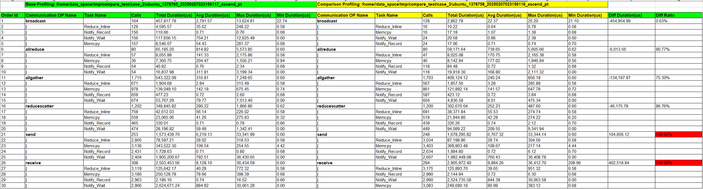
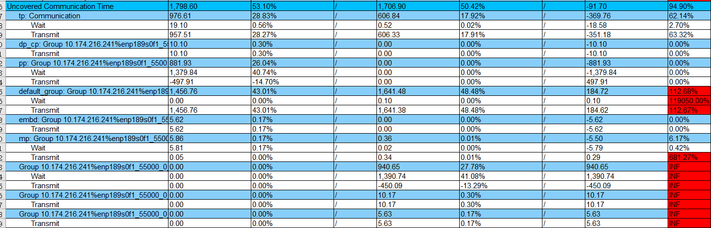
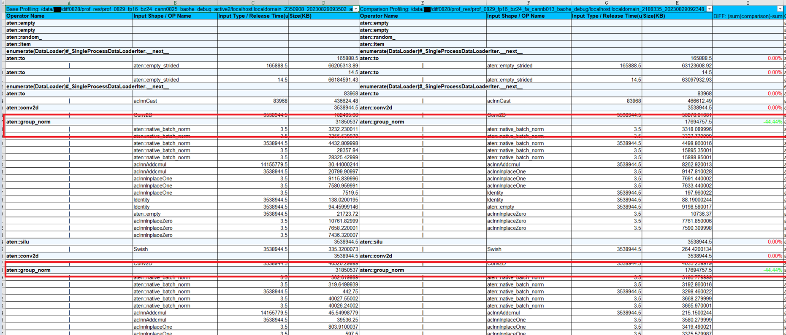
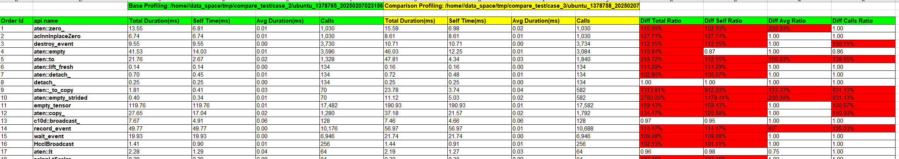

# 版本升级性能劣化定位方法论

## 确认主要性能瓶颈

使用msprof-analyze compare工具，查看打点信息，如[图1](#ZH-CN_TOPIC_0000002535887045__fig1351083175417)所示。或查看performance_comparison_result_{timestamp}.xlsx的OverallMetrics页。

**图1** 打印信息

需重点关注四个核心维度差异，找到差异最明显的维度进一步分析。

- Computing Time（计算时间）
- Uncovered Communication Time（未被计算掩盖的通信时间）
- Mem Usage（内存使用）
- Free Time（空闲时间）

## 算子性能劣化对比分析

### 算子级性能比对

msprof-analyze compare工具提供了算子级性能比对，结果在performance_comparison_result_{timestamp}.xlsx中“OperatorCompare”和“OperatorCompareStatistic”的sheet页，呈现了全面的Shape信息、下发的kernel、device耗时，以及内存占用情况。

1. 查看“OperatorCompareStatistic”页，给出了算子调用次数与Device上运行总耗时，按照"Diff Duration(ms)"或"Diff Ratio"字段逆向排序，找出耗时差距TOP的算子。

2. 在“OperatorCompare”页，搜索耗时差距TOP的算子，查看具体执行的kernel耗时，如[图1](#ZH-CN_TOPIC_0000002503927216__fig142391113203011)所示，寻找可优化点。

   **图1** 查看执行的kernel耗时

   

### module级性能比对

compare工具也支持module级比对，帮助快速识别劣化的模块和算子，并定位至代码块。

1. 查看“ModuleCompareStatistic”页， 筛选“Operator Name”字段为[ TOTAL ]，将模块总体情况按照“Device Self Time(ms)”字段逆向排序，找出耗时差距TOP的模块。

2. 查看“ModuleCompare”页，查找耗时差距TOP模块下的劣化算子。

3. 通过调用栈找到对应的代码行，如[图2](#ZH-CN_TOPIC_0000002503927216__fig49361714183410)所示。

   **图2** 查找代码行

   

## 通信时间（未被掩盖的）劣化对比分析

1. 确认是否存在显著的通信算子性能劣化现象。

   打开performance_comparison_result_.xlsx文件中的“CommunicationCompare”工作表，重点对比以下通信大算子的性能指标，如[图1](#ZH-CN_TOPIC_0000002504087130__fig154214341371)所示。

   - 算子类型（Broadcast、AllReduce等）
   - 耗时指标（平均耗时、最大/最小耗时）与调用频次统计
   - 关联的子任务信息（Reduce_Inline、Notify_Record、Notify_Wait、Memcpy等）

   **图1** 对比通信大算子的性能指标

   

2. 在“OverallMetrics”工作表中，按通信域维度进行深入对比分析。

   需重点关注同一通信域下transit_time，wait time指标的差异分析，如[图2](#ZH-CN_TOPIC_0000002504087130__fig165861453143815)所示。

   **图2** 关注重点指标差异

   

3. 如果通信性能分析没有劣化的通信算子，代表通信与计算的并行度较差，继续进行NPU的集群性能分析。

## 内存劣化对比分析

算子内存比对结果在performance_comparison_result_*.xlsx中“MemoryCompare”和“MemoryCompareStatistic”的sheet页呈现。

1. 查看“MemoryCompareStatistic”页，找出内存占用差距TOP的算子。

2. 查看“MemoryCompare”页，搜索内存占用差距TOP的算子，查看具体占用的算子。

   例如：现场某次升级CANN软件包和PTA软件包后，发生OOM情况，于是采集升级前后两次的Profiling，根据算子级比对发现是aten::group_norm多申请了10GB+内存，如[图1](#ZH-CN_TOPIC_0000002535807069__fig15924104214429)所示。

   **图1** 算子比对

   

## 空闲时间劣化对比分析

当计算时间和通信时间无明显变化，但Free时间明显增大时，可以借助performance_comparison_result_*.xlsx中“ApiCompare”页的比对结果，找到耗时差距TOP的API，结合MindStudio Insight界面的下发连线，确认是否有Host bound。

**图1** 查看ApiCompare页

