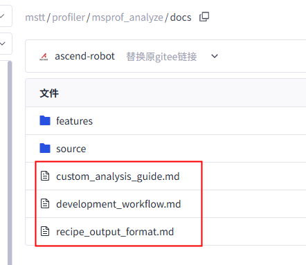
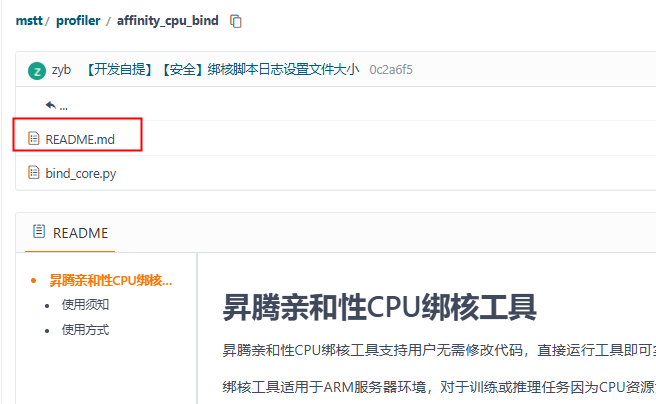

# md文件名称规范

_**资料书写要求：**_

1. _总体介绍类文档在蓝区仓一般是首页呈现，文件名必须固定为“README.md”，否则gitee首页默认无法展示。_
2. _其他md文档统一放在docs文件夹下，文件以工具、特性或产品等手册英文名称命名。（中文名称链接会因转义变成乱码）_
    1. _英文名称给全称，全小写，单词之间以下划线“\_”分隔，不可用其他特殊字符（包括序号，比如：01.xxx.md，删除前面的01.）_

        _特殊情况：单个API文件名直接以API名称命名，API名称中一般含有“.”，则“.”用英文格式的中划线“-”代替（例如：API名称为torch\_npu.scatter\_update，那么对应的md文件名改为torch\_npu-scatter\_update.md）_

    2. _名称缩写：当该名称有公认术语或华为术语以及对应的缩写时可以用缩写，其他情况建议用全称，保证用户可理解__（文档名称不宜过长，根据中文标题翻译，中文标题长度不超过15个汉字，英文建议不超过25\~50个字符）_

3. _所有文件名称可按照下列[表2](#table2)固定格式命名，xxx部分或其他非下面固定格式的文档，由中文名称翻译为英文全称后，发给资料审视_

**示例1：**

**示例2：**

# 中英文名称对照

**表 1** 黄区文档一级标题英文名称

<table><thead align="left"><tr id="row16817181064416"><th class="cellrowborder" valign="top" width="50%" id="mcps1.2.3.1.1">
中文名称

</th>
<th class="cellrowborder" valign="top" width="50%" id="mcps1.2.3.1.2">
英文md文件名

</th>
</tr>
</thead>
<tbody><tr id="row13817191044410"><td class="cellrowborder" colspan="2" valign="top" headers="mcps1.2.3.1.1 mcps1.2.3.1.2 ">
<strong id="b1934961335110">安装指南</strong>

</td>
</tr>
<tr id="row128171210184416"><td class="cellrowborder" valign="top" width="50%" headers="mcps1.2.3.1.1 ">
选择安装场景

</td>
<td class="cellrowborder" valign="top" width="50%" headers="mcps1.2.3.1.2 ">
selecting_installation_scenario.md

</td>
</tr>
<tr id="row28171810144419"><td class="cellrowborder" valign="top" width="50%" headers="mcps1.2.3.1.1 ">
安装说明

</td>
<td class="cellrowborder" valign="top" width="50%" headers="mcps1.2.3.1.2 ">
installation_guide.md

</td>
</tr>
<tr id="row108171010134419"><td class="cellrowborder" valign="top" width="50%" headers="mcps1.2.3.1.1 ">
安装前准备

</td>
<td class="cellrowborder" valign="top" width="50%" headers="mcps1.2.3.1.2 ">
installation_preparations.md

</td>
</tr>
<tr id="row681791011445"><td class="cellrowborder" valign="top" width="50%" headers="mcps1.2.3.1.1 ">
安装规划

</td>
<td class="cellrowborder" valign="top" width="50%" headers="mcps1.2.3.1.2 ">
installation_planning.md

</td>
</tr>
<tr id="row13817181074415"><td class="cellrowborder" valign="top" width="50%" headers="mcps1.2.3.1.1 ">
安装步骤

</td>
<td class="cellrowborder" valign="top" width="50%" headers="mcps1.2.3.1.2 ">
installation_procedure.md

</td>
</tr>
<tr id="row98173105441"><td class="cellrowborder" valign="top" width="50%" headers="mcps1.2.3.1.1 ">
安装XX（XXX场景）

</td>
<td class="cellrowborder" valign="top" width="50%" headers="mcps1.2.3.1.2 ">
installing_xx_for_xxx_scenario.md

</td>
</tr>
<tr id="row181715109441"><td class="cellrowborder" valign="top" width="50%" headers="mcps1.2.3.1.1 ">
安装后配置

</td>
<td class="cellrowborder" valign="top" width="50%" headers="mcps1.2.3.1.2 ">
post-installation_configuration.md

</td>
</tr>
<tr id="row198173101447"><td class="cellrowborder" valign="top" width="50%" headers="mcps1.2.3.1.1 ">
升级

</td>
<td class="cellrowborder" valign="top" width="50%" headers="mcps1.2.3.1.2 ">
upgrade.md

</td>
</tr>
<tr id="row381781054420"><td class="cellrowborder" valign="top" width="50%" headers="mcps1.2.3.1.1 ">
卸载

</td>
<td class="cellrowborder" valign="top" width="50%" headers="mcps1.2.3.1.2 ">
uninstallation.md

</td>
</tr>
<tr id="row12817101013444"><td class="cellrowborder" valign="top" width="50%" headers="mcps1.2.3.1.1 ">
安全加固

</td>
<td class="cellrowborder" valign="top" width="50%" headers="mcps1.2.3.1.2 ">
security_hardening.md

</td>
</tr>
<tr id="row9817191044420"><td class="cellrowborder" valign="top" width="50%" headers="mcps1.2.3.1.1 ">
附录

</td>
<td class="cellrowborder" valign="top" width="50%" headers="mcps1.2.3.1.2 ">
appendixes.md

</td>
</tr>
<tr id="row1181791084418"><td class="cellrowborder" colspan="2" valign="top" headers="mcps1.2.3.1.1 mcps1.2.3.1.2 ">
<strong id="b35056159519">模型迁移指南</strong>

</td>
</tr>
<tr id="row19817191017444"><td class="cellrowborder" valign="top" width="50%" headers="mcps1.2.3.1.1 ">
概述

</td>
<td class="cellrowborder" valign="top" width="50%" headers="mcps1.2.3.1.2 ">
overview.md

</td>
</tr>
<tr id="row1281761014442"><td class="cellrowborder" valign="top" width="50%" headers="mcps1.2.3.1.1 ">
迁移流程

</td>
<td class="cellrowborder" valign="top" width="50%" headers="mcps1.2.3.1.2 ">
migration_process.md

</td>
</tr>
<tr id="row198171210114410"><td class="cellrowborder" valign="top" width="50%" headers="mcps1.2.3.1.1 ">
模型选取

</td>
<td class="cellrowborder" valign="top" width="50%" headers="mcps1.2.3.1.2 ">
model_selection.md

</td>
</tr>
<tr id="row1281741024412"><td class="cellrowborder" valign="top" width="50%" headers="mcps1.2.3.1.1 ">
迁移前分析

</td>
<td class="cellrowborder" valign="top" width="50%" headers="mcps1.2.3.1.2 ">
pre-migration_analysis.md

</td>
</tr>
<tr id="row208188108444"><td class="cellrowborder" valign="top" width="50%" headers="mcps1.2.3.1.1 ">
模型迁移

</td>
<td class="cellrowborder" valign="top" width="50%" headers="mcps1.2.3.1.2 ">
model_migration.md

</td>
</tr>
<tr id="row10818141017442"><td class="cellrowborder" valign="top" width="50%" headers="mcps1.2.3.1.1 ">
特性使能

</td>
<td class="cellrowborder" valign="top" width="50%" headers="mcps1.2.3.1.2 ">
feature_enabling.md

</td>
</tr>
<tr id="row781831094415"><td class="cellrowborder" valign="top" width="50%" headers="mcps1.2.3.1.1 ">
模型训练

</td>
<td class="cellrowborder" valign="top" width="50%" headers="mcps1.2.3.1.2 ">
model_training.md

</td>
</tr>
<tr id="row148189103448"><td class="cellrowborder" valign="top" width="50%" headers="mcps1.2.3.1.1 ">
模型保存与导出

</td>
<td class="cellrowborder" valign="top" width="50%" headers="mcps1.2.3.1.2 ">
model_saving_and_exporting.md

</td>
</tr>
<tr id="row1681810108440"><td class="cellrowborder" valign="top" width="50%" headers="mcps1.2.3.1.1 ">
精度调试

</td>
<td class="cellrowborder" valign="top" width="50%" headers="mcps1.2.3.1.2 ">
accuracy_debugging.md

</td>
</tr>
<tr id="row5818610104417"><td class="cellrowborder" valign="top" width="50%" headers="mcps1.2.3.1.1 ">
性能调优

</td>
<td class="cellrowborder" valign="top" width="50%" headers="mcps1.2.3.1.2 ">
performance_tuning.md

</td>
</tr>
<tr id="row48182010184414"><td class="cellrowborder" valign="top" width="50%" headers="mcps1.2.3.1.1 ">
附录

</td>
<td class="cellrowborder" valign="top" width="50%" headers="mcps1.2.3.1.2 ">
appendixes.md

</td>
</tr>
<tr id="row10818910174419"><td class="cellrowborder" colspan="2" valign="top" headers="mcps1.2.3.1.1 mcps1.2.3.1.2 ">
<strong id="b1583010415518">特性指南</strong>

</td>
</tr>
<tr id="row10818171034418"><td class="cellrowborder" valign="top" width="50%" headers="mcps1.2.3.1.1 ">
特性描述

</td>
<td class="cellrowborder" valign="top" width="50%" headers="mcps1.2.3.1.2 ">
feature_description.md

</td>
</tr>
<tr id="row4818111054414"><td class="cellrowborder" valign="top" width="50%" headers="mcps1.2.3.1.1 ">
软件编译

</td>
<td class="cellrowborder" valign="top" width="50%" headers="mcps1.2.3.1.2 ">
software_compilation.md

</td>
</tr>
<tr id="row1818110154419"><td class="cellrowborder" valign="top" width="50%" headers="mcps1.2.3.1.1 ">
部署软件/安装软件

</td>
<td class="cellrowborder" valign="top" width="50%" headers="mcps1.2.3.1.2 ">
software_deployment_and_installation.md

</td>
</tr>
<tr id="row14818151084415"><td class="cellrowborder" valign="top" width="50%" headers="mcps1.2.3.1.1 ">
使用特性

</td>
<td class="cellrowborder" valign="top" width="50%" headers="mcps1.2.3.1.2 ">
feature_usage.md

</td>
</tr>
<tr id="row188180101443"><td class="cellrowborder" valign="top" width="50%" headers="mcps1.2.3.1.1 ">
维护特性

</td>
<td class="cellrowborder" valign="top" width="50%" headers="mcps1.2.3.1.2 ">
features_maintenance.md

</td>
</tr>
<tr id="row481881014417"><td class="cellrowborder" valign="top" width="50%" headers="mcps1.2.3.1.1 ">
安全管理

</td>
<td class="cellrowborder" valign="top" width="50%" headers="mcps1.2.3.1.2 ">
security_management.md

</td>
</tr>
<tr id="row58181710164420"><td class="cellrowborder" valign="top" width="50%" headers="mcps1.2.3.1.1 ">
故障排除

</td>
<td class="cellrowborder" valign="top" width="50%" headers="mcps1.2.3.1.2 ">
troubleshooting.md

</td>
</tr>
<tr id="row8818910174411"><td class="cellrowborder" valign="top" width="50%" headers="mcps1.2.3.1.1 ">
参考信息

</td>
<td class="cellrowborder" valign="top" width="50%" headers="mcps1.2.3.1.2 ">
reference.md

</td>
</tr>
<tr id="row11818121044417"><td class="cellrowborder" colspan="2" valign="top" headers="mcps1.2.3.1.1 mcps1.2.3.1.2 ">
<strong id="b17562194395614">命令行和API工具</strong>

</td>
</tr>
<tr id="row08183108448"><td class="cellrowborder" valign="top" width="50%" headers="mcps1.2.3.1.1 ">
工具使用导航

</td>
<td class="cellrowborder" valign="top" width="50%" headers="mcps1.2.3.1.2 ">
tool_usage_overview.md

</td>
</tr>
<tr id="row581861054410"><td class="cellrowborder" valign="top" width="50%" headers="mcps1.2.3.1.1 ">
简介

</td>
<td class="cellrowborder" valign="top" width="50%" headers="mcps1.2.3.1.2 ">
overview.md

</td>
</tr>
<tr id="row14818161010443"><td class="cellrowborder" valign="top" width="50%" headers="mcps1.2.3.1.1 ">
使用前准备

</td>
<td class="cellrowborder" valign="top" width="50%" headers="mcps1.2.3.1.2 ">
preparations.md

</td>
</tr>
<tr id="row1481831018447"><td class="cellrowborder" valign="top" width="50%" headers="mcps1.2.3.1.1 ">
快速入门

</td>
<td class="cellrowborder" valign="top" width="50%" headers="mcps1.2.3.1.2 ">
quick_start.md

</td>
</tr>
<tr id="row78181010144414"><td class="cellrowborder" valign="top" width="50%" headers="mcps1.2.3.1.1 ">
xxx功能介绍

</td>
<td class="cellrowborder" valign="top" width="50%" headers="mcps1.2.3.1.2 ">
xxx_description.md

</td>
</tr>
<tr id="row138181101443"><td class="cellrowborder" valign="top" width="50%" headers="mcps1.2.3.1.1 ">
输出结果文件说明

</td>
<td class="cellrowborder" valign="top" width="50%" headers="mcps1.2.3.1.2 ">
output_file_description.md

</td>
</tr>
<tr id="row1881851013448"><td class="cellrowborder" valign="top" width="50%" headers="mcps1.2.3.1.1 ">
案例

</td>
<td class="cellrowborder" valign="top" width="50%" headers="mcps1.2.3.1.2 ">
case_study.md

</td>
</tr>
<tr id="row198181210184418"><td class="cellrowborder" valign="top" width="50%" headers="mcps1.2.3.1.1 ">
扩展功能

</td>
<td class="cellrowborder" valign="top" width="50%" headers="mcps1.2.3.1.2 ">
extended_functions.md

</td>
</tr>
<tr id="row181819103448"><td class="cellrowborder" valign="top" width="50%" headers="mcps1.2.3.1.1 ">
附录

</td>
<td class="cellrowborder" valign="top" width="50%" headers="mcps1.2.3.1.2 ">
appendixes.md

</td>
</tr>
<tr id="row1081951084414"><td class="cellrowborder" colspan="2" valign="top" headers="mcps1.2.3.1.1 mcps1.2.3.1.2 ">
<strong id="b920144319591">界面工具</strong>

</td>
</tr>
<tr id="row138191010124418"><td class="cellrowborder" valign="top" width="50%" headers="mcps1.2.3.1.1 ">
简介

</td>
<td class="cellrowborder" valign="top" width="50%" headers="mcps1.2.3.1.2 ">
overview.md

</td>
</tr>
<tr id="row188199108442"><td class="cellrowborder" valign="top" width="50%" headers="mcps1.2.3.1.1 ">
安装说明

</td>
<td class="cellrowborder" valign="top" width="50%" headers="mcps1.2.3.1.2 ">
installation_guide.md

</td>
</tr>
<tr id="row281941012448"><td class="cellrowborder" valign="top" width="50%" headers="mcps1.2.3.1.1 ">
基础操作

</td>
<td class="cellrowborder" valign="top" width="50%" headers="mcps1.2.3.1.2 ">
basic_operations.md

</td>
</tr>
<tr id="row78197102446"><td class="cellrowborder" valign="top" width="50%" headers="mcps1.2.3.1.1 ">
工具使用

</td>
<td class="cellrowborder" valign="top" width="50%" headers="mcps1.2.3.1.2 ">
tool_usage.md

</td>
</tr>
<tr id="row7819131084418"><td class="cellrowborder" colspan="2" valign="top" headers="mcps1.2.3.1.1 mcps1.2.3.1.2 ">
<strong id="b15798311002">术语规范</strong>

</td>
</tr>
<tr id="row1881911015448"><td class="cellrowborder" valign="top" width="50%" headers="mcps1.2.3.1.1 ">
术语和缩略语规范

</td>
<td class="cellrowborder" valign="top" width="50%" headers="mcps1.2.3.1.2 ">
terms_and_acronyms.md

</td>
</tr>
<tr id="row20819101004412"><td class="cellrowborder" valign="top" width="50%" headers="mcps1.2.3.1.1 ">
术语运作规则

</td>
<td class="cellrowborder" valign="top" width="50%" headers="mcps1.2.3.1.2 ">
term_management_rules.md

</td>
</tr>
<tr id="row1782020107441"><td class="cellrowborder" valign="top" width="50%" headers="mcps1.2.3.1.1 ">
术语变更

</td>
<td class="cellrowborder" valign="top" width="50%" headers="mcps1.2.3.1.2 ">
term_change.md

</td>
</tr>
<tr id="row982061010445"><td class="cellrowborder" colspan="2" valign="top" headers="mcps1.2.3.1.1 mcps1.2.3.1.2 ">
<strong id="b99178118117">版本说明书</strong>

</td>
</tr>
<tr id="row5820410164411"><td class="cellrowborder" valign="top" width="50%" headers="mcps1.2.3.1.1 ">
版本配套说明

</td>
<td class="cellrowborder" valign="top" width="50%" headers="mcps1.2.3.1.2 ">
version_mapping.md

</td>
</tr>
<tr id="row14820111016444"><td class="cellrowborder" valign="top" width="50%" headers="mcps1.2.3.1.1 ">
版本兼容性说明

</td>
<td class="cellrowborder" valign="top" width="50%" headers="mcps1.2.3.1.2 ">
version_compatibility.md

</td>
</tr>
<tr id="row98201310184414"><td class="cellrowborder" valign="top" width="50%" headers="mcps1.2.3.1.1 ">
版本使用注意事项

</td>
<td class="cellrowborder" valign="top" width="50%" headers="mcps1.2.3.1.2 ">
version_precautions.md

</td>
</tr>
<tr id="row3820181017443"><td class="cellrowborder" valign="top" width="50%" headers="mcps1.2.3.1.1 ">
xxx更新说明

</td>
<td class="cellrowborder" valign="top" width="50%" headers="mcps1.2.3.1.2 ">
xxx_updates.md

</td>
</tr>
<tr id="row11820151015447"><td class="cellrowborder" valign="top" width="50%" headers="mcps1.2.3.1.1 ">
升级影响

</td>
<td class="cellrowborder" valign="top" width="50%" headers="mcps1.2.3.1.2 ">
upgrade_impact.md

</td>
</tr>
<tr id="row982013105449"><td class="cellrowborder" valign="top" width="50%" headers="mcps1.2.3.1.1 ">
xxx版本配套文档

</td>
<td class="cellrowborder" valign="top" width="50%" headers="mcps1.2.3.1.2 ">
xxx_documentation.md

</td>
</tr>
<tr id="row2820181017445"><td class="cellrowborder" valign="top" width="50%" headers="mcps1.2.3.1.1 ">
漏洞修补列表

</td>
<td class="cellrowborder" valign="top" width="50%" headers="mcps1.2.3.1.2 ">
vulnerability_fixes.md

</td>
</tr>
<tr id="row16820141019442"><td class="cellrowborder" colspan="2" valign="top" headers="mcps1.2.3.1.1 mcps1.2.3.1.2 ">
<strong id="b431612413204">开发指南</strong>

</td>
</tr>
<tr id="row18205104441"><td class="cellrowborder" valign="top" width="50%" headers="mcps1.2.3.1.1 ">
XXX简介

</td>
<td class="cellrowborder" valign="top" width="50%" headers="mcps1.2.3.1.2 ">
xxx_introduction.md

</td>
</tr>
<tr id="row6820161019447"><td class="cellrowborder" valign="top" width="50%" headers="mcps1.2.3.1.1 ">
准备环境

</td>
<td class="cellrowborder" valign="top" width="50%" headers="mcps1.2.3.1.2 ">
environment_setup.md

</td>
</tr>
<tr id="row18820131094417"><td class="cellrowborder" valign="top" width="50%" headers="mcps1.2.3.1.1 ">
快速入门

</td>
<td class="cellrowborder" valign="top" width="50%" headers="mcps1.2.3.1.2 ">
quick_start.md

</td>
</tr>
<tr id="row8820121074414"><td class="cellrowborder" valign="top" width="50%" headers="mcps1.2.3.1.1 ">
编程接口与调用流程

</td>
<td class="cellrowborder" valign="top" width="50%" headers="mcps1.2.3.1.2 ">
programming_apis_and_call_sequence.md

</td>
</tr>
<tr id="row17820510194419"><td class="cellrowborder" valign="top" width="50%" headers="mcps1.2.3.1.1 ">
精度/性能调优

</td>
<td class="cellrowborder" valign="top" width="50%" headers="mcps1.2.3.1.2 ">
accuracy_and_performance_tuning.md

</td>
</tr>
<tr id="row10841202594520"><td class="cellrowborder" valign="top" width="50%" headers="mcps1.2.3.1.1 ">
xx数据监控

</td>
<td class="cellrowborder" valign="top" width="50%" headers="mcps1.2.3.1.2 ">
xx_data_monitoring

</td>
</tr>
<tr id="row1795851620218"><td class="cellrowborder" valign="top" width="50%" headers="mcps1.2.3.1.1 ">
服务化调优

</td>
<td class="cellrowborder" valign="top" width="50%" headers="mcps1.2.3.1.2 ">
serving_tuning.md

</td>
</tr>
<tr id="row9773161112512"><td class="cellrowborder" valign="top" width="50%" headers="mcps1.2.3.1.1 ">
xx样例集合

</td>
<td class="cellrowborder" valign="top" width="50%" headers="mcps1.2.3.1.2 ">
xx_samples.md

</td>
</tr>
<tr id="row382019109442"><td class="cellrowborder" valign="top" width="50%" headers="mcps1.2.3.1.1 ">
XXX样例参考

</td>
<td class="cellrowborder" valign="top" width="50%" headers="mcps1.2.3.1.2 ">
xxx_sample.md

</td>
</tr>
<tr id="row118214107442"><td class="cellrowborder" valign="top" width="50%" headers="mcps1.2.3.1.1 ">
附录

</td>
<td class="cellrowborder" valign="top" width="50%" headers="mcps1.2.3.1.2 ">
appendixes.md

</td>
</tr>
<tr id="row79261621904"><td class="cellrowborder" colspan="2" valign="top" headers="mcps1.2.3.1.1 mcps1.2.3.1.2 ">
<strong id="b2073112382020">API接口</strong>

</td>
</tr>
<tr id="row48119433011"><td class="cellrowborder" valign="top" width="50%" headers="mcps1.2.3.1.1 ">
总体说明

</td>
<td class="cellrowborder" valign="top" width="50%" headers="mcps1.2.3.1.2 ">
overview.md

</td>
</tr>
<tr id="row187076561729"><td class="cellrowborder" valign="top" width="50%" headers="mcps1.2.3.1.1 ">
xx类型

</td>
<td class="cellrowborder" valign="top" width="50%" headers="mcps1.2.3.1.2 ">
英文可不翻译，保留xx

</td>
</tr>
<tr id="row168204174220"><td class="cellrowborder" valign="top" width="50%" headers="mcps1.2.3.1.1 ">
xx系列

</td>
<td class="cellrowborder" valign="top" width="50%" headers="mcps1.2.3.1.2 ">
英文可不翻译，保留xx

</td>
</tr>
<tr id="row3489144620"><td class="cellrowborder" valign="top" width="50%" headers="mcps1.2.3.1.1 ">
宏定义

</td>
<td class="cellrowborder" valign="top" width="50%" headers="mcps1.2.3.1.2 ">
macro_definitions

</td>
</tr>
<tr id="row149818591925"><td class="cellrowborder" valign="top" width="50%" headers="mcps1.2.3.1.1 ">
输出结果说明

</td>
<td class="cellrowborder" valign="top" width="50%" headers="mcps1.2.3.1.2 ">
output_description

</td>
</tr>
<tr id="row2045711219310"><td class="cellrowborder" valign="top" width="50%" headers="mcps1.2.3.1.1 ">
示例代码

</td>
<td class="cellrowborder" valign="top" width="50%" headers="mcps1.2.3.1.2 ">
sample_code

</td>
</tr>
</tbody>
</table>
**表 2** 特定文档的固定文件名格式

<table><thead align="left"><tr id="row78099019712"><th class="cellrowborder" valign="top" width="30.509999999999998%" id="mcps1.2.3.1.1">
中文名称

</th>
<th class="cellrowborder" valign="top" width="69.49%" id="mcps1.2.3.1.2">
英文md文件名

</th>
</tr>
</thead>
<tbody><tr id="row177113480182"><td class="cellrowborder" valign="top" width="30.509999999999998%" headers="mcps1.2.3.1.1 ">
<em id="i965525203018">xxx模型迁移指南</em>

</td>
<td class="cellrowborder" valign="top" width="69.49%" headers="mcps1.2.3.1.2 ">
<em id="i1365685263017">xxx_model_migration_guide</em><em id="i46501677199">.md</em>

</td>
</tr>
<tr id="row173761619112311"><td class="cellrowborder" valign="top" width="30.509999999999998%" headers="mcps1.2.3.1.1 ">
<em id="i16658752103011">xxx模型迁移调优指南</em>

</td>
<td class="cellrowborder" valign="top" width="69.49%" headers="mcps1.2.3.1.2 ">
<em id="i665975233010">xxx_model_migration_and_tuning_guide</em><em id="i6839023192410">.md</em>

</td>
</tr>
<tr id="row14109854112519"><td class="cellrowborder" valign="top" width="30.509999999999998%" headers="mcps1.2.3.1.1 ">
<em id="i96601752203013">xxx特性指南</em>

</td>
<td class="cellrowborder" valign="top" width="69.49%" headers="mcps1.2.3.1.2 ">
<em id="i366014522308">xxx_feature_guide</em>

</td>
</tr>
<tr id="row19914518308"><td class="cellrowborder" valign="top" width="30.509999999999998%" headers="mcps1.2.3.1.1 ">
<em id="i140343495">xxx版本说明书</em>

</td>
<td class="cellrowborder" valign="top" width="69.49%" headers="mcps1.2.3.1.2 ">
<em id="i1976019451095">xxx_release_notes.md</em>

</td>
</tr>
<tr id="row1662617344192"><td class="cellrowborder" valign="top" width="30.509999999999998%" headers="mcps1.2.3.1.1 ">
<em id="i14408160583">xxx快速入门</em>

</td>
<td class="cellrowborder" valign="top" width="69.49%" headers="mcps1.2.3.1.2 ">
<em id="i0544751881">xxx_quick_start.md</em>

</td>
</tr>
<tr id="row1629620912816"><td class="cellrowborder" valign="top" width="30.509999999999998%" headers="mcps1.2.3.1.1 ">
<em id="i17269194816918">昇腾产品形态说明</em>

</td>
<td class="cellrowborder" valign="top" width="69.49%" headers="mcps1.2.3.1.2 ">
<em id="i1550318531796">ascend_product_models.md</em>

</td>
</tr>
<tr id="row5185133615194"><td class="cellrowborder" valign="top" width="30.509999999999998%" headers="mcps1.2.3.1.1 ">
<em id="i4565681814">xxx安装指南</em>

</td>
<td class="cellrowborder" valign="top" width="69.49%" headers="mcps1.2.3.1.2 ">
<em id="i523117111680">xxx_install_guide.md</em>

</td>
</tr>
<tr id="row11410153319194"><td class="cellrowborder" valign="top" width="30.509999999999998%" headers="mcps1.2.3.1.1 ">
<em id="i13646677920">xxx开发指南</em>

</td>
<td class="cellrowborder" valign="top" width="69.49%" headers="mcps1.2.3.1.2 ">
<em id="i979716120916">xxx_development_guide.md</em>

</td>
</tr>
<tr id="row19583193711914"><td class="cellrowborder" valign="top" width="30.509999999999998%" headers="mcps1.2.3.1.1 ">
<em id="i7669013189">xxx用户指南（xxx使用指南应统一改为xxx用户指南）</em>

</td>
<td class="cellrowborder" valign="top" width="69.49%" headers="mcps1.2.3.1.2 ">
<em id="i1761316168816">xxx_user_guide.md</em>

</td>
</tr>
<tr id="row9810509716"><td class="cellrowborder" valign="top" width="30.509999999999998%" headers="mcps1.2.3.1.1 ">
<em id="i441120191184">xxx工具用户指南</em>

</td>
<td class="cellrowborder" valign="top" width="69.49%" headers="mcps1.2.3.1.2 ">
<em id="i2676222987">xxx_tool_user_guide.md</em>

</td>
</tr>
<tr id="row48104012710"><td class="cellrowborder" valign="top" width="30.509999999999998%" headers="mcps1.2.3.1.1 ">
<em id="i1476218149716">介绍说明类</em>

</td>
<td class="cellrowborder" valign="top" width="69.49%" headers="mcps1.2.3.1.2 ">
<em id="i166839251376">xxx_introduct.md</em>

</td>
</tr>
<tr id="row18101501870"><td class="cellrowborder" valign="top" width="30.509999999999998%" headers="mcps1.2.3.1.1 ">
<em id="i19591137571">操作指导类</em>

</td>
<td class="cellrowborder" valign="top" width="69.49%" headers="mcps1.2.3.1.2 ">
<em id="i182621841572">xxx_instruct.md</em>

</td>
</tr>
<tr id="row118107010719"><td class="cellrowborder" valign="top" width="30.509999999999998%" headers="mcps1.2.3.1.1 ">
<em id="i57600151498">xxxAPI参考</em>

</td>
<td class="cellrowborder" valign="top" width="69.49%" headers="mcps1.2.3.1.2 ">
<em id="i7695720796">xxx_api_reference.md</em>

</td>
</tr>
<tr id="row1781011014716"><td class="cellrowborder" valign="top" width="30.509999999999998%" headers="mcps1.2.3.1.1 ">
<em id="i960216443720">单独API文档</em>

</td>
<td class="cellrowborder" valign="top" width="69.49%" headers="mcps1.2.3.1.2 ">
<em id="i47151748477">直接以API名称命名文件，API名称中有“.”的转为英文格式的中划线“-”</em>

</td>
</tr>
<tr id="row7810609719"><td class="cellrowborder" valign="top" width="30.509999999999998%" headers="mcps1.2.3.1.1 ">
<em id="i836514376910">故障处理</em>

</td>
<td class="cellrowborder" valign="top" width="69.49%" headers="mcps1.2.3.1.2 ">
<em id="i168453394918">troubleshooting.md</em>

</td>
</tr>
<tr id="row17810150570"><td class="cellrowborder" valign="top" width="30.509999999999998%" headers="mcps1.2.3.1.1 ">
<em id="i587353119918">日志参考</em>

</td>
<td class="cellrowborder" valign="top" width="69.49%" headers="mcps1.2.3.1.2 ">
<em id="i1112011351998">log_reference.md</em>

</td>
</tr>
<tr id="row58111439189"><td class="cellrowborder" valign="top" width="30.509999999999998%" headers="mcps1.2.3.1.1 ">
<em id="i64879233916">环境变量参考</em>

</td>
<td class="cellrowborder" valign="top" width="69.49%" headers="mcps1.2.3.1.2 ">
<em id="i19744162610912">environment_variable_reference.md</em>

</td>
</tr>
<tr id="row1257713499816"><td class="cellrowborder" valign="top" width="30.509999999999998%" headers="mcps1.2.3.1.1 ">
<em id="i5836533102">术语和缩略语</em>

</td>
<td class="cellrowborder" valign="top" width="69.49%" headers="mcps1.2.3.1.2 ">
<em id="i819237121014">terms_acronyms_abbreviations.md</em>

</td>
</tr>
<tr id="row188931924081"><td class="cellrowborder" valign="top" width="30.509999999999998%" headers="mcps1.2.3.1.1 ">
<em id="i7619560916">安全声明</em>

</td>
<td class="cellrowborder" valign="top" width="69.49%" headers="mcps1.2.3.1.2 ">
<em id="i1332714018107">security_statement.md（这个文档里包含了通信矩阵、安全声明、漏洞机制说明</a>）</em>

</td>
</tr>
<tr id="row961755595815"><td class="cellrowborder" valign="top" width="30.509999999999998%" headers="mcps1.2.3.1.1 ">
<em id="i1621717274212">漏洞处理流程.png</em>

</td>
<td class="cellrowborder" valign="top" width="69.49%" headers="mcps1.2.3.1.2 ">
<em id="i12188271021">vulnerability_handling_process.png</em>

</td>
</tr>
<tr id="row16729155318585"><td class="cellrowborder" valign="top" width="30.509999999999998%" headers="mcps1.2.3.1.1 ">
<em id="i1921811273211">MindStudio漏洞机制说明</em>

</td>
<td class="cellrowborder" valign="top" width="69.49%" headers="mcps1.2.3.1.2 ">
<em id="i1321819271629">mindstudio_vulnerability_handling_procedure.md</em>

</td>
</tr>
<tr id="row128482536119"><td class="cellrowborder" valign="top" width="30.509999999999998%" headers="mcps1.2.3.1.1 ">
<em id="i172192275217">公网地址</em>

</td>
<td class="cellrowborder" valign="top" width="69.49%" headers="mcps1.2.3.1.2 ">
<em id="i1521915272028">public_ip_address.md</em>

</td>
</tr>
<tr id="row087415365818"><td class="cellrowborder" valign="top" width="30.509999999999998%" headers="mcps1.2.3.1.1 ">
<em id="i13224101020104">FAQ</em>

</td>
<td class="cellrowborder" valign="top" width="69.49%" headers="mcps1.2.3.1.2 ">
<em id="i359321231011">faq.md</em>

</td>
</tr>
<tr id="row377118261385"><td class="cellrowborder" valign="top" width="30.509999999999998%" headers="mcps1.2.3.1.1 ">
<em id="i152001315171013">xxx性能基线报告</em>

</td>
<td class="cellrowborder" valign="top" width="69.49%" headers="mcps1.2.3.1.2 ">
<em id="i147071814107">xxx_perf_baseline.md</em>

</td>
</tr>
</tbody>
</table>
