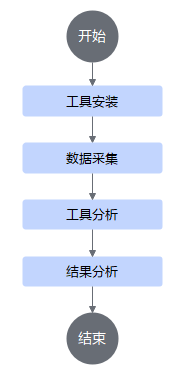

# MindStudio Probe

## 最新消息

- [2025.08.06]：msProbe工具资料结构整改。

## 简介

MindStudio Probe（MindStudio精度调试工具，msProbe）是针对昇腾提供的全场景精度工具链，专为模型开发的精度调试环节设计，可显著提升用户定位模型精度问题的效率。

msProbe主要包括精度数据采集（dump）、精度预检、训练状态监测和精度比对等功能，这些功能侧重不同的训练或推理场景，可以帮助定位模型训练或推理中的精度问题。

**基本概念**

- 概念1：是xxx
- 概念2：是xxx
- ...

**流程图**



## 目录结构

关键目录如下。

```
├── docs              // 文档目录
...需要补全
```

## 版本说明

msProbe工具的版本配套说明和特性变更，具体请参见[版本说明](docs/zh/release_notes.md)。

## 兼容性信息

提供兼容性信息的内容，包括支持的模型清单、支持的框架等。

## 环境部署

安装msProbe工具，当前仅支持编译安装方式，具体请参见《[msProbe工具安装指南](docs/zh/msprobe_install_guide.md)》。

## 快速入门

msProbe工具快速入门当前提供在PyTorch和MindSpore训练场景中，通过一个可执行样例，串联msProbe工具的训练前配置检查、精度数据采集、精度预检、训练状态监测及精度比对功能，帮助用户快速上手。详细快速入门可参见《训练场景工具快速入门》中的“[模型精度调试](https://www.hiascend.com/document/detail/zh/mindstudio/82RC1/msquickstart/atlasquick_train_0023.html?framework=pytorch)（PyTorch场景）”或“[模型精度调试](https://www.hiascend.com/document/detail/zh/mindstudio/82RC1/msquickstart/atlasquick_train_0006.html?framework=mindspore)（MindSpore场景）。

## 工具限制与注意事项

介绍msProbe工具的适用场景和当前版本局限性，具体请参见[工具限制与注意事项]()。

## 功能介绍

### vLLM推理场景

#### aclgraph图模式

1. [数据采集](https://gitcode.com/Ascend/msprobe/blob/master/docs/zh/dump/aclgraph_dump_instruct.md)

   通过acl_save接口完成精度数据采集操作。

#### torchair图模式

1. [数据采集](https://gitcode.com/Ascend/msprobe/blob/master/docs/zh/dump/torchair_dump_instruct.md)

   通过set_ge_dump_config接口完成精度数据采集操作。

2. [精度比对](https://gitcode.com/Ascend/msprobe/blob/master/docs/zh/accuracy_compare/torchair_compare_instruct.md)

   将msProbe工具dump的精度数据进行精度比对，进而定位精度问题。

## API参考

介绍msProbe工具的API接口，具体请参见[msProbe API参考]()。

## FAQ

介绍msProbe工具的常见问题和解决方案，具体请参见[FAQ]()。

## 分支维护策略

版本分支的维护阶段如下：

| **状态**            | **时间**  | **说明**                                                     |
| ------------------- | --------- | ------------------------------------------------------------ |
| 计划                | 1—3 个月  | 计划特性                                                     |
| 开发                | 6—12 个月 | 开发新特性并修复问题，定期发布新版本。针对不同的PyTorch版本采取不同的策略，常规分支的开发周期分别为6个月，长期支持分支的开发周期为12个月 |
| 维护                | 1年/3.5年 | 常规分支维护1年,长期支持分支维护3.5年。对重大BUG进行修复，不合入新特性，并视BUG的影响发布补丁版本 |
| 生命周期终止（EOL） | N/A       | 分支不再接受任何修改                                         |

## 版本维护策略

| **PyTorch版本** | **维护策略** | **当前状态** | **发布时间** | **后续状态**                   | **EOL日期** |
| --------------- | ------------ | ------------ | ------------ | ------------------------------ | ----------- |
| 2.6.0           | 常规分支     | 开发         | 2025/07/25   | 预计2026/01/25起进入维护状态   | -           |
| 2.5.1           | 常规分支     | 开发         | 2024/11/08   | 预计2025/08/08起进入维护状态   | -           |
| 2.4.0           | 常规分支     | 维护         | 2024/10/15   | 预计2026/06/15起进入无维护状态 | -           |
| 2.3.1           | 常规分支     | 维护         | 2024/06/06   | 预计2026/06/07起进入无维护状态 |             |
| 2.2.0           | 常规分支     | 维护         | 2024/04/01   | 预计2025/09/10起进入无维护状态 |             |
| 2.1.0           | 长期支持     | 开发         | 2023/10/15   | 预计2025/09/15起进入维护状态   |             |
| 2.0.1           | 常规分支     | EOL          | 2023/7/19    |                                | 2024/3/14   |
| 1.11.0          | 长期支持     | 维护         | 2023/4/19    | 预计2025/09/10起进入无维护状态 |             |
| 1.8.1           | 长期支持     | EOL          | 2022/4/10    |                                | 2023/4/10   |
| 1.5.0           | 长期支持     | EOL          | 2021/7/29    |                                | 2022/7/29   |

## 贡献指导

介绍如何向msProbe反馈问题、需求以及为msProbe贡献的代码开发流程，具体请参见[为MindStudio Probe贡献](https://gitcode.com/Ascend/msprobe/blob/master/CONTRIBUTING.md)。

## 联系我们

[](https://raw.gitcode.com/kali20gakki1/Imageshack/raw/main/CDC0BEE2-8F11-477D-BD55-77A15417D7D1_4_5005_c.jpeg)

## 安全声明

描述MindStudio Probe产品的安全加固信息、公网地址信息及通信矩阵等内容，具体请参见[安全声明]()。

## 免责声明

### 致MindSpeed使用者

1. MindSpeed提供的所有内容仅供您用于非商业目的。
2. 对于MindSpeed测试用例以及示例文件中所涉及的各模型和数据集，平台仅用于功能测试，华为不提供任何模型权重和数据集，如您使用这些数据进行训练，请您特别注意应遵守对应模型和数据集的License，如您因使用这些模型和数据集而产生侵权纠纷，华为不承担任何责任。
3. 如您在使用MindSpeed过程中，发现任何问题（包括但不限于功能问题、合规问题），请在Gitee提交issue，我们将及时审视并解决。
4. MindSpeed功能依赖的Megatron等第三方开源软件，均由第三方社区提供和维护，因第三方开源软件导致的问题的修复依赖相关社区的贡献和反馈。您应理解，MindSpeed仓库不保证对第三方开源软件本身的问题进行修复，也不保证会测试、纠正所有第三方开源软件的漏洞和错误。

### 致数据所有者

如果您不希望您的模型或数据集在MindSpeed中被提及，或希望更新MindSpeed中有关的描述，请在Gitee提交issue，我们将根据您的issue要求删除或更新您相关描述。衷心感谢您对MindSpeed的理解和贡献。

## License

介绍msProbe产品的使用许可证，具体请参见[LICENSE](LICENSE)文件。

介绍msProbe工具docs目录下的文档适用CC-BY 4.0许可证，具体请参见[LICENSE](docs/LICENSE)文件。

## 致谢

msProbe由华为公司的下列部门联合贡献：

- 昇腾计算MindStudio开发部
- 分布式并行计算实验室

感谢来自社区的每一个PR，欢迎贡献msProbe！
