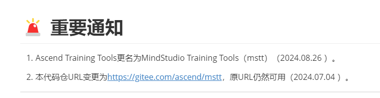
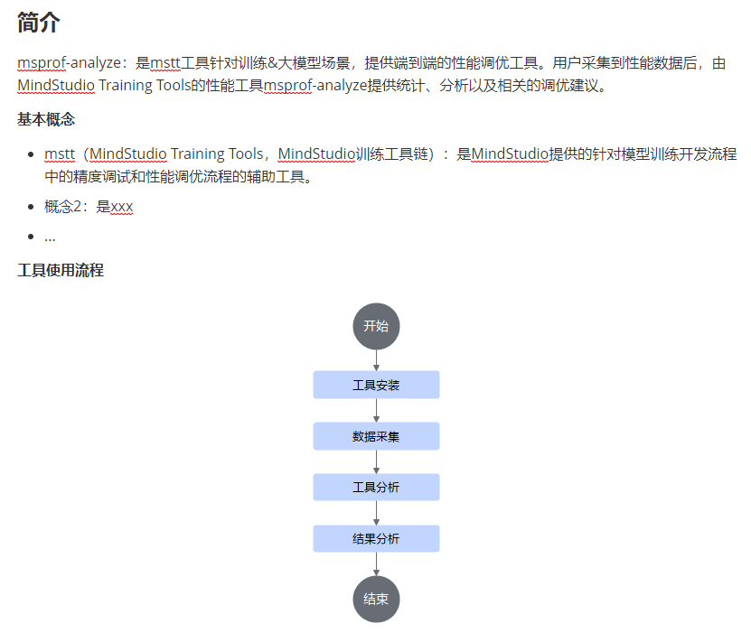
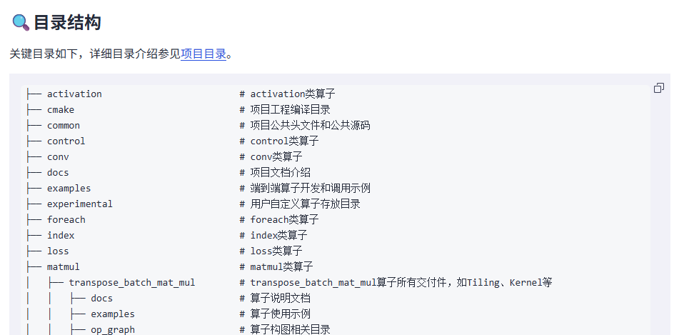
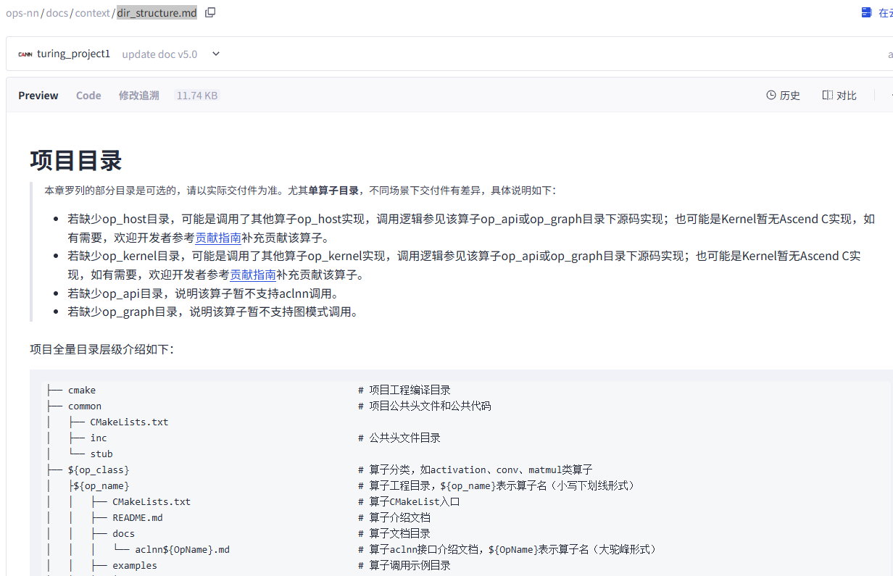
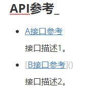
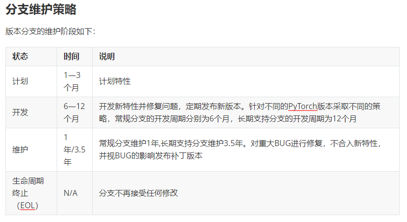
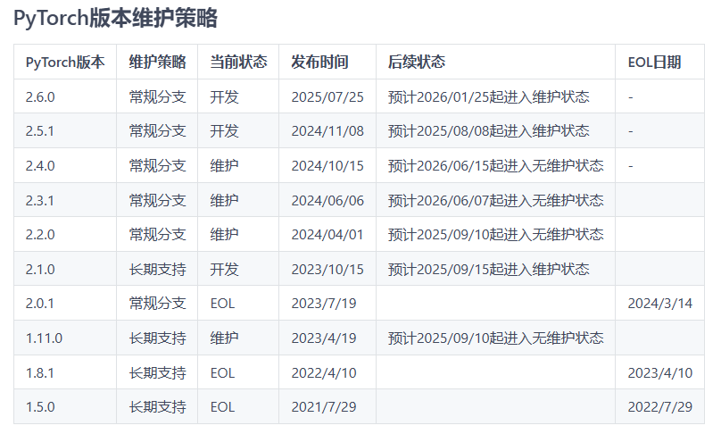
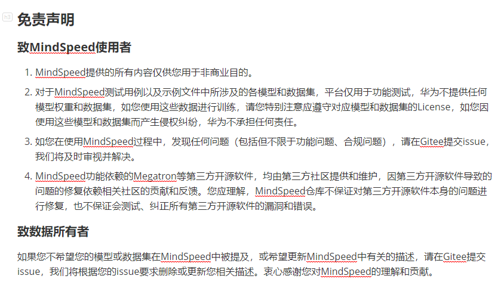

# 仓库总体介绍模板

> **说明：** 
>
>- _下文中所有章节名称不加章节序号。_
>- _中英文之间不加空格，中文与数字之间不加空格_
>- _一个标题下如果有子标题，那么父标题和子标题之间不允许写内容_

## 产品名称

_**资料书写要求：**_

1. _在总体介绍的首页第一个一级标题为产品（特性、工具）名称，之后均为其子节点_
2. _名称格式：英文全称（格式为：品牌名 产品名称）_
    1. _品牌名如：MindStudio、MindSpeed、Ascend、CANN等_
    2. _产品名称可以是工具名称特性名称等，例如：Training Tools、Probe、Prof、Monitor、Modelslim、Infer Tools、LLM、MM等_
    3. _名称可以用缩写，但必须是业界公认或华为术语库有的术语缩写_

**示例：**

MindStudio Probe

MindSpeed LLM

### （可选）最新消息

_**资料书写要求：**_

1. _在总体介绍的首页第一个二级标题为“最新消息”_
2. _内容格式：有序列表，按时间倒序排列，内容格式为：“\[日期如2025.08.06\]：变更内容”_
3. _变更内容字数建议在30个字以内，最多不超过50个字_
4. _变更条数建议在10条以内，最多不超过15条，时间超过半年的可以删除_
5. _内容是代码仓的整体变更（工具名称或链接等变更等），以及最新的主要变更、合作、新闻等消息类内容_
6. _大特性变更是指新增一个可独立完成一项任务包括完整的输入输出的、或者说需要单独一篇文档介绍的，也可以是涉及整个工具架构变化的，可以认为是大特性；其他的特性变更均写在“版本说明”中的“特性变更说明”_
7. _大特性变更，可以加超链接跳转到具体位置_
8. _可以加标题图标，放文字前面_

**示例：**


- \[2025.08.06\]：msprof-analyze工具资料结构整改。
- \[2024.07.04 \]：支持pp流水图的采集、数据分析，详见[pp流水图采集和分析指导](https://gitee.com/ascend/mstt/blob/242016582d262896b14efeb9488f14f2c928a389/profiler/msprof_analyze/docs/pp_chart.md)。

_**下列为需要微调的示例：**_



_上图重要通知标题改为**最新消息**，有序列表改为无序列表，时间放前面用方括号，时间倒序排列_


_上图章节调整到简介前面，标题改为**最新消息**_

### 简介

_**资料书写要求：**_

1. _简介内容需要包括工具简介、基本概念（可选）、流程图（可选）_
2. _简介格式：英文全称（中文全称，缩略语）：工具定义_
    1. _工具定义要求字数100个字以内__，不超过__150个字_
    2. _介绍工具的作用和使用场景__（不需要介绍工具用到的技术或内部原理）_

3. _基本概念（可选）_

    _本文内容中若有新名词或专业术语，需要换行写定义，注意后续全文使用统一名称。样式如下：_

    - _概念1：是xxx_
    - _概念2：是xxx_
    - _..._

4. _流程图（可选）_

    _需要用户了解整体流程的情况下建议添加_

    _建议使用流程图形式（流程图不需要自己画，只要提供简要初稿，交给资料美工进行规范）_

**示例：**



### 目录结构

_**资料书写要求：**_

_提供整个仓目录结构说明，代码块格式，无语言，每个目录和文件需要简要说明_

_在这里提供完整目录（不包括文件，重要文件需要用户了解的除外）的简要说明，若完整目录结构太长，可以在这里先提供关键目录结构，完整目录结构放单独的md文档（可以参考<https://gitcode.com/Ascend/msmonitor/blob/master/docs/zh/dir_structure.md）>_

**示例：**



_整体项目目录文档需要给出所有文件的解释说明，文件名称dir\_structure.md_



### 版本说明

_**资料书写要求：**_

1. _版本说明书包含“版本配套说明”和“特性变更说明”，与昇腾社区保持一致_
2. _这里的格式为：超链接+短描述形式_
    1. _版本说明不建议直接在这里写全部内容，因为会随版本迭代，内容不断增多_
    2. _超链接在标题上直接加_
    3. _短描述是指对这个标题的目标文档包含哪些内容进行简单描述，字数在15个字以内，最多不超过30个字_

3. _目标文件格式：_
    1. _文件名：release\_notes.md_
    2. _文档标题：版本说明_

**示例：**


\#\# 版本说明

xxx的版本说明包含xxx的软件版本配套关系和软件包下载以及每个版本的特性变更说明，具体请参见\[版本说明\]\(docs/zh/release\_notes.md\)。

### （可选）xx兼容性信息

_**资料书写要求：**_

1. _可选说明：提供兼容性信息的内容，包括支持的模型清单、支持的框架等等__，没有这些内容的删除此章节_
2. _内容少的话（不超过一页）可以直接在这里列出来，用表格形式_
3. _内容多的话（超过一页）用超链接+短描述形式_
    1. _超链接在标题上直接加_
    2. _短描述是指对这个标题的目标文档包含哪些内容进行简单描述，字数在15个字以内，最多不超过30个字_

**示例：**


# \# xx兼容性信息

提供兼容性信息的内容，包括支持的模型清单、支持的框架等，具体请参见\[xx兼容性信息\]\(xxx\)。

### 环境部署

_**资料书写要求：**_

1. _形式一：依赖和工具安装内容超过一页的，单独一个文档，按照标题+超链接+短描述形式格式呈现_
   1. _超链接在标题上直接加_
   2. _短描述是指对这个标题的目标文档包含哪些内容进行简单描述，字数在15个字以内，最多不超过30个字_
   3. _目标文件格式：_

       _文件名：install\_guide.md_

       _文档标题：xxx工具安装指南_

2. _形式二：如果安装内容很少（不超过一页）可以直接给完整安装内容、__也可以提供快速安装内容（不超过一页），详细安装链接到安装手册_

3. ***注意：不管是形式一还是形式二，安装指南都必须有单独的一个install\_guide.md***

**形式一示例：**


\#\# 环境部署

介绍xxx工具的环境依赖及安装方式，具体请参见\[xxx安装指南\]\(xxx\)。

**形式二示例：**


### （可选）快速入门

_**资料书写要求：**_

1. _形式一：快速安装+操作步骤内容超过一页的，单独一个文档，按照标题+超链接+短描述形式格式呈现_
    1. _超链接在标题上直接加_
    
    2. _短描述是指对这个标题的目标文档包含哪些内容进行简单描述，字数在15个字以内，最多不超过30个字_

    3. _目标文件格式：_

        _文件名：quick_start.md_

        _文档标题：xxx快速入门_

2. _形式二__：__快速安装+操作步骤内容不超过一页的，按照标题+具体步骤格式呈现（注意如果前面环境部署中写了快速部署，那么这里的快速安装改成参考前面的环境部署，不需要重复写安装操作）_

**形式一示例：**


\#\# 快速入门

xxx的快速入门，包括快速安装、数据准备和工具使用等，具体请参见\[快速入门\]\(quick\_start\)。

**形式二示例：**


**_蓝区不能用section，这里用加粗即可，不给三级标题了，不然会显得目录结构臃肿_**

### （可选）工具限制与注意事项

_**资料书写要求：**_

1. _超链接+短描述形式_
    1. _超链接在标题上直接加_
    2. _短描述是指对这个标题的目标文档包含哪些内容进行简单描述，字数在15个字以内，最多不超过30个字_
    3. _目标文件格式：_

        _文件名：Limitations\_and\_Precautions.md_

        _文档标题：工具限制与注意事项_

2. _规则：超过5个以上的子工具或功能，且每个子工具或功能里包含对该工具或功能整体的约束超过3条，可以单独一个文档汇总这些约束。_
3. _可选说明：不符合以上规则的不需要这个章节，约束放到各自的工具&特性文档里。_

**示例：**


\#\# 工具限制与注意事项

介绍msProbe工具的适用场景和当前版本局限性，具体请参见\[工具限制与注意事项\]\(xxx\)。

### 功能介绍&特性介绍

_**资料书写要求：**_

_内容为介绍所有子工具的导读，标题为功能或特性的父目录“功能介绍”或“特性介绍”。_

**示例：**

目录结构


#### 功能

_**资料书写要求：**_

1. _功能点没有分类时，直接在“功能介绍”标题下用列表格式罗列功能点，各功能有顺序时使用有序列表，没有顺序时使用无序列表；功能点有分类时，在“功能介绍”标题下新建子标题以分类名称命名，子标题下同样用列表格式罗列功能点。_

2. _功能点格式：超链接+短描述_
    1. _超链接在功能名称上直接加_
    2. _短描述是指对这个标题的目标文档包含哪些内容进行简单描述，字数在15个字以内，最多不超过30个字_
    3. _目标文件格式：_

        _文件名：功能名称英文.md，比如：dump.md_

        _文档标题：xxx使用指南，比如：精度数据采集使用指南_

**示例：**


#### 特性

_**资料书写要求：**_

1. _特性没有分类时，直接在“特性介绍”标题下用表格罗列特性；特性有分类时，在“特性介绍”标题下新建子标题以分类名称命名，子标题下同样用表格罗列特性。_

2. _特性格式：特性名称+超链接_
    1. _超链接在在表格第二列的link上加_
    2. _目标文件格式：_

        _文件名：特性名称英文.md，比如：ulysses-context-parallel.md_

        _文档标题直接用特性名称，比如：Ulysses长序列并行_

**示例：**


### （可选）API参考

_**资料书写要求：**_

1. _可选说明：没有API的可以删除此章节；API直接构成子功能的，API在功能手册中介绍，也可以删除此章节_

2. _超链接+短描述形式_
    1. _超链接在标题上直接加_
    2. _短描述是指对这个标题的目标文档包含哪些内容进行简单描述，字数在15个字以内，最多不超过30个字_
    3. _目标文件名格式：_

        _文件名：xxx\_API.md_

        _文档标题：xxx接口参考_

**示例：**



### （可选）FAQ

_**资料书写要求：**_

1. _可选说明：没有FAQ的可以删除此章节_

2. _这里的FAQ通常是汇总整个工具所有的FAQ，所以不建议直接在这里写详细内容，用单独一个md文档_

3. _超链接+短描述形式_
    1. _超链接在标题上直接加，多个场景分不同的文档时用无序列表罗列不同场景的FAQ文档名称并在名称上加超链接_
    2. _短描述是指对这个标题的目标文档包含哪些内容进行简单描述，字数在15个字以内，最多不超过30个字_
    3. _目标文件名格式：_

        _文件名：FAQ.md__或xxxFAQ.md_

        _文档标题：根据实际场景分类命名_

**示例：**


### （可选）分支维护策略

**_资料书写要求_**_：_

1. _可选说明：存在多个分支，且每个分支会根据迭代计划更新迭代，或发布时需要拉新分支并且分支需要长稳维护的，需要说明分支维护策略；如果对外开源仅维护master分支，则不需要分支维护策略_
2. _内容直接按照下列分支维护策略表格示例提供即可__，__版本维护策略表头含义：_
    1. _状态：包括开发（正在演进并持续合入新特性）、维护（不再合入新特性，持续发布状态，且发现问题会进行修复）、无维护（不再合入新特性，不会发布新版本，不再投入人员进行问题修复）、EOL（生命周期结束，版本下线，不再维护）_
    2. _时间：每个状态持续的时间，根据版本计划制定_
    3. _说明：句式根据下列示例表格固定描述即可，时间根据版本计划制定_

**示例**：



### （可选）版本维护策略

**_资料书写要求：_**

1. _可选说明：存在**分支维护策略**时，且各分支也在持续演进，需要同时提供版本维护策略；如果没有**分支维护策略**，则也不需要版本维护策略_
2. _内容直接按照下列示例的版本维护策略表格提供_，_版本维护策略表头含义：_
    1. _xx版本：产品拉分支后的分支版本号_
    2. _维护策略：体现当前分支情况，包括：常规分支（处于正常生命周期）、长期支持（即不管是否处于维护状态，该版本均为稳定提供不会下线的状态）_
    3. _当前状态：体现当前分支版本的开发状态，包括：开发（正在演进并持续合入新特性）、维护（不再合入新特性，持续发布状态，且发现问题会进行修复）、无维护（不再合入新特性，不会发布新版本，不再投入人员进行问题修复）、EOL（生命周期结束，版本下线，不再维护）_
    4. _后续状态：版本生命周期状态以开发 \> 维护 \> 无维护 \> EOL的顺序进行，后续状态则是针对当前状态的下一状态的计划时间，比如当前状态为开发，那么下一状态则为维护状态，后续状态列则填写“预计xxx时间起进入维护状态”_
    5. _EOL日期，已进入EOL的版本填写，其他版本填“-”_

**示例：**



### 贡献指导

参照下面链接的文档进行定制

<https://gitcode.com/Ascend/msprof/blob/7c1b38dc2c5ab3f9127510f31a24ee46013af4ca/CONTRIBUTING.md>

**示例：**

\#\# 贡献指导

介绍如何向msProf反馈问题、需求以及为msProf贡献的代码开发流程，具体请参见[为MindStudio Probe贡献](https://gitcode.com/Ascend/msprof/blob/7c1b38dc2c5ab3f9127510f31a24ee46013af4ca/CONTRIBUTING.md)。

### 联系我们

_**资料书写要求：**_

1. _可选说明：蓝区代码仓开源后建议作为必选内容，未开源的代码仓可删除_
2. _内容直接提供可下面示例的微信二维码_

**示例：**

```
<div>
  <a href="https://raw.gitcode.com/kali20gakki1/Imageshack/raw/main/CDC0BEE2-8F11-477D-BD55-77A15417D7D1_4_5005_c.jpeg">
    </a>
</div>
```

### 安全声明

_**资料书写要求：**_

1. _固定格式：超链接+短描述形式_
    1. _超链接在标题上直接加_
    2. _短描述是指对这个标题的目标文档包含哪些内容进行简单描述，字数在15个字以内，最多不超过30个字_
    3. _目标文件名格式：_
        1. _文件名：security_statement.md_
        2. _文档标题：xxx安全声明_
3. _根据实际内容多少判断是否直接在这里呈现详细内容，内容超过一页的，单独一个文档，不超过一页的可以直接写详细内容_

**示例：**


\#\# 安全声明

描述xx产品的安全加固信息、公网地址信息及通信矩阵等内容，具体请参见\[安全声明\]\(xxx\)。

### 免责声明

_**资料书写要求：**_

1. _可选说明：当代码仓或资料中引用了第三方内容、提供的内容存在不确定性或有时间限制、代码仓开源非商业目的而可能在用户使用时产生风险等问题时，需要补充免责声明来规避风险_
2. _内容直接按照下列示例提供即可__，具体补充哪些声明需要根据实际情况自定义_
3. _格式建议使用无序列表按条列出，字数50以内，最多建议不要超过150字一条，若条数较多，比如超过5\~10条，建议根据声明的类型进行分类，参照__下列示例_

> **说明：** 
>关于“xx内容仅供您用于非商业目的”描述建议：一般情况开源 不会限制商业目的。除非有些特殊情况，如技术，代码质量不行，但也不建议这么直白的描述（不建议直接用于非商业，告知用户存在质量风险等）。

**示例：**



**致xxx使用者**

- 本工具仅供调试和开发之用，使用者需自行承担使用风险，并理解以下内容：
    - 数据处理及删除：用户在使用本工具过程中产生的数据属于用户责任范畴。建议用户在使用完毕后及时删除相关数据，以防信息泄露。
    - 数据保密与传播：使用者了解并同意不得将通过本工具产生的数据随意外发或传播。对于由此产生的信息泄露、数据泄露或其他不良后果，本工具及其开发者概不负责。
    - 用户输入安全性：用户需自行保证输入的命令行的安全性，并承担因输入不当而导致的任何安全风险或损失。对于输入命令行不当所导致的问题，本工具及其开发者概不负责。

- 免责声明范围：本免责声明适用于所有使用本工具的个人或实体。使用本工具即表示您同意并接受本声明的内容，并愿意承担因使用该功能而产生的风险和责任，如有异议请停止使用本工具。
- 在使用本工具之前，请**谨慎阅读并理解以上免责声明的内容**。对于使用本工具所产生的任何问题或疑问，请及时联系开发者。

**致数据所有者**

如果您不希望您的模型或数据集等信息在xxx中被提及，或希望更新xxx中有关的描述，请在GitCode提交issue，我们将根据您的issue要求删除或更新您相关描述。衷心感谢您对xxx的理解和贡献。

### License

_**资料书写要求：**_

1. _可选说明：当代码仓内需要明确界定代码使用权限和责任划分时，需要添加License_
2. _开源代码仓应固定有LICENSE文件，文件内容由开源组织制定，资料不作规范，这里仅提供LICENSE文件的链接和短描述_
3. _License一般为单独一个文件，按照__超链接+短描述形式__呈现即可_
4. _LICENSE文件名用全大写，表示强调重要性，链接也是全大写，和文件名统一，其他描述用首字母大写_

**示例：**

\#\# License

xxx产品的使用许可证，具体请参见[LICENSE](License.md)文件。

xxxdocs目录下的文档适用CC-BY 4.0许可证，具体请参见[LICENSE](License.md)文件。

### 致谢

_**资料书写要求：**_

1. _可选说明：蓝区代码仓开源后建议作为必选内容，未开源的代码仓可删除_
2. _固定句式：_

    _xxx由xxx的下列部门联合贡献：_

    - _A_
    - _B_
    - _C_

    _此外，感谢以下团队对项目的贡献（没有可不写）：_

    - _D_
    - _E_
    - _F_

    _感谢来自社区的每一个PR，欢迎贡献 xxx！_

**示例：**


或


