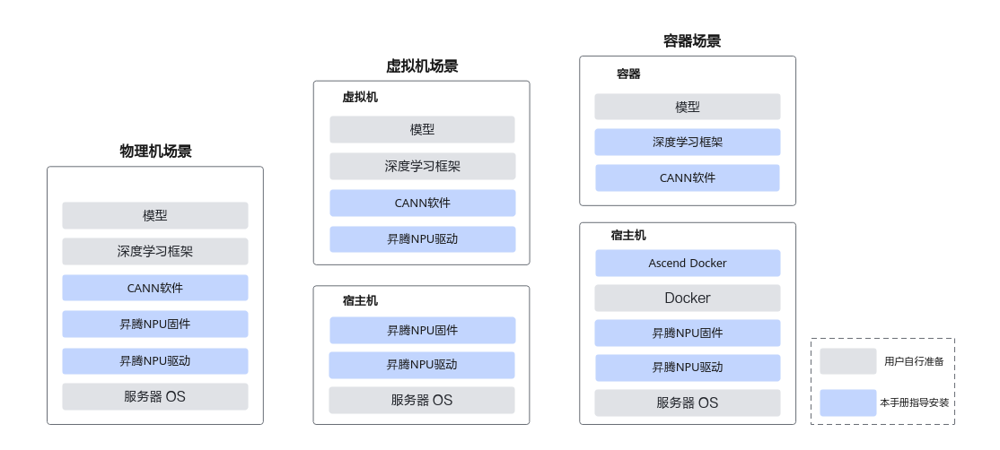
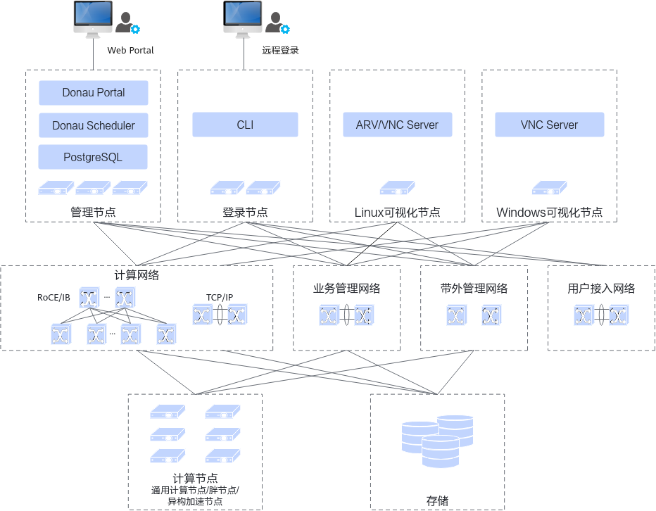
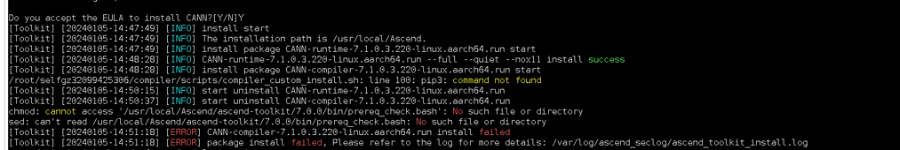

# 安装说明

**资料书写要求：**

_重点介绍xx软件“概念”类知识，安装方案、安装的场景、环境要求和配套信息。需要包含：_

- _软件或工具是什么_，_什么场景下使用_，_使用该软件的作用或目的是什么_
- _如果有多种安装方式，需要分别介绍，且需要给出什么场景下选择哪种安装方式的建议。（本样例已做了场景选择，此处不描述具体安装建议）_
- _介绍安装部署整体架构时，通过安装方案方便安装人员快速了解整体情况，更好的理解后续安装流程。_
- _如果软件或工具的安装流程超过5个任务，或者有多个子场景，则需要提供安装流程图或流程说明。_
- _如果软件有硬件或者OS等环境要求，在此处加section说明。_

示例如下：

本文主要向用户介绍如何快速完成昇腾NPU（Neural-Network Processing Unit，神经网络处理器单元）驱动和固件、CANN（Compute Architecture for Neural Networks，异构计算架构）软件的安装。

**安装方案（可选）**

**资料书写要求：**

方案说明XXX，复杂场景下，建议辅以示意图或者架构图。如果安装场景单一，步骤简单，该section可以忽略。

示例如下：
本文档包含物理机、容器、虚拟机场景下，安装驱动、固件和CANN软件的方案，部署架构如下图所示。

**图 1**  安装方案  


**硬件配套和支持的操作系统**

_规则：昇腾全站参考[兼容性查询助手](https://www.hiascend.com/hardware/compatibility)，兼容性助手中未体现的再说明。_

**资料书写要求：**

_配套信息和约束说明，如果信息较多，建议辅以表格或者list说明。_

示例如下：

各硬件产品对应物理机部署场景支持的操作系统请参考[兼容性查询助手](https://www.hiascend.com/hardware/compatibility)。

各硬件产品对应虚拟机部署场景支持的操作系统请参考以下信息，**指导文档中提供容器操作系统为已验证过的版本，具体请以实际获取的操作系统镜像版本为准。**

**表 1**  虚拟机支持的操作系统

- Atlas 900 A3 SuperPoD：《Atlas A3 中心推理和训练硬件 24.1.RC3 NPU驱动和固件安装指南》的“虚拟机安装与卸载”章节
- Atlas 800I A2/Atlas 800T A2/Atlas 900 A2 PoD：请参考《Atlas A2 中心推理和训练硬件 24.1.0 NPU驱动和固件安装指南》中的“虚拟机安装与卸载 ”章节

# 安装前准备

**资料书写要求：**

_可以根据实际情况将“安装前准备”设置为父章节，“准备软件包”等为子章节。若内容较少时，可以提将子章节提为一级章节。_

## 准备软件包

**资料书写要求：**

_介绍安装指南需要提前获取的软件包以及特殊的配置要求，示例仅供参考，具体以实际情况为主。_

- _昇腾部署需要提前准备的所有软件包说明及获取方式，后续安装操作过程中需要用到的所有软件包都应覆盖。_
- _涉及多个软件包的时候，如果获取链接相对独立，则分别给出获取链接，如果在同一链接内，务必合一给出，指导用户用最快捷的方式获取。_
- _如果需要用户自行下载获取指定软件包，请详细给出待下载的全量软件包包名及获取地址，避免用户遗漏。_
- _此处指引用户下载的软件包，应在后续的安装步骤中均有覆盖。_
- _说明和提示信息，用一句话说清楚，必要的变量文件需给出解释。_

示例如下：

示例章节标题：准备软件包

**软件包下载**

单击[获取链接](https://www.hiascend.com/developer/download/commercial/result?module=cann)，确认版本信息后获取如下所示软件包。CANN软件包中，Toolkit、NNAE和NNRT根据业务需求选其一安装，Kernels和NNAL包根据业务需求可选安装。

CANN软件包中，Toolkit、NNAE和NNRT根据业务需求选其一安装，Kernels根据业务需求可选安装。

下载本软件即表示您同意[华为企业业务最终用户许可协议（EULA）](https://e.huawei.com/cn/about/eula)的条款和条件。

**表 1**  软件包清单

| 软件类型 | 软件包说明 | 软件包名称 | 获取链接 |
| :--- | :--- | :--- | :--- |
| 昇腾NPU驱动 | 部署在昇腾AI处理器，用于管理查询昇腾AI处理器，同时为上层CANN软件提供处理器控制、资源分配等接口。 | `Ascend-hdk-<chip_type>-npu-driver_<version>_linux-<arch>.run` | [下载软件包](https://support.huawei.com/enterprise/zh/ascend-computing/ascend-hdk-pid-252764743/software/264169686?idAbsPath=fixnode01\|23710424\|251366513\|254884019\|261408772\|252764743) |
| 昇腾NPU固件 | 固件包含昇腾AI处理器自带的OS 、电源器件和功耗管理器件控制软件，分别用于后续加载到AI处理器的模型计算、处理器启动控制和功耗控制。 | `Ascend-hdk-<chip_type>-npu-firmware_<version>.run` | [下载软件包](https://support.huawei.com/enterprise/zh/ascend-computing/ascend-hdk-pid-252764743/software/264169686?idAbsPath=fixnode01\|23710424\|251366513\|254884019\|261408772\|252764743) |
| Toolkit | CANN开发套件包，在训练&推理&开发调试场景下安装，主要用于训练和推理业务、模型转换、算子/应用/模型的开发和编译。 | `Ascend-cann-toolkit_<version>_linux-<arch>.run` | [下载软件包](https://support.huawei.com/enterprise/zh/ascend-computing/cann-pid-251168373/software/264213225?idAbsPath=fixnode01\|23710424\|251366513\|22892968\|252309113\|251168373) |
| NNAE | CANN深度学习引擎包，在训练&推理场景下安装，主要用于训练和推理业务。 | `Ascend-cann-nnae_<version>_linux-<arch>.run` | [下载软件包](https://support.huawei.com/enterprise/zh/ascend-computing/cann-pid-251168373/software/264213225?idAbsPath=fixnode01\|23710424\|251366513\|22892968\|252309113\|251168373) |
| NNRT | CANN离线推理引擎包，在边缘推理场景下安装，仅支持离线推理，主要用于应用程序的模型推理。 | `Ascend-cann-nnrt_<version>_linux-<arch>.run` | [下载软件包](https://support.huawei.com/enterprise/zh/ascend-computing/cann-pid-251168373/software/264213225?idAbsPath=fixnode01\|23710424\|251366513\|22892968\|252309113\|251168373) |
| Kernels | CANN二进制算子包，包括单算子API执行（例如aclnn类API）动态库/静态库文件，以及kernel二进制文件。<br><br>安装时需已安装Toolkit或NNAE或NNRT软件包，请选择运行设备对应产品类型和架构的Kernels软件包。 | `Atlas-A3-cann-kernels_<version>_linux-<arch>.run` | [下载软件包](https://support.huawei.com/enterprise/zh/ascend-computing/cann-pid-251168373/software/264213225?idAbsPath=fixnode01\|23710424\|251366513\|22892968\|252309113\|251168373) |
| NNAL | CANN加速库，包含面向大模型领域的ATB（Ascend Transformer Boost）加速库，可以提升大模型训练和推理性能。<br><br>安装时需已安装Toolkit或NNAE软件包。 | `Ascend-cann-nnal_<version>_linux-<arch>.run` | [下载软件包](https://support.huawei.com/enterprise/zh/ascend-computing/cann-pid-251168373/software/264213225?idAbsPath=fixnode01\|23710424\|251366513\|22892968\|252309113\|251168373) |

> **说明：** 
>
>- <version>表示软件版本号
>- <arch\>表示CPU架构
>- <type>表示产品类型
>- <chip\_type>表示处理器类型

**软件数字签名验证**

**资料书写要求：**

_必要的验签等操作，按照用户获取软件包的操作顺序提供对应指导。_

- _对于从Support__等华为官方平台获取的软件包，应给出软件包完全性校验方法说明及校验步骤指引，以保证内容一致性。_
- _如果在软件部署过程中，例如通过工具化自动部署中包含了一致性校验步骤，本部分内容也可以不提供。_

为了防止软件包在传递过程或存储期间被恶意篡改，下载软件包时需下载对应的数字签名文件用于完整性验证。

请单击[PGP数字签名工具包](https://support.huawei.com/enterprise/zh/tool/pgp-verify-TL1000000054)获取工具包，将工具包解压后，请参考文件夹中的《OpenPGP签名验证指南》，对下载的软件包进行PGP数字签名校验。如果校验失败，请不要使用该软件包，访问支持与服务在论坛求助或提交技术工单。

**准备工具**

**资料书写要求：**

_安装前需要用户获取的工具，__按照用户的操作顺序提供对应指导。此节内容可以根据实际操作步骤的难易程度，可选为一个section或者topic。_

**准备License**

**资料书写要求：**

_必要的申请License等，按照用户的操作顺序提供对应指导。如果在软件部署过程中，例如通过工具化自动部署中包含了License，本部分内容也可以不提供。_

在DonauKit安装前或安装完成后都可以申请License，用户可根据自身需求选择License申请时间。详细操作请参见《Kunpeng DonauKit 25.1.RC1 License使用指南》获取ESN并申请License。

- 由于申请License要等待的审批时间较长，建议用户在DonauKit安装前使用Linux命令行获取ESN，相较于DonauKit安装后再获取ESN来申请License的方式可节约时间。
- DonauKit安装完成后，用户可使用Donau Scheduler CLI命令行或Donau Portal界面获取ESN。

## 准备用户（可选）

**资料书写要求：**

_如果对安装用户没有特殊要求或者约束，则忽略本章节。_

- _主要介绍软件包的安装用户或者其他运行用户的创建方式和使用约束。_
- _复杂的说明信息，用note展示。_

示例如下：

- 安装用户：安装NPU驱动、固件和CANN软件包的用户。
- 运行用户：在NPU驱动、固件和CANN上运行业务的用户。

请参考[表1](#table51451614142817)中的介绍，创建安装和运行用户。

**表 1**  用户类型

| 组件 | 安装用户 | 运行用户 |
| :--- | :--- | :--- |
| 驱动和固件 | root | - 由于安装驱动固件时，运行用户和用户组默认指定为HwHiAiUser，需在安装软件包前自行创建HwHiAiUser的运行用户和用户组。<br>- 若创建的用户和用户组是非HwHiAiUser，安装驱动和固件时必须指定运行用户。 |
| CANN | root | 支持所有用户运行业务。 |
| CANN | 非root | - CANN软件使用`--install-for-all`参数安装时，支持所有用户运行业务。<br>- CANN软件未使用`--install-for-all`参数时，安装用户和运行用户必须为同一个。 |

**本文档中的示例步骤使用的用户如下：**

- 以root用户安装驱动、固件。
- 以非root用户HwHiAiUser（驱动固件的默认运行用户）安装CANN软件。

执行如下示例命令，创建HwHiAiUser用户和用户属组：

``` bash
groupadd HwHiAiUser
useradd -g HwHiAiUser -d /home/HwHiAiUser -m HwHiAiUser -s /bin/bash
```

若想创建其他用户时，可以参考如下步骤。需注意，若安装驱动固件时未使用--install-for-all参数，CANN软件包运行用户需与驱动固件的运行用户为同一个用户属组。

以下命令请以root用户执行，<_usergroup_\>和<_username_\>请自行替换为实际用户名：

1. 创建非root用户。

    ``` bash
    groupadd <usergroup>
    useradd -g <usergroup> -d /home/<username> -m <username> -s /bin/bash
    ```

2. 设置非root用户密码。

    ``` bash
    passwd <username>
    ```

>**说明：** 
>
>- CANN运行用户不建议为root用户属组，权限控制可能存在安全风险，请谨慎使用。
>- 创建完运行用户后， 请勿关闭该用户的登录认证功能。
>- 设置的口令需符合口令复杂度要求（请参见[口令复杂度要求](zh-cn_topic_0000002167106473.md)）。密码有效期为90天，您可以在/etc/login.defs文件中修改有效期的天数，或者通过chage命令来设置用户的有效期，详情请参见[设置用户有效期](zh-cn_topic_0000002131667080.md)。

# 安装规划（可选）

**资料书写要求**

安装步骤前，需要用户准备的内容包括组网、用户、IP地址等，且操作步骤复杂，请使用“安装规划”章节。如果内容较少，可以使用安装前准备。

## 组网规划

_描述产品的典型组网配置方案，针对关键组网进行说明。_

**典型组网**

_资料书写要求：给出总体组网图示例。__给用户提供一个基础的组网印象。__若包含多个网络平面（__包括管理面，业务面，控制面__），需要对网络平面有明确的说明。_

_示例：_

**图 1** DonauKit的典型组网图  


_资料书写要求：需要针对组网图中元素进行说明。_

_示例：_

**表 1**  典型组网图介绍

| 项目 | 说明 |
| :--- | :--- |
| 计算网络 | 用于计算节点间通信，节点间通过RoCE或IB进行通信。 |
| 业务管理网络 | 用于管理集群中的资源。 |
| 带外管理网络 | 用于监控集群中物理设备状态。 |

**组网规划**

_针对上述典型组网，分场景进行组网规划，指导用户判断该产品是在什么样的现有环境下，可选用的哪种典型规格的安装。_

_资料书写要求：组网规划中需包含不同的组网需要的节点/软硬件型号、数量，并说明针对这些不同配置可达到的业务规模。方便读者结合自己部署的现有环境和业务规模使用本文档的内容。在实际中如果不是本文提供的典型规格，或在部署过程中不能完全照搬文档的规划和安装步骤，需要调整或适配本文档内容予以使用，特此说明。_

_示例：_

| 方案类型 | 部署类型 | 节点数量及性能规格 | 日作业规模 | 管理登录节点推荐配置 |
| :--- | :--- | :--- | :--- | :--- |
| 非HA方案 | xx与xxxx合并部署 | - 管理节点：1个<br>- 登录节点：1个<br>- 计算节点数：≤200（单节点核数≥128） | - xx：12W<br>- xxxx：12W | - 节点配置：32核 + 64GB DDR4<br>- 节点硬盘配置：双硬盘（读写混合型）+ RAID 1 |
| 非HA方案 | xx与xxxx分离部署 | - 管理节点：2个<br>- 登录节点：1个<br>- 计算节点数：≤1000（单节点核数≥128） | - xx：60W<br>- xxxx：60W | - 节点配置：64核 + 128GB DDR4<br>- 节点硬盘配置：双硬盘（读写混合型）+ RAID 1 |

## IP地址及主机名规划

_介绍软/硬件的IP地址及主机名规划。根据典型组网规划，对不同网络面的IP及主机名进行划分。_

_资料书写要求：建议先写明一个概述，表明本章节会规划哪些IP以及IP数量。__本章节可根据实际情况进行修改或裁剪。_

_示例：_

本节以非HA方案的Donau Scheduler与Donau Portal合并部署场景为例给出IP地址及主机名示例。详细请参见[表1](#ta66d14a6f72b4835a5223d6ea326c8c5)。

- 管理节点数量：1个，部署Donau Portal、Donau Scheduler Master、Donau Scheduler CLI、数据库和Donau OM服务。
- 计算节点数量：≤200个，部署Donau Scheduler Agent服务。
- 登录节点数量：1个，部署Donau Scheduler CLI服务。
- 可视化节点数量：1个或多个，部署可视化服务，可使用计算节点。

**表 1**  IP地址规划示例

| 网络层面 | 项目 | IP类型 | IP地址示例 | 主机名示例 | 说明 |
| :--- | :--- | :--- | :--- | :--- | :--- |
| - 业务网络<br>- 管理网络<br>- …… | 管理节点 | - 静态IP<br>- 浮动IP | 192.168.1.4 | master01 | Donau Portal、Donau Portal数据库、Donau OM、Donau Scheduler Master、和Donau Scheduler数据库安装节点的IP地址及主机名。 |

## 用户规划

_规划安装前需要手动创建的用户，若对安装用户、业务用户无要求或软件会自动创建，则不需要规划该内容。_

_资料书写要求：_

_1、需要说明用户/用户组命令要求、用户密码要求，且该要求符合软件和安全要求。_

_2、给出推荐的用户名示例。_

_3、写明用户创建必要性和创建的节点_。

_示例：_

**用户名设置要求**

- 长度不超过64个字符，实际接入其他第三方认证系统时，如果第三方系统长度限制小于64个字符，以第三方系统为准，例如：OS支持长度最大32个字符。
- 用户名只允许以大写字母（A\~Z）、小写字母（a\~z）、数字（0\~9）、下划线（\_）开头。
- 用户名只允许包含大写字母（A\~Z）、小写字母（a\~z）、数字（0\~9）、下划线（\_）、空格以及特殊字符（-或.）。
- 用户名不支持连续点符号（.）。

**用户组名要求**

- 长度不超过128个字符，实际接入其他第三方认证系统时，如果第三方系统长度限制小于128个字符，以第三方系统为准，例如：OS支持长度最大32个字符。
- 用户组名只允许以大写字母（A\~Z）、小写字母（a\~z）、数字（0\~9）、下划线（\_）开头。
- 用户组名只允许包含大写字母（A\~Z）、小写字母（a\~z）、数字（0\~9）、下划线（\_）、空格以及特殊字符（-）。

**密码复杂度要求**

- 密码长度至少16个字符。
- 密码必须包含如下至少两种字符的组合：
    - 至少一个小写字母
    - 至少一个大写字母
    - 至少一个数字
    - 至少一个特殊字符：\`\~!@\#$%^&\*\(\)-\_=+|\[\]:",<.\>/?

- 密码不能和账户名一样。
- 密码请勿使用弱口令，例如sps600@HW、9061cslX@、IMS\_spg2800等。
- 数据库密码不允许包含半角单引号。
- 建议用户90天内修改密码。

示例：

| 用户 | 用户名示例 | 创建节点 | 创建说明 |
| :--- | :--- | :--- | :--- |
| DonauKit运维登录用户 | donau_guest | 高性能计算集群所有节点 | 必须创建。<br><br>用于DonauKit运维登录，系统加固后可远程登录服务器。 |

## 业务规划

_规划本产品安装时需要填写的业务相关的内容，可包含数据库管理员名称及密码、数据表名称、安全证书密码和信任库密码等内容。本章节可根据实际情况进行修改或裁剪。_

_资料书写要求：_

_1、用户不感知的内容不需要写入。_

_2、写入的内容需要说明在什么时候使用_。

_示例：_

规划PostgreSQL数据库用户密码。

| 项目 | 名称 | 说明 | 创建条件 |
| :--- | :--- | :--- | :--- |
| PostgreSQL数据库的系统管理员 | postgres | PostgreSQL数据库的系统管理员为postgres，用于创建xx数据库。 | 安装xx时自动创建该用户，但需要手动设置其密码。 |

## 共享目录规划

_基于已有共享存储自定义配置本产品所需的共享目录。_

_资料书写要求：_

_1、说明该目录的用途、规划的必要性、所需的空间大小和权限要求。_

_2、若使用不同的存储挂载，需写明存储类型、挂载协议。_

_3、若对挂载的存储有其他要求，也需要进行说明。_

_示例：_

- 共享目录属主、属组对应的UID、GID，在服务端以及所有客户端必须保持一致。
- 所有节点挂载共享存储的本地目录必须一致。
- 如下共享目录名称只能由字母、数字、特殊字符（.:_-,）组成，且每级目录必须以字母、数字、_或.开头。

| 项目 | 服务端 | 目录类型（可选） | 服务端共享目录示例 | 客户端 | 客户端共享目录示例 | 目录权限要求 | 空间最小要求 | 说明 |
| :--- | :--- | :--- | :--- | :--- | :--- | :--- | :--- | :--- |
| 管理数据共享目录 | 文件服务器 | 业务目录 | /share/donau | DonauKit集群所有节点 | /share/donau | 属主：root<br>属组：root<br>权限：755 | 10TB | 业务目录的统一目录。<br><br>该目录下存放OS镜像、第三方依赖软件包和DonauKit软件包和业务数据。 |

# 安装步骤

当前模板按照子章节的方式生成大纲，实际使用时请根据安装内容的复杂度，灵活调节对应内容为section或者topic。

## 确认XX（检查安装环境）

**资料书写要求：**

- _安装前，如果对环境或网络有约束，建议进行环境或网络检查，必要时需给出检查指令。_
- _特殊场景下的安装条件，建议给出__相关参考说明或外部参考链接。_
- _告知用户在什么前提下可以使用此功能，在不满足某个条件时，提供对应指导的超链接或替代方案。信息分类合理，采用无序列表等形式，避免大段的纯文字描述。如果只有一个前提则使用正文样式。_
- _前提条件中的操作需要是用户可判断可操作可执行的，不能只提要求不写确认方法。_
- _如果前提条件是后面多个页面操作的共同前提，且该前提操作确认方法比较复杂，建议把该前提条件独立出来，涉及到的页面做引用，例如检查源。_

示例如下：

- 请参考本文档正确安装和使用CANN软件，不建议将CANN安装在共享磁盘后，通过挂载的方式使用CANN，因为CANN对文件系统有文件锁的依赖，部分共享存储不支持文件锁，可能导致任务拉起失败。
- root用户和非root用户安装CANN软件包的步骤一致，当前示例步骤以非root用户为例。

## 安装依赖

**资料书写要求：**

_如果安装该软件或工具需要依赖其他第三方的依赖包、库等，则需要提供对应依赖包的安装指导。如果不同依赖包的安装操作仅有1-2个步骤，建议采用主步骤方式区分。如果不同依赖包的安装操作比较复杂，建议采用topic方式区分。_

_写作注意点：_

- _安装依赖前，如果对环境有约束，建议分section检查环境信息，必要时需给出检查指令。_
- _操作指令用screen标记对，打codetype标签，需要强调的变量参数用斜体显示修改，需要特殊修改了说明含义_。
- _命令执行后的回显，建议用截图或者screen标记对（打codetype的coldfusion标签）。_
- _如果执行的命令中包含多个参数，针对需要修改的参数，需要提供命令中参数含义解释。_
- _表格、图片等需要建立引用。_

示例如下：

安装前需确保已具备Python环境及pip3，当前CANN支持Python3.7.x至3.11.4版本，若不满足可执行以下命令安装。

Debian系列：

``` bash
sudo apt-get install -y python3 python3-pip
```

openEuler系列：

``` bash
sudo yum install -y python3 python3-pip
```

## 安装XX

**资料书写要求：**

_昇腾推荐用户使用run包格式安装，本节提供run格式软件包step by step的安装方法。如果安装时，涉及不同的软件包，建议采用Section方式区分。_

如果涉及不同的安装方式，则分为不同的topic，标题中需说明“方式一：XX安装”，“方式二：XX安装”。可参考[安装XX（XXX场景）]。

_写作注意点：_

- _安装前，如果对环境有约束，在操作步骤开始前说明，必要时需给出检查指令。_
- _如果软件包的种类较多，需要在对应section下的操作步骤前，正文说明软件包的功能和建议安装的场景。_
- _操作指令需为方便用户直接复制的，建议减少注释信息在screen标记对中，而是放在命令后辅助说明。_
- _操作指令用screen标记对，打codetype标签，需要强调的变量参数用<\>斜体显示修改，需要特殊修改了说明含义_。
- _命令执行后的回显，建议用在screen标记对里的文本（打codetype的coldfusion标签）。截图效果比screen效果更好时，可以用截图。_
- _如果执行的命令中包含多个参数，针对需要修改的参数，需要提供参数说明的超链接。_
- _表格、图片等需要建立引用。_

示例参考：

**安装Toolkit开发套件包**

**CANN Toolkit开发套件包，在训练&推理&开发调试场景**下安装，主要用于训练和推理业务、模型转换、算子/应用/模型的开发和编译。

>**须知：** 
>安装Toolkit软件前请确保安装目录可用空间大于10G，如不满足请清理空间或更换安装目录。

1. 增加对软件包的可执行权限。

    ``` bash
    chmod +x Ascend-cann-toolkit_<version>_linux-<arch>.run
    ```

2. 安装软件包（安装命令支持--install-path=\<path\>等参数，具体使用方式请参见[参数说明](参数说明.md)）。

    ``` bash
    ./Ascend-cann-toolkit_<version>_linux-<arch>.run --install
    ```

    执行安装命令时，会自动执行**--check**参数，校验软件包的一致性和完整性，出现如下回显信息，表示软件包校验成功。

    ``` bash
    Verifying archive integrity...  100%   SHA256 checksums are OK. All good.
    ```

    执行以上命令会显示[华为企业业务最终用户许可协议（EULA）](https://e.huawei.com/cn/about/eula)的条款和条件，请输入**Y**或**y**同意协议，继续安装流程。

    安装完成后，若显示如下信息，则说明软件安装成功：

    ``` bash
    xxx install success
    ```

    xxx表示安装的实际软件包名。

    如果用户未指定安装路径，则软件会安装到默认路径下，默认安装路径如下。root用户：“/usr/local/Ascend”，非root用户：“_$\{HOME\}_/Ascend”，_$\{HOME\}_为当前用户目录。

3. 配置环境变量，当前以非root用户安装后的默认路径为例，请用户根据set\_env.sh的实际路径执行如下命令。

    ``` bash
    source ${HOME}/Ascend/ascend-toolkit/set_env.sh
    ```

    上述环境变量配置只在当前窗口生效，用户可以按需将以上命令写入环境变量配置文件（如.bashrc文件）。

更多建议：

- _采用step by step方式写作，一个步骤一个动作。步骤要具体、可操作。例如，不要只写“配置XXX。”要写“配置XXX，参数说明如XXX所示。”或“执行如下操作命令，配置XXX。”再如：不能写“检查xx状态是否正常”，要写“执行xx命令检查xx状态是否正常”。_
- _操作步骤完整，可指导用户完成整个任务，避免在任务结束前跳转至其他页面；如必须跳转至某页面，要精准定位到具体Section，而非整个页面。_
- _对于复杂或者关键操作，提供示意图、界面截图或操作动图，辅助用户理解。截图中的参数填写内容和参数说明中的取值样例内容保持一致。_
- _对于可能会出错的步骤，给出对应出错后的处理建议。_
    - _内容少：一句话在出错状态的步骤中描述_
    - _内容多：写成FAQ，此处做链接_

- _提供结果验证方式，以下方式可供参考：_
    - _界面上的资源状态变化_
    - _出现标志性界面或回显提示信息_
    - _执行命令测试，若步骤复杂，可以独立为section/topic，参见可提供超链接_
    - _查看进程变化_

## 安装后检查（可选）

**资料书写要求：**

_给出对应查看命令或者具体打印信息。当存在多种安装场景或者安装方式时，验证安装成功的操作_放在统一的章节下。_

# 安装XX（XXX场景）

**资料书写要求：**

- _如果有多种安装场景，但是整体操作流程不一致时，请提供同级的topic，对其他安装场景进行说明。并在标题中添加（场景名称）。_
- _准备软件包/用户如果在不同场景下，操作方式不同，可以将所需章节放在不同安装方式下，成为子章节。_

特殊规则：

涉及到开源软件包，必须提供一种**离线安装**的方式。

## 方式一：XX安装方式

_细节描述和示例请参考“安装步骤”。_

## 方式二：XX安装方式

_细节描述和示例请参考“安装步骤”。_

# 安装后配置

规则：

安装后必须要配置的，需要安装步骤提供超链接引导本章节，或者将安装后配置列为单独的section，通过超链接进行引导。

资料书写要求：

本节可提供安装后软件后，用户必选或者可选的配置操作，与安装整体的步骤分离，不干扰用户的安装操作。

验证软件安装后，功能是否正常的操作步骤，比如提供一个运行样例。

部分特殊场景下，运行业务所需的配置。

示例如下：

**运行推理样例**

可通过运行一个简单的推理样例，来验证CANN安装的完整性。

单击[链接](https://gitee.com/ascend/samples/tree/master/cplusplus/level2_simple_inference/1_classification/resnet50_firstapp)获取快速入门样例，并按README.md中的指导下载样例、准备模型、准备测试图片、编译及运行应用，如果CANN软件安装配置正确，则输出的结果会类似于样例中示例信息。

``` ColdFusion
top 1: index[162] value[0.954676]
top 2: index[161] value[0.033442]
top 3: index[166] value[0.006534]
top 4: index[167] value[0.004561]
top 5: index[163] value[0.000315]
```

**配置最大线程数（可选）**

训练场景下，OS的最大线程数可能不满足训练要求，以root用户执行以下命令修改最大线程数为无限制。

1. 配置环境变量，修改线程数为无限制，打开“/etc/profile“文件。

    ``` bash
    vi /etc/profile
    ```

2. 添加如下内容后保存退出。

    ``` bash
    ulimit -u unlimited
    ```

3. 执行如下命令使环境变量生效。

    ``` bash
    source /etc/profile
    ```

# 升级（可选）

规则：

针对单软件，流程简单（如：一条指令），可写在《安装指南》中，其他情况下需独立为《升级指导书》。

资料书写要求：

1. 正常升级需提供“升级前必读”和“升级操作”章节。
2. 部分产品未提供升级参数，但需提供“升级”章节，并说明建议的操作步骤。如覆盖安装后卸载后安装。

示例如下：

1. 需要先手动卸载旧版本，具体可参见“卸载”章节。
2. 安装新版本，具体可参见“安装步骤”进行操作。

## 升级前必读

资料书写要求：

_升级前必读由“升级影响”、“注意事项”、“升级流程（可选）”三个section组成。_

_升级影响补充升级前需要用户关注的重点信息，比如升级过程不能打断业务等。_

_注意事项：升级前，对软件版本的评估事项，跟步骤强相关不能放在这里，应该放在具体操作中。_

_升级流程（可选）：若升级时，对升级顺序和操作有要求，需提前在该section下说明。_

示例如下：

**升级影响**

- 升级过程禁止进行其他维护操作动作。
- 软件版本升级过程中会导致业务中断。

**注意事项**

软件版本升级时的注意事项如下表所示。

**表 1**  升级时注意事项

| 序号 | 描述 |
| :--- | :--- |
| 1 | 在进行升级操作之前，请仔细阅读本文档，确定已经理解全部内容。 |
| 2 | 为了减少对业务的影响，请提前切走业务或停止业务再进行升级操作。 |
| 3 | 升级后，请确保所有软件满足版本配套关系。 |
| 4 | 如果需要从高版本回退至低版本，需卸载高版本后重新安装所需版本。 |
| 5 | 默认会升级安装目录下，latest软链接指向的版本。 |

**升级流程**

- 在驱动、固件和CANN软件配套场景下，可单独升级CANN软件。驱动和固件和CANN的配套关系，请单击[CANN](https://support.huawei.com/enterprise/zh/ascend-computing/cann-pid-251168373/software/)并选择对应版本，查看版本说明书中的版本配套表。

- 如果同时升级固件和驱动，请按照“固件 > 驱动 > CANN软件”的顺序进行升级。

## 升级操作

资料书写要求：

_升级和安装类似，细节描述和示例请参考“安装步骤”。_

示例如下：

**升级步骤**

1. 以安装用户登录安装环境，并进入软件包所在路径。
2. 执行如下命令，增加软件包的可执行权限，校验软件包安装文件的一致性和完整性（其中_**xxx**_**.run**请根据实际软件包全名替换）。

    ``` bash
    chmod +x xxx.run
    ```

3. 软件包升级。

    ``` bash
    ./xxx.run --upgrade
    ```

    执行升级命令时，会自动执行**--check**参数，校验软件包的一致性和完整性，出现如下回显信息，表示软件包校验成功。

    ``` bash
    Verifying archive integrity...  100%   SHA256 checksums are OK. All good.
    ```

    执行以上命令会显示[华为企业业务最终用户许可协议（EULA）](https://e.huawei.com/cn/about/eula)的条款和条件，请输入**Y**或**y**同意协议，继续升级流程。

    升级完成后，若显示如下信息，则说明软件升级成功：

    ``` ColdFusion
    xxx upgrade success
    ```

    _xxx_表示升级成功的实际软件包名。

# 卸载

资料书写要求：

_卸载和安装类似，细节描述和示例请参考“安装步骤”。_

示例如下：

**脚本卸载（推荐）**

xxx.run格式离线安装后，用户可以通过卸载脚本完成卸载，执行如下步骤：

1. 进入卸载脚本所在路径。

    - Toolkit：

        ``` bash
        cd <path>/ascend-toolkit/<version>/<arch>-linux/script
        ```

    - 单独卸载Kernels（以跟随Toolkit安装的路径为例）：

        ``` bash
        cd <path>/ascend-toolkit/<version>/opp_kernel/script
        ```

    其中\<path>为软件包的安装路径，\<version>为软件包版本，\<arch>-linux为CPU架构，请用户根据实际情况替换。

2. 执行**./uninstall.sh**命令运行脚本，完成卸载。

    卸载完成后，若显示如下信息，则说明软件卸载成功：

    ``` ColdFusion
    [INFO] xxx uninstall success
    ```

    xxx表示卸载的实际软件包名。

# 安全加固（可选）

资料书写要求：

请以各个组件安全SE的提供的为准。

如果提供的是单本，“安装后配置”中需要有指引到《安全加固》手册链接。一般情况下，可以包含在《安装指南》的目录中。

# 附录A：参考信息（可选）

资料书写要求：

_附录包含非主流程信息或者参考信息。以下为参数说明为例。_

## 参数说明

本章节介绍了run格式软件包相关参数说明，run格式软件包支持通过命令行参数进行一键式安装，各个命令之间可以配合使用，用户根据安装需要选择对应参数，所有参数都是可选参数。

安装命令格式：**./**xxx.run [options]

详细参数请参见下表。

>**须知：** 
>
>- 如果通过**./xxx.run --help**命令查询出的参数未解释在如下表格，则说明该参数为预留参数或适用于其他产品类型，用户无需关注。
>- 以下参数未展示在--help参数中，用户请勿直接使用。
>   - --xwin：使用xwin模式运行。
>   - --phase2：要求执行第二步动作。

**表 1**  参数说明

| 参数 | 说明 |
| :--- | :--- |
| --help \| -h | 查询帮助信息。 |
| --info | 查询软件包构建信息。 |
| --list | 查询软件包文件列表。 |
| --check | 检查软件包的一致性和完整性。 |
| --quiet \| -q | 静默安装或升级，跳过交互式信息，需配合--install或--upgrade参数使用。<br><br>使用此参数安装或升级时，将默认签署 [华为企业业务最终用户许可协议（EULA）](https://e.huawei.com/cn/about/eula)。 |
| --nox11 | 不使用x11模式运行。 |
| --noexec | 不执行安装脚本。配套--extract=&lt;path&gt;使用，格式为：--noexec --extract=&lt;path&gt;。 |
| --extract=&lt;path&gt; | 解压软件包中文件到指定目录。使用该参数时，用户无需手动建立指定的目录，解压过程中会自动创建，例如：--noexec --extract=./package，则命令执行后会自动将解压后的内容放在package目录。 |
| --tar arg1 [arg2 ...] | 对软件包执行tar命令，使用tar后面的参数作为命令的参数。例如执行 --tar xvf 命令，解压run安装包的内容到当前目录。 |
| --install | 安装软件包。后面可以指定安装路径--install-path=&lt;path&gt;，也可以不指定安装路径，直接安装到默认路径下。 |
| --devel | 仅软件包toolkit，nnrt，kernels支持使用该参数。<br><br>按照开发模式安装软件包，即只安装开发环境需安装的文件。 |
| --full | 仅软件包toolkit支持使用该参数。<br><br>支持在无驱动场景下实现全量安装。 |
| --install-path=&lt;path&gt; | 指定操作路径，需配合安装--install、升级--upgrade和卸载--uninstall参数使用。<br><br>当环境上已存在全局配置文件“ascend_cann_install.info”时，该参数指定的路径会自动重置该文件中的安装路径，并在原路径下创建时间戳文件夹，备份旧配置文件。<br><br>可在如下目录查看是否存在全局配置文件“ascend_cann_install.info”：<br>- root用户：/etc/Ascend<br>- 非root用户： $ {HOME}/Ascend<br><br>若不指定，将安装到默认路径下：<br>- 若使用root用户安装，默认安装路径为：/usr/local/Ascend。<br>- 若使用非root用户安装，则默认安装路径为： $ {HOME}/Ascend。<br><br>若通过该参数指定了安装目录，root用户需要对指定的安装路径有755权限，非root用户需要750权限。 |
| --install-for-all | 安装或升级时，允许其他用户具有安装用户组的权限。<br><br>当安装或者升级携带该参数时，支持其他用户使用CANN运行业务，但该参数存在安全风险，请谨慎使用。<br><br>该参数需要与--install、--devel、--upgrade等其中一个参数配合使用，例如：<br>`./xxx.run --install --install-for-all` |
| --force | 强制安装、升级命令。当安装、升级检测不通过导致安装或升级失败时，则会提示用户使用该参数跳过安装检测，使用后方可安装或升级成功。<br><br>该参数需要配合--install、--upgrade、--devel或--full一起使用。 |
| --torch_atb | 仅软件包nnal支持使用该参数。<br><br>安装Python库时使用，需配合--install和--upgrade参数使用。<br><br>需注意，Python库会安装在Python的site-packages目录下，示例路径：“/usr/local/python3.10/lib/python3.10/site-packages”，可执行如下命令查看已安装Python库版本。<br>`pip3 list` |
| --feature | 仅软件包toolkit、nnrt、nnae、kernels支持使用该参数。<br><br>toolkit、nnrt、nnae安装/升级时和kernels安装时可以通过该参数指定某些特性。<br>- toolkit、nnrt、nnae软件包当前取值仅支持输入“ascendc”，表示只安装公共必选的文件和已标识AscendC算子开发特性的文件，未标识AscendC算子开发特性的文件会跳过不安装。需注意，ascendc特性只包括Kernel开发（基于Kernel Launch算子工程，通过基础调用方式调用算子），不包含ACLNN开发（通过单算子API执行的方式开发单算子调用应用）。<br>  该参数需要与--install、--devel、--full、--upgrade配合使用，例如：<br>  `./xxx.run --install --feature=ascendc`<br>- kernels软件包当前取值范围如下，支持单个或者多个特性同时输入：<br>  - aclnn_ops_infer：NN网络算子推理库。由于推理库依赖数学库，安装时会包含标识aclnn_ops_infer和aclnn_math特性的文件。<br>  - aclnn_ops_train：NN网络算子训练库。由于训练库依赖推理库、随机数算子库和数学库，安装时会包含标识aclnn_ops_train、aclnn_ops_infer、aclnn_rand和aclnn_math的文件。<br>  - aclnn_math：数学算子库。<br>  - aclnn_rand：随机数算子库。<br>  示例命令如下<br>  `./Ascend-cann-kernels-<chip_type>_<version>_linux-<arch>.run --install --feature=aclnn_ops_infer` |
| --whitelist=&lt;feature_type&gt; | 可选安装白名单，用于在执行安装或升级的时候指定部分可选安装特性，需根据参数功能配合--install和--upgrade一起使用。<br><br>仅软件包toolkit、nnae支持使用的参数。<br>- nnae：仅安装nnae包相关特性，用于支持离线推理、在线推理、训练以及IR构图场景。仅支持toolkit包使用。<br>- nnrt：仅安装nnrt包相关特性，用于支持离线推理场景。仅支持toolkit包使用。<br>- hccl：仅安装hccl基础依赖包和nnrt包，主要用于多机多卡推理场景，支持toolkit和nnae包使用。<br>- hccl-only：仅安装hccl基础依赖包，支持toolkit和nnae包使用。<br>- opp：仅独立升级opp算子包，支持toolkit和nnae包配合“--upgrade”参数升级时使用（支持8.1.RC1之后的版本使用）。<br>- atc：仅安装ATC转换工具特性，用于支持模型编译、模型转换。仅支持toolkit包使用。<br>- devtools：仅安装开发工具包，主要为调测、仿真工具。选择安装该特性时请配套安装nnae。仅支持toolkit包使用。<br><br>仅软件包nnal支持使用的参数。<br>- atb：只安装ATB加速库。<br>- SIP：只安装SiP加速库。<br>- all：同时安装ATB加速库和SiP加速库。 |
| --chip=&lt;chip_type&gt; | 仅软件包toolkit、nnrt、nnae支持使用该参数。未指定此参数时，默认安装软件包内的全部AICPU算子包。<br><br>指定昇腾产品类型，以便在安装过程中选择匹配的软件（如AICPU算子包）。 |
| --upgrade | 升级已安装的软件，支持在低版本升级至高版本场景下使用。<br><br>如果需要从高版本回退至低版本，需卸载高版本后重新安装所需版本。 |
| --feature-list=&lt;feature&gt; | 仅软件包toolkit、nnae支持使用该参数。<br><br>指定升级特性。仅支持升级使用，参数仅支持输入“Acclibs”（独立升级算子包），如“--feature-list=Acclibs”。<br><br>该参数需要配合“--upgrade”一起使用。 |
| --uninstall | 卸载已安装的软件。 |
| --type=&lt;package_type&gt; | 仅软件包kernels支持使用该参数。<br><br>指定已安装的CANN软件包类型，用于在执行安装（--install）时指定跟随安装的软件包（nnae、nnrt或toolkit），以识别到具体的安装目录。该参数需要配合--install或--uninstall或--upgrade一起使用。 |
| --version | 查询版本信息。 |

# 附录B：常用操作（可选）

_本章节包含安装过程中常用的操作指导，但是不需要体现在主流程中的。_

# 附录C：FAQ

_规则：安装指南前面的操作章节若有引用的FAQ需要放在该章节，安装流程无引用的直接放在昇腾社区的故障案例库中。_

- _本章节包含安装过程中可能遇到的相关问题及故障排查指导。_
- _常见问题可根据实际情况看是否需要分类，若常见问题较多，则按业务场景分类组织目录。_

示例如以下topic：

## 安装CANN包时报错pip3：command not found

**问题描述**

安装CANN软件包的时候，报错pip3：command not found，导致安装中止。

**图 1**  报错截图 


**可能原因**

CANN软件包中部分组件依赖pip3进行安装，但当前环境pip3命令不生效，可能是未配置相关环境变量。

**解决措施**

以配置Python3.7.5环境变量为例，请根据实际情况修改Python所在路径。

``` bash
#用于设置python3.7.5库文件路径
export LD_LIBRARY_PATH=/usr/local/python3.7.5/lib:$LD_LIBRARY_PATH
#如果用户环境存在多个python3版本，则指定使用python3.7.5版本
export PATH=/usr/local/python3.7.5/bin:$PATH
```

通过以上export方式设置环境变量，该种方式设置的环境变量只在当前窗口有效。

您也可以通过将以上命令写入\~/.bashrc文件中，然后执行如下命令，使上述环境变量永久生效。

``` bash
source ~/.bashrc
```

注意如果后续您有使用环境上其他python版本的需求，则不建议将以上命令写入到\~/.bashrc文件中。
