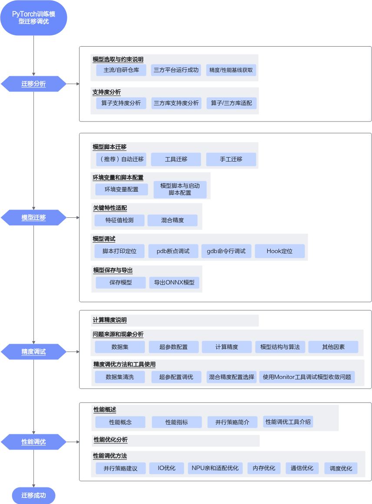
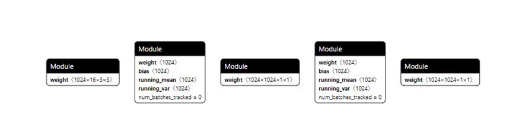

# 概述

从概念类知识入手简要介绍xxx迁移，需要包括：

-   xxx迁移是什么
-   为什么要做xxx迁移
-   面向客户群体
-   怎么做xxx迁移

写作要求：

内容较多时各模块分section写作。

**【写作样例】**

PyTorch作为当前深度学习领域中广泛采用的框架之一，经过Ascend Extension for PyTorch对昇腾平台的兼容性适配，现已支持在昇腾平台上高效运行。

本手册的主要目标是指导具有一定PyTorch模型训练基础的用户将原本在其他硬件平台（例如GPU）上训练的模型迁移到昇腾平台（NPU）。

手册内容涵盖模型全流程的迁移方法，无论是针对小模型还是大模型，都提供了详尽的指导。主要关注点是如何有效地将PyTorch训练模型迁移至昇腾平台上，并在合理精度误差范围内高性能运行。

本手册面向的读者主要是具有一定深度学习基础与编程经验的研究人员、工程师和开发者：

-   了解深度学习的基本概念和技术，能够使用Python编程语言、PyTorch框架进行深度学习模型开发和调试；
-   对深度学习模型的训练和优化有一定的了解，包括训练任务执行与评估，分布式训练，性能数据采集及分析等；
-   对常见的系统性能优化手段有基本认知，例如并行化、编译优化等。

**什么是模型迁移**

模型迁移是指将原本运行在GPU或其他硬件平台的深度学习模型迁移至NPU，并保障模型在合理精度误差范围内高性能运行。

**为什么要做模型迁移**

将模型从其他硬件平台迁移到NPU时，由于硬件架构和库的不同，涉及到一系列底层到上层的适配操作。以GPU为例，模型迁移至NPU需要适配的原因可分为三方面：

-   硬件特性和性能特点差异

    由于NPU和GPU的硬件特性和性能特点不同，模型在NPU上可能需要进一步的性能调试和优化，以充分发挥NPU的潜力。

-   计算架构差异

    CUDA（Compute Unified Device Architecture）+ cuDNN（CUDA Deep Neural Network）是NVIDIA GPU的并行计算架构，而CANN（Compute Architecture for Neural Networks）是华为NPU的异构计算架构。

-   深度学习框架差异

    为了支持NPU硬件，需要通过[Ascend Extension for PyTorch](https://www.hiascend.com/document/detail/zh/Pytorch/600/quickstart/productoverview/ptoverview_0001.html)对PyTorch框架进行适配：包括适配张量运算、自动微分等功能，以便在NPU上高效执行。此外，[PyTorch](https://pytorch.org/tutorials/advanced/privateuseone.html)正持续原生支持NPU，以提供给用户更好的模型体验，实现迁移修改最小化。

**如何进行模型迁移**

本手册端到端给出了模型迁移流程指南，具体请参考XXX章节。

# 迁移流程

介绍迁移过程中的主要操作阶段，例如：模型选取、迁移前分析、模型迁移、特性使能、模型训练、模型保存与导出、精度调试、性能调试等。具体操作流程可根据实际情况调整。

写作要求：

给出迁移总体流程图：和大纲一一对应，热点图支持跳转，在图片上精简写出相应阶段的重点操作。

下方表格对流程图进行具体说明：和流程图/大纲一一对应，各章节内容总体介绍

**【写作样例】**

通用模型迁移适配方法，可以分为五个阶段：**模型选取、迁移前分析、模型迁移、精度调试与性能调优**，总体流程如下图所示。



本手册的内容章节是根据迁移阶段与其对应任务设计的，如[表1](#table156961010105816)所示。

**表 1**  迁移阶段任务表

<a name="table156961010105816"></a>
<table><thead align="left"><tr id="row10697111045812"><th class="cellrowborder" valign="top" width="13.88%" id="mcps1.2.4.1.1"><p id="p156971010125816"><a name="p156971010125816"></a><a name="p156971010125816"></a><strong id="b196971410115818"><a name="b196971410115818"></a><a name="b196971410115818"></a>迁移阶段</strong></p>
</th>
<th class="cellrowborder" valign="top" width="21.18%" id="mcps1.2.4.1.2"><p id="p15697161019584"><a name="p15697161019584"></a><a name="p15697161019584"></a><strong id="b169771085810"><a name="b169771085810"></a><a name="b169771085810"></a>迁移任务</strong></p>
</th>
<th class="cellrowborder" valign="top" width="64.94%" id="mcps1.2.4.1.3"><p id="p16697111015813"><a name="p16697111015813"></a><a name="p16697111015813"></a><strong id="b12697191014584"><a name="b12697191014584"></a><a name="b12697191014584"></a>任务描述</strong></p>
</th>
</tr>
</thead>
<tbody><tr id="row6697610185814"><td class="cellrowborder" rowspan="2" valign="top" width="13.88%" headers="mcps1.2.4.1.1 "><p id="p76971510135812"><a name="p76971510135812"></a><a name="p76971510135812"></a>迁移分析</p>
<p id="p146989109587"><a name="p146989109587"></a><a name="p146989109587"></a></p>
</td>
<td class="cellrowborder" valign="top" width="21.18%" headers="mcps1.2.4.1.2 "><p id="p10698101012587"><a name="p10698101012587"></a><a name="p10698101012587"></a>模型选取与约束说明</p>
</td>
<td class="cellrowborder" valign="top" width="64.94%" headers="mcps1.2.4.1.3 "><a name="ol1769810108582"></a><a name="ol1769810108582"></a><ol id="ol1769810108582"><li>调研业务需求场景，参考模型选取选取主流仓库模型。</li><li>保证选取的模型在第三方平台（如GPU）可成功运行。</li><li>明确迁移前模型运行的硬件型号、精度、性能基线。从权威网站或数据平台获取源模型的性能值基线，或在三方平台实测性能基线。</li></ol>
</td>
</tr>
<tr id="row156981410185814"><td class="cellrowborder" valign="top" headers="mcps1.2.4.1.1 "><p id="p569851010587"><a name="p569851010587"></a><a name="p569851010587"></a>迁移支持度分析</p>
</td>
<td class="cellrowborder" valign="top" headers="mcps1.2.4.1.2 "><a name="ol1769861017580"></a><a name="ol1769861017580"></a><ol id="ol1769861017580"><li>准备NPU环境，获取模型的源码、权重和数据集等文件。</li><li>使用迁移分析工具采集目标网络中的模型/算子清单，识别第三方库及目标网络中算子支持情况，分析模型迁移的可行性。</li><li>模型迁移需要符合模型选取与约束说明（必读）。</li><li>算子开发与适配：在迁移支持度分析中如果存在平台未支持的算子，需进行算子替换或者开发适配。</li></ol>
</td>
</tr>
<tr id="row9699121025818"><td class="cellrowborder" rowspan="5" valign="top" width="13.88%" headers="mcps1.2.4.1.1 "><p id="p4699191015585"><a name="p4699191015585"></a><a name="p4699191015585"></a>模型迁移</p>
</td>
<td class="cellrowborder" valign="top" width="21.18%" headers="mcps1.2.4.1.2 "><p id="p1269901095813"><a name="p1269901095813"></a>模型脚本迁移</p>
</td>
<td class="cellrowborder" valign="top" width="64.94%" headers="mcps1.2.4.1.3 "><p id="p17329287619"><a name="p17329287619"></a><a name="p17329287619"></a>通过模型脚本迁移，实现GPU -&gt; NPU的接口替换、NPU分布式框架改造。</p>
</td>
</tr>
<tr id="row13700010175811"><td class="cellrowborder" valign="top" headers="mcps1.2.4.1.1 "><p id="p1375111171962"><a name="p1375111171962"></a>环境变量和脚本配置</p>
</td>
<td class="cellrowborder" valign="top" headers="mcps1.2.4.1.2 "><a name="ol0715166819"></a><a name="ol0715166819"></a><ol id="ol0715166819"><li>参考训练前环境变量配置，配置训练相关环境变量，以保证模型训练可以在NPU上正常运行。</li><li>参考模型脚本与启动脚本配置，根据实际场景选择相应操作完成模型脚本和启动脚本配置。</li></ol>
</td>
</tr>
<tr id="row142519313511"><td class="cellrowborder" valign="top" headers="mcps1.2.4.1.1 "><p id="p14252331153"><a name="p14252331153"></a><a name="p14252331153"></a>关键特性适配</p>
</td>
<td class="cellrowborder" valign="top" headers="mcps1.2.4.1.2 "><a name="ul172241715151411"></a><a name="ul172241715151411"></a><ul id="ul172241715151411"><li>数据类型为<strong id="b16770611181610"><a name="b16770611181610"></a><a name="b16770611181610"></a>BF16或FP32</strong>的模型在训练过程中出现的收敛异常，可开启特征值检测，用于检测在训练过程中的梯度特征值是否存在异常，具体可参考特征值检测（大模型推荐）。</li><li>在训练时如需混合使用单精度（float32）与半精度（float16）数据类型，可参考（可选）混合精度适配。</li></ul>
</td>
</tr>
<tr id="row069313385513"><td class="cellrowborder" valign="top" headers="mcps1.2.4.1.1 "><p id="p18693183813513">模型调试</p>
</td>
<td class="cellrowborder" valign="top" headers="mcps1.2.4.1.2 "><a name="ol265162572114"></a><a name="ol265162572114"></a><ol id="ol265162572114"><li>训练过程中，如果遇到问题，可以通过模型调试定位问题发生的代码位置。</li><li>常见问题发生场景包括环境配置、脚本配置、硬件配置与集群配置，可从以上场景角度排查问题。</li></ol>
</td>
</tr>
<tr id="row1851015114716"><td class="cellrowborder" valign="top" headers="mcps1.2.4.1.1 "><p id="p351171110712"><a name="p351171110712"></a><a name="p351171110712"></a>模型保存与导出</p>
</td>
<td class="cellrowborder" valign="top" headers="mcps1.2.4.1.2 "><p id="p15119113715"><a name="p15119113715"></a><a name="p15119113715"></a>参考模型保存与导出用于在线或离线推理。</p>
<a name="ul1540225594513"></a><a name="ul1540225594513"></a><ul id="ul1540225594513"><li>保存模型文件用于在线推理。</li><li>使用模型文件导出ONNX模型，通过ATC工具将其转换为适配昇腾AI处理器的.om文件，用于离线推理。</li></ul>
</td>
</tr>
<tr id="row6700191085812"><td class="cellrowborder" valign="top" width="13.88%" headers="mcps1.2.4.1.1 "><p id="p18700111015581"><a name="p18700111015581"></a>精度调试</p>
</td>
<td class="cellrowborder" valign="top" width="21.18%" headers="mcps1.2.4.1.2 "><p id="p370020104584"><a name="p370020104584"></a><a name="p370020104584"></a>精度分析与调优</p>
</td>
<td class="cellrowborder" valign="top" width="64.94%" headers="mcps1.2.4.1.3 "><a name="ol270015101586"></a><a name="ol270015101586"></a><ol id="ol270015101586"><li>训练过程中的模型精度问题分析，及时处理训练不稳定问题。</li><li>分析并评估迁移前后模型在loss/ppl和模型下游评测的任务得分，评估迁移前后的精度差异。</li><li>确保迁移前后模型精度差异在可接受范围之内，数据无异常溢出；如果出现精度相关问题，需要借助精度问题分析工具分析。</li></ol>
</td>
</tr>
<tr id="row1970111109584"><td class="cellrowborder" rowspan="2" valign="top" width="13.88%" headers="mcps1.2.4.1.1 "><p id="p2701010125818"><a name="p2701010125818"></a><a name="p2701010125818"></a>性能调优</p>
</td>
<td class="cellrowborder" valign="top" width="21.18%" headers="mcps1.2.4.1.2 "><p id="p1701121013589"><a name="p1701121013589"></a><a name="p1701121013589"></a>性能数据采集与评测</p>
</td>
<td class="cellrowborder" valign="top" width="64.94%" headers="mcps1.2.4.1.3 "><a name="ol770111109585"></a><a name="ol770111109585"></a><ol id="ol770111109585"><li>在NPU环境上，参考性能调优工具介绍章节对模型进行性能拆解。</li><li>基于性能拆解得到的数据，分析瓶颈模块，模块分类参考性能概念，明确性能优化方向。</li></ol>
</td>
</tr>
<tr id="row77016108583"><td class="cellrowborder" valign="top" headers="mcps1.2.4.1.1 "><p id="p1870161045810"><a name="p1870161045810"></a><a name="p1870161045810"></a>模型性能优化实施</p>
</td>
<td class="cellrowborder" valign="top" headers="mcps1.2.4.1.2 "><p id="p1170281010588"><a name="p1170281010588"></a><a name="p1170281010588"></a>依据性能瓶颈模块的类型，从性能调优方法寻求优化方法，具体方法包括数据加载优化、<span id="ph4747115216528"><a name="ph4747115216528"></a><a name="ph4747115216528"></a>NPU</span><span id="ph3672730144217"><a name="ph3672730144217"></a><a name="ph3672730144217"></a>亲和适配优化</span>、内存优化、<span id="ph1120642124215"><a name="ph1120642124215"></a><a name="ph1120642124215"></a>通信优化和调度优化</span>。</p>
<p id="p3702141012589"><a name="p3702141012589"></a><a name="p3702141012589"></a>此外，本章节还提供了通信优化的建议和可以使能的通信算法，以及调度优化方法。</p>
</td>
</tr>
</tbody>
</table>

# 模型选取（可选）

介绍选择待迁移对象的要求，如获取路径等。

**【写作样例】**

-   建议用户在选取迁移模型时，尽可能选取权威PyTorch模型实现仓，包括但不限于PyTorch（[imagenet](https://github.com/pytorch/examples/tree/master/imagenet)/[vision](https://github.com/pytorch/vision)等）、Meta Research（[Detectron](https://github.com/facebookresearch/Detectron)/[detectron2](https://github.com/facebookresearch/detectron2)等）、open-mmlab（[MMDetection](https://github.com/open-mmlab/mmdetection)/[mmpose](https://github.com/open-mmlab/mmpose)等）。
-   对于大模型，使用较为广泛的资源仓库是[HuggingFace](https://github.com/huggingface)、[Megatron-LM](https://github.com/NVIDIA/Megatron-LM)、[Llama-Factory](https://github.com/hiyouga/LLaMA-Factory)等仓库，可以在其中选取目标模型。
-   迁移前要保证选定的模型能在三方平台（如GPU）上运行，并输出精度和性能基线。

# 迁移前分析

_介绍迁移前如何进行分析，包括分析方法和具体分析结果说明，分析方法例如借助工具分析和人工分析等，分析结果明确，例如暂不支持、有替代方案、开发适配算子等。_章节内容那个较多时可以分section介绍。

**【写作样例】**

**分析方法**

模型是否可以迁移成功主要取决于模型算子是否支持昇腾AI处理器。支持度分析主要包括以下工作：

1.  借助XXX识别当前昇腾平台对待迁移模型算子、API的支持情况；如果模型原始代码中调用了模型套件或第三方库，需要关注NPU对其的支持情况：
    -   如果该三方库原生支持NPU，用户需要关注NPU目前对库中特性的支持情况；
    -   如果是昇腾适配的第三方库，用户需要额外安装该库的昇腾适配版本，并关注其适配情况。详细昇腾第三方库支持情况请参考《套件与三方库支持清单》。如果用户希望以上第三方库和模型套件在适配昇腾设备后能达到更高的性能，可以自行调优。

2.  人工分析，目前已知的不支持场景：
    -   当前不支持使用DP（Data Parallel，数据并行）模式的模型迁移。若用户训练脚本中包含NPU平台不支持的torch.nn.parallel.DataParallel接口，则需手动修改该接口为torch.nn.parallel.DistributedDataParallel接口，以执行多卡训练。原脚本需要在GPU环境下基于Python3.8及以上跑通。
    -   APEX库中的FusedAdam融合优化器，目前不支持使用自动迁移或PyTorch GPU2Ascend工具迁移该优化器，需用户手工进行迁移，具体修改方法可单击[Link](https://gitee.com/ascend/apex#apexoptimizers)。
    -   大模型迁移暂不支持bmtrain框架的迁移。
    -   bitsandbytes已支持在昇腾上进行安装，具体可单击[Supported Backends](https://github.com/bitsandbytes-foundation/bitsandbytes/blob/main/docs/source/installation.mdx#supported-backendsmulti-backend-supported-backends)进行参考，目前仅支持NF4量化/反量化迁移，用于LLM QLoRA微调，其余功能暂不支持。
    -   大模型迁移暂不支持colossai三方库中HybridAdam优化器相关接口的迁移。
    -   目前暂不原生支持xFormers训练，如需使用xFormers中的FlashAttentionScore融合算子的迁移，用户可参考XXX章节进行替换。
    -   当前NPU不支持grouped\_gemm第三方库安装。
    -   当前NPU支持composer第三方库安装，但NPU未做适配，无法使用。

**迁移分析工具**

在执行迁移操作前，需借助PyTorch Analyse工具，分析基于GPU平台的PyTorch训练脚本中API、三方库套件、亲和API分析以及动态shape在昇腾AI处理器上的支持情况，具体可参见[表1](#table1121155815119)，工具使用详细指导可参见《CANN 分析迁移工具用户指南CANN 分析迁移工具用户指南》。

**表 1**  分析模式介绍

<a name="table1121155815119"></a>
<table><thead align="left"><tr id="row1322258101117"><th class="cellrowborder" valign="top" width="17.69%" id="mcps1.2.5.1.1"><p id="p32205817110"><a name="p32205817110"></a><a name="p32205817110"></a>分析模式</p>
</th>
<th class="cellrowborder" valign="top" width="19.730000000000004%" id="mcps1.2.5.1.2"><p id="p19221158101111"><a name="p19221158101111"></a><a name="p19221158101111"></a>分析脚本</p>
</th>
<th class="cellrowborder" valign="top" width="45.330000000000005%" id="mcps1.2.5.1.3"><p id="p192295814116"><a name="p192295814116"></a><a name="p192295814116"></a>分析结果</p>
</th>
<th class="cellrowborder" valign="top" width="17.25%" id="mcps1.2.5.1.4"><p id="p172255812116"><a name="p172255812116"></a><a name="p172255812116"></a>调优建议</p>
</th>
</tr>
</thead>
<tbody><tr id="row1574506161417"><td class="cellrowborder" valign="top" width="17.69%" headers="mcps1.2.5.1.1 "><p id="p72375816114"><a name="p72375816114"></a><a name="p72375816114"></a>三方库套件分析模式</p>
</td>
<td class="cellrowborder" valign="top" width="19.730000000000004%" headers="mcps1.2.5.1.2 "><p id="p1174614617144"><a name="p1174614617144"></a><a name="p1174614617144"></a>需用户提供待分析的三方库套件源码。</p>
</td>
<td class="cellrowborder" valign="top" width="45.330000000000005%" headers="mcps1.2.5.1.3 "><p id="p1174710691417"><a name="p1174710691417"></a><a name="p1174710691417"></a>可快速获得源码中不支持的三方库API和cuda信息。</p>
<div class="note" id="note1813892861814"><a name="note1813892861814"></a><a name="note1813892861814"></a><span class="notetitle"> 说明： </span><div class="notebody"><p id="p6138172851811"><a name="p6138172851811"></a><a name="p6138172851811"></a>三方库API是指在三方库代码中的函数，如果某函数的函数体内使用了不支持的torch算子或者cuda自定义算子，则此函数就是三方库不支持的API。如果第三方库中其他函数调用了这些不支持的API，则这些调用函数也为不支持的API。</p>
</div></div>
</td>
<td class="cellrowborder" valign="top" width="17.25%" headers="mcps1.2.5.1.4 "><p id="p6745321171513"><a name="p6745321171513"></a><a name="p6745321171513"></a>-</p>
</td>
</tr>
<tr id="row42214583117"><td class="cellrowborder" valign="top" width="17.69%" headers="mcps1.2.5.1.1 "><p id="p162210588116"><a name="p162210588116"></a><a name="p162210588116"></a>API支持情况分析模式</p>
</td>
<td class="cellrowborder" rowspan="3" valign="top" width="19.730000000000004%" headers="mcps1.2.5.1.2 "><p id="p72245851116"><a name="p72245851116"></a><a name="p72245851116"></a>需用户提供待分析的PyTorch训练脚本。</p>
</td>
<td class="cellrowborder" valign="top" width="45.330000000000005%" headers="mcps1.2.5.1.3 "><p id="p162375841111"><a name="p162375841111"></a><a name="p162375841111"></a>可快速获得训练脚本中不支持的torch API和cuda API信息。</p>
</td>
<td class="cellrowborder" valign="top" width="17.25%" headers="mcps1.2.5.1.4 "><p id="p32315831119"><a name="p32315831119"></a><a name="p32315831119"></a>输出训练脚本中API精度和性能调优的专家建议。</p>
</td>
</tr>
<tr id="row162375817114"><td class="cellrowborder" valign="top" headers="mcps1.2.5.1.1 "><p id="p923758161112"><a name="p923758161112"></a><a name="p923758161112"></a>动态shape分析模式</p>
</td>
<td class="cellrowborder" valign="top" headers="mcps1.2.5.1.2 "><p id="p823558121112"><a name="p823558121112"></a><a name="p823558121112"></a>可快速获得训练脚本中包含的动态shape信息。</p>
</td>
<td class="cellrowborder" valign="top" headers="mcps1.2.5.1.3 "><p id="p1230583116"><a name="p1230583116"></a><a name="p1230583116"></a>-</p>
</td>
</tr>
<tr id="row522292712121"><td class="cellrowborder" valign="top" headers="mcps1.2.5.1.1 "><p id="p12237278122"><a name="p12237278122"></a><a name="p12237278122"></a>亲和API分析模式</p>
</td>
<td class="cellrowborder" valign="top" headers="mcps1.2.5.1.2 "><p id="p1022362761212"><a name="p1022362761212"></a><a name="p1022362761212"></a>可快速获得训练脚本中可替换的亲和API信息。</p>
</td>
<td class="cellrowborder" valign="top" headers="mcps1.2.5.1.3 "><p id="p1722342713122"><a name="p1722342713122"></a><a name="p1722342713122"></a>-</p>
</td>
</tr>
</tbody>
</table>

在迁移可行性分析中如果存在平台未支持的算子，可参考如下方法进行算子适配：

-   修改模型脚本使用等价支持的算子替换；
-   算子开发与适配，算子开发相关请参见《CANN Ascend C算子开发指南》或《CANN 6.3.RC1 算子开发指南CANN TBE&AI CPU算子开发指南》，算子适配请参见《套件与三方库支持清单》中的“自定义算子适配开发”章节；
-   联系华为工程师提出开发适配诉求。

# 模型迁移

介绍模型迁移方法。

写作要求：

-   若模型迁移有多种方式，建议分章节单独进行写作。每个章节内容较多时，建议分section写作。
-   若涉及到多个方式的话章节名称以具体方式命名，如果有推荐的方法，直接章节的名称后面加推荐，例如XXX。


## 迁移方式比较

写作要求：

多个方式可选其一操作时，可以用一个章节先总体介绍有哪些方法，且明确各方法优缺点，后分章节对应介绍每种方式具体需要怎么操作，例如XXX。

**【写作样例】**

脚本迁移操作的目的是将PyTorch的训练脚本迁移到昇腾AI处理器上，以支持模型在NPU上训练。

目前支持3种迁移方式：自动迁移（推荐）、工具迁移、手工迁移。**推荐用户使用最简单的自动迁移方式**。

>[!CAUTION] 注意</br>
> 迁移前要保证该脚本能在GPU或CPU上运行。

-   自动迁移：在训练脚本中导入脚本转换库，然后拉起脚本执行训练。训练脚本在运行时，会自动将脚本中的CUDA接口替换为昇腾AI处理器支持的NPU接口。整体过程为边训练边转换。
-   工具迁移：使用迁移工具PyTorch GPU2Ascend，自动将训练脚本中的CUDA接口替换为昇腾AI处理器支持的NPU接口，并生成迁移报告（脚本转换日志、不支持算子的列表、脚本修改记录）。训练时，运行转换后的脚本。整体过程为先转换脚本，再进行训练。
-   手工迁移：通过分析模型，对比GPU与NPU接口，手动对训练脚本进行修改，以支持在昇腾AI处理器上执行训练。迁移要点如下：
    -   定义NPU为训练设备，将训练脚本中适配GPU的接口切换至适配NPU的接口。
    -   多卡迁移需修改芯片间通信方式为昇腾支持的HCCL。

## 方式一（推荐）

写作要求：

-   如果在执行迁移操作前，对环境或网络有约束，建议增加前提条件。
    -   前提条件中建议进行环境或网络检查，必要时需给出检查指令。
    -   前提条件中的操作需要是用户可判断可操作可执行的，不能只提要求不写确认方法。

-   迁移操作步骤_采用step by step方式写作，一个步骤一个动作。
    -   步骤要具体、可操作。例如，不要只写“配置XXX。”要写“配置XXX，参数说明如XXX所示。”或“执行如下操作命令，配置XXX。”再如：不能写“检查xx状态是否正常”，要写“执行XXX命令检查XXX状态是否正常”。
    -   操作步骤完整，可指导用户完成整个任务，避免在任务结束前跳转至其他页面；如必须跳转至某页面，要精准定位到具体Section，而非整个页面。
    -   对于复杂或者关键操作，提供示意图、界面截图或操作动图，辅助用户理解。截图中的参数填写内容和参数说明中的取值样例内容保持一致。
    -   对于可能会出错的步骤，给出对应出错后的处理建议。
        -   内容少：一句话在出错状态的步骤中描述。
        -   内容多：写成FAQ，此处做链接。
    -   提供结果验证方式，以下方式可供参考：
        -   界面上的资源状态变化。
        -   出现标志性界面或回显提示信息。
        -   执行命令测试，若步骤复杂，可提供超链接。
        -   查看进程变化。

**【写作样例】**

自动迁移操作简单，且修改内容少，只需在训练脚本中导入库代码即可完成脚本迁移。

**前提条件**

> [!NOTE] 说明
> -   当前自动迁移暂不支持channel\_last特性，建议用户使用contiguous代替。
> -   若原脚本中使用的backend为nccl，在init\_process\_group初始化进程组后，backend已被自动迁移工具替换为hccl。如果后续代码逻辑包含backend是否为nccl的判断，例如assert backend in \['gloo', 'nccl'\]、if backend == 'nccl'，请手动将字符串nccl改写为hccl。
> -   由于自动迁移工具使用了Python的动态特性，但**torch.jit.script**不支持Python的动态语法，因此用户原训练脚本中包含**torch.jit.script**时使用自动迁移功能会产生冲突，目前自动迁移时会屏蔽torch.jit.script功能，若用户脚本中必须使用**torch.jit.script**功能，请使用XXX进行迁移。

**操作步骤**

1.  在训练脚本中导入库代码。

    > [!NOTE] 说明 
    > -   仅PyTorch框架下需要导入`from torch_npu.contrib import transfer_to_npu`代码。
    > -   自动迁移工具与已适配的《套件与三方库支持清单》可能存在功能冲突，若发生冲突，请使用XXX。

    -   PyTorch2.4.0及之前版本，导入如下库代码：

        ```python
        import torch 
        import torch_npu 
        ..... 
        from torch_npu.contrib import transfer_to_npu
        ```

    -   PyTorch2.5.1及之后版本，导入如下库代码：

        ```python
        import torch 
        ..... 
        from torch_npu.contrib import transfer_to_npu
        ```

        > [!NOTE] 说明</br>
        > PyTorch2.5.1及之后版本支持设备插件自动加载，无需执行**import torch\_npu**即可使用NPU设备，具体使用方法与限制说明可参见[Autoloading Out-of-Tree Extension](https://pytorch.org/tutorials/prototype/python_extension_autoload.html)。

2.  参考XXX执行训练。如果训练正常进行，开始打印迭代日志，说明训练功能迁移成功。
3.  参考XXX，如果成功保存权重，说明保存权重功能迁移成功。

**后续处理**

-   如果模型包含评估、在线推理功能，也可在对应脚本中导入自动迁移库代码，并通过对比评估推理结果和日志打印情况，判断与GPU/CPU是否一致决定是否迁移成功。
-   若训练过程中提示部分CUDA接口报错，可能是部分API（算子API或框架API）不支持引起，用户可参考以下方案进行解决。

    使用[迁移分析工具](zh-cn_topic_0000001825509260.md#section56695751919)对模型脚本进行分析，获得支持情况存疑的API列表，进入[昇腾开源社区](https://gitee.com/ascend/pytorch)提出ISSUE求助；算子请参考《套件与三方库支持清单》中的“自定义算子适配开发”章节进行适配。

# 特性使能（可选）

对训练前需要使能的特性进行简要说明，描述特性的作用、为什么要使能、什么情况下需要使能、具体如何使能。

写作要求：

-   若为可选操作，直接章节的名称后面加可选，如“特性使能（可选）”。
-   特性手册中有的特性，此手册简要介绍后，直接给出跳转链接即可。
-   需要单独输出的特性，提供端到端操作指导：
    -   若涉及多个场景，建议分场景进行写作，一个场景一个章节，例如“梯度累加场景”。每个章节内容较多时，建议分section写作。
    -   用户多个场景选其一时，可以用一个章节先总体介绍有哪些场景，后分章节介绍每种方式具体需要怎么操作。
    -   若涉及端到端代码示例，满足如下条件：
        -   示例方便用户直接复制。
        -   示例用screen标记对，根据实际代码语言打codetype标签，若有斜体或加粗可不设置_codetype_，否则斜体或加粗会失效。
        -   （可选）关键代码处，可辅助注释解释说明，注意不同语言的注释风格不同，注释符号与文字之间要有空格，例如：

            // xxxxxxxxxxxx

            /\* xxxxxxxxxxx  \*/

            \# xxxxxxxxx

**【写作样例】**

以特征值检测特性为例进行说明。

**简介**

特征值检测是针对NPU的PyTorch API，作用是检测在训练过程中激活值的梯度特征值是否存在异常。当前仅能识别数据类型为**BF16或FP32**的模型在训练过程中出现的收敛异常。

> [!NOTE] 说明</br>
> - PyTorch图模式（TorchAir）不支持此特性。
> - Ascend Extension for PyTorch7.0.0及之前，可参考Ascend Extension for PyTorch相应版本的资料进行操作。
> - 特征值检测需要计算激活值梯度的统计值，会产生额外的显存占用，最多可能存在1.5G的额外显存消耗，用户显存紧张情况下可能导致OOM（Out of Memory，内存不足）。

特征值检测具体介绍可参见《PyTorch 框架特性指南》中的“特征值检测”章节。

**开启检测开关**

1.  训练前，配置如下环境变量，开启特征值检测和checksum联动功能：

    > [!CAUTION] 注意</br>
    >
    > 开启特征值检测会导致性能损失，建议在满足如下所有条件时开启，否则性能损失可能大于2%。
    > -   模型规模：70B及以上；
    > -   集群规模：64卡及以上；
    > -   torch.npu.set\_compile\_mode设置：jit\_compile=False。

    ```shell
    export NPU_ASD_CONFIG=enable:true,with_checksum:true         
    # 开启特征值检测和Checksum联动功能
    ```

    更多参数可参考《PyTorch 框架特性指南》中的“特征值检测”章节。

# 模型训练

迁移后执行训练动作，章节名称可根据实际情况调整。大致包含：环境变量配置、执行训练（训练前相关脚本配置、拉起训练、训练结果）、模型调试等。具体内容可根据实际场景调整。

写作要求：

-   若环境变量配置是后续操作的共同前提，且该操作步骤较多，建议单独一个章节。若仅某些场景下需要，在具体场景中描述即可。
-   若执行训练涉及到多个场景的话，可分场景进行写作，一个场景一个章节，章节名称以场景名称命名，例如“单机多卡场景”。每个章节内容较多时，建议分section写作。
-   若调试动作所有场景一样，且调试方法较多，步骤比较复杂，建议独立一个章节。

**【写作样例】**

**环境准备**

1.  请参见《CANN 软件安装指南CANN 软件安装指南》手册，安装硬件与OS，NPU驱动和固件以及CANN软件；请参见《Ascend Extension for PyTorch 软件安装指南》手册，安装PyTorch框架、torch\_npu插件以及APEX模块（可选）。
2.  根据实际需求准备模型环境，如conda、docker以及三方库依赖。

    > [!CAUTION] 注意</br>
    >
    > 分布式训练场景下，HCCL会使用Host服务器的部分端口进行集群信息收集，需要操作系统预留该部分端口。HCCL建议使用60000-60015端口，也可以通过环境变量HCCL\_IF\_BASE\_PORT指定Host网卡起始端口，此场景下需要预留以指定端口起始的16个端口。
    > -   若操作系统端口号预留仅需临时生效，可执行如下命令，临时生效的配置重启后会失效：
    >       ```shell
    >       sysctl -w net.ipv4.ip_local_reserved_ports=60000-60015
    >       ```
    > -   若操作系统端口号预留需永久生效，可执行如下操作：
    >       1.  以root用户登录服务器，编辑`/etc/sysctl.conf`文件。
    >           ```shell
    >           vim /etc/sysctl.conf
    >           ```
    >       2.  在`/etc/sysctl.conf`文件末尾加上`net.ipv4.ip_local_reserved_ports=60000-60015`，保存并退出。
    >       3.  执行如下命令使配置生效。
    >           ```shell
    >           sysctl -p
    >           ```

**模型脚本配置**

本节以XXX章节的代码为样例，介绍将单机单卡训练脚本修改为单机多卡训练脚本的核心步骤。

1.  在主函数中添加如下代码。
    1.  添加分布式逻辑，即在环境变量中获取local\_rank参数。

        ```python
        local_rank = int(os.environ.get("LOCAL_RANK", 0)) 
        ```

    2.  用local\_rank自动获取device号。

        ```python
        device = torch.device(f'npu:{local_rank}')
        ```

    3.  初始化，将通信方式设置为HCCL。

        ```python
        torch.distributed.init_process_group(backend="hccl",rank=(args.node_rank)*(args.nproc_per_node) + local_rank)
        ```

2.  定义模型后，开启DDP模式。

    ```python
    model = torch.nn.parallel.DistributedDataParallel(model, device_ids=[local_rank], output_device=local_rank)
    ```

3.  在获取训练数据集后，设置train\_sampler。

    ```python
    train_sampler = torch.utils.data.distributed.DistributedSampler(train_data)
    ```

4.  将train\_sampler赋值至DataLoader中的sampler。

    ```python
    train_dataloader = DataLoader(dataset = train_data, batch_size=batch_size, sampler = train_sampler)
    ```

**启动脚本配置**

有5种脚本启动方式可拉起多卡训练：

-   [shell脚本方式](https://www.hiascend.com/document/detail/zh/Pytorch/730/ptmoddevg/trainingmigrguide/PT_LMTMOG_0074.html#ZH-CN_TOPIC_0000002539202535__section2275mcpsimp)
-   [mp.spawn方式](https://www.hiascend.com/document/detail/zh/Pytorch/730/ptmoddevg/trainingmigrguide/PT_LMTMOG_0074.html#ZH-CN_TOPIC_0000002539202535__section115358519516)
-   [torch.distributed.launch方式](https://www.hiascend.com/document/detail/zh/Pytorch/730/ptmoddevg/trainingmigrguide/PT_LMTMOG_0074.html#ZH-CN_TOPIC_0000002539202535__section1252222311714)
-   [torchrun方式](https://www.hiascend.com/document/detail/zh/Pytorch/730/ptmoddevg/trainingmigrguide/PT_LMTMOG_0074.html#ZH-CN_TOPIC_0000002539202535__section3952435870)：仅在PyTorch 1.11.0及以上版本支持使用。
-   [torch\_npu\_run方式](https://www.hiascend.com/document/detail/zh/Pytorch/730/ptmoddevg/trainingmigrguide/PT_LMTMOG_0074.html#ZH-CN_TOPIC_0000002539202535__section53631541720)**（集群场景推荐）**：此方式是torchrun在大集群场景的改进版，提升集群建链性能。

附录[拉起多卡训练脚本示例](https://www.hiascend.com/document/detail/zh/Pytorch/730/ptmoddevg/trainingmigrguide/PT_LMTMOG_0074.html)中，以一个简单模型脚本为样例，展示了每种拉起方式脚本代码的修改方法以及各种拉起方式的适配方法，用户可以参考学习。

> [!NOTE] 说明
> -   集合通信存在如下约束：
>     -   数据并行模式中不同device上执行的计算图相同。
>     -   针对Atlas 训练系列产品：AllReduce和reduce\_scatter仅支持int8、int32、float16和float32数据类型。
>     -   针对Atlas A2 训练系列产品/Atlas A3 训练系列产品：AllReduce和reduce\_scatter仅支持int8、int32、float16、float32和bfloat16数据类型。
> -   针对Atlas A2 训练系列产品/Atlas A3 训练系列产品，若用户准备进行2卡训练，可将8卡训练脚本进行改写，改为2卡训练脚本。可参见以下修改方法：
>     1.  若8卡脚本的batch\_size是单卡脚本的batch\_size的8倍，则将8卡训练时的batch\_size和learning\_rate同时除以4，作为2卡训练时的batch\_size和learning\_rate。
>     2.  将nproc\_per\_node修改为2。
> -   一个device对应执行一个训练进程，当前不支持多进程在同一个device上进行训练。

**单机多卡示例**

以torchrun方式启动为例，通过一个简单的自定义模型，展示单机八卡的模型代码和启动脚本样例。

1.  <a name="li1740104811379"></a>模型脚本配置示例，以下示例以一个简单的自定义模型为例，适配NPU需要注意和修改的内容已加粗标注。

    ```python
    import argparse
    import os
    from datetime import timedelta
    
    import torch
    import torch.distributed as dist
    import torch.nn as nn
    import torch.optim as optim
    # 导入DDP模块，用于分布式数据并行
    from torch.nn.parallel import DistributedDataParallel as DDP
    from torch.utils.data import DataLoader
    # 导入DistributedSampler模块，用于分布式训练数据采样
    from torch.utils.data.distributed import DistributedSampler
    import torch_npu
    from torchvision import datasets, transforms
    
    DATA_DIR = "./data"
    
    
    def cleanup():
        # 销毁进程组
        dist.destroy_process_group()
    
    
    class ToyModel(nn.Module):
        def __init__(self):
            super(ToyModel, self).__init__()
            self.layer1 = nn.Linear(784, 128)
            self.relu = nn.ReLU()
            self.layer2 = nn.Linear(128, 10)
    
        def forward(self, x):
            return self.layer2(self.relu(self.layer1(x)))
    
    
    def data_process(inputs, labels):
        inputs = inputs.view(-1, 784)
        labels = labels.view(-1)
        return inputs, labels
    
    
    def get_train_args():
        parser = argparse.ArgumentParser(description="command line arguments")
        parser.add_argument("--batch_size", type=int, default=64)
        parser.add_argument("--epochs", type=int, default=1)
        parser.add_argument("--learning_rate", type=float, default=0.0001)
        args = parser.parse_args()
        return args
    
    
    def train(args):
        # torchrun启动单机多卡训练时，通过环境变量获取参与训练的NPU总卡数world_size和当前进程所在NPU卡序号local_rank_idx
        world_size = int(os.environ["WORLD_SIZE"])
        local_rank_idx = int(os.environ["LOCAL_RANK"])
    
        devices_per_node = torch.npu.device_count()
    
        # 初始化进程组，将通信方式设置为hccl
        dist.init_process_group("hccl", rank=local_rank_idx, world_size=world_size, timeout=timedelta(minutes=30))
    
        # 设定当前进程所在NPU卡序号
        torch_npu.npu.set_device(local_rank_idx)
    
        # 将模型转移到对应NPU卡上
        device_id = f"npu:{local_rank_idx}"
        model = ToyModel().to(device_id)
    
        transform = transforms.Compose([
            transforms.ToTensor(),
            transforms.Normalize((0.5,), (0.5,))
        ])
    
        # 为数据集准备分布式sampler和dataloader
        train_dataset = datasets.MNIST(root=DATA_DIR, train=True, download=True, transform=transform)
        train_sampler = DistributedSampler(train_dataset, num_replicas=devices_per_node, rank=local_rank_idx)
        train_dataloader = DataLoader(train_dataset, batch_size=args.batch_size, sampler=train_sampler)
    
        # 将交叉熵损失函数算子转移到对应NPU卡上
        criterion = nn.CrossEntropyLoss().to(device_id)
        optimizer = optim.Adam(model.parameters(), lr=args.learning_rate)
    
        # 将模型封装为分布式数据并行训练状态
        model = DDP(model)
    
        for epoch in range(args.epochs):
            if local_rank_idx == 0:
                print(f"\nCurrent epoch: {epoch}")
    
            train_sampler.set_epoch(epoch)
    
            model.train()
    
            for i, (inputs, labels) in enumerate(train_dataloader):
                inputs, labels = data_process(inputs, labels)
               # 将数据转移到对应NPU卡上
               inputs, labels = inputs.to(device_id), labels.to(device_id)
    
                outputs = model(inputs)
                loss = criterion(outputs, labels)
    
                optimizer.zero_grad()
                loss.backward()
                optimizer.step()
    
                if local_rank_idx == 0:
                    print(f"Current step: {i}, loss: {loss.item()}")
    
        cleanup()
    
    
    def main():
        args = get_train_args()
        train(args)
    
    
    if __name__ == "__main__":
        main()
    ```

2.  启动脚本配置样例，通过bash启动即可：
    
    a.  新建启动脚本文件，例如“_train\_8p\_torchrun.py_”，将[1](#li1740104811379)的示例代码放置其中。

    b.  在bash执行如下指令启动：

    ```python
    torchrun --nproc_per_node=8 --master_addr localhost --master_port 12345 train_8p_torchrun.py
     ```

# 模型保存与导出

简要说明模型保存和导出的目的，介绍模型保存和导出的具体操作步骤。如果这部分内容少，一两句话介绍就可以了；如果这部分内容多，保存和导出可以独立成章节，章节内容较多分section。

示例参考XXX和XXX。

## 保存模型

**【写作样例】**

PyTorch在训练过程中，通常使用torch.save\(\)来保存Checkpoint文件，根据模型文件的后续用途会保存为两种格式的模型文件（pth文件和pth.tar文件），以便用于在线推理。

**.pth或.pt扩展名的文件**

用于在线推理或导出ONNX格式模型。仅保存模型参数，不保存模型结构，以便压缩文件的体积，可以用Netron等可视化工具打开，样例如所示。

**图 1**  .pth文件  


通过state\_dict来保存和加载模型。

保存模型，示例如下，端到端示例可参考[LINK](https://gitee.com/ascend/ModelZoo-PyTorch/blob/master/PyTorch/contrib/others/ToyModel_for_PyTorch/train_1p.py#L75)：

```python
# 创建保存路径
save_pt_path = "state_dict_model.pt"
# 保存模型
torch.save(model.state_dict(), save_pt_path) # model为前面训练定义的模型变量
```

加载模型以用于在线推理，示例如下：

```python
# 模型文件保存路径
save_pt_path = "state_dict_model.pt"

model = TheModelClass(*args, **kwargs)        #根据实际模型定义填写函数和参数
# 以模型脚本与启动脚本配置中介绍的简单模型为例: model = ToyModel()

# 加载模型
model.load_state_dict(torch.load(save_pt_path))
model.eval()
```

**.pth.tar扩展名的文件**

-   可用于在线推理或重新加载后继续训练。文件中保存了多个组件，以字典形式保存。常见的组件包括模型和优化器的state\_dict、停止时的epoch、最新记录的训练损失以及外部的torch.nn.Embedding层等。如果仅用于部署推理模型，推荐只在.pth.tar扩展名的文件中保存权重信息即模型的state\_dict。

    保存模型，示例如下，端到端示例可参考[LINK](https://gitee.com/ascend/ModelZoo-PyTorch/blob/master/PyTorch/contrib/others/ToyModel_for_PyTorch/train_1p.py#L67)：

    ```python
    checkpoint_path = "checkpoint.pth.tar"
    torch.save({
        'epoch': epoch,
        'loss': loss,
        'state_dict': model.state_dict(),
        'optimizer' : optimizer.state_dict(),
        ...
    }, checkpoint_path)
    ```

    加载模型用于推理或恢复训练，示例如下：

    ```python
    model = TheModelClass(*args, **kwargs)            #根据实际模型定义填写函数和参数
    optimizer = TheOptimizerClass(*args, **kwargs)    #根据实际优化器填写函数和参数
    
    checkpoint = torch.load(checkpoint_path)
    model.load_state_dict(checkpoint['state_dict'])
    optimizer.load_state_dict(checkpoint['optimizer'])
    epoch = checkpoint['epoch']
    loss = checkpoint['loss']
    
    model.eval()
    # - or -
    model.train()
    ```

## 导出ONNX模型

**【写作样例】**

模型训练完成后，用户可以使用pth文件和pth.tar文件导出ONNX模型，然后通过ATC工具将其转换为适配昇腾AI处理器的.om文件用于离线推理。将ONNX模型转换为适配昇腾AI处理器的.om文件流程请参考《CANN ATC离线模型编译工具用户指南CANN ATC离线模型编译工具用户指南》。离线推理应用构建请参考《CANN 应用开发指南 \(C&C++\)CANN 应用开发指南 \(C&C++\)》。

**.pth或.pt文件导出ONNX模型**

保存的.pth或.pt文件可以通过PyTorch构建模型，再加载权重的方法恢复，然后导出ONNX模型，样例如下：

```python
import torch
import torch.nn as nn
import torch.onnx
import torch_npu
from torch_npu.contrib import transfer_to_npu

device = torch.device("cuda")


class ToyModel(nn.Module):
    def __init__(self):
        super(ToyModel, self).__init__()
        self.weight = nn.Parameter(torch.randn(20, 10))
        self.net1 = nn.Linear(10, 10)
        self.relu = nn.ReLU()
        self.net2 = nn.Linear(10, 5)

    def forward(self, x):
        return self.net2(self.relu(self.net1(x)))

def convert():
    model = ToyModel()  
    model.load_state_dict(torch.load('state_dict_model.pt', map_location='cuda'),strict=False)    #根据实际文件名称修改

    # 模型设置为推理模式
    model.eval()

    dummy_input = torch.randn(20, 10) #  定义输入shape
    torch.onnx.export(model, 
                      dummy_input, 
                      "model.onnx", 
                      input_names = ["input"],   # 构造输入名
                    output_names = ["output"],    # 构造输出名
                      opset_version=11,    # ATC工具目前支持opset_version=9，10，11，12，13
                      dynamic_axes={"input":{0:"batch_size"}, "output":{0:"batch_size"}})  #支持输出动态轴

if __name__ == "__main__":
    convert()
```

# 精度调试

【写作样例】

具体写作样例可参考[精度调试](https://www.hiascend.com/document/detail/zh/Pytorch/710/ptmoddevg/trainingmigrguide/LMaccuracy_0002.html)。


## 精度调试流程

【写作要求】

涉及精度调试的场景，可以在这一章节用图展示调试思路、再结合文字给出操作步骤或案例。

## 精度概念介绍


如果操作比较复杂，需要有一定的知识背景需要了解，建议在此章节对这些精度概念进行介绍。可通过图文方式进行介绍。

## 精度问题分析

主要介绍大模型精度问题，根据现象分析总结大模型精度问题的主要来源。如果这部分内容多，每种精度问题可以独立分一个章节。每个章节内容那个较多时可以分section介绍。

## 精度调试方法

主要介绍模型精度问题的人为以及工具调试方法，方法分章节介绍，某个方法内容较多时分section介绍。

## 典型案例分析

从问题现象、问题定位和问题优化等几个方面完整介绍典型精度问题的解决过程。案例较多时，每个案例分章节介绍，每个章节内容那个较多时分section介绍，其中包括问题现象，问题定位和问题优化。问题优化的过程，可以提供Step by Step的操作步骤。

# 性能调优

【写作样例】

具体写作样例可参考[性能调优](https://www.hiascend.com/document/detail/zh/Pytorch/710/ptmoddevg/trainingmigrguide/performance_tuning_0001.html)。


## 性能调优流程

【写作要求】

涉及性能调优的场景，可以在这一章节用图展示调优思路、再结合文字给出操作步骤或案例。

## 性能概述介绍

如果操作比较复杂，需要有一定的知识背景需要了解，建议在此章节对性能相关概念、指标、策略、工具等进行介绍，可通过图文方式进行介绍。如果这部分内容多，相关内容可以独立分一个章节。每个章节内容那个较多时可以分section介绍。对于性能工具具体使用方法均使用的参考链接，不直接再PyTorch文档中呈现。

## 性能优化分析

介绍性能优化分析方法。如果这部分内容较多，相关内容可以独立分一个章节。每个章节内容那个较多时可以分section介绍。若场景分析方法不同，分场景进行写作。

## 性能调优方法

提供具体的性能调优方法，内容多时，可以独立成section或章节来介绍。

## 典型案例分析

【写作要求】

从问题现象、问题定位和问题优化等几个方面完整介绍典型性能问题的解决过程。案例较多时，每个案例分章节介绍，每个章节内容那个较多时分section介绍，其中包括问题现象，问题定位和问题优化。

问题优化的过程，可以提供Step by Step的操作步骤。

# 附录

【写作要求】

附录包含非主流程信息或者参考信息。

