# （可选）概述<a name="ZH-CN_TOPIC_0000002513371865"></a>

-   _如果涉及多个特性，可整体对特性进行介绍，**此章节为必选**。_
-   _仅仅涉及一个特性，可直接在XX特性，特性描述下简介中进行介绍，**此章节为可选**。_

# （可选）特性列表<a name="ZH-CN_TOPIC_0000002481412036"></a>

-   _涉及多个特性有一个整体列表，此章节必选，只涉及一个特性，此章节可选。_
-   _将特性以用户场景为基准，将特性进行分类后，再以表格形式进行补充简短描述和具体章节的链接。_
-   _此表格需要积极进行维护，后续每新增加一个特性文件，都要在表格体现，确保不遗漏任何一个特性，每一个特性用户可以通过超链接直达。_

**举例：**

Ascend Extension for PyTorch插件是基于昇腾的深度学习适配框架，使昇腾NPU可以支持PyTorch框架，为PyTorch框架的使用者提供昇腾AI处理器的超强算力。

该插件最大限度地继承了PyTorch框架的动态图特性、原生开发方式以及体系结构，使得开发者在使用Ascend Extension for PyTorch时，几乎无需改变原有的开发习惯和代码风格。开发者可以继续使用熟悉的PyTorch接口和函数，只需在指定设备为昇腾NPU的情况下，即可将模型无缝迁移到昇腾平台上进行训练，大大降低了开发成本和迁移难度。

随着深度学习领域蓬勃发展，数据规模不断膨胀，模型复杂度的持续攀升，对计算平台的挑战日益增长。面对这些挑战，Ascend Extension for PyTorch从内存资源优化、通信性能优化、计算性能优化、辅助报错定位等方面精心打造了一系列独特的特性。为用户提供了一个高效、便捷的开发工具，具体特性请参见下表1特性列表

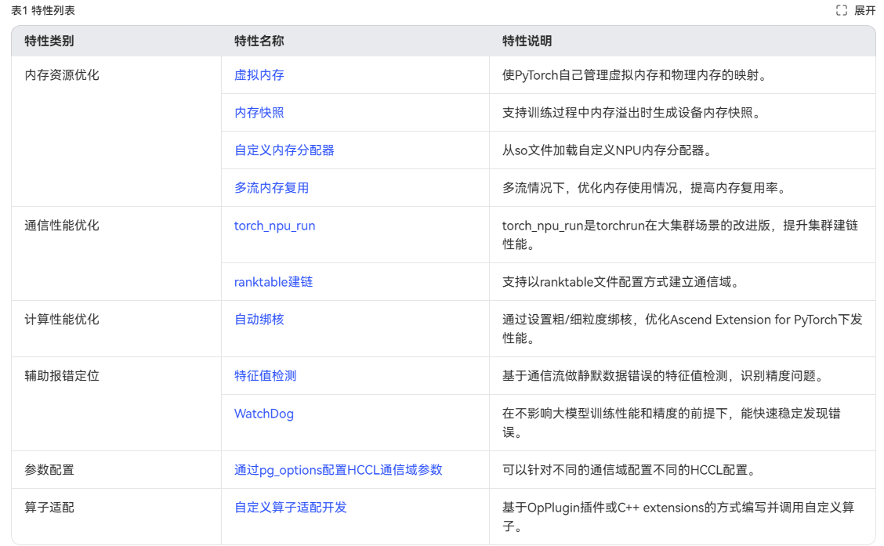

# XX特性<a name="ZH-CN_TOPIC_0000002513371871"></a>

-   _当整本手册仅有一个特性时，则不需要XX特性这一层目录层级。_
-   _直接以特性描述为第一层级章节，以减少资料层级。_

## 特性描述<a name="ZH-CN_TOPIC_0000002481412024"></a>

### 简介<a name="ZH-CN_TOPIC_0000002481571990"></a>

_用户在初步接触特性阶段，需要对特性特征及功能有一个整体、清晰的认知，以便于部署和应用特性。_

_本章需要简单明了的介绍引入特性的背景、特性解决的问题、特性的功能，以及对用户的价值。_

-   _此部分信息必选。_
-   _明确给出特性的定义，需要包括特性功能的描述。需符合以下原则：_
    -   _适度性：定义不可过宽或过窄。例如“机动车是以汽油为燃料，机械驱动的车辆。”此定义过窄，因为机动车不限于以汽油为燃料。_
    -   _正确使用否定定义：只有在概念本身是否定性的情况下，才可使用否定定义。例如，“无损升级功能是指，在升级过程中在线业务不受影响。”。_
    -   _避免使用循环定义：如果一个概念使用第二个概念做为定义，而第二个概念又引用第一个概念，称为循环定义。例如，“匿名接入是指透明鉴权接入。”。_

-   _从用户角度，重点描述本特性的对外表现，不涉及系统内部实现。_
-   _避免在定义中引入其他新的概念。_
-   _避免在定义中引入过多的实现细节、使用限制、特性规格等信息。这些信息可以放在后面详细介绍，如果放到了这里，反而会使特性功能不好理解并引起疑惑。_
-   _对于受益的描述，要将产品的技术特点转化为利益，从客户角度出发，描述特性给用户带来的好处，避免对技术的“自吹自擂”。_

示例：

视频流引擎主要应用于云手机，基于视频流引擎技术实现的云手机方案也称为视频流云手机 。本文介绍了视频流引擎的基本概念，提供视频流引擎环境部署和使用操作指导。

云手机是基于ARM服务器虚拟出的带有AOSP （Android Open Source Project）系统的虚拟手机服务。简单来说，云手机=ARM服务器+Android OS。您可以远程实时控制云手机，实现安卓APP的云端运行；也可以基于云手机的基础算力，高效搭建应用，如云游戏、移动办公、直播互娱等场景。

端云协同引擎顾名思义可以分为端侧和云侧两个部分：云侧运行于服务器上；端侧一般为云手机APK，可以被安装在用户的Android手机上，用于和云侧进行交互，进而对Kbox容器进行正常的操作。

端云协同引擎包括视频流引擎和指令流引擎 ，本文主要描述视频流引擎。

### （可选）架构介绍<a name="ZH-CN_TOPIC_0000002481571986"></a>

_介绍产品/特性的软件架构、组成、每个模块的含义、作用等。_

示例：

本节介绍视频流云手机的上下文逻辑结构与所包含的模块含义及作用。

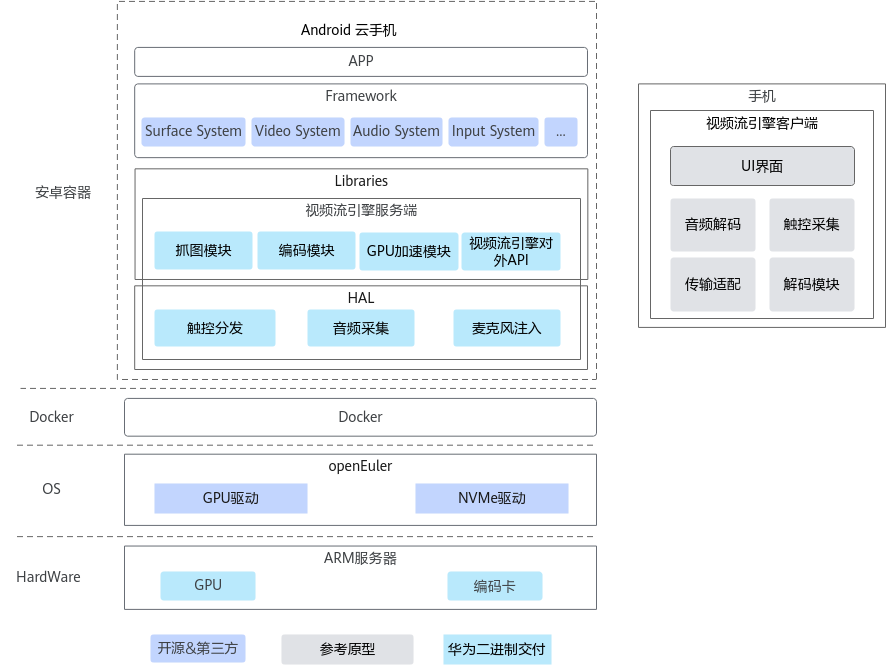

视频流引擎包括服务端和客户端两个部分：服务端提供图像获取、图像数据编码等功能；客户端提供视频数据解码播放功能。在部分场景下还包含用户触控的获取和注入、音频数据的获取和播放等功能。

| 模块名称       | 功能描述                                          |
| ---------- | --------------------------------------------- |
| 抓图模块       | 获取图像数据，输出格式为RGBA显存地址或者RGBA内存地址。               |
| 编码模块       | 将YUV数据通过编码模块编码为H.264/H.265码流，并通过视频流引擎对外API发送。 |
| GPU加速模块    | 将抓图模块获取的RGBA数据，利用GPU能力转换为YUV数据或视频码流。          |
| 音频采集       | 获取音频数据，输出OPUS或PCM格式音频数据，并通过视频流引擎对外API发送。      |
| 麦克风注入      | 从视频流引擎对外API获取OPUS或PCM数据，并注入Android系统。         |
| 触控分发       | 向服务端Android云手机注入触控数据。                         |
| 视频流引擎对外API | 视频流引擎服务端的对外API接口。                             |

### （可选）规格<a name="ZH-CN_TOPIC_0000002513491847"></a>

_介绍能够表征这个特性最基本的规格。特性规格属于特性的重要属性，用户运营维护中需要了解并参考特性涉及的各种指标规格，以便有效理解及掌握特性及系统运行状态。_

_介绍XXX特性的规格。针对当前我司产品规格变更频繁问题，建议将规格统一放到产品描述的产品规格表中（或者采用common文件同源管理的方式），避免规格更新带来的不一致问题（多处更新补全导致前后不一致或者各个文档不一致）。_

-   _此部分信息可选。_
-   _列出该特性涉及到的各种指标规格，如处理能力、QoS、精度、时延、占用资源、功耗等。_
-   _与产品和MKT共同决策的宣传口径保持一致。_
-   _特性无规格时，统一描述为“本特性无特殊规格。”。_

示例：

鲲鹏服务器上视频流云手机规格，如下表所示。

**表 1**  视频流云手机规格
| 条目     | 配置                 |
| ------ | ------------------ |
| 场景     | 中度游戏应用（王者荣耀登录页面）硬编 |
| 绑核策略   | 容器绑NUMA，每NUMA空前两核。 |
| 内存     | 3GB                |
| 存储     | 16GB               |
| 分辨率/帧率 | 720*1280/30fps     |
| 手机开数   | 120路               |

> [!NOTE] 说明<br>
> 内存和硬盘以满足整机规格为准，可灵活调配。

### （可选）参考标准和协议<a name="ZH-CN_TOPIC_0000002481571984"></a>

_便于用户进一步了解特性的实现标准，加深对特性的认知。_

_根据实际产品要求确定。_

-   _此部分信息可选。_
-   _提供特性实现中遵循的协议和标准，同时提供协议和标准的版本信息。_
-   _提供该协议在产品设计中的用途及对遵循情况进行补充说明。_

示例：

-   [MySQL select语句结构标准](https://dev.mysql.com/doc/refman/8.0/en/select.html)
-   [MySQL插件标准](https://dev.mysql.com/doc/refman/8.0/en/plugin-loading.html)
-   [MySQL配置参数标准](https://dev.mysql.com/doc/refman/8.0/en/server-option-variable-reference.html)

### 约束与限制<a name="ZH-CN_TOPIC_0000002513491851"></a>

_特性部署和维护时，用户需了解特性应用的限制和约束，以有效评估相关影响，同时便于用户进行特性配置及故障处理活动中参考。_

_本章节分为以下几个小节：_

-   _对系统的影响_
    -   _此部分信息必选。_
    -   _描述应用特性后对系统容量、性能产生的影响。_
    -   _建议影响描述要量化，避免使用模糊词，如“很大”、“很小”、“较大”、“较小”、“不大”等。给出量化范围，量化数据要与市场宣传材料保持一致。_
    -   _为了便于更好的理解特性对系统的影响，可以描述影响产生的原因。_
    -   _对于重大的负面影响，需要产品和MKT一起决策。_
    -   _如无影响，统一描述为“本特性对系统无影响。”。_

-   _应用限制_
    -   _此部分信息必选。_
    -   _说明业务所适用的组网情况，如说明在什么组网下应用，不支持在什么组网下应用。_
    -   _对硬件的依赖，描述该特性需要硬件支持的版本及新老版本的兼容性。如只能用新版本硬件，而与老的硬件版本不再兼容的情况。_
    -   _只描述特性引入的最早软件版本信息，包括所有涉及网元的最早版本信息。版本以“产品名称＋版本号”表示。_
    -   _如果有对标准协议的限制或不支持需要说明。_
    -   _无应用限制时，统一描述为“本特性无应用限制。”。_

-   _与其他特性的交互_

    -   _此部分信息必选。_
    -   _相关特性的名称及ID需与特性清单中保持一致。_
    -   _与其他特性交互主要包括特性冲突和依赖。_
    -   _涉及相互冲突的特性在特性描述中“与其他特性交互”内容需互相对应。_
    -   _如果依赖的特性为产品必须配置的基本特性，则无需描述。_
    -   _对于特性间无交互，即不存在冲突、依赖及互相影响，但用户有可能对其相互间关系存在疑惑的情况，仍需要描述，减少用户的疑虑。_
    -   _需与MKT确认，确保描述和市场宣传口径保持一致。_
    -   _与其他特性没有交互时，统一描述“本特性与其他特性无交互关系。”_

    示例：

    在特性配置前，请先了解OmniOperator算子加速特性的使用限制。

    公共约束

    -   当前支持的Decimal数据类型规格包含64位和128位，如若超过128位的表示范围，则会抛出异常或者返回null，可能会产生和引擎开源版本行为不相同的场景，如SUM、AVG聚合等，若中间结果超出Decimal 128位，引擎开源版本正常执行，OmniOperator则根据配置抛出异常或者返回null。这里建议如果字段需要进行AVG运算且存在累加结果过大的可能，请使用Double等其他类型存储。
    -   由于浮点数精度问题，OmniOperator算子加速在对Double类型的Sum和AVG操作可能会因执行顺序不同而产生不一致的结果。如果需要精确的结果，请考虑使用更高精度的数据类型（如Decimal）。
    -   当前Sort、Window和HashAgg等算子支持Spill功能，BroadcastHashJoin、ShuffledHashJoin和SortMergeJoin等尚不支持Spill功能。

    Hive

    -   当前UDF插件仅支持Simple UDF，用于执行基于Hive UDF框架编写的UDF函数。

    -   Hive OmniOperator算子加速在支持跑通TPC-DS 99条时，由于Hive开源版本在q14、q72和q89运行时可能存在问题，因此OmniOperator算子加速暂不支持Hive引擎运行该3条SQL。
    -   Hive OmniOperator算子加速在支持POWER表达式时，由于C++ std:pow函数和Java的Math.pow函数实现存在一些细微差距，导致使用C++实现的POWER表达式和Hive开源版本的POWER表达式存在一定误差，但相对精度误差不大于1e-15。
    -   Hive OmniOperator算子加速在支持浮点数运算时，可能会产生和Hive开源版本行为不相同的场景，如除浮点数0.0等。若出现除浮点数0.0的场景，开源版本Hive返回null，OmniOperator算子加速则根据具体的运算行为返回Infinity、NaN或null。
    -   Hive引擎默认开启CBO优化，Hive OmniOperator算子加速当前仅支持开启CBO优化，不支持关闭，即不支持将hive.cbo.enable设置为false。
    -   当SQL中存在Alter字段属性或使用LOAD DATA导入.parq数据的场景时，Hive引擎建议使用开源版本的TableScan算子。

### 应用场景<a name="ZH-CN_TOPIC_0000002481571976"></a>

_描述何种情况下、如何应用该特性，便于用户了解特性的不同应用或在规划设计时参考。_

_这里的场景，简言之就是分解到本特性的用户现网需求和目标。是具体的、清晰的子场景或者任务场景，来源是现网实际情况。_

-   _此部分信息可选。_
-   _当特性本身包括多种应用场景时选用。如果特性应用场景单一，在定义或受益中说明，不需重复描述。_
-   _需要指出特性在不同场景下如何使用、应用后产生的效果等。_
-   _应用场景可以是开启特性的触发条件，如产生告警；也可以是部署特性的场景。_

示例：

在应用特性前，请先了解OmniOperator算子加速特性的应用场景。

OmniOperator算子加速特性适用于数据分析引擎，用户输入SQL在引擎执行时会转为一系列的算子，OmniOperator算子加速特性提供Native算子，分析引擎可以使用Native算子来替换分析引擎的开源软件对应算子，从而加速分析引擎的执行，提升分析性能。适用于大规模融合场景。

OmniOperator算子加速特性目前支持Spark 3.1.1、Spark 3.3.1、Spark 3.4.3、Spark 3.5.2、Hive 3.1.0引擎。

### 原理描述<a name="ZH-CN_TOPIC_0000002481412020"></a>

_使用户理解特性的工作原理，便于用户对特性进行操作和维护。_

_“原理知识＝背景知识”，它起的是辅助性作用，用于帮助用户更好的理解和进行产品操作。只是由于服务目的的不同（有些背景知识是应该进入产品前就预先有的；有些背景知识在操作某个任务前了解就可以的），因而所处的层次有所不同。_

_写大原理前，需要清楚后面的配置任务真正需要哪些背景知识，需要的就规划写；不需要的不写。_

-   _此部分信息必选。_
-   _主要包括以下两方面信息：_
    -   _特性原理：讲解特性使用的基本技术原理。_
    -   _业务流程：详细讲解特性运作的过程，需要覆盖主要的应用场景。提供流程图、交互过程的解释。_

-   _对于包括多种应用场景的特性，可以每个应用场景分别介绍原理和流程。_
-   _原理中如果引入了新概念，需要进行必要的解释。_
-   _为了方便用户全面的理解特性的工作原理，可以增加分支场景的描述。_

示例：

视频流云手机的整体思路，是将视频流引擎分解为服务端和客户端两个部分：服务端提供图像获取、图像数据编码等功能；客户端提供视频数据解码播放功能。在某些场景下还包含用户触控的获取和注入、音频数据的获取和播放等功能。

## （可选）软件编译<a name="ZH-CN_TOPIC_0000002513371877"></a>

_可选章节，如果涉及软件编译，在此章节说明相应流程和步骤。_

### 编译流程<a name="ZH-CN_TOPIC_0000002513371863"></a>

_按照编译步骤，描述编译流程，如配置网络代理、配置YUM源、安装依赖、获取软件等。_

-   _此部分信息必选。_
-   _如果编译流程步骤较少，则建议在一个章节内说明所有的编译流程步骤。_
-   _如果编译流程步骤较多，则建议分为不同的章节，一个章节详细说明一个步骤。_

示例：

算法库的编译主要分为如下的三个部分，分别是环境准备、获取代码和编译代码。

1.  环境准备部分，主要包括安装JDK和Maven。
2.  获取代码部分，获取图分析算法加速库适配代码。
3.  编译代码部分，负责适配代码的编译。

### 配置编译环境<a name="ZH-CN_TOPIC_0000002481412018"></a>

_说明编译环境的软、硬件要求。_

-   _此部分信息可选。_
-   _清晰区分软、硬件要求，提供版本号、跳转链接等信息，方便用户定位到具体的内容。_

#### 环境要求<a name="ZH-CN_TOPIC_0000002481412034"></a>

_说明编译环境的软、硬件要求。_

-   _此部分信息可选。_
-   _清晰区分软、硬件要求，提供版本号、跳转链接等信息，方便用户定位到具体的内容。_

示例：

编译Doris前需安装依赖包和配置环境变量，文档中所有源码和依赖软件安装目录以“opt/tools/installed/“目录为例，如没有此目录，请先创建该目录。

**硬件环境<a name="zh-cn_topic_0000001976149660_section3375145518216"></a>**

编译机所使用的硬件环境如下表所示。

**表 1**  编译机环境硬件推荐配置

| 项目   | 要求       |
| ---- | -------- |
| 处理器  | 鲲鹏920处理器 |
| 内存大小 | 32GB以上   |
| 硬盘   | 480GB以上  |

**软件环境<a name="zh-cn_topic_0000001976149660_zh-cn_topic_0000001672345618_section669644275719"></a>**

编译机所使用到的软件环境版本如下表所示。

**表 2**  编译机环境软件推荐配置

| 项目       | 软件版本                    |
| -------- | ----------------------- |
| OS       | openEuler 22.03 LTS SP1 |
| JDK      | JDK 1.8.0_291           |
| Maven    | 3.6.3                   |
| CMake    | 3.28.0                  |
| Ninja    | 1.12.1                  |
| Clang    | 17.0.6                  |
| GCC      | 12.3.1                  |
| Autoconf | 2.69                    |

#### 数据库场景配置环境（示例）<a name="ZH-CN_TOPIC_0000002513371873"></a>

##### 升级CMake<a name="ZH-CN_TOPIC_0000002481571996"></a>

> [!NOTE] 说明
> 系统自带的CMake软件不能满足当前数据库版本的编译要求，需要升级CMake版本至3.4.3或者以上，本文以升级到3.5.2版本为例。

1.  下载CMake 3.5.2上传至服务器“/home“目录。

    CMake 3.5.2下载地址：[https://cmake.org/files/v3.5/cmake-3.5.2.tar.gz](https://cmake.org/files/v3.5/cmake-3.5.2.tar.gz)

    > [!NOTE] 说明<br>
    > 若服务器可以访问外网，则可以直接使用**wget**命令下载。
    > ```
    > cd /home
    > wget https://cmake.org/files/v3.5/cmake-3.5.2.tar.gz --no-check-certificate
    > ```

2.  解压。

    ```
    tar -zxvf cmake-3.5.2.tar.gz
    ```

    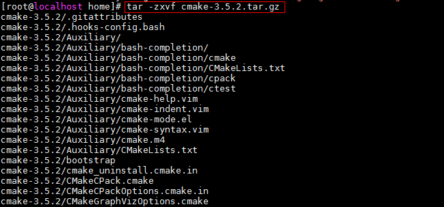

3.  进入解压后目录。

    ```
    cd cmake-3.5.2
    ```

4.  升级CMake。

    ```
    ./bootstrap
    ```

    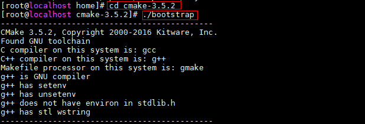

    ```
    make -j 96
    ```

    > [!NOTE] 说明<br>
    > “-j 96“参数充分利用多核CPU优势，加快编译速度，参数“-j“后数字为CPU核数，可用**cat /proc/cpuinfo | grep processor | wc -l**进行查看，此数值应小于等于CPU核数。

    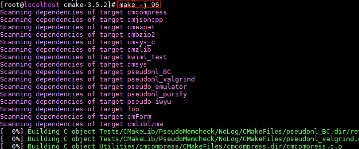

    ```
    make install
    ```

    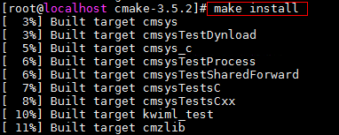

5.  确认CMake的版本是否为3.5.2。

    ```
    hash -r
    /usr/local/bin/cmake --version
    ```

    .png)

##### 升级GCC<a name="ZH-CN_TOPIC_0000002513491859"></a>

> [!NOTE] 说明<br>
> - CentOS 7.6系统自带的GCC软件版本较低，需要升级GCC版本至5.3.0或者以上，本文以升级到7.3.0版本为例。
> - openEuler 20.03系统自带的GCC版本为7.3.0，CentOS 8.1系统自带的GCC版本为8.3.1，不需要升级。

1.  下载GCC 7.3.0。

    ```
    cd /home
    wget https://mirrors.tuna.tsinghua.edu.cn/gnu/gcc/gcc-7.3.0/gcc-7.3.0.tar.gz --no-check-certificate
    ```

2.  解压。

    ```
    tar -xvf gcc-7.3.0.tar.gz
    ```

    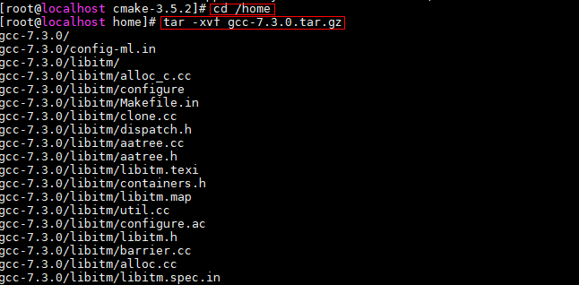

3.  编译安装GCC。

    进入GCC文件路径。

    ```
    cd /home/gcc-7.3.0
    ```

    1.  配置。

        ```
        ./configure --prefix=/usr --mandir=/usr/share/man --infodir=/usr/share/info --enable-bootstrap
        ```

        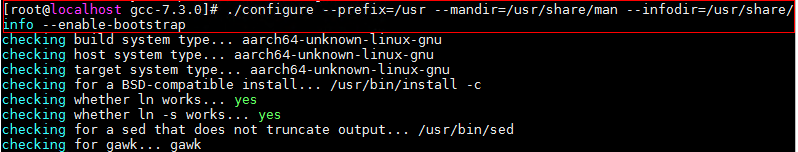

        -   --prefix=PATH：指定GCC软件安装目录，默认路径“/usr“。
        -   --mandir=PATH：指定GCC软件文档目录，默认路径“/usr/share/man“。
        -   --infodir=PATH：指定GCC软件日志信息目录，默认路径“/usr/share/info“。
        -   --enable-bootstrap：指定启用bootstrap方式安装。

        > [!NOTE] 说明
        > 如果配置报错提示“configure: error: no acceptable C compiler found in $PATH”，则执行以下命令。
        > ```
        > yum -y reinstall gcc gcc-c++
        > ```

    2.  编译GCC源码。

        ```
        make -j 96
        ```

        > [!NOTE] 说明
        > “-j 96“参数充分利用多核CPU优势，加快编译速度，参数“-j“后数字为CPU核数，可用**cat /proc/cpuinfo | grep processor | wc -l**进行查看，此数值应小于等于CPU核数。

        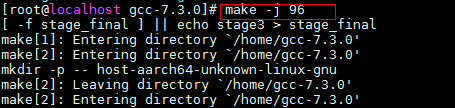

    3.  安装。

        ```
        make -j 96 install
        ```

4.  确认GCC的版本是否为7.3.0。

    ```
    gcc -v
    ```

    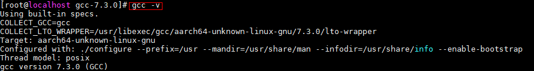

##### 配置Yum源<a name="ZH-CN_TOPIC_0000002481571980"></a>

> [!NOTE] 说明<br>
> 如果环境可以访问外网，参考XX配置Yum源。
>如果环境无法访问外网，参考XX配置Yum源。

**配置外网Yum源<a name="section183429384117"></a>**

1.  查看Yum源。

    如果存在外网Yum源（存在后缀为.repo的文件），则直接执行步骤[5](#zh-cn_topic_0000001185280288_zh-cn_topic_0200578655_li9992192753818)。

    ```
    ls /etc/yum.repos.d/
    ```

2.  备份Yum源。

    ```
    cd /etc/yum.repos.d
    ```

    ```
    mkdir bak
    ```

    ```
    mv *.repo bak
    ```

3.  配置外网Yum源。

    ```
    wget -O /etc/yum.repos.d/CentOS-Base.repo https://mirrors.huaweicloud.com/repository/conf/CentOS-AltArch-7.repo
    ```

4.  查看Yum源。

    ```
    ls /etc/yum.repos.d/
    ```

    ```
    cat /etc/yum.repos.d/CentOS-Base.repo
    ```

5.  <a name="zh-cn_topic_0000001185280288_zh-cn_topic_0200578655_li9992192753818"></a>使Yum源生效。

    ```
    yum clean all
    ```

    ```
    yum makecache
    ```

    ```
    yum list
    ```

**配置本地Yum源<a name="section534318384115"></a>**

1.  挂载OS镜像文件。

    **方法一：**

    1.  上传OS镜像文件至“/root“路径。
    2.  挂载OS镜像文件至“/mnt“目录下。

        ```
        mount /root/CentOS-7-aarch64-Everything-1810.iso /mnt
        ```

        > [!NOTE] 说明<br>
        > iso文件名请根据实际情况修改，该操作单次生效，重启后失效，可执行下列操作开机自动挂载OS镜像文件。
        > 1. 打开fstab文件。
        >     ```
        >     vi /etc/fstab
        >     ```
        > 2. 编辑fstab文件，在文件末尾添加如下信息。
        >     ```
        >     /root/CentOS-7-aarch64-Everything-1810.iso /mnt iso9660 loop 0 0
        >     ```
        > 3. 保存并退出fstab文件。

    **方法二：**

    1.  浏览器登录BMC，通过KVM加载OS镜像文件。
    2.  查看OS镜像对应的设备符号。

        ```
        ls /dev/sr*
        ```

    3.  将OS镜像文件挂载至“/mnt“目录下。

        ```
        mount /dev/sr0 /mnt
        ```

        ```
        df -h | grep /mnt
        ```

        ```
        ls /mnt/
        ```

2.  备份Yum源。

    ```
    cd /etc/yum.repos.d
    ```

    ```
    mkdir bak
    ```

    ```
    mv *.repo bak
    ```

3.  配置本地Yum源。
    1.  进入“/etc/yum.repos.d“目录。

        ```
        cd /etc/yum.repos.d
        ```

    2.  创建local.repo文件。
        1.  打开local.repo文件。

            ```
            vi local.repo
            ```

        2.  编辑local.repo文件，在local.repo文件中添加如下内容。

            ```
            [local]
            name=local.repo
            baseurl=file:///mnt
            enabled=1
            gpgcheck=0
            ```

        3.  保存并退出local.repo文件。
        4.  查看local.repo文件。

            ```
            cat local.repo
            ```

4.  使Yum源生效。

    ```
    yum clean all
    ```

    ```
    yum makecache
    ```

    ```
    yum list
    ```

#### 大数据场景配置环境（示例）<a name="ZH-CN_TOPIC_0000002513491865"></a>

##### 安装基础库<a name="ZH-CN_TOPIC_0000002481412016"></a>

**安装GCC<a name="section1871935318111"></a>**

1.  挂载OS镜像。

    ```
    mount YOUR_OS.iso /media -o loop
    ```

    > [!NOTE] 说明<br>
    > YOUR\_OS.iso用实际的iso包名代替。

2.  备份repo文件，清空“/etc/yum.repos.d/“目录文件。

    ```
    cp -r /etc/yum.repos.d /etc/yum.repos.d-bak
    rm /etc/yum.repos.d/*
    ```

    > [!NOTICE] 须知<br>
    > 请确认已经备份所有repo文件后，在rm删除界面输入“y“表示同意删除。

3.  配置Yum本地源。
    1.  打开“/etc/yum.repos.d/Local.repo“文件。

        ```
        vi /etc/yum.repos.d/Local.repo
        ```

    2.  按“i“进入编辑模式，在文件中添加以下内容。

        ```
        [Local]
        name=Local
        baseurl=file:///media/
        enabled=1
        gpgcheck=0
        ```

    3.  按“Esc“键，输入**:wq!**，按“Enter“保存并退出编辑。

4.  使Yum源配置生效。

    ```
    yum clean all
    yum makecache
    ```

5.  通过Yum源安装GCC相关软件。

    ```
    yum -y install gcc.aarch64 gcc-c++.aarch64 gcc-gfortran.aarch64 libgcc.aarch64
    ```

**修改GCC（解决-fsigned-char问题）<a name="section137207538113"></a>**

1.  寻找GCC所在路径（一般位于“/usr/bin/gcc“）。

    ```
    command -v gcc
    ```

2.  更改原GCC文件的名字（例如改成gcc-impl）。

    ```
    mv /usr/bin/gcc /usr/bin/gcc-impl
    ```

3.  配置GCC文件。
    1.  新建GCC文件。

        ```
        vi /usr/bin/gcc
        ```

    2.  按“i“进入编辑模式，填入如下内容。

        ```
        #! /bin/sh
        /usr/bin/gcc-impl -fsigned-char "$@"
        ```

    3.  按“Esc“键，输入**:wq!**，按“Enter“保存并退出编辑。

4.  给GCC文件添加可执行权限。

    ```
    chmod +x /usr/bin/gcc
    ```

5.  确认GCC是否可用。

    ```
    gcc --version
    ```

    -   CentOS：回显如下所示即为安装成功。

        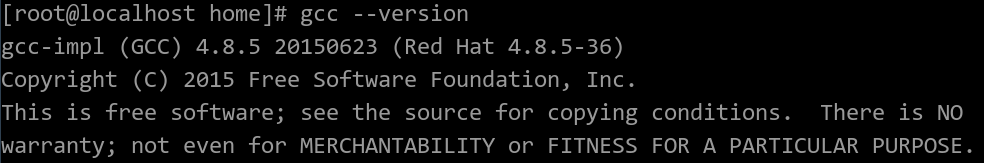

    -   openEuler：回显如下所示即为安装成功。

        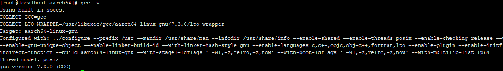

**修改G++（解决-fsigned-char问题）<a name="section8721453017"></a>**

1.  寻找G++所在路径（一般位于“/usr/bin/g++“）。

    ```
    command -v g++
    ```

2.  更改原G++文件的名字（例如改成g++-impl）。

    ```
    mv /usr/bin/g++ /usr/bin/g++-impl
    ```

3.  配置G++文件。
    1.  新建G++文件。

        ```
        vi /usr/bin/g++
        ```

    2.  按“i“进入编辑模式，填入如下内容。

        ```
        #! /bin/sh
        /usr/bin/g++-impl -fsigned-char "$@"
        ```

    3.  按“Esc“键，输入**:wq!**，按“Enter“保存并退出编辑。

4.  给G++文件添加可执行权限。

    ```
    chmod +x /usr/bin/g++
    ```

5.  确认G++是否可用。

    ```
    g++ --version
    ```

    -   CentOS：回显如下所示即为安装成功。

        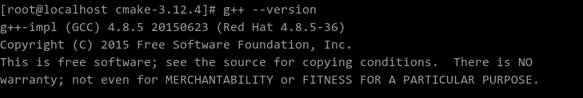

    -   openEuler：回显如下所示即为安装成功。

        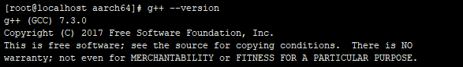

**安装依赖<a name="zh-cn_topic_0202268626_section54411130301"></a>**

通过Yum源安装依赖的相关软件。

```
yum install -y wget vim openssl-devel zlib-devel automake libtool make libstdc++-static glibc-static git snappy snappy-devel fuse fuse-devel
```

##### 安装OpenJDK<a name="ZH-CN_TOPIC_0000002513491843"></a>

1.  下载并解压安装到指定目录（此处以指定“/opt/tools/installed/“目录为例）。

    ```
    wget https://github.com/AdoptOpenJDK/openjdk8-binaries/releases/download/jdk8u252-b09/OpenJDK8U-jdk_aarch64_linux_hotspot_8u252b09.tar.gz
    tar -zxf OpenJDK8U-jdk_aarch64_linux_hotspot_8u252b09.tar.gz
    mkdir -p /opt/tools/installed/
    mv jdk8u252-b09 /opt/tools/installed/
    ```

2.  配置Java环境变量。
    1.  打开“/etc/profile“文件。

        ```
        vi /etc/profile
        ```

    2.  按“i“进入编辑模式，在文件末尾添加如下代码。

        ```
        export JAVA_HOME=/opt/tools/installed/jdk8u252-b09
        export PATH=$JAVA_HOME/bin:$PATH
        ```

    3.  按“Esc“键，输入**:wq!**，按“Enter“保存并退出编辑。

3.  使修改的环境变量生效。

    ```
    source /etc/profile
    ```

4.  检查OpenJDK是否安装成功。

    ```
    java -version
    ```

    回显如下所示即为安装成功。

    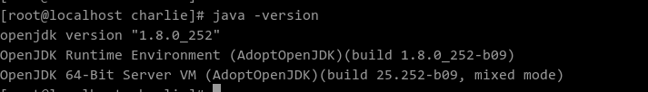

##### 安装Maven<a name="ZH-CN_TOPIC_0000002513491869"></a>

1.  下载并安装到指定目录（此处以指定“/opt/tools/installed/“目录为例）。

    ```
    wget https://archive.apache.org/dist/maven/maven-3/3.5.4/binaries/apache-maven-3.5.4-bin.tar.gz --no-check-certificate
    tar -zxf apache-maven-3.5.4-bin.tar.gz
    mkdir -p /opt/tools/installed
    mv apache-maven-3.5.4 /opt/tools/installed/
    ```

2.  修改Maven环境变量。
    1.  打开“/etc/profile“文件。

        ```
        vi /etc/profile
        ```

    2.  按“i“进入编辑模式，在末尾增加如下代码。

        ```
        export MAVEN_HOME=/opt/tools/installed/apache-maven-3.5.4
        export PATH=$MAVEN_HOME/bin:$PATH
        ```

    3.  按“Esc“键，输入**:wq!**，按“Enter“保存并退出编辑。

3.  使修改的环境变量生效。

    ```
    source /etc/profile
    ```

4.  检查Maven是否安装成功。

    ```
    mvn -v
    ```

    回显如下所示即为安装成功。

    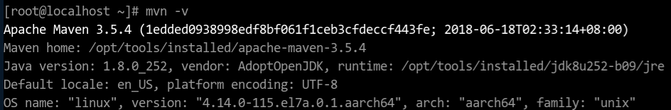

5.  修改Maven配置文件中的本地仓路径、远程仓。
    1.  打开配置文件。

        ```
        vi /opt/tools/installed/apache-maven-3.5.4/conf/settings.xml
        ```

        > [!NOTE] 说明<br>
        >本地仓库地址默认在“\~/.m2/”目录下，如果想修改成指定目录，则修改<localRepository\>标签，没有特殊需求，无需修改该参数。

    2.  按“i“进入编辑模式，远程仓库配置（修改成自己搭建的Maven仓库，如果没有，可以按照下面示例配置），在<mirrors\>标签内添加以下内容。

        ```
        <mirror>
          <id>huaweimaven</id>
          <name>huawei maven</name>
          <url>https://mirrors.huaweicloud.com/repository/maven/</url>
          <mirrorOf>central</mirrorOf>
        </mirror>
        ```

    3.  当编译环境不能访问外网，需要在settings.xml配置文件中添加代理配置，具体内容如下。

        ```
        <proxies>
          <proxy>
            <id>optional</id>
            <active>true</active>
            <protocol>http</protocol>
            <username>用户名</username>
            <password>密码</password>
            <host>代理服务器网址</host>
            <port>代理服务器端口</port>
            <nonProxyHosts>local.net|some.host.com</nonProxyHosts>
          </proxy>
        </proxies>
        ```

    4.  按“Esc“键，输入**:wq!**，按“Enter“保存并退出编辑。

### 编译代码<a name="ZH-CN_TOPIC_0000002481571978"></a>

_描述如何编译软件代码。_

-   _此部分信息必选。_
-   _完整说明编译代码的步骤。_

示例：

**获取机器学习算法加速库适配代码Spark-ml-algo-lib<a name="section10846327156"></a>**

编译机器学习算法加速库适配代码

机器学习算法加速库适配代码基于开源软件Spark 3.3.1开发，用于编译机器学习算法加速库。下载大数据机器学习算法加速库的[适配Spark3.3.1的开源仓代码](https://gitee.com/kunpengcompute/Spark-ml-algo-lib/tree/Spark3.3.1/)到指定目录下，如“/opt/“，并解压（以下操作都以适配Spark 3.3.1的包为例）。

```
cd /opt/
unzip Spark-ml-algo-lib-v3.0.0-spark3.3.1.zip
```

> [!NOTE] 说明<br>
>机器学习算法加速库适配代码是由Spark 3.3.1、Breeze 1.0、netlib-2.2.1、xgboost 1.1.0、CRF-Spark、spark-knn、LightGBM的部分开源版本代码文件打入Patch后进行构建而来，构建方法详见XXX。

**编译开源适配代码<a name="section51954381616"></a>**

1.  进入“/opt/Spark-ml-algo-lib-v3.0.0-spark3.3.1/“目录，并编译算法需要使用到的JAR包。

    ```
    cd /opt/Spark-ml-algo-lib-v3.0.0-spark3.3.1/
    mvn clean package
    ```

    > [!NOTE] 说明<br>
    > 执行此步骤前请先确认服务可连通外网，如果没有外网权限，执行命令会报错。

    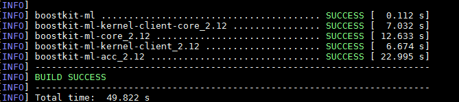

2.  在“/opt/Spark-ml-algo-lib-v3.0.0-spark3.3.1/ml-core/target/“目录下可以获取boostkit-ml-core\_2.12-3.0.0-spark3.3.1.jar。

    ```
    cd /opt/Spark-ml-algo-lib-v3.0.0-spark3.3.1/ml-core/target/
    ```

    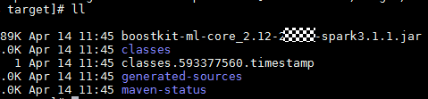

3.  在“/opt/Spark-ml-algo-lib-v3.0.0-spark3.3.1/ml-accelerator/target/“目录下可以获取boostkit-ml-acc\_2.12-3.0.0-spark3.3.1.jar。

    ```
    cd /opt/Spark-ml-algo-lib-v3.0.0-spark3.3.1/ml-accelerator/target/
    ```

    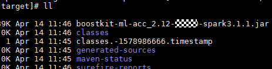

4.  在“/opt/Spark-ml-algo-lib-v3.0.0-spark3.3.1/ml-kernel-client/target/“目录下可以获取boostkit-ml-kernel-client\_2.12-3.0.0-spark3.3.1.jar。

    ```
    cd /opt/Spark-ml-algo-lib-v3.0.0-spark3.3.1/ml-kernel-client/target/
    ```

    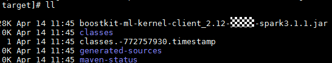

## （可选）部署软件/安装软件<a name="ZH-CN_TOPIC_0000002481412038"></a>

-   _当该特性已集成在某个框架、软件等平台上，无需额外安装操作，**此章节为可选**。_
-   _当该特性需要独立部署，进行额外的安装操作时，**此章节为必选**。_
-   _如果涉及软件编译，在此章节说明相应流程和步骤。_

_用户在使用特性前，需要在环境上先进行软件部署/软件安装。_

_本章需要介绍如何进行软件安装，包括部署的环境要求、如何获取软件、如何安装软件，如何配置/调测软件，如何验证软件生效。_

### 组网规划<a name="ZH-CN_TOPIC_0000002513491863"></a>

_说明部署/安装环境的组网规划。_

-   _此部分信息可选。_
-   _提供清晰组网图，并介绍组网图中各个节点的信息，方便用户理解。_

示例：

建议采用存算一体组网，即存储节点和计算节点共用，充分发挥OmniRuntime子特性在大数据场景的计算加速效果。

**ESS模式<a name="zh-cn_topic_0000002295842293_section4956171532"></a>**

OmniShuffle Shuffle加速组件在ESS模式下的组网规划采用存算一体架构，由4个节点构成，包括一个管理节点和三个计算节点。

此处以存储节点为HDFS为示例说明，其中：

-   管理节点为server，用于管理任务。
-   计算节点为agent01、agent02和agent03，用于运行OmniShuffle Shuffle加速组件查询引擎服务以及存储数据集。

一台服务器可以同时充当管理节点、计算节点（如果是单机安装模式，后续文章中提到的在管理节点/计算节点上执行的操作，均需要在一个节点上执行），组网规划如[图1](#zh-cn_topic_0000002295842293_zh-cn_topic_0000001713019717_fig195021730155013)所示。

**图 1**  ESS安装组网图<a name="zh-cn_topic_0000002295842293_zh-cn_topic_0000001713019717_fig195021730155013"></a>  
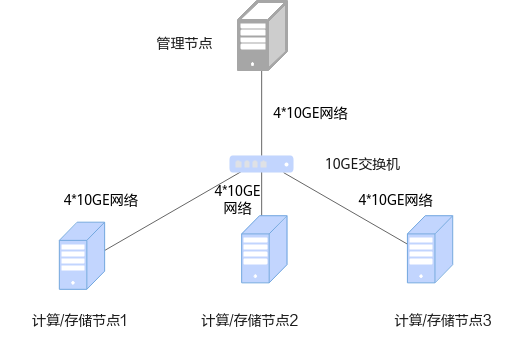

**RSS模式<a name="zh-cn_topic_0000002295842293_section174242103314"></a>**

> [!NOTICE] 须知<br>
> -   OmniShuffle Shuffle加速组件RSS在Spark任务Shuffle数据量大的情况下提升才会比较明显。
> -   OmniShuffle Shuffle加速组件RSS采用存算分离架构，所以对带宽要求较高。例如当集群带宽低于50GE且数据量大的情况下，带宽会成为性能瓶颈。
> -   OmniShuffle Shuffle加速组件RSS把Shuffle数据存储在独立的RSS集群，RSS节点的规模远小于计算节点，多任务情况下Shuffle数据需要落盘，因此对盘的要求较高，建议使用NVMe SSD盘。如使用HDD盘，数据量大的情况下，磁盘IO会成为性能瓶颈。

OmniShuffle Shuffle加速组件在RSS模式下的组网规划采用存算分离架构，由9个节点构成，包括1个管理节点，6个计算节点和2个存储节点。

其中：

-   管理节点为server，用于管理任务。
-   计算节点为agent01、agent02、agent03、agent04、agent05和agent06，用于运行OmniShuffle Shuffle加速组件查询引擎服务。
-   存储节点为RSS01和RSS02，用于存储Shuffle过程中的数据集。

组网规划如[图2](#zh-cn_topic_0000002295842293_fig1261925062019)所示。

**图 2**  RSS安装组网图<a name="zh-cn_topic_0000002295842293_fig1261925062019"></a>  
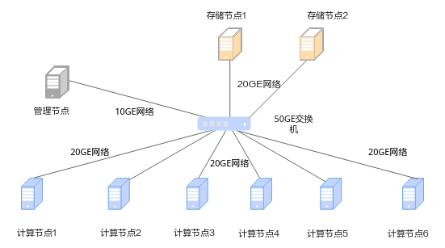

### 环境要求<a name="ZH-CN_TOPIC_0000002513491849"></a>

_说明部署/安装环境的硬件、软件要求。_

-   _此部分信息必选。_
-   _清晰区分软、硬件要求，提供版本号、跳转链接等信息，方便用户定位到具体的内容。_

示例：

安装OmniShuffle Shuffle加速组件特性前，请参见本节提前准备软硬件安装环境，以确保后续安装操作顺利进行。

**硬件要求<a name="zh-cn_topic_0000002295769121_zh-cn_topic_0000001664980070_section4570887453"></a>**

集群中各节点硬件要求如[表1](#table_000001)和[表2](#table_000002)所示。

**表 1**  ESS硬件版本<a name="table_000001"></a>

| 硬件环境    | 管理/计算/存储节点                                                        |
| ------- | ----------------------------------------------------------------- |
| 处理器     | 鲲鹏920 5250                                                        |
| 内存大小    | 384GB(12 * 32GB)                                                  |
| 内存频率    | 2666MHz                                                           |
| 网卡      | &#8226; 业务网络10GE<br>&#8226; 管理网络GE                                                    |
| 硬盘      | &#8226; 系统盘：1 * RAID 0(1 * 1.2T SAS HDD)<br>&#8226; 数据盘：12 * RAID 0(12 * 8T SATA HDD) |
| RAID控制卡 | LSI SAS3508                                                       |

**表 2**  RSS硬件版本<a name="table_000002"></a>

| 硬件环境    | 管理节点                                                              | 计算节点                                                              | 存储节点                                                |
| ------- | ----------------------------------------------------------------- | ----------------------------------------------------------------- | --------------------------------------------------- |
| 处理器     | 鲲鹏920 7260                                                        | 鲲鹏920 7260                                                        | 鲲鹏920 7260                                          |
| 内存大小    | 512GB                                                             | 512GB                                                             | 512GB                                               |
| 内存频率    | 2666MHz                                                           | 2666MHz                                                           | 2666MHz                                             |
| 网卡      | &#8226; 业务网络10GE<br>&#8226; 管理网络GE                                                    | &#8226; 业务网络20GE<br>&#8226; 管理网络GE                                                    | &#8226; 业务网络20GE<br>&#8226; 管理网络GE                                      |
| 硬盘      | &#8226; 系统盘：1 * RAID 0(1 * 1.2T SAS HDD)<br>&#8226; 数据盘：12 * RAID 0(12 * 8T SATA HDD) | &#8226; 系统盘：1 * RAID 0(1 * 1.2T SAS HDD)<br>&#8226; 数据盘：12 * RAID 0(12 * 8T SATA HDD) | &#8226; 系统盘：1 * RAID 0(1 * 1.2T SAS HDD)<br>&#8226; 数据盘：2 * 4T NVMe SSD |
| RAID控制卡 | LSI SAS3508                                                       | LSI SAS3508                                                       | LSI SAS3508                                         |

**软件要求<a name="zh-cn_topic_0000002295769121_zh-cn_topic_0000001664980070_section12083304460"></a>**

集群中各节点软件要求如[表3](#table_000003)所示。

**表 3**  软件版本<a name="table_000003"></a>

| 软件名称                              | 软件版本                                           | 说明                                                                                                          | 管理节点 | 计算/存储节点 |
| --------------------------------- | ---------------------------------------------- | ----------------------------------------------------------------------------------------------------------- | ---- | ------- |
| OS                                | &#8226; openEuler 22.03 LTS SP1<br>&#8226; openEuler 20.03 LTS SP1 | -                                                                                                           | √    | √       |
| 网卡驱动                              | [Mellanox 5.4-3.6.8.1-LTS](https://www.mellanox.com/products/infiniband-drivers/linux/mlnx_ofed)                       | -                                                                                                           | √    | √       |
| JDK                               | [BiSheng JDK 1.8（优选BiSheng JDK 1.8.0_342）](https://mirror.iscas.ac.cn/kunpeng/archive/compiler/bisheng_jdk/bisheng-jdk-8u262-linux-aarch64.tar.gz)       | openEuler 22.03 LTS SP1与BiSheng JDK 1.8.0_262不兼容，需更换为[BiSheng JDK 1.8.0_342](https://mirror.iscas.ac.cn/kunpeng/archive/compiler/bisheng_jdk/bisheng-jdk-8u342-linux-aarch64.tar.gz)。BiSheng JDK安装指南请参见《[毕昇JDK 8 安装指南](https://gitee.com/openeuler/bishengjdk-8/wikis/%E4%B8%AD%E6%96%87%E6%96%87%E6%A1%A3/%E6%AF%95%E6%98%87JDK%208%20%E5%AE%89%E8%A3%85%E6%8C%87%E5%8D%97)》 | √    | √       |
| Hadoop                            | 3.2.0                                          | 部署指南请参见《[Hadoop 集群部署（CentOS 7.6&openEuler 20.03）](https://www.hikunpeng.com/document/detail/zh/kunpengbds/ecosystemEnable/Hadoop/kunpenghadoop_04_0001.html)》                                                            | √    | √       |
| Hive                              | 3.1.0                                          | 部署指南请参见《[Hive 部署指南（CentOS 7.6&openEuler 20.03）](https://www.hikunpeng.com/document/detail/zh/kunpengbds/ecosystemEnable/Hive/kunpenghive_04_0001.html)》                                                              | √    | -       |
| Spark                             | &#8226; 3.1.1<br>&#8226; 3.3.1                                     | 部署指南请参见《[Spark 部署指南（CentOS 7.6&openEuler 20.03）](https://www.hikunpeng.com/document/detail/zh/kunpengbds/ecosystemEnable/Spark/kunpengspark_04_0001.html)》                                                             | √    | -       |
| ZooKeeper                         | 3.6.2及以上                                       | 部署指南请参见《[ZooKeeper 部署指南（CentOS 7.6&openEuler 20.03）](https://www.hikunpeng.com/document/detail/zh/kunpengbds/ecosystemEnable/ZooKeeper/kunpengzookeeper_04_0001.html)》                                                         | √    | -       |

- √：是指对应节点需要安装该项目。
- -：是指对应节点不需要安装该项目。 

> [!NOTE] 说明<br>
>如果系统软件无KRB5，安全模式下需安装KRB5。

**获取软件安装包<a name="zh-cn_topic_0000002295769121_zh-cn_topic_0000001664980070_section3489574613"></a>**

**表 4**  OmniShuffle Shuffle加速组件软件获取列表<a name="table_000004"></a>

| 名称                         | 包名                                | 发布类型 | 说明                            | 获取地址                                                                                      |
| -------------------------- | --------------------------------- | ---- | ----------------------------- | ----------------------------------------------------------------------------------------- |
| OmniShuffle Shuffle加速组件软件包 | BoostKit-omnishuffle_1.9.0.tar.gz | 闭源   | OmniShuffle Shuffle加速组件软件安装包。 | 华为技术支持网站：<br> &#8226; 企业网：获取链接（地址待刷新）<br> &#8226; 运营商网：获取链接（地址待刷新）<br> &#8226; 鲲鹏社区：获取链接<br>说明：使用软件包前请先阅读许可协议，如确认继续使用，则默认同意协议的条款和条件。 |

**验证软件包完整性<a name="section16999136121519"></a>**

为了防止软件包在传递过程或存储期间被恶意篡改，获取软件包时需下载对应的数字签名文件用于完整性验证。

1.  参见[表4](#table_000004)获取软件包。
2.  获取《OpenPGP签名验证指南》。
    -   运营商客户：请访问[获取链接](http://support.huawei.com/carrier/digitalSignatureAction)
    -   企业客户：请访问[获取链接](https://support.huawei.com/enterprise/zh/tool/pgp-verify-TL1000000054)

3.  根据《OpenPGP签名验证指南》进行软件安装包完整性检查。

    > [!NOTE] 说明<br>
    > -   如果校验失败，请不要使用该软件包，先联系华为技术支持工程师解决。
    > -   使用软件包安装或升级之前，也需要按上述过程先验证软件包的数字签名，确保软件包未被篡改。

### （可选）获取软件<a name="ZH-CN_TOPIC_0000002481412022"></a>

_介绍如何获取到软件，提供相应的下载包或跳转链接。_

-   _此部分信息可选。_
-   _如果在文档前文已经清晰说明过如何获取软件，可以不用独立一个章节，否则需要单独说明如何获取。_

示例：

机器学习算法加速库软件包的获取方式如[表1](#table5811155918141)所示。

**表 1**  软件包获取方式

<a name="table5811155918141"></a>
<table><thead align="left"><tr id="row168111259131418"><th class="cellrowborder" valign="top" width="39.69%" id="mcps1.2.4.1.1"><p id="p881120599149"><a name="p881120599149"></a><a name="p881120599149"></a>软件包</p>
</th>
<th class="cellrowborder" valign="top" width="36.54%" id="mcps1.2.4.1.2"><p id="p1084911229619"><a name="p1084911229619"></a><a name="p1084911229619"></a>描述</p>
</th>
<th class="cellrowborder" valign="top" width="23.77%" id="mcps1.2.4.1.3"><p id="p17811185918146"><a name="p17811185918146"></a><a name="p17811185918146"></a>获取方式</p>
</th>
</tr>
</thead>
<tbody><tr id="row11811175921410"><td class="cellrowborder" valign="top" width="39.69%" headers="mcps1.2.4.1.1 "><p id="p18967145153013"><a name="p18967145153013"></a><a name="p18967145153013"></a>BoostKit-ml_3.0.0.zip</p>
</td>
<td class="cellrowborder" valign="top" width="36.54%" headers="mcps1.2.4.1.2 "><p id="p15852345171118"><a name="p15852345171118"></a><a name="p15852345171118"></a>压缩包内含算法包boostkit-ml-kernel-2.12-3.0.0-spark3.3.1-aarch64.jar</p>
</td>
<td class="cellrowborder" valign="top" width="23.77%" headers="mcps1.2.4.1.3 "><div class="p" id="p155993289210"><a name="p155993289210"></a><a name="p155993289210"></a>华为技术支持网站：<a name="ul17373814593"></a><a name="ul17373814593"></a><ul id="ul17373814593"><li>企业网：<a href="https://support.huawei.com/enterprise/zh/kunpeng-computing/kunpeng-boostkit-pid-253662285/software/255094599?idAbsPath=fixnode01|23710424|251364417|9856629|253662285" target="_blank" rel="noopener noreferrer">获取链接</a></li><li>运营商网：<a href="https://support.huawei.com/carrier/navi?coltype=software#col=software&amp;from=product&amp;detailId=PBI1-255094599&amp;path=PBI1-21430725/PBI1-21430756/PBI1-21431670/PBI1-251366796/PBI1-253662285" target="_blank" rel="noopener noreferrer">获取链接</a></li></ul>
</div>
<p id="p618812571799"><a name="p618812571799"></a><a name="p618812571799"></a>鲲鹏社区：<a href="https://www.hikunpeng.com/zh/developer/download?title=大数据&amp;subTitle=机器学习算法&amp;version=23.0.0" target="_blank" rel="noopener noreferrer">获取链接</a></p>
<div class="note" id="note321065363118"><a name="note321065363118"></a><a name="note321065363118"></a><span class="notetitle"> 说明： </span><div class="notebody"><p id="p10380141552511"><a name="p10380141552511"></a><a name="p10380141552511"></a><span id="ph1814244111813"><a name="ph1814244111813"></a><a name="ph1814244111813"></a>使用软件包前请先阅读<span id="ph12141144141815"><a name="ph12141144141815"></a><a name="ph12141144141815"></a>《<a href="https://www.hikunpeng.com/zh/legal/developer/boostkit/software/protocol" target="_blank" rel="noopener noreferrer">鲲鹏应用使能套件BoostKit用户许可协议 2.0</a>》</span>，如确认继续使用，则默认同意协议的条款和条件。</span></p>
</div></div>
</td>
</tr>
<tr id="row1128161613116"><td class="cellrowborder" valign="top" width="39.69%" headers="mcps1.2.4.1.1 "><p id="p1014350144719"><a name="p1014350144719"></a><a name="p1014350144719"></a>boostkit-ml-acc_2.12-3.0.0-spark3.3.1.jar</p>
</td>
<td class="cellrowborder" rowspan="3" valign="top" width="36.54%" headers="mcps1.2.4.1.2 "><p id="p1270414352910"><a name="p1270414352910"></a><a name="p1270414352910"></a>运行算法需要的算法适配包，其中boostkit-ml-kernel-client_2.12-3.0.0-spark3.3.1.jar包是应用开发时的依赖库，不需要部署在Spark集群，仅在开发阶段编译时使用。</p>
</td>
<td class="cellrowborder" rowspan="3" valign="top" width="23.77%" headers="mcps1.2.4.1.3 "><p id="p1451411154117"><a name="p1451411154117"></a><a name="p1451411154117"></a>编译获得，详情请参见<a href="zh-cn_topic_0000001672345614.md">编译代码</a>。</p>
</td>
</tr>
<tr id="row103630414710"><td class="cellrowborder" valign="top" headers="mcps1.2.4.1.1 "><p id="p9141150114716"><a name="p9141150114716"></a><a name="p9141150114716"></a>boostkit-ml-core_2.12-3.0.0-spark3.3.1.jar</p>
</td>
</tr>
<tr id="row09931117182"><td class="cellrowborder" valign="top" headers="mcps1.2.4.1.1 "><p id="p1323964724516"><a name="p1323964724516"></a><a name="p1323964724516"></a>boostkit-ml-kernel-client_2.12-3.0.0-spark3.3.1.jar</p>
</td>
</tr>
</tbody>
</table>

**软件安装包完整性校验<a name="section1788315401183"></a>**

从华为技术支持官网鲲鹏社区获取的软件安装包，下载软件安装包后需要校验软件安装包，确保与网站上的原始软件安装包一致。

校验方法：

1.  获取软件数字证书和软件安装包。
2.  在如下链接中获取[校验工具和校验方法](https://support.huawei.com/enterprise/zh/tool/pgp-verify-TL1000000054)。
3.  参见上述链接下载的《OpenPGP签名验证指南》进行软件安装包完整性检查。

**获取机器学习算法加速库的核心JAR包<a name="section788394019188"></a>**

机器学习算法加速库核心JAR包的压缩包BoostKit-ml\_3.0.0.zip可在support上获得，获取途径可见[获取软件](zh-cn_topic_0000001720504769.md)，解压得到boostkit-ml-kernel-2.12-3.0.0-spark3.3.1-aarch64.jar，并放在“/opt/“目录下。

1.  在客户端节点上，以大数据组件的授权用户登录服务器，将机器学习算法加速库核心JAR包的压缩包放置“/opt/“目录下，解压压缩包BoostKit-ml\_3.0.0.zip。

    ```
    cd /opt/
    unzip BoostKit-ml_3.0.0.zip
    ```

2.  查询机器学习算法加速库核心JAR包版本。

    ```
    cat version.txt
    ```

    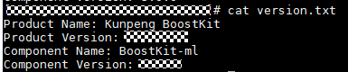

3.  创建“lib“目录。

    ```
    mkdir -p /home/test/boostkit/lib
    ```

4.  复制boostkit-ml-kernel-2.12-3.0.0-spark3.3.1-aarch64.jar并放入“/home/test/boostkit/lib/“目录下

    ```
    cd BoostKit-ml_3.0.0
    cp boostkit-ml-kernel-2.12-3.0.0-spark3.3.1-aarch64.jar /home/test/boostkit/lib
    ```

### 部署/安装xx（软件或特性名称）<a name="ZH-CN_TOPIC_0000002481571992"></a>

_介绍如何获取到部署/安装软件，提供明确的步骤。_

-   _此部分信息必选。_
-   _注意将每一步操作步骤都呈现出来，避免默认用户已知某些步骤而不提供的情况，例如：进入目录的命令。_

示例：


#### 大数据场景示例<a name="ZH-CN_TOPIC_0000002481412030"></a>

##### 安装依赖<a name="ZH-CN_TOPIC_0000002481571972"></a>

以本地方式安装OmniOperator算子加速，在OmniOperator算子加速结合Spark引擎应用时，在管理节点和计算节点安装依赖包LLVM和Jemalloc。在Spark on yarn场景，通过Spark的**--archives**参数提升部署易用性。预编译SO下载安装与源码编译安装两种方式二选一即可。

**安装依赖（预编译so下载安装方式）<a name="section129369267254"></a>**

**安装LLVM和Jemalloc**

> [!NOTE] 说明<br>
> Dependency\_library.zip压缩包中有Dependency\_library\_openeuler.zip和Dependency\_library\_centos.zip两个包，分别适用于openEuler系统和CentOS系统，以下安装以openEuler系统为例。如需在CentOS系统安装OmniOperator算子加速，把以下命令参数中的Dependency\_library\_openeuler.zip替换为Dependency\_library\_centos.zip即可。

1.  在管理节点和计算节点创建“/opt/omni-operator/“目录作为安装OmniOperator算子加速的根目录，进入该目录。

    ```
    mkdir /opt/omni-operator
    cd /opt/omni-operator
    rm -rf Dependency_library_*.zip
    ```

2.  从XX中获取的Dependency\_library压缩包（Dependency\_library.zip、Dependency\_library.z01），上传到“/opt/omni-operator/“目录下，进行解压。

    ```
    zip -F Dependency_library.zip --out Dependency_library_complete.zip
    unzip Dependency_library_complete.zip
    ```

3.  创建“/opt/omni-operator/lib“目录，将Dependency\_library\_openeuler中的libLLVM-15.so、libjemalloc.so.2复制到“/opt/omni-operator/lib“目录下。

    ```
    cd /opt/omni-operator
    mkdir lib
    rm -rf  /opt/omni-operator/lib/libjemalloc.so.2
    rm -rf  /opt/omni-operator/lib/libLLVM-15.so
    cp /opt/omni-operator/Dependency_library/Dependency_library_openeuler/libjemalloc.so.2 /opt/omni-operator/lib
    cp /opt/omni-operator/Dependency_library/Dependency_library_openeuler/libLLVM-15.so /opt/omni-operator/lib
    ```

> [!NOTE] 说明<br>
>“/opt/omni-operator“及“/opt/omni-operator/lib“目录用户可自行定义。

**安装依赖（源码编译安装方式）<a name="section1937526102518"></a>**

**安装LLVM**

1.  下载[llvm-project-llvmorg-15.0.4.tar.gz](https://github.com/llvm/llvm-project/archive/refs/tags/llvmorg-15.0.4.tar.gz)，在管理节点和计算节点上创建目录“/opt/omni-operator“作为安装OmniOperator的根目录并进入，将压缩包上传到“/opt/omni-operator“目录下。

    ```
    mkdir /opt/omni-operator
    cd /opt/omni-operator
    tar zxvf llvm-project-llvmorg-15.0.4.tar.gz
    mv llvm-project-llvmorg-15.0.4 llvm
    cd llvm
    mkdir build
    ```

2.  进入“build“目录编译并安装LLVM。

    ```
    cd ./build
    cmake -DCMAKE_INSTALL_PREFIX=/opt/omni-operator/llvm -DCMAKE_BUILD_TYPE=Release -DLLVM_BUILD_LLVM_DYLIB=true -DLLVM_ENABLE_PROJECTS="clang" -G "Unix Makefiles" ../llvm
    make -j4
    make install
    ```

3.  在“/opt/omni-operator“下创建“lib“目录，拷贝“/opt/omni-operator/llvm/lib/libLLVM-15.so“到“/opt/omni-operator/lib“目录下。

    ```
    mkdir /opt/omni-operator/lib
    cp /opt/omni-operator/llvm/lib/libLLVM-15.so /opt/omni-operator/lib/
    ```

> [!NOTE] 说明<br>
>“/opt/omni-operator“、“/opt/omni-operator/llvm“和“/opt/omni-operator/lib“目录用户可自行定义。

**安装Jemalloc**

1.  下载[jemalloc-5.3.0.tar.gz](https://github.com/jemalloc/jemalloc/archive/refs/tags/5.3.0.tar.gz)，并上传到管理节点和计算节点。

    ```
    cd /opt/omni-operator/
    tar zxvf jemalloc-5.3.0.tar.gz
    mv jemalloc-5.3.0 jemalloc
    ```

    > [!NOTE] 说明<br>
    >“/opt/omni-operator/jemalloc“目录用户可自行定义。

2.  进入“jemalloc“目录，运行脚本并安装。

    ```
    cd jemalloc
    ./autogen.sh --disable-initial-exec-tls
    make -j2
    ```

3.  拷贝“/opt/omni-operator/jemalloc/lib/libjemalloc.so.2“到“/opt/omni-operator/lib“目录下。

    ```
    cp /opt/omni-operator/jemalloc/lib/libjemalloc.so.2 /opt/omni-operator/lib/
    ```

##### 安装OmniOperator<a name="ZH-CN_TOPIC_0000002513371881"></a>

安装依赖完成后，即可安装OmniOperator算子加速软件包。在管理节点和计算节点安装OmniOperator算子加速软件并设置相应的环境变量。

> [!NOTE] 说明<br>
>BoostKit-omniop\_1.9.0.zip压缩包中有boostkit-omniop-operator-1.9.0-aarch64-openeuler.tar.gz和boostkit-omniop-operator-1.9.0-aarch64-centos.tar.gz两个包，分别适用于openEuler系统和CentOS系统，以下安装以openEuler系统为例。如需在CentOS系统安装OmniOperator算子加速，把以下命令参数中的boostkit-omniop-operator-1.9.0-aarch64-openeuler.tar.gz替换为boostkit-omniop-operator-1.9.0-aarch64-centos.tar.gz即可。

1.  将XXX中OmniOperator算子加速相关压缩文件上传到管理节点和计算节点的“/opt/omni-operator/“目录。
2.  进入“/opt/omni-operator/“目录解压OmniOperator算子加速相关文件。

    ```
    cd /opt/omni-operator/
    unzip BoostKit-omniop_1.9.0.zip
    tar -zxvf boostkit-omniop-operator-1.9.0-aarch64-openeuler.tar.gz
    ```

3.  拷贝OmniOperator算子加速相关文件到“/opt/omni-operator/lib“目录下，并将该目录下的软件安装包权限设置为550。

    ```
    cd /opt/omni-operator/boostkit-omniop-operator-1.9.0-aarch64
    cp -r include libboostkit* boostkit-omniop* libsecurec.so /opt/omni-operator/lib/
    chmod -R 550 /opt/omni-operator/lib/*
    ```

4.  在“/opt/omni-operator“目录下创建“conf“文件夹，设置文件夹权限750。

    ```
    cd /opt/omni-operator
    mkdir conf
    chmod 750 /opt/omni-operator/conf
    ```

5.  在“conf“文件夹下新增“omni.conf“配置文件并修改配置文件权限为640，用于配置OmniOperator算子加速配置项。

    ```
    cd conf
    touch omni.conf
    chmod 640 omni.conf
    ```

6.  删除“/opt/omni-operator“的冗余文件。

    ```
    mkdir -p /opt/omni-operator-bak
    mv /opt/omni-operator/lib /opt/omni-operator-bak
    mv /opt/omni-operator/conf /opt/omni-operator-bak
    rm -rf /opt/omni-operator
    cd /opt
    mv omni-operator-bak omni-operator
    ```

##### （可选）安装UDF插件<a name="ZH-CN_TOPIC_0000002481412032"></a>

仅使用OmniOperator算子加速UDF功能的情况下才需安装UDF插件，且仅支持Simple UDF。安装UDF插件仅在管理节点操作。OmniOperator算子加速UDF支持表达式行处理和批处理两种方式，两种方式可根据更改配置文件进行切换。

**前置条件<a name="section15136154016211"></a>**

> [!NOTE] 说明<br>
> 本小节仅使用OmniOperator算子加速UDF（用户自定义函数，User Defined Functions）功能才需要进行操作，当前的OmniOperator算子加速UDF插件仅支持HiveSimpleUDF，用于执行基于Hive UDF框架编写的UDF函数。HiveSimpleUDF是Hive中的用户定义函数（UDF）类型之一，它是一种简单的UDF类型。

OmniOperator算子加速关于UDF的所需文件需用户提供相关JAR包和配置文件，包括udf.zip、conf.zip和udf.properties，其中udf.zip包含所有UDF的class文件，conf.zip包含UDF所依赖的配置文件，udf.properties是OmniOperator算子加速UDF配置文件，以udfName1和udfName2函数为例，udf.properties内容格式如下。

```
udfName1 com.huawei.udf.UdfName1
udfName2 com.huawei.udf.UdfName2
```

**UDF插件行处理安装<a name="section167541950102512"></a>**

1.  在管理节点和计算节点创建“/opt/omni-operator/hive-udf“目录。

    ```
    mkdir /opt/omni-operator/hive-udf
    ```

2.  将上述相关的压缩文件udf.zip、conf.zip上传到管理节点和计算节点的“/opt/omni-operator/hive-udf“目录。
3.  执行以下命令解压相关压缩文件。

    ```
    cd /opt/omni-operator/hive-udf
    unzip udf.zip
    rm -f udf.zip
    unzip conf.zip
    rm -f conf.zip
    ```

4.  在“/opt/omni-operator/conf/omni.conf“文件中更新配置内容。
    1.  打开“/opt/omni-operator/conf/omni.conf“文件。

        ```
        vi /opt/omni-operator/conf/omni.conf
        ```

    2.  按“i“进入编辑模式，新增关于UDF配置相关内容。

        ```
        # <----UDF properties---->
        #false表示使用表达式行处理，true表示使用表达式批处理
        enableBatchExprEvaluate=false
        #UDF白名单文件路径
        hiveUdfPropertyFilePath=./hive-udf/udf.properties
        #Hive UDF JAR所在目录路径
        hiveUdfDir=./hive-udf/udf
        ```

        > [!NOTE] 说明<br>
        >配置的路径必须以字符“.”开始，OmniOperator运行的时候会读取环境变量OMNI\_HOME的值替换字符“.”。

    3.  按“Esc“键，输入**:wq!**，按“Enter“保存并退出编辑。

5.  通过**vi**打开“\~/.bashrc“文件，在该文件中追加LD\_LIBRARY\_PATH的内容更新环境变量。
    1.  打开“\~/.bashrc“文件。

        ```
        vi ~/.bashrc
        ```

    2.  按“i“进入编辑模式，追加LD\_LIBRARY\_PATH的内容更新环境变量。

        ```
        export LD_LIBRARY_PATH=$LD_LIBRARY_PATH:${JAVA_HOME}/jre/lib/aarch64/server
        ```

    3.  按“Esc“键，输入**:wq!**，按“Enter“保存并退出编辑。
    4.  执行以下命令更新环境变量。

        ```
        source ~/.bashrc
        ```

> [!NOTE] 说明<br>
> 上述udf.zip、conf.zip等压缩包名称用户根据自己实际情况可进行自定义，本处仅提供示例。

**UDF插件批处理安装<a name="section13754750192512"></a>**

在管理节点行处理安装的基础之上，执行以下步骤更新omni.conf中的配置内容。

1.  打开“/opt/omni-operator/conf/omni.conf“文件。

    ```
    vi /opt/omni-operator/conf/omni.conf
    ```

2.  按“i“进入编辑模式，更新关于UDF行/批处理配置相关内容。

    ```
    enableBatchExprEvaluate=true
    ```

3.  按“Esc“键，输入**:wq!**，按“Enter“保存并退出编辑。

### 配置/调测xx（软件或特性名称）<a name="ZH-CN_TOPIC_0000002513371875"></a>

_介绍如何获取到配置/调测软件，提供明确的步骤。_

-   _此部分信息可选。_
-   _如果涉及到如何配置与调测软件/特性，则提供相应的指导。_
-   _注意将每一步操作步骤都呈现出来，避免默认用户已知某些步骤而不提供的情况，例如：进入目录的命令。_

## 使用特性<a name="ZH-CN_TOPIC_0000002481571994"></a>

_用户完成软件/特性安装后，将会使用特性。_

_本章需要介绍如何使用特性，包括如何在相应环境上使用特性。_

_此部分信息必选。_

-   _当使用特性较为简单，如只有一两行命令时，直接写在特性描述后，可新增目录章节3.1.8、3.1.9···_
-   _当使用特性较复杂，需要大篇幅详细介绍时，可新增子标题3.4.1、3.4.2··_

_用户完成软件/特性安装后，将会使用特性。_

_本章需要介绍如何使用特性，包括如何在相应环境上使用特性。_

### 使能xx（软件或特性名称）<a name="ZH-CN_TOPIC_0000002513371867"></a>

_介绍如何获取到使用特性，提供明确的步骤。_

-   _此部分信息必选。_
-   _注意将每一步操作步骤都呈现出来，避免默认用户已知某些步骤而不提供的情况，例如：进入目录的命令。_
-   如果有多个使用场景，则区分为不同的章节进行写作。

示例：

#### 大数据场景示例<a name="ZH-CN_TOPIC_0000002481571988"></a>

##### 使用Spark引擎执行SQL<a name="ZH-CN_TOPIC_0000002513371879"></a>

为用户提供了两种使用OmniMV物化视图Spark引擎执行SQL的方式，均可用于重写SQL的物理执行计划。

**前提条件<a name="zh-cn_topic_0000001664980174_section2080521443512"></a>**

请参见安装特性完成OmniMV物化视图安装，并参见《[Spark 部署指南](https://www.hikunpeng.com/document/detail/zh/kunpengbds/ecosystemEnable/Spark/kunpengspark_04_0001.html)》完成Spark的部署。

**使用OmniMV物化视图执行SQL的方式<a name="zh-cn_topic_0000001664980174_zh-cn_topic_0000001518847449_section18710143819163"></a>**

可以通过两种方式使用OmniMV物化视图Spark引擎执行SQL，均可自动进行执行计划重写。

-   <a name="zh-cn_topic_0000001518847449_li4881163716166"></a>方式一：进入spark-sql客户端手动执行SQL。
    1.  进入客户端。
        -   Spark 3.1.1。

            ```
            spark-sql \
            --deploy-mode client \
            --driver-cores 5 \
            --driver-memory 5g \
            --num-executors 18 \
            --executor-cores 21 \
            --executor-memory 55g \
            --master yarn \
            --database 数据库名称 \
            --name 任务名称 \
            --jars /opt/omnimv/boostkit-omnimv-spark-3.1.1-1.2.0-aarch64.jar \
            --conf 'spark.sql.extensions=com.huawei.boostkit.spark.OmniMV' \
            --conf spark.sql.omnimv.metadata.path=/omnimv/plugin_metadata \
            ```

        -   Spark 3.4.3。

            ```
            spark-sql \
            --deploy-mode client \
            --driver-cores 5 \
            --driver-memory 5g \
            --num-executors 18 \
            --executor-cores 21 \
            --executor-memory 55g \
            --master yarn \
            --database 数据库名称 \
            --name 任务名称 \
            --jars /opt/omnimv/boostkit-omnimv-spark-3.4.3-1.2.0-aarch64.jar \
            --conf 'spark.sql.extensions=com.huawei.boostkit.spark.OmniMV' \
            --conf spark.sql.omnimv.metadata.path=/omnimv/plugin_metadata \
            ```

    2.  Spark参数可根据集群配置进行调整。
    3.  手动执行SQL。

-   方式二：使用脚本批量执行SQL。

    Spark参数可根据集群配置进行调整。主要是通过-f调用写好的SQL文件，用户仿照此例自定义脚本，批量执行SQL。例如：

    -   Spark 3.1.1。

        ```
        spark-sql \
        --deploy-mode client \
        --driver-cores 5 \
        --driver-memory 5g \
        --num-executors 18 \
        --executor-cores 21 \
        --executor-memory 55g \
        --master yarn \
        --database 数据库名称 \
        --name 任务名称 \
        --jars /opt/omnimv/boostkit-omnimv-spark-3.1.1-1.2.0-aarch64.jar \
        --conf 'spark.sql.extensions=com.huawei.boostkit.spark.OmniMV' \
        --conf spark.sql.omnimv.metadata.path=/omnimv/plugin_metadata \
        -f sql文件的实际路径
        ```

    -   Spark 3.4.3。

        ```
        spark-sql \
        --deploy-mode client \
        --driver-cores 5 \
        --driver-memory 5g \
        --num-executors 18 \
        --executor-cores 21 \
        --executor-memory 55g \
        --master yarn \
        --database 数据库名称 \
        --name 任务名称 \
        --jars /opt/omnimv/boostkit-omnimv-spark-3.4.3-1.2.0-aarch64.jar \
        --conf 'spark.sql.extensions=com.huawei.boostkit.spark.OmniMV' \
        --conf spark.sql.omnimv.metadata.path=/omnimv/plugin_metadata \
        -f sql文件的实际路径
        ```

**OmniMV物化视图Spark引擎支持的语法<a name="zh-cn_topic_0000001664980174_zh-cn_topic_0000001518847449_section10546184118151"></a>**

**表 1**  OmniMV物化视图Spark引擎支持的语法

<a name="zh-cn_topic_0000001518847449_table374713115535"></a>
<table><thead align="left"><tr id="zh-cn_topic_0000001518847449_row147471212534"><th class="cellrowborder" valign="top" width="50%" id="mcps1.2.3.1.1"><p id="zh-cn_topic_0000001518847449_p187479117538"><a name="zh-cn_topic_0000001518847449_p187479117538"></a><a name="zh-cn_topic_0000001518847449_p187479117538"></a>操作名称</p>
</th>
<th class="cellrowborder" valign="top" width="50%" id="mcps1.2.3.1.2"><p id="zh-cn_topic_0000001518847449_p774717113532"><a name="zh-cn_topic_0000001518847449_p774717113532"></a><a name="zh-cn_topic_0000001518847449_p774717113532"></a>操作语法</p>
</th>
</tr>
</thead>
<tbody><tr id="zh-cn_topic_0000001518847449_row167471611535"><td class="cellrowborder" valign="top" width="50%" headers="mcps1.2.3.1.1 "><p id="zh-cn_topic_0000001518847449_p17475110530"><a name="zh-cn_topic_0000001518847449_p17475110530"></a><a name="zh-cn_topic_0000001518847449_p17475110530"></a>Create MV（创建视图）</p>
</td>
<td class="cellrowborder" valign="top" width="50%" headers="mcps1.2.3.1.2 "><p id="zh-cn_topic_0000001518847449_p1253133812508"><a name="zh-cn_topic_0000001518847449_p1253133812508"></a><a name="zh-cn_topic_0000001518847449_p1253133812508"></a>CREATE MATERIALIZED VIEW [IF NOT EXISTS] [db_name.]mv_name</p>
<p id="zh-cn_topic_0000001518847449_p1353123816500"><a name="zh-cn_topic_0000001518847449_p1353123816500"></a><a name="zh-cn_topic_0000001518847449_p1353123816500"></a>[DISABLE REWRITE]</p>
<p id="zh-cn_topic_0000001518847449_p7531387506"><a name="zh-cn_topic_0000001518847449_p7531387506"></a><a name="zh-cn_topic_0000001518847449_p7531387506"></a>[COMMENT 'mv_comment']</p>
<p id="zh-cn_topic_0000001518847449_p1052103820501"><a name="zh-cn_topic_0000001518847449_p1052103820501"></a><a name="zh-cn_topic_0000001518847449_p1052103820501"></a>[PARTITIONED BY (col_name, ...)]</p>
<p id="zh-cn_topic_0000001518847449_p18521738155014"><a name="zh-cn_topic_0000001518847449_p18521738155014"></a><a name="zh-cn_topic_0000001518847449_p18521738155014"></a>AS</p>
<p id="zh-cn_topic_0000001518847449_p1437963935314"><a name="zh-cn_topic_0000001518847449_p1437963935314"></a><a name="zh-cn_topic_0000001518847449_p1437963935314"></a>&lt;query&gt;;</p>
</td>
</tr>
<tr id="zh-cn_topic_0000001518847449_row137471115534"><td class="cellrowborder" valign="top" width="50%" headers="mcps1.2.3.1.1 "><p id="zh-cn_topic_0000001518847449_p474711119531"><a name="zh-cn_topic_0000001518847449_p474711119531"></a><a name="zh-cn_topic_0000001518847449_p474711119531"></a>Drop MV（删除视图）</p>
</td>
<td class="cellrowborder" valign="top" width="50%" headers="mcps1.2.3.1.2 "><p id="zh-cn_topic_0000001518847449_p574716145313"><a name="zh-cn_topic_0000001518847449_p574716145313"></a><a name="zh-cn_topic_0000001518847449_p574716145313"></a>DROP MATERIALIZED VIEW [IF EXISTS] [db_name.]mv_name;</p>
</td>
</tr>
<tr id="zh-cn_topic_0000001518847449_row5747151205318"><td class="cellrowborder" valign="top" width="50%" headers="mcps1.2.3.1.1 "><p id="zh-cn_topic_0000001518847449_p1674715117530"><a name="zh-cn_topic_0000001518847449_p1674715117530"></a><a name="zh-cn_topic_0000001518847449_p1674715117530"></a>Show MVS（枚举视图）</p>
</td>
<td class="cellrowborder" valign="top" width="50%" headers="mcps1.2.3.1.2 "><p id="zh-cn_topic_0000001518847449_p1058785835320"><a name="zh-cn_topic_0000001518847449_p1058785835320"></a><a name="zh-cn_topic_0000001518847449_p1058785835320"></a>SHOW MATERIALIZED VIEWS [ON [db_name.]mv_name];</p>
</td>
</tr>
<tr id="zh-cn_topic_0000001518847449_row17747218531"><td class="cellrowborder" valign="top" width="50%" headers="mcps1.2.3.1.1 "><p id="zh-cn_topic_0000001518847449_p87476145314"><a name="zh-cn_topic_0000001518847449_p87476145314"></a><a name="zh-cn_topic_0000001518847449_p87476145314"></a>Alter MV rewrite（更新视图配置，是否参与重写）</p>
</td>
<td class="cellrowborder" valign="top" width="50%" headers="mcps1.2.3.1.2 "><p id="zh-cn_topic_0000001518847449_p17747161185313"><a name="zh-cn_topic_0000001518847449_p17747161185313"></a><a name="zh-cn_topic_0000001518847449_p17747161185313"></a>ALTER MATERIALIZED VIEW [db_name.]mv_name ENABLE|DISABLE REWRITE;</p>
</td>
</tr>
<tr id="zh-cn_topic_0000001518847449_row48331832125319"><td class="cellrowborder" valign="top" width="50%" headers="mcps1.2.3.1.1 "><p id="zh-cn_topic_0000001518847449_p1383319327530"><a name="zh-cn_topic_0000001518847449_p1383319327530"></a><a name="zh-cn_topic_0000001518847449_p1383319327530"></a>Refresh MV （更新视图数据）</p>
</td>
<td class="cellrowborder" valign="top" width="50%" headers="mcps1.2.3.1.2 "><p id="zh-cn_topic_0000001518847449_p583393265316"><a name="zh-cn_topic_0000001518847449_p583393265316"></a><a name="zh-cn_topic_0000001518847449_p583393265316"></a>REFRESH MATERIALIZED VIEW [db_name.]mv_name;</p>
</td>
</tr>
<tr id="row11113153414218"><td class="cellrowborder" valign="top" width="50%" headers="mcps1.2.3.1.1 "><p id="p105218137457"><a name="p105218137457"></a><a name="p105218137457"></a>WASH OUT MATERIALIZED VIEW（淘汰视图）</p>
<p id="p199365362507"><a name="p199365362507"></a><a name="p199365362507"></a>--ALL：淘汰所有视图</p>
<p id="p12455174414719"><a name="p12455174414719"></a><a name="p12455174414719"></a>--UNUSED_DAYS策略（默认）：淘汰${UNUSED_DAYS}未使用过的视图</p>
<p id="p134552044154717"><a name="p134552044154717"></a><a name="p134552044154717"></a>--RESERVE_QUANTITY_BY_VIEW_COUNT策略：保留使用次数前${RESERVE_QUANTITY_BY_VIEW_COUNT}的视图</p>
<p id="p54551044144720"><a name="p54551044144720"></a><a name="p54551044144720"></a>--DROP_QUANTITY_BY_SPACE_CONSUMED策略：淘汰占用空间前${DROP_QUANTITY_BY_SPACE_CONSUMED}的视图</p>
</td>
<td class="cellrowborder" valign="top" width="50%" headers="mcps1.2.3.1.2 "><p id="p348420527460"><a name="p348420527460"></a><a name="p348420527460"></a>WASH OUT [ALL] MATERIALIZED VIEW [</p>
<p id="p4954165718463"><a name="p4954165718463"></a><a name="p4954165718463"></a>USING</p>
<p id="p1038774211462"><a name="p1038774211462"></a><a name="p1038774211462"></a>[UNUSED_DAYS,]</p>
<p id="p17242022479"><a name="p17242022479"></a><a name="p17242022479"></a>[RESERVE_QUANTITY_BY_VIEW_COUNT,]</p>
<p id="p1463516964710"><a name="p1463516964710"></a><a name="p1463516964710"></a>[DROP_QUANTITY_BY_SPACE_CONSUMED]</p>
<p id="p1411403414214"><a name="p1411403414214"></a><a name="p1411403414214"></a>]</p>
</td>
</tr>
</tbody>
</table>

**OmniMV物化视图Spark启动参数信息<a name="section1817324859"></a>**

**表 2**  OmniMV物化视图Spark启动参数信息

| 启动参数名称                                                 | 缺省值                     | 含义                                                                                                         |
| ------------------------------------------------------ | ----------------------- | ---------------------------------------------------------------------------------------------------------- |
| spark.sql.omnimv.enable                                | true                    | 是否开启OmniMV物化视图改写。<br> &#8226; true：开启OmniMV物化视图改写。<br> &#8226; false：关闭OmniMV物化视图改写。                                                 |
| spark.sql.omnimv.show.length                           | 50                      | show materialized views打印OmniMV物化视图信息的字符长度。                                                                |
| spark.sql.omnimv.default.datasource                    | orc                     | OmniMV物化视图的存储格式，orc、parquet。                                                                               |
| spark.sql.omnimv.logLevel                              | DEBUG                   | OmniMV物化视图相关的日志级别，DEBUG、INFO、WARN、ERROR。                                                                   |
| spark.sql.omnimv.log.enable                            | true                    | 是否把解析的SQL输出到event log。<br> &#8226; true：把解析的SQL输出到event log。<br> &#8226; false：不把解析的SQL输出到event log。                                 |
| spark.sql.omnimv.metadata.path                         | /omnimv/plugin_metadata | OmniMV物化视图元数据HDFS路径。                                                                                       |
| spark.sql.omnimv.metadata.initbyquery.enable           | false                   | 用于OmniMV物化视图元数据加载加速，是否只加载查询SQL用到的表相关的OmniMV物化视图元数据。<br> &#8226; true：只加载查询SQL用到的表相关的OmniMV物化视图元数据。<br> &#8226; false：加载查询所有的物化视图元数据。 |
| spark.sql.omnimv.dbs                                   | 没有缺省值，请根据实际情况自行配置       | 用于OmniMV物化视图元数据加载加速，是否只加载某些数据库下的OmniMV物化视图元数据。可配置例如omnimv、omnimv1。                                         |
| spark.sql.omnimv.washout.automatic.enable              | false                   | 是否开启OmniMV物化视图的自动淘汰，自动删除旧的物化视图，默认采取UNUSED_DAYS策略。<br> &#8226; true：开启OmniMV物化视图的自动淘汰。<br> &#8226; false：不开启OmniMV物化视图的自动淘汰。          |
| spark.sql.omnimv.washout.unused.day                    | 30                      | UNUSED_DAYS策略（默认），淘汰30天未被使用的视图。                                                                            |
| spark.sql.omnimv.washout.reserve.quantity.byViewCnt    | 25                      | RESERVE_QUANTITY_BY_VIEW_COUNT策略，按视图使用次数降序排序后，淘汰25名之后的。                                                    |
| spark.sql.omnimv.washout.drop.quantity.bySpaceConsumed | 3                       | DROP_QUANTITY_BY_SPACE_CONSUMED策略，按视图占用存储空间降序排序后，淘汰前3名。                                                    |
| spark.sql.omnimv.washout.automatic.time.interval       | 35                      | 两次OmniMV物化视图的自动淘汰执行，间隔多少天。                                                                                 |
| spark.sql.omnimv.washout.automatic.checkTime.interval  | 3600                    | 一个session里，尝试自动淘汰，间隔多少秒。                                                                                   |
| spark.sql.omnimv.washout.automatic.view.quantity       | 20                      | 触发自动淘汰的最少视图数量。                                                                                             |
| spark.sql.omnimv.detect-rewrite-sqls.enable            | false                   | 用于OmniMV物化视图元数据加载加速，是否只针对视图可改写SQL生效，降低不生效SQL因元数据加载耗时带来的劣化。<br> &#8226; true：只针对OmniMV物化视图可改写SQL生效。<br> &#8226; false：针对所有SQL生效。      |

**OmniMV物化视图使用到Kryo相关的参数信息<a name="section2231112814185"></a>**

OmniMV物化视图使用Kryo进行物化视图元数据序列化时，可能存在用户配置和OmniMV物化视图不兼容的情况，所以不使用用户的配置，使用固定配置，这并不影响Spark本身的功能。

**表 3**  OmniMV物化视图内部使用到Kryo相关的参数信息

| 参数名称                            | 固定值   | 含义                         |
| ------------------------------- | ----- | -------------------------- |
| spark.kryo.unsafe               | false | 不使用Kryo的“unsafe”模式。        |
| spark.kryo.registrationRequired | false | 不强制要求所有需要序列化的类都必须在Kryo中注册。 |
| spark.kryo.registrator          | ""    | 不指定自定义的Kryo注册器类。           |
| spark.kryo.classesToRegister    | ""    | 不指定需要注册的类列表。               |
| spark.kryo.pool                 | true  | 启用Kryo实例池。                 |
| spark.kryo.referenceTracking    | true  | 启用引用追踪。                    |
| spark.kryoserializer.buffer     | 64k   | 设置Kryo序列化缓冲区的初始大小。         |
| spark.kryoserializer.buffer.max | 64m   | 设置Kryo序列化缓冲区的最大大小。         |

**查看OmniMV物化视图Spark引擎是否加载成功<a name="section10846162919474"></a>**

1.  使用[方式一](#zh-cn_topic_0000001518847449_li4881163716166)进入spark-sql客户端手动执行SQL。
2.  执行枚举视图命令，返回信息如下图所示，说明Plugin加载成功。

    ```
    SHOW MATERIALIZED VIEWS;
    ```

    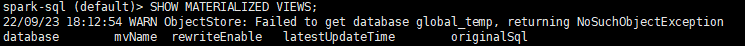

3.  创建样例基本表和样例视图。

    ```
    CREATE TABLE IF NOT EXISTS column_type(
        empid INT,
        deptno INT,
        locationid INT,
        booleantype BOOLEAN,
        bytetype BYTE,
        shorttype SHORT,
        integertype INT,
        longtype LONG,
        floattype FLOAT,
        doubletype DOUBLE,
        datetype DATE,
        timestamptype TIMESTAMP,
        stringtype STRING,
        decimaltype DECIMAL
    );
    INSERT INTO TABLE column_type VALUES(
        1,1,1,TRUE,1,1,1,1,1.0,1.0,
        DATE '2022-01-01',
        TIMESTAMP '2022-01-01',
        'stringtype1',1.0
    );
    INSERT INTO TABLE column_type VALUES(
        2,2,2,TRUE,2,2,2,2,2.0,2.0,
        DATE '2022-02-02',
        TIMESTAMP '2022-02-02',
        'stringtype2',2.0
    );
    ```

    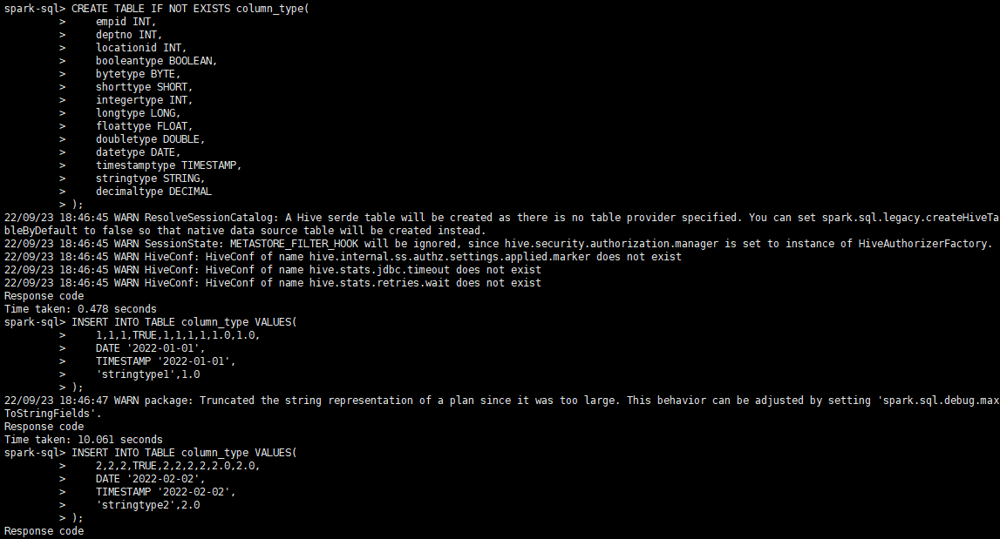

4.  创建物化视图。

    ```
    CREATE MATERIALIZED VIEW IF NOT EXISTS mv_create1
    AS
    SELECT * FROM column_type;
    ```

    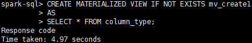

5.  通过EXPLAIN SQL，来查看查询的执行计划是否被重写。

    ```
    EXPLAIN 
    SELECT * FROM column_type;
    ```

    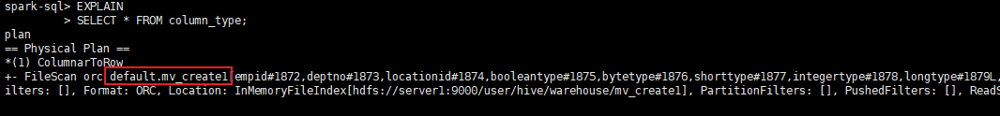

##### 推荐视图<a name="ZH-CN_TOPIC_0000002513491855"></a>

用户可根据实际需要提供数据表，使用OmniMV物化视图最终得到推荐的视图集。

本次任务示例使用TPC-DS的数据表作为测试表。

1.  修改配置文件。

    1.  打开“config/omnimv\_config\_spark.cfg“文件。

        ```
        cd /opt/omnimv/BoostKit-omnimv_1.2.0
        vi config/omnimv_config_spark.cfg
        ```

    2.  按“i“进入编辑模式，参考如下内容修改。
        -   Spark 3.1.1。

            ```
            database = tpcds_bin_partitioned_varchar_orc_3000
            logparser_jar_path = /opt/omnimv/boostkit-omnimv-logparser-spark-3.1.1-1.2.0-aarch64.jar
            cache_plugin_jar_path = /opt/omnimv/boostkit-omnimv-spark-3.1.1-1.2.0-aarch64.jar
            hdfs_input_path = hdfs://server1:9000/spark2-history
            sqls_path = hdfs://server1:9000/omnimv/tpcds
            ```

        -   Spark 3.4.3。

            ```
            database = tpcds_bin_partitioned_varchar_orc_3000
            logparser_jar_path = /opt/omnimv/boostkit-omnimv-logparser-spark-3.4.3-1.2.0-aarch64.jar
            cache_plugin_jar_path = /opt/omnimv/boostkit-omnimv-spark-3.4.3-1.2.0-aarch64.jar
            hdfs_input_path = hdfs://server1:9000/spark2-history
            sqls_path = hdfs://server1:9000/omnimv/tpcds
            ```

    3.  按“Esc“键，输入:wq!，按“Enter“保存并退出编辑。

    **表 1**  OmniMV物化视图部分配置

    | 配置项                   | 含义                      | 参考值                                                                                                                                    |
    | --------------------- | ----------------------- | -------------------------------------------------------------------------------------------------------------------------------------- |
    | database              | 用于测试的数据库名称。             | -                                                                                                                                      |
    | logparser_jar_path    | 日志解析JAR包路径。             | <br> &#8226; /opt/omnimv/boostkit-omnimv-logparser-spark-3.1.1-1.2.0-aarch64.jar<br> &#8226; /opt/omnimv/boostkit-omnimv-logparser-spark-3.4.3-1.2.0-aarch64.jar |
    | cache_plugin_jar_path | OmniMV的JAR包路径。          | <br> &#8226; /opt/omnimv/boostkit-omnimv-spark-3.1.1-1.2.0-aarch64.jar<br> &#8226; /opt/omnimv/boostkit-omnimv-spark-3.4.3-1.2.0-aarch64.jar                     |
    | hdfs_input_path       | Spark任务运行日志在HDFS上的访问地址。 | hdfs://server1:9000/spark2-history                                                                                                     |
    | sqls_path             | 测试SQL在HDFS上的访问地址。       | hdfs://server1:9000/omnimv/tpcds                                                                                                       |

2.  获取测试SQL（以TPC-DS为例）。
    1.  下载[Spark源码](https://github.com/apache/spark)并解压，在“spark-master/sql/core/src/test/resources/tpcds/“路径下获取TPC-DS测试SQL。
    2.  将测试SQL传到HDFS上（路径为配置文件中sqls\_path的值）。

        ```
        hdfs dfs -mkdir -p hdfs://server1:9000/omnimv/tpcds
        hdfs dfs -put /spark源码目录/sql/core/src/test/resources/tpcds/* hdfs://server1:9000/omnimv/tpcds/
        ```

3.  初始化数据库。这一步主要是获取目标表的建表信息，用于后续创建推荐视图。

    屏幕打印“init\_database succeed!”说明执行成功。

    ```
    python main.py spark init_database
    ```

4.  运行测试SQL（以TPC-DS测试SQL为例）。

    屏幕打印“run\_original\_sqls succeed!”说明执行成功。

    ```
    python main.py spark run_original_sqls
    ```

5.  解析运行日志。
    1.  通过http://ip:18080地址访问Spark History Server查看SQL任务起止时间。
    2.  打开配置文件“config/omnimv\_config\_spark.cfg“。

        ```
        vi config/omnimv_config_spark.cfg
        ```

    3.  按“i“进入编辑模式，修改参数如下。

        ```
        # 测试SQL运行开始时间
        q_log_start_time = 2022-09-15 11:58
        # 测试SQL运行结束时间
        q_log_end_time = 2022-09-15 17:15
        ```

    4.  按“Esc“键，输入**:wq!**，按“Enter“保存并退出编辑。
    5.  运行日志解析脚本。

        屏幕打印“parse\_query\_logs succeed!”说明执行成功。

        ```
        python main.py spark parse_query_logs
        ```

6.  生成候选视图。
    1.  打开配置文件“config/omnimv\_config\_spark.cfg“。

        ```
        vi config/omnimv_config_spark.cfg
        ```

    2.  按“i“进入编辑模式，修改参数如下。

        ```
        # 候选TOP mv的数量限制，实际推荐数量小于等于该值
        mv_limit = 10
        ```

    3.  按“Esc“键，输入**:wq!**，按“Enter“保存并退出编辑。
    4.  运行脚本。

        屏幕打印“greedy recommend for candidate mv”说明执行成功。

        ```
        python main.py spark generate_views
        ```

7.  运行创建topN视图。

    需要人为确认，是否可以真实的创建这个候选的视图。

    ```
    python main.py spark create_greedy_views
    ```

### 验证xx（软件或特性名称）<a name="ZH-CN_TOPIC_0000002481412014"></a>

_介绍如何获取到验证软件/特性生效，提供明确的步骤。_

-   _此部分信息必选。_
-   _注意将每一步操作步骤都呈现出来，避免默认用户已知某些步骤而不提供的情况，例如：进入目录的命令。_

示例：

使能特性后，可在虚拟机内部通过以下命令验证基于PMC（PMU）中断的NMI Watchdog是否加载成功。

```
dmesg | grep "NMI watchdog"
```

根据加载的Watchdog类型，您将看到不同的回显信息。

-   如果已加载SDEI Watchdog，且已加载成功，回显中应包含以下内容。

    ```
    SDEI NMI watchdog: SDEI Watchdog registered successfully
    ```

-   虚拟化场景下，默认加载SDEI Watchdog，且加载必然失败，将回显如下内容。

    ```
    SDEI NMI watchdog: Disable SDEI NMI Watchdog in VM
    ```

-   如果已加载基于PMC（PMU）中断的NMI Watchdog（虚拟化场景下的唯一可行方案），且已加载成功，回显中应包含以下内容。

    ```
    NMI watchdog: Enabled. Permanently consumes one hw-PMU counter.
    ```

### （可选）使用效果<a name="ZH-CN_TOPIC_0000002481571974"></a>

-   _对该特性进行比较笼统的价值介绍时，可在简介里体现。_
-   _对该特性基于具体案例或可量化的指标，体现收益时，可在此章节体现。_

示例：

使用MM-OpenSoraPlan1.3模型训练场景下，并行配置\(CP=8+分层ZeRO\)相较于基线\(TP=8+ZeRO1\)内存使用情况基本一致，实验组并行配置\(CP=8+分层ZeRO\)相比于基线\(TP=8+ZeRO1\)端到端性能提升9.7%。

## （可选）维护特性<a name="ZH-CN_TOPIC_0000002513491845"></a>

_用户在使用特性的过程中，会涉及到一些维护管理的操作，本章节介绍如何维护特性，包括如何升级软件、卸载软件、提供使用特性时会使用到的查询命令，以及指导如何收集日志等。_

-   _当该特性需要独立部署时，应有相应的维护计划，**此章节为必选。**
-   _当该特性集成在某个框架、软件上等平台上，没有单独维护计划时，**此章节为可选。**

### 升级软件<a name="ZH-CN_TOPIC_0000002513491853"></a>

_介绍如何升级软件。_

-   _此部分信息可选。_
-   _注意将每一步操作步骤都呈现出来，避免默认用户已知某些步骤而不提供的情况，例如：进入目录的命令。_

示例：

OmniOperator算子加速软件升级仅需在管理节点操作并确保OmniOperator算子加速上层引擎处于没有任务执行的状态。

1.  删除依赖SO文件以及OmniOperator算子加速相关文件，这里安装的目录以“/opt/omni-operator/lib“为例。

    ```
    cd /opt/omni-operator/lib
    rm -rf libjemalloc.so.2 libLLVM-15.so
    rm -rf include libboostkit-omniop* boostkit-omniop* libsecurec.so
    ```

2.  下载并上传预安装版本依赖包以及OmniOperator算子加速压缩包（获取方式请参见XXX和XXX)）到管理节点和计算节点，分别按安装依赖和安装OmniOperator完成安装。
3.  在Spark引擎上应用时，需按打包与上传OmniOperator安装包重新打包与上传OmniOperator算子加速安装包。

### 卸载软件<a name="ZH-CN_TOPIC_0000002513491857"></a>

_介绍如何卸载软件。_

-   _此部分信息可选。_
-   _注意将每一步操作步骤都呈现出来，避免默认用户已知某些步骤而不提供的情况，例如：进入目录的命令。_

示例：

OmniOperator算子加速软件卸载仅需在管理节点操作并确保OmniOperator算子加速上层引擎处于没有任务执行的状态。

Spark Extension配置的目录以“/opt/omni-operator/conf“和“/opt/omni-operator/lib“为例，Hive Extension配置的目录以“/opt/omni-operator/hive“为例。

1.  删除conf和hive文件夹。

    ```
    rm -rf /opt/omni-operator/conf
    rm -rf /opt/omni-operator/hive
    ```

2.  进入“/opt/omni-operator/lib“目录，删除依赖SO文件以及OmniOperator算子加速相关文件。

    ```
    cd /opt/omni-operator/lib
    rm -rf libjemalloc.so.2 libLLVM-15.so
    rm -rf include libboostkit-omniop* boostkit-omniop* libsecurec.so
    ```

3.  在Spark引擎上应用时，删除HDFS的OmniOperator算子加速安装包。

    ```
    hdfs dfs -rm -f /user/root/omni-operator.tar.gz
    ```

4.  通过**vi**打开“\~/.bashrc“文件，在该文件中删除与OmniOperator算子加速相关的LD\_LIBRARY\_PATH的内容，更新环境变量。
    1.  打开“\~/.bashrc“文件。

        ```
        vi ~/.bashrc
        ```

    2.  按“i“进入编辑模式，删除与OmniOperator算子加速相关的LD\_LIBRARY\_PATH的内容。
    3.  按“Esc“键，输入:**wq!**，按“Enter“保存并退出编辑。
    4.  执行以下命令更新环境变量。

        ```
        source ~/.bashrc
        ```

### 查询命令<a name="ZH-CN_TOPIC_0000002513371859"></a>

_介绍使用特性时会用到的查询命令。_

-   _此部分信息可选。_
-   _注意将每一步操作步骤都呈现出来，避免默认用户已知某些步骤而不提供的情况，例如：进入目录的命令。_

示例：

通过该命令可以查询打印ock\_version自身的版本信息。

**命令功能<a name="zh-cn_topic_0000002261192100_section10503133234813"></a>**

提供查询打印ock\_version自身的版本信息。使用之前需要配置LD\_LIBRARY\_PATH环境变量。

**命令格式<a name="zh-cn_topic_0000002261192100_section938834720485"></a>**

```
./ock_version --version
```

**使用实例<a name="zh-cn_topic_0000002261192100_section107721447174818"></a>**

运行以下命令，查看OCK版本信息。

```
./ock_version --version
```

返回信息如下：

```
Component Name: BoostKit-ock-bigdata-spark
Component version: 2.0.0
Component AppendInfo: openeuler_aarch64
SoftWare Name: ock_version
SoftWare Build Id: *******
```

### 收集日志<a name="ZH-CN_TOPIC_0000002513371869"></a>

_介绍使用特性时如何收集日志。_

-   _此部分信息可选。_
-   _注意将每一步操作步骤都呈现出来，避免默认用户已知某些步骤而不提供的情况，例如：进入目录的命令。_

示例：

日志记录了系统的运行情况和功能流程的处理情况，是维护人员查看系统状态、进行问题定位的重要工具和手段。通过日志收集功能，可以将OmniData算子下推日志导出到本地。

**收集最新日志文件<a name="zh-cn_topic_0000001665139794_zh-cn_topic_0000001518846969_section172825810566"></a>**

使用业务流中的文件传输功能，可以将服务器的日志文件导出到本地，操作会把选中OmniData算子下推日志目录下的omnidata-server.log收集到本地目录下。日志的目录为“/home/omm/omnidata-install/omnidata/log/omnidata-server.log“。

**收集所有日志<a name="section10412565417"></a>**

1.  打包日志文件。

    当用户需要下载所有的日志文件时，需要先将日志目录打包，然后再进行日志收集。“/home/omm/omnidata-install/omnidata/log“为OmniData算子下推服务的日志目录，用户需要根据实际情况填写日志目录。

    ```
    cd /home/omm/omnidata-install/omnidata/log
    tar -zcvf log.tar.gz *
    ```

2.  下载日志包。日志路径为：“/home/omm/omnidata-install/log/log.tar.gz“。

    将日志包保存至本地查看。

## （可选）安全管理<a name="ZH-CN_TOPIC_0000002481571982"></a>

介绍使用特性时会遇到的安全管理方法，例如：防病毒软件例行检查、安全加固等。

_此部分信息可选。_

示例：

通过安全检查与加固提高系统或网络的安全性和稳定性，防止黑客攻击、数据泄露、系统崩溃等问题的发生。同时，也可以满足法规和合规要求，保护用户隐私和信息安全。

| 产品            | 安全检查与加固                                                                                                 |
| ------------- | ------------------------------------------------------------------------------------------------------- |
| OmniData      | 防病毒软件例行检查、通信矩阵、日志控制、日志检查、检查OmniData日志、检查HAF日志、漏洞修复、SSH加固。                                               |
| OmniShuffle   | 防病毒软件例行检查、通信矩阵、漏洞修复、SSH加固、信息泄露风险提醒、地址随机化及内核地址栈编译开关、密钥更新、导入吊销列表、配置限制集群外IP地址访问、配置Kerberos身份认证票据、推荐环境变量设置。 |
| OmniShield    | 防病毒软件例行检查、日志控制、设置登录会话超时时间、设置禁用history命令、设置umask、缓冲区溢出安全保护、漏洞修复、SSH加固、后面所有。                              |
| OmniOperator  | 防病毒软件例行检查、日志控制、漏洞修复、SSH加固。                                                                              |
| OmniMV        | 防病毒软件例行检查、日志控制、漏洞修复、SSH加固。                                                                                                         |
| OmniAdvisor   | 防病毒软件例行检查、日志控制、漏洞修复、SSH加固。                                                                                                        |
| OmniHBaseGSI  | 防病毒软件例行检查、日志控制、漏洞修复、SSH加固。                                                                                                         |
| OmniScheduler | 防病毒软件例行检查、日志控制、漏洞修复、SSH加固。                                                                                                         |
| OmniStream    | 防病毒软件例行检查、日志控制、漏洞修复、SSH加固。                                                                                                         |

**防病毒软件例行检查<a name="section859962412142"></a>**

此项所有特性均需关注。

定期开展对集群和Spark组件的防病毒扫描，防病毒例行检查会帮助集群免受病毒、恶意代码、间谍软件以及程序侵害，降低系统瘫痪、信息泄露等风险。可以使用业界主流防病毒软件进行防病毒检查。

**日志控制<a name="section107732316151"></a>**

此项除OmniShuffle Shuffle加速外均需关注。

**关注点：**

-   检查系统是否可以限制单个日志文件的大小。
-   检查日志空间占满后，是否存在机制进行清理。

**设置登录会话超时时间<a name="section1167734205410"></a>**

此项仅需OmniShield机密大数据特性关注。

登录会话30分钟（或更短）的时间内没有活动的情况下应该超时。具体操作步骤如下：

1.  登录安装Ascend-mindxdl-mindio组件的节点。
2.  执行以下命令，打开“/etc/profile“文件。

    ```
    vim /etc/profile
    ```

3.  按“i”进入编辑模式，在文件尾部增加以下内容。

    ```
    export TMOUT=1800
    readonly TMOUT
    ```

4.  按“ESC”键，输入:wq!，按“Enter”保存并退出编辑。

## （可选）故障排除<a name="ZH-CN_TOPIC_0000002513491861"></a>

_提供特性安装、使用过程中遇到的常见问题处理方法。采用故障处理的写作模板。__不同的故障分子章节写作。__如果没有内容，请删除本章节。_

_写作注意事项：_

-   _操作步骤和命令分开，步骤中仅描述要执行的操作和执行该操作的目的。命令作为步骤的正文内容，换行显示。_
-   _如果执行的命令中包含多个参数，针对需要修改的参数，需要提供命令中参数含义解释，以及默认值、配置要求和建议。_
-   _表格、图片等需要建立引用。_
-   _命令行，用正文加粗，需要强调的变量参数斜体显示。_
-   _命令执行后的回显，必须用文本，带灰色底纹的回显样式，不要用截图。_

### 案例名称（示例）<a name="ZH-CN_TOPIC_0000002513371883"></a>

-   “信息内容”列含有“_（必填项）_”字样的必须填写，填写后请把“_（必填项）_”字样删掉。
-   “适用于服务器系列”、“适用于服务器版本”和“适用于组件分类”表示案例所适用的服务器系列、版本和组件分类，**需要按照适用情况选择，本模板提供全集可选项，请按需删减**。
-   案例所适用的分类必须是可选项内的子集，如案例适用多个分类，则需要使用英文分号“;”隔开。
-   zh和en标签用于案例提交机器翻译流程时使用，用en标签是为了统一用语，防止机器翻译时出现同一词语不同译文的现象。

**问题现象描述Symptom<a name="zh-cn_topic_0000001216835577_section3941254"></a>**

【书写注意事项】：

<u>案例但凡涉及截图，需要将截图中的关键信息（包括但不限于os debug日志片段等）以文本方式呈现在案例正文中，以便案例查询助手搜索引擎可以匹配搜索。在案例编写、评审时均需要关注。</u>

**关键过程、根本原因分析Key Process and Cause Analysis<a name="zh-cn_topic_0000001216835577_section35471290"></a>**

关键过程：

根本原因分析：

【书写注意事项】：

<u>案例但凡涉及截图，需要将截图中的关键信息（包括但不限于os debug日志片段等）以文本方式呈现在案例正文中，以便案例查询助手搜索引擎可以匹配搜索。在案例编写、评审时均需要关注。</u>

**结论、解决方案及效果Conclusion and Solution<a name="zh-cn_topic_0000001216835577_section50806158"></a>**

【书写注意事项】：

<u>案例但凡涉及截图，需要将截图中的关键信息（包括但不限于os debug日志片段等）以文本方式呈现在案例正文中，以便案例查询助手搜索引擎可以匹配搜索。在案例编写、评审时均需要关注。</u>

### snappy-java-1.1.1.3编译包格式错误<a name="ZH-CN_TOPIC_0000002513491867"></a>

_该案例为示例，仅供参考，具体以实际情况为准。_

**问题现象描述<a name="section758133012554"></a>**

执行编译时报错。报错信息如下：

```
gzip:stdin: not in gzip format
tar: Child returned status 1
tar: Error is not recoverable: exiting now
```

**关键过程、根本原因分析<a name="section145813300553"></a>**

无

**结论、解决方案及效果<a name="section135191856195612"></a>**

1.  进入“snappy-java-1.1.1.3/target“目录，删除未下载成功的tar包。

    ```
    cd snappy-java-1.1.1.3/target
    rm -rf snappy-1.1.1.tar.gz
    ```

2.  注释Makefile文件中，snappy压缩包下载地址，手动下载对应的snappy-1.1.1.tar.gz。

    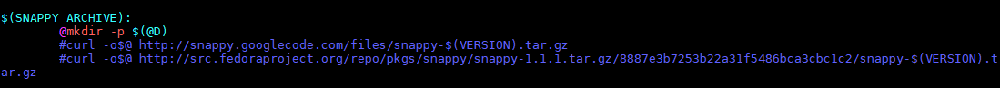

    ```
    wget http://src.fedoraproject.org/repo/pkgs/snappy/snappy-1.1.1.tar.gz/8887e3b7253b22a31f5486bca3cbc1c2/snappy-1.1.1.tar.gz --no-check-certificate
    ```

## （可选）FAQ<a name="ZH-CN_TOPIC_0000002481412028"></a>

_回答关于XXX特性的常见问题。_

示例：

MySQL并行查询优化应用场景常见问题如下表所示。

**表 1**  MySQL并行查询优化应用场景常见问题
| 序号 | 问题                                                                                                | 答案                                                                                                                                              |
| -- | ------------------------------------------------------------------------------------------------- | ----------------------------------------------------------------------------------------------------------------------------------------------- |
| 1  | MySQL并行查询优化的应用场景的白名单格式中，**where**和**limit**是必选项吗？                                                         | 不是。MySQL并行查询优化的应用场景的白名单格式中，**select**和**from**是必选项，**where**、**group by**、**having**、**order by**和**limit**都是可选项。                                                           |
| 2  | MySQL并行查询优化的触发条件一定要满足白名单的格式吗？                                                                     | 是。                                                                                                                                              |
| 3  | 部分semi join查询不支持并行查询，可以举例吗？                                                                       | semi join查询中涉及复杂子查询或特殊连接操作的场景，可能不支持并行查询。例如：多级嵌套的子查询，以及涉及不常见的连接操作，例如anti join（not exists的变体）。                                                    |
| 4  | 使用Hint语法进行并行查询，还需要满足白名单吗？                                                                         | 需要。并行查询的触发条件一定要满足白名单的格式。                                                                                                                        |
| 5  | 在系统参数满足条件情况下，满足白名单格式是一定会触发并行查询吗？                                                                  | 会触发。                                                                                                                                            |
| 6  | 如何判断查询有没有触发并行查询？                                                                                  | 查看执行计划，执行计划中会出现parallel关键字。                                                                                                                     |
| 7  | 并行查询的四个状态变量**PQ_threads_running**、**PQ_memory_used**、**PQ_threads_refused**或**PQ_memory_refused**是否能作为并行查询触发的观察点？ | 四个状态变量中的**PQ_threads_running**可作为并行查询触发的观察点。如果执行并行查询，**PQ_threads_running**的值会变大；查询结束后，**PQ_threads_running**的值将恢复。                                         |
| 8  | 满足白名单、并行查询的开关打开且阈值为0的情况下，如果t1中只有一条数据（例如：**select * from t1;**），会触发并行查询吗？                              | 只有一条数据会被认为是const表，不会触发并行查询。超过一条数据则会触发并行查询。但是，如果数据太少，触发了并行查询没有意义，性能反而会更差。                                                                        |
| 9  | 并行查询的应用场景，多表白名单中，多表的联合方式，写法只能是“t1,t2;”吗，是否有其他写法？                                                  | 写法不限于“t1,t2;”。具体支持哪些联合方式取决于数据库的查询优化器和执行计划生成策略。<br>例如“SELECT t1.a, t2.b FROM t1 INNER JOIN t2 ON t1.id = t2.id;”，如果t1和t2满足并行查询的单表条件，那么这条查询可能会触发并行查询。 |
| 10 | 如果关联的字段在两个表上分别有索引，或者条件里分别用了两个表上的索引，这种情况会发生索引归并而不能触发并行查询吗？                                         | 这种情况下，如果满足索引归并的条件，会触发索引归并。索引归并优化是针对单表的优化，当一个表同时使用多个索引进行条件扫描时，可能会触发索引归并优化。可以通过查询执行计划确认是否触发了索引归并。当触发了索引归并时，则不会触发并行查询。                             |
## （可选）参考信息<a name="ZH-CN_TOPIC_0000002513371861"></a>

_此处描述可参考的资料汇总，如果文档中有引用公开网站的内容，需要在此处注明参考内容来源。如果没有内容，请删除本章节。_

# 修订记录<a name="ZH-CN_TOPIC_0000002481412026"></a>

_写作说明：_

_在第一次发布时，明确第一次正式发布。后续的刷新记录，需明确是第几次发布，然后提供发布日期和具体的修订说明。_

| 发布日期       | 修订记录    |
| ---------- | ------- |
| 2019-08-06 | 第一次正式发布 |

