# 开发工具手册模板

> **说明：** 
>-   _下文中所有章节名称不加章节序号。_
>-   _中英文之间不加空格，中文与数字之间不加空格_

## 命令行和API工具手册模板


### （可选）工具使用导航

_**资料书写要求：**_

1.  _可选说明：针对多特性场景或多工具场景可添加，单特性场景或单工具情况不需要此章节。_
2.  _主要内容是以表格形式罗列各工具，并添加超链接，以及工具短描述，供用户快速选择。_
    1.  _超链接在功能名称上直接加_
    2.  _短描述是指对这个标题的目标文档包含哪些内容进行简单描述，字数在15个字以内，最多不超过30个字_
    3.  _目标文件格式：_

        _文件名：功能名称英文.md，比如：dump.md_

        _文档标题：xxx使用指南，比如：精度数据采集使用指南_

**示例：**

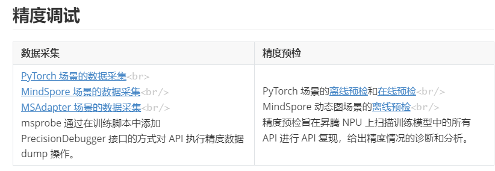

### 简介

_**资料书写要求：**_

1.  _简介内容需要包括工具简介、基本概念（可选）、流程图（可选）_
2.  _简介格式：中文全称（英文全称，缩略语）：工具定义_
    1.  _工具定义要求字数100个字以内__，不超过__150个字_
    2.  _介绍工具的作用和使用场景（不需要介绍工具用到的技术或内部原理）_

3.  _基本概念__（可选）_

    _本文内容中若有新名词或专业术语，需要换行写定义，注意后续全文使用统一名称。样式如下：_

    -   _概念1：是xxx_
    -   _概念2：是xxx_
    -   _..._

4.  _工具使用流程（可选）_

    _需要用户了解整体流程的情况下建议添加_

    _建议使用流程图形式（流程图不需要自己画，只要提供简要初稿，交给资料美工进行规范）_

**示例：**

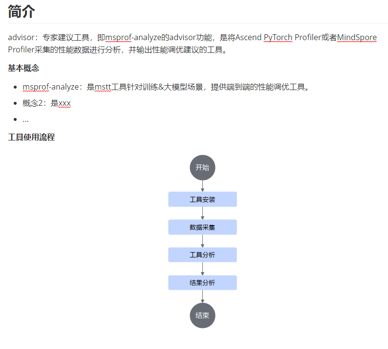

### 产品支持情况

_**资料书写要求：**_

_如果整个工具所有功能&特性支持情况一致，则在此处统一写一个昇腾AI处理器支持情况即可，如果各个功能&特性支持情况不一致则在各个功能&特性介绍开头写_

***具体产品型号需要同步资料对外宣称的名称***

**示例：**

| 产品                                        | 是否支持 |
| ------------------------------------------- | -------- |
| Ascend 950PR/Ascend 950DT                   | √        |
| Atlas A3 训练系列产品/Atlas A3 推理系列产品 | √        |
| Atlas A2 训练系列产品/Atlas A2 推理系列产品 | √        |
| Atlas 200I/500 A2 推理产品                  | √        |
| Atlas 推理系列产品                          | √        |
| Atlas 训练系列产品                          | √        |


### 使用前准备

_**资料书写要求：**_

1.  _包括环境准备、约束（可选）_
    1.  _环境准备：用有序列表或无序列表格式描述每一条需要准备的内容（一条内容时直接用正文描述），涉及到需要安装依赖的，需要写出命令和安装步骤_
    2.  _约束（可选）：用无序列表罗列约束只有一条约束时直接用正文描述，没有约束时就不写（没有约束时环境准备的标题也不需要，直接在使用前准备的标题下写环境准备的内容）_

2.  _参见xxx手册安装软件使用固定句式_

    _通用句式：安装xxx，详情请参见《xx》中“xx”章节的”xx”场景。_或_安装xxx，详情请参见《xx》中的“xx”章节_。

    _例如参见CANN手册xxx场景安装句式：_

    -   _安装配套版本的NPU驱动和固件、CANN软件（Toolkit、Kernels和NNAL）并配置CANN环境变量，具体__请参见《CANN软件安装指南》中“[选择安装场景]()”章节（商用版）或“[选择安装场景]()”章节（社区版）的“训练&推理&开发调试”场景_。
    -   _根据实际用户场景选择CANN相关软件包并安装，具体请参见《CANN软件安装指南》中“[选择安装场景]()”章节（商用版）或“[选择安装场景]()”章节（社区版）的“训练&推理&开发调试”场景_。

**示例：**

参见CANN手册xxx场景安装句式：

-   性能：请参见《CANN软件安装指南》根据实际场景安装CANN相关软件包。

    修改后：根据实际用户场景选择CANN相关软件包并安装，具体请参见《CANN软件安装指南》中“[选择安装场景]()”章节的“训练&推理&开发调试”场景。

-   精度：请参见《CANN软件安装指南》中的“选择安装场景”章节中选择“训练&推理&开发调试”场景安装CANN Toolkit开发套件包。

    修改后：安装配套版本的CANN Toolkit开发套件包并配置CANN环境变量，具体请参见《CANN软件安装指南》中“[选择安装场景]()”章节的“训练&推理&开发调试”场景。

-   msLeaks：使用msLeaks工具前，需要安装驱动固件和Ascend-cann-toolkit软件包，并配置环境变量，请参见《CANN软件安装指南》中的“选择安装场景”章节中选择“训练&推理&开发调试”场景安装CANN软件包。

    修改后：安装配套版本的NPU驱动、固件、CANN Toolkit开发套件包并配置CANN环境变量，具体请参见《CANN软件安装指南》中“[选择安装场景]()”章节的“训练&推理&开发调试”场景。

-   AOE：请参考《CANN软件安装指南》完成驱动、固件以及开发套件包Ascend-cann-toolkit的安装，部署开发环境和运行环境。

    修改后：安装配套版本的NPU驱动、固件、CANN Toolkit开发套件包并配置CANN环境变量，具体请参见《CANN软件安装指南》中“[选择安装场景]()”章节的“训练&推理&开发调试”场景。

-   服务化：请参见《MindIE安装指南》完成MindIE的安装和配置并确认MindIE Motor可以正常运行。

    修改后：完成MindIE的安装和配置并确认MindIE Motor可以正常运行，具体请参见《[MindIE安装指南]()》完成MindIE的安装。

-   分析迁移：安装开发套件包，请参见《CANN 软件安装指南》中的“[选择安装场景]()”章节中选择“训练&推理&开发调试”场景安装CANN软件包。

    修改后：安装配套版本的CANN Toolkit开发套件包并配置CANN环境变量，具体请参见《CANN软件安装指南》中“[选择安装场景]()”章节的“训练&推理&开发调试”场景。

-   算子速查：详情请参见《CANN软件安装指南》中的“选择安装场景”章节中选择“训练&推理&开发调试”场景安装CANN软件包。

    修改后：安装配套版本的CANN Toolkit开发套件包并配置CANN环境变量，具体请参见《CANN软件安装指南》中“[选择安装场景]()”章节的“训练&推理&开发调试”场景。

-   ATC：参见《CANN软件安装指南》进行环境搭建，并确保开发套件包Ascend-cann-toolkit安装完成。该场景下ATC工具安装在“$\{install\_path\}/latest/bin”目录下；其中，$\{install\_path\}请替换为CANN软件安装目录，以root安装举例，安装目录为：/usr/local/Ascend/ascend-toolkit。

    修改后：安装配套版本的CANN Toolkit开发套件包并配置CANN环境变量，具体请参见《CANN软件安装指南》中“[选择安装场景]()”章节的“训练&推理&开发调试”场景。该场景下ATC工具安装在“$\{install\_path\}/latest/bin”目录下；其中，$\{install\_path\}请替换为CANN软件安装目录，以root安装举例，安装目录为：/usr/local/Ascend/ascend-toolkit。

-   算子编译：

    根据软件包列表准备软件包。

    **表 1**  软件包列表

    <table><thead align="left"><tr id="row1487213252618"><th class="cellrowborder" valign="top" width="31.230000000000004%" id="mcps1.2.3.1.1"><p id="p587217212616"><a name="p587217212616"></a><a name="p587217212616"></a>组件</p>
    </th>
    <th class="cellrowborder" valign="top" width="68.77%" id="mcps1.2.3.1.2"><p id="p1987213242618"><a name="p1987213242618"></a><a name="p1987213242618"></a>简介</p>
    </th>
    </tr>
    </thead>
    <tbody><tr id="row13873142152614"><td class="cellrowborder" valign="top" width="31.230000000000004%" headers="mcps1.2.3.1.1 "><p id="p16873326262"><a name="p16873326262"></a><a name="p16873326262"></a>Toolkit</p>
    </td>
    <td class="cellrowborder" valign="top" width="68.77%" headers="mcps1.2.3.1.2 "><p id="p138731026265"><a name="p138731026265"></a><a name="p138731026265"></a>开发、调测、调优工具包。主要包括算子工具、模型工具、应用工具。</p>
    </td>
    </tr>
    <tr id="row158735215267"><td class="cellrowborder" valign="top" width="31.230000000000004%" headers="mcps1.2.3.1.1 "><p id="p5873172152612"><a name="p5873172152612"></a><a name="p5873172152612"></a>Firmware</p>
    </td>
    <td class="cellrowborder" valign="top" width="68.77%" headers="mcps1.2.3.1.2 "><p id="p158732242613"><a name="p158732242613"></a><a name="p158732242613"></a>固件包。设备上的UEFI等基础固件，通常在device生产过程烧入该软件包，但也可以在后期通过安装该包实现固件版本升级。</p>
    </td>
    </tr>
    <tr id="row18735219261"><td class="cellrowborder" valign="top" width="31.230000000000004%" headers="mcps1.2.3.1.1 "><p id="p1987316219265"><a name="p1987316219265"></a><a name="p1987316219265"></a>Driver</p>
    </td>
    <td class="cellrowborder" valign="top" width="68.77%" headers="mcps1.2.3.1.2 "><p id="p1687313220269"><a name="p1687313220269"></a><a name="p1687313220269"></a>驱动包。用于承载Host和Device之间的交互、调度、传输等，包含设备管理、查询驱动，图执行任务调度驱动，训练数据传输预处理驱动，AICPU算子加载执行驱动等。</p>
    </td>
    </tr>
    </tbody>
    </table>
    
    安装软件包。请参考《CANN软件安装指南》完成驱动、固件、开发套件包Ascend-cann-toolkit的安装。
    
-   修改后：安装配套版本的NPU驱动、固件、CANN Toolkit开发套件包并配置CANN环境变量，具体请参见《CANN软件安装指南》中“[选择安装场景]()”章节的“训练&推理&开发调试”场景。
-   算子开发：进行算子开发之前，需要安装驱动固件和CANN Toolkit软件包，请参见《CANN软件安装指南》中的“选择安装场景”章节中选择“训练&推理&开发调试”场景安装CANN软件包。本节不再给出安装示例。

    修改后：安装配套版本的NPU驱动、固件、CANN Toolkit开发套件包并配置CANN环境变量，具体请参见《CANN软件安装指南》中“[选择安装场景]()”章节的“训练&推理&开发调试”场景。

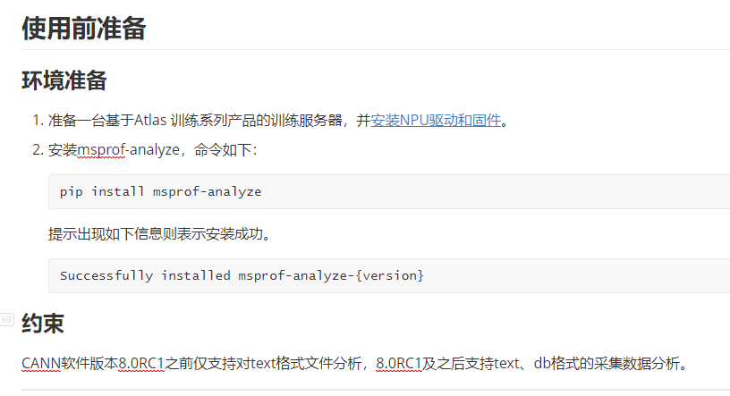

### （可选）快速入门

_**资料书写要求：**_

1.  _可选说明：对于工具使用较为复杂，比如命令行参数较多或API较多的工具，为例让用户快速上手，建议添加快速入门，如果功能操作很简单，可能就一条命令、一个示例代码，那么可以不需要快速入门_
2.  _这里的快速入门由于有前面的环境准备，所以可以直接写操作，前提条件中可以描述完成使用前准备_
3.  _多个场景时可以一个场景一个快速入门，命名格式为：xxx场景快速入门_
4.  _对于多个工具合一的手册，子工具或子场景也可以在对应工具或场景的章节里写快速入门（当前只有黄区工具有此现象）_
5.  _快速入门具体写作参照《**快速入门写作模板**》_

**示例：**

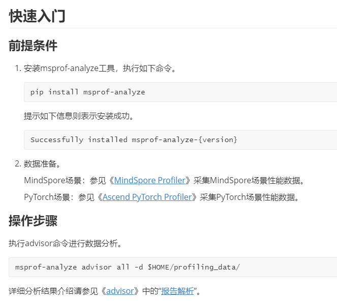

### xxx（功能介绍）（命令行工具）

_**资料书写要求：**_

1.  _可选说明：与[xxx（功能介绍&xxx特性介绍）](#xxx（功能介绍&xxx特性介绍）)不同的是本章节介绍工具详细内容，而[xxx（功能介绍&xxx特性介绍）](#xxx（功能介绍&xxx特性介绍）)是以超链接形式将功能&特性跳转到另一个文档介绍，当一个工具既有一个主功能也有其他功能&特性时，两个章节可以并存，当只有主功能时只需要本章节。_
2.  _章节标题要求：可以用命令功能做标题，也可以用命令字如__kubectl get做标题。__当命令较长时建议用命令含义做标题。_
3.  _包含内容：**产品支持情况、功能说明、注意事项、命令格式、参数说明、使用示例、输出说明**_
4.  _多个功能时，一个功能分一个章节，相同类型的功能也可以加父目录进行分类_
5.  *下列各标题（**产品支持情况、功能说明、命令格式、参数说明、使用示例、输出说明**）如果使用标题格式，则会重复臃肿的情况，所以用加粗，特殊情况如果需要用标题，具体情况具体判断*

**产品支持情况**

_**资料书写要求：**_

_如果整个工具所有功能&特性支持情况一致，则在此处统一写一个昇腾AI处理器支持情况即可，如果各个功能&特性支持情况不一致则在各个功能&特性介绍开头写_

***具体产品型号需要同步资料对外宣称的名称***

**示例：**

| 产品                                        | 是否支持 |
| ------------------------------------------- | -------- |
| Ascend 950PR/Ascend 950DT                   | √        |
| Atlas A3 训练系列产品/Atlas A3 推理系列产品 | √        |
| Atlas A2 训练系列产品/Atlas A2 推理系列产品 | √        |
| Atlas 200I/500 A2 推理产品                  | √        |
| Atlas 推理系列产品                          | √        |
| Atlas 训练系列产品                          | √        |

**功能说明**

_**资料书写要求：**_

_描述命令的功能、应用场景等。_

**示例：**

设置Device侧系统类日志的日志级别。

**注意事项**

_**资料书写要求：**_

_列举执行本命令的注意事项，如果无，就写无__，用无序列表格式_

**示例：**

-   昇腾虚拟化实例容器场景不支持使用该命令。
-   执行该命令必须拥有xx权限

**命令格式**<a name="命令格式"></a>

_**资料书写要求：**_

1.  _命令格式用代码块，且无需设置codetype；可选参数用\[\]；变量值用<\>__，且无需使用斜体。__以上要求仅适用于命令格式。_
2.  _参数过多时，可使用\[options\]表示。_

**示例1：**

```
msnpureport config --set --log [--device <deviceId>] --global <global_level>
```

**示例2：**

```
msnpureport config --set --log [options]
```

**参数说明**<a name="参数说明"></a>

_**资料书写要求：**_

_用表格呈现，且需包括以下三列：_

1.  _参数：__和命令格式中的参数格式保持一致__，当存在短命令字如-d和--device作用时，需要该列中体现。_
2.  _可选/必选__：明确该参数是可选还是必选_。
3.  _说明：需要明确__参数含义+取值列表/取值的获取方法+取值范围等_
4.  _参数较多时，比如超过十个，可以根据功能特性进行分类，分多个表格，每个表格一个子标题，也可以放到附录[（可选）命令行参数说明](#（可选）命令行参数说明)_

**示例：**

**表 1**  参数说明

| 参数         | 可选/必选 | 说明                                                         |
| ------------ | --------- | ------------------------------------------------------------ |
| -d或--device | 可选      | 指定Device ID（逻辑ID），默认导出所有Device日志信息。        |
| --global     | 必选      | 设置全局级的日志级别。<br>&#8226; debug：表示DEBUG级别。<br/>&#8226; info：表示INFO级别。<br/>&#8226; warning：表示WARNING级别。<br/>&#8226; error：表示ERROR级别。<br/>&#8226; null：表示NULL级别，不输出日志。<br/>默认值为info。 |

**使用示例**

_**资料书写要求：**_

1.  多个功能或场景时，每个功能或场景一个章节，章节命名格式：xxx场景使用示例（在使用示例章节下加子标题xxxxxx场景使用示例）
2.  _包括三个关键信息：执行用户+执行路径（也可在简介部分统一说明）、该示例是干什么用的，具体输入什么命令。_
3.  _命令样式要求（该要求适用于所有的命令示例，包括操作过程中的命令执行举例）：_
    1.  _操作步骤中的命令需使用screen标记对，无需设置codetype。_
    2.  _变量参数值不使用<\>（尖括号仅在命令格式中使用），必要时增加变量说明，可参考样例2。_

**示例：**

1.  以xx用户登录xx。
2.  【样例1】在任意路径下执行如下命令，设置全局日志为info级别：

    ```
    msnpureport config --set --log -g info
    ```

3.  【样例2】在任意路径下执行如下命令，采集AI任务执行过程中的AscendCL性能数据，包括Host与Device之间、Device间的同步异步内存复制时延等，命令示例如下：

    ```
    msprof --application="/home/projects/MyApp/out/main" --output=/home/projects/output
    ```

**输出说明**

_**资料书写要求：**_

_包括两个关键信息：回显（样式为ColdFusion）+回显参数说明（必要时提供）_

-   _配置类的命令如无输出说明，写无_；_查询类的命令一般会有回显信息，但不能截图，必须用文字，便于拷贝、查找_。
-   _回显样式要求：使用代码块标记对，设置codetype为__ColdFusion_。
-   _有些命令的回显信息很多、而且不确定，这时只需要用文字概括性介绍回显什么信息即可，无需把所有不相关回显信息贴出来。重点展示关键信息，无关信息使用省略号“…”代替或文字说明清楚。_

**示例：**

```
f           : 5
g_shift     : 4
alpha_ min  : 232
tkp_shift   : 8
```

| 字段       | 说明                                                         |
| ---------- | ------------------------------------------------------------ |
| f          | 后续迭代计数。                                               |
| g_shift    | 用来更新alpha的参数G的偏移。                                 |
| alpha_ min | alpha_min，alpha的最小值。                                   |
| tkp_shift  | tkp_shift，token桶更新周期的偏移2的N次方，如配置为8，则为2的8次方。 |


### xxx（功能介绍）（API工具）

_**资料书写要求：**_

1.  _可选说明：与[xxx（功能介绍&xxx特性介绍）](#xxx（功能介绍&xxx特性介绍）)不同的是本章节介绍工具详细内容，而[xxx（功能介绍&xxx特性介绍）](#xxx（功能介绍&xxx特性介绍）)是以超链接形式将功能&特性跳转到另一个文档介绍，当一个工具既有一个主功能也有其他功能&特性时，两个章节可以并存，当只有主功能时只需要本章节。_
2.  _章节标题要求：可以用命令含义做标题，也可以用命令字如__kubectl get做标题。__当命令较长时建议用命令含义做标题。_
3.  _包含内容：**功能说明、注意事项、使用指导、输出说明**_
4.  _多个功能时，一个功能分一个章节，相同类型的功能也可以加父目录进行分类_
5.  *下列各标题（**功能说明、注意事项、使用指导、输出说明**）如果使用标题格式，则会重复臃肿的情况，所以用加粗，特殊情况如果需要用标题，具体情况具体判断*

**功能说明**

_**资料书写要求：**_

_描述命令的功能、应用场景等__。_

**示例：**

设置Device侧系统类日志的日志级别。

**注意事项**

_**资料书写要求：**_

_列举执行本命令的注意事项，如果无，就写无__，用无序列表格式_

**示例：**

-   昇腾虚拟化实例容器场景不支持使用该命令。
-   执行该命令必须拥有xx权限

**使用示例**

_**资料书写要求：**_

1.  _多个功能或场景时，每个功能或场景一个章节，章节名称以实际功能命名_
2.  _如何执行代码的操作步骤，步骤中为节省篇幅可以给简略代码，完整代码跳转到附录的[（可选）示例代码](#（可选）示例代码)_
3.  _代码以代码块格式呈现，需要配置codetype_
4.  _代码示例后面补充完整API参考的链接_

**示例：**

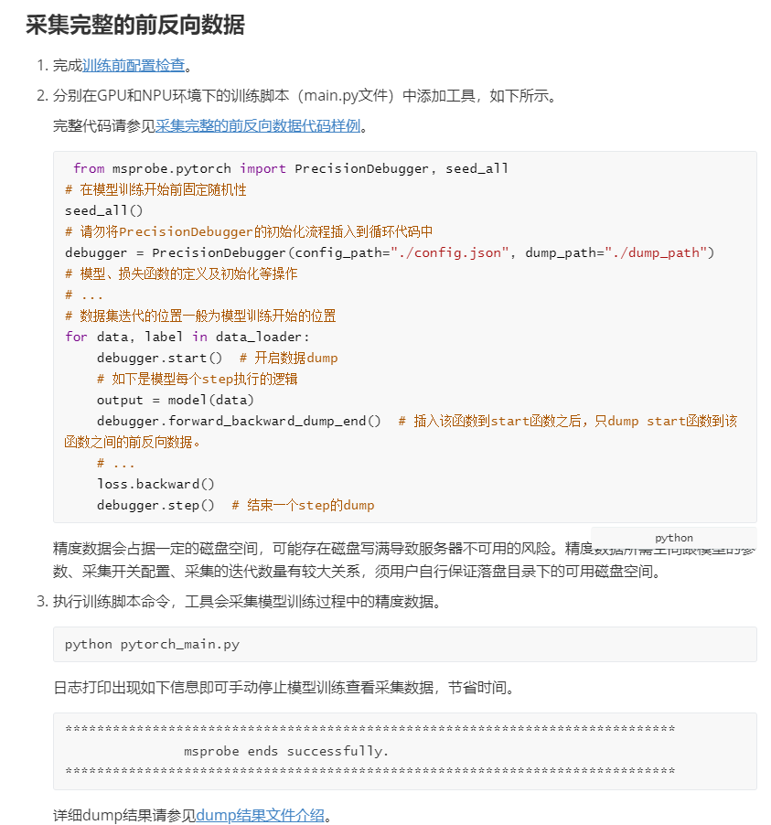

**输出说明**

_**资料书写要求：**_

_包括两个关键信息：回显（样式为ColdFusion）+回显参数说明（必要时提供）_

-   _配置类的命令如无输出说明，写无_；_查询类的命令一般会有回显信息，但不能截图，必须用文字，便于拷贝、查找_。
-   _回显样式要求：使用代码块格式，设置codetype为ColdFusion_。
-   _有些命令的回显信息很多、而且不确定，这时只需要用文字概括性介绍回显什么信息即可，无需把所有不相关回显信息贴出来。重点展示关键信息，无关信息使用省略号“…”代替或文字说明清楚。_

**示例：**

```
f           : 5
g_shift     : 4
alpha_ min  : 232
tkp_shift   : 8
```

| 字段       | 说明                                                         |
| ---------- | ------------------------------------------------------------ |
| f          | 后续迭代计数。                                               |
| g_shift    | 用来更新alpha的参数G的偏移。                                 |
| alpha_ min | alpha_min，alpha的最小值。                                   |
| tkp_shift  | tkp_shift，token桶更新周期的偏移2的N次方，如配置为8，则为2的8次方。 |


### xxx（功能介绍&xxx特性介绍）

_**资料书写要求：**_

-   _可选说明：与[xxx（功能介绍）（命令行工具）](#xxx（功能介绍）（命令行工具）)或[xxx（功能介绍）（API工具）](#xxx（功能介绍）（API工具）)不同的是本章节以超链接形式将功能&特性跳转到另一个文档介绍，而[xxx（功能介绍）（命令行工具）](#xxx（功能介绍）（命令行工具）)或[xxx（功能介绍）（API工具）](#xxx（功能介绍）（API工具）)介绍工具详细内容，当一个工具既有一个主功能也有其他功能&特性时，可以与[xxx（功能介绍）（命令行工具）](#xxx（功能介绍）（命令行工具）)或[xxx（功能介绍）（API工具）](#xxx（功能介绍）（API工具）)并存，当只有主功能时不需要本章节。_
-   _内容为介绍所有子工具的导读，标题为功能或特性的父目录“功能介绍”或“特性介绍”。_

**示例：**

目录结构


#### xxx功能

_**资料书写要求：**_

1. _功能点没有分类时，直接在“功能介绍”标题下用列表格式罗列功能点，各功能有顺序时使用有序列表，没有顺序时使用无序列表；功能点有分类时，在“功能介绍”标题下新建子标题以分类名称命名，子标题下同样用列表格式罗列功能点。_

2.  _功能点格式：超链接+短描述_
    1.  _超链接在功能名称上直接加_
    2.  _短描述是指对这个标题的目标文档包含哪些内容进行简单描述，字数在15个字以内，最多不超过30个字_
    3.  _目标文件格式：_

        _文件名：功能名称英文.md，比如：dump.md_

        _文档标题：xxx使用指南，比如：精度数据采集使用指南_

**示例：**

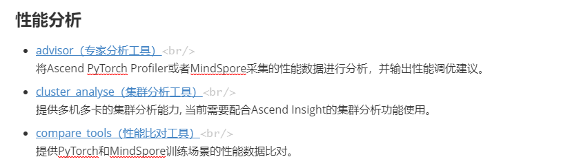

#### xxx特性

_**资料书写要求：**_

1.  _特性没有分类时，直接在“特性介绍”标题下用表格罗列特性；特性有分类时，在“特性介绍”标题下新建子标题以分类名称命名，子标题下同样用表格罗列特性。_
2.  _特性格式：特性名称+超链接_
    1.  _超链接在在表格第二列的link上加_
    2.  _目标文件格式：_

        _文件名：特性名称英文.md，比如：ulysses\_context\_parallel.md_

        _文档标题直接用特性名称，比如：Ulysses长序列并行_

3.  _具体开发工具手册写作参照《**特性资料写作模板**》_

**示例：**

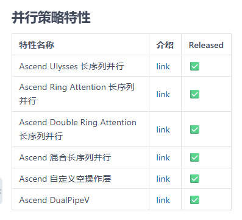

### （可选）输出结果文件说明

_**资料书写要求：**_

1.  _可选说明：当工具具有输出结果文件时，需要在这里写一份输出结果文件说明，没有输出结果文件就删除此章节_
2.  _每个文件说明开头提供产品支持情况_
3.  _输出结果文件说明是多个工具公共的输出结果时在这里汇总一份公共说明章节，各个工具输出结果不同时，输出结果文件说明放回各个工具章节_
4.  _章节命名格式：xx输出结果文件说明，多个文件时在该标题下增加子标题，以文件名称、参数或特性名称命名_
5.  _主要包含：结果介绍、截图示例和字段说明三个内容，三个内容直接描述不需要再加这三个标题_
    1.  _结果介绍：需要描述该结果对用户的收益_
    2.  _截图示例：截取能包含该特性的最小图片以节省空间，截图要求清晰，放大不能模糊_
    3.  _字段说明：表格呈现两列，表头为：字段、说明_

**示例：**

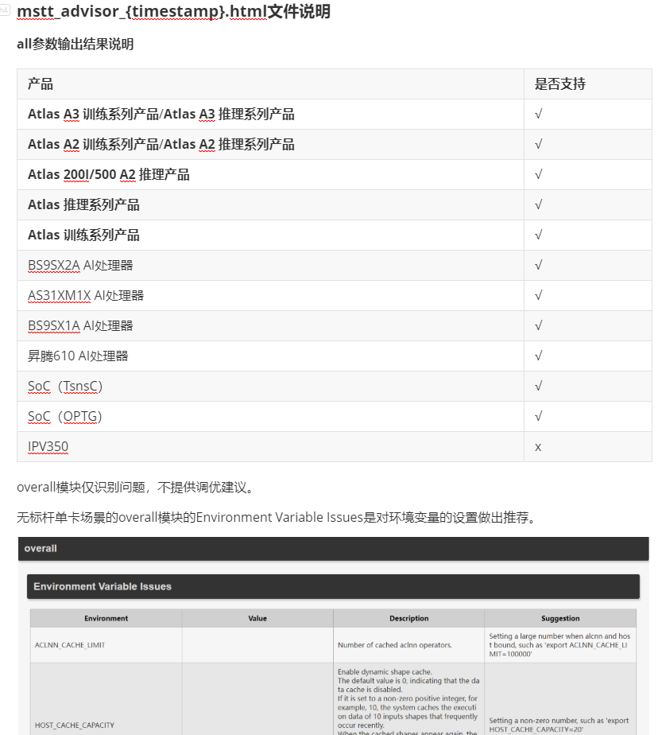

### （可选）案例

_**资料书写要求：**_

1.  _可选说明：根据实际需求判断是否补充案例_
2.  _以具体场景为背景，描述端到端的操作指南_
3.  _呈现方式可以在这里直接描述正文内容，也可以以短描述+超链接方式跳转到其他目录__，案例内容一般较多，建议使用__短描述+超链接方式_
4.  _请参考《**案例手册**》模板_

**示例：**

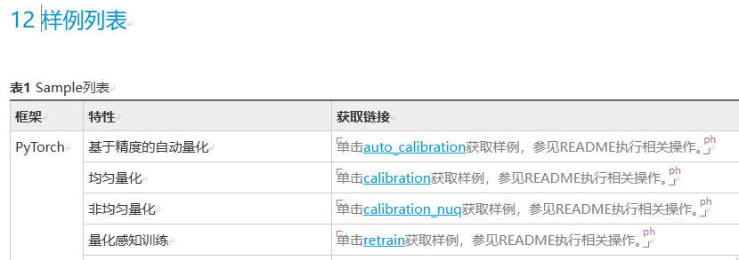

### （可选）扩展功能

_**资料书写要求：**_

1.  _可选说明：不在上面主流程中的功能_
2.  _每个功能写法与前面[xxx（功能介绍）（命令行工具）](#xxx（功能介绍）（命令行工具）)或[xxx（功能介绍）（API工具）](#xxx（功能介绍）（API工具）)保持一致_

### （可选）附录

_**资料书写要求：**_

-   _可选说明：不在上面结构中的，且上面结构内容中会引用的内容，比如配置文件、命令行参数说明、接口介绍、完整示例代码等_
-   _每个内容一个子章节_

#### （可选）命令行参数说明

_**资料书写要求：**_

1.  _可选说明：参数较多时，比如超过十个，可以根据功能特性进行分类，分多个表格，每个表格一个子标题，包含命令格式说明和完整参数说明_
2.  _写法与[参数说明](#参数说明)保持一致_

#### （可选）_API参考_

_**资料书写要求：**_

1.  _章节标题为xxxAPI参考，在这个章节下每个接口一个子章节，以接口名称命名_
2.  _可选说明：根据内容多少判断是否单独一个文档，超过十个接口时，单独一本，在前文相关位置用链接跳转，此处章节删除_
3.  _API接口介绍参照《**API参考写作规范**》_

#### （可选）示例代码

_**资料书写要求：**_

1.  _多个示例按使用场景分多个子章节_
2.  _可选说明：根据内容多少判断是否单独一个文档，超过三页或三个示例时，单独一本，在前文相关位置用链接跳转，此处章节删除_
3.  _章节名称以场景命名，格式为：xxx代码样例_
4.  _内容只包含一个代码块，用于拷贝代码样例，代码块需要填codetype_

**示例：**


#### （可选）配置文件

_**资料书写要求：**_

1.  _根据工具实际情况添加，有配置文件的工具需要此章节，没有的可删除此章节_
2.  _可选说明：根据内容多少判断是否单独一个文档，超过一页时，单独一本，在前文相关位置用链接跳转，此处章节删除_
3.  _标题格式：xxx配置文件_
4.  _内容包含：_
    1.  _配置文件简介，包含配置文件的作用和所在路径_
    2.  _配置文件参数介绍，以表格形式呈现，与[命令格式](#命令格式)一致_
    3.  _配置文件示例，根据不同场景提供配置文件的配置示例，以代码块格式呈现，需要配置代码块的codetype，一般为json_

**示例：**

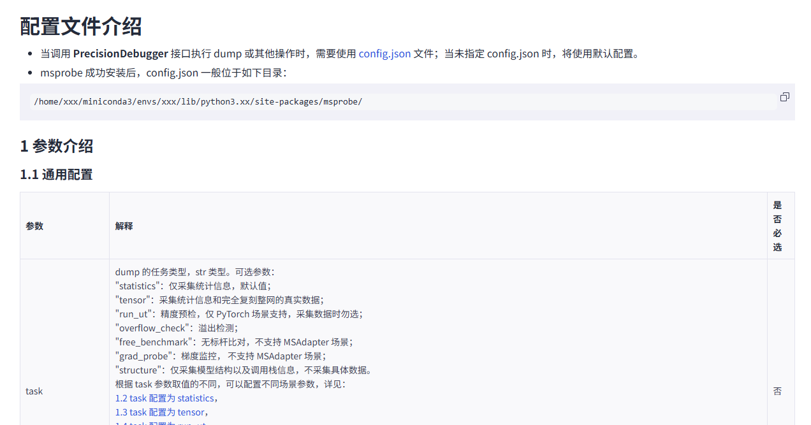

### （可选）FAQ

_**资料书写要求：**_

1.  _可选说明：__无FAQ时不需要此章节_
2.  _内容较少，5条以内，直接在这里描述_
3.  _内容较多，超过5条时，单独一本，用链接跳转_
4.  _FAQ具体写法参考《**FAQ**》模板_

## 界面工具手册模板

### 简介<a name="简介2"></a>

_资料书写要求：_

1.  _描述工具概念、优势、功能、应用场景及解决的问题。_
2.  _概念可使用一句简单的描述来呈现。_
3.  _功能、应用场景、解决的问题，分别以section形式呈现。_
4.  _如果有多个功能或者场景，可在对应section中使用表格形式呈现说明。_
5.  _如果有使用约束，也可在此topic中以section形式呈现。_
6.  _具体的写作示例可参考《[MindStudio Insight工具用户指南](https://www.hiascend.com/document/detail/zh/mindstudio/81RC1/GUI_baseddevelopmenttool/msascendinsightug/Insight_userguide_0002.html)》。_

示例1：

**概述**

此工具是将模型结构进行分级可视化展示的Tensorboard插件。可将模型的层级关系、精度性能数据进行可视化，并支持将调试模型和标杆模型进行分视图展示和关联比对，方便用户快速定位精度问题。

**优势**

MindStudio Insight借助于数据库支持超大性能数据处理，可以支持20GB的集群性能文件分析，并且能够支持大模型场景下的性能调优。

**功能**

MindStudio Insight包含系统调优、算子调优、内存调优的功能。

**使用约束**

MindStudio Insight工具支持导入并展示trace\_view.json文件，为了保证数据解析和展示性能，对导入的trace\_view.json文件规模做出了指导性的建议。

### 安装说明

_资料书写要求：_

1.  _当安装步骤简单清晰，步骤控制在1页内容时，可直接使用section写作。_
2.  _当安装步骤复杂，资料页数在1页以上时，需要使用topic形式写作。_
3.  _安装指南的模板可参见《**软件安装指南**》模板。_

示例：

可视化工具安装分为代码和GUI界面安装，可根据实际情况选择一种安装方式。

-   代码安装方式，可参考《**软件安装指南**》模板写作。
-   GUI界面安装方式，参照下方步骤写作。
    1.  安装
        1.  环境准备

            需要的相关依赖、软件包等需要在安装前准备和确认的内容。参见代码安装的环境准备。

        2.  安装方式

            按照安装操作逐步写出来，可参考《[MindStudio Insight 用户指南](zh-cn_topic_0000002274870533.md)》中的Windows安装。

        3.  启动工具（可选）

            如果安装完成后，需要另外找出快捷图标安装或以其它方式安装，写在这里。

            _例：双击桌面的“MindStudio Insight”快捷方式图标，或安装目录下的“MindStudio-Insight.exe”，即可启动MindStudio Insight工具。_

            如果安装完成后，就在安装界面有个启动工具，可直接写在安装方式中，可不单独写在这个章节。

            _例：_

            

    2.  升级
    3.  卸载

### 基础操作

_资料书写要求：_

1.  _当工具有公共使用操作时，可写在此topic中，包括数据导入，页面设置，日志管理，快捷键管理等。_
2.  _如果公共使用操作内容均较少，可使用section方式呈现。_
3.  _如果公共使用操作每个操作的内容较多，且不易理解时，可使用topic形式呈现。_

示例：

**切换主题**

1.  打开MindStudio Insight工具。
2.  单击界面右上方，切换主题，可切换为亮色或者暗色主题。

**切换语言**

1.  打开MindStudio Insight工具。
2.  单击界面右上方，进行MindStudio Insight工具中英文切换。

### 数据说明

_资料书写要求：_

1.  _“工具使用”名称可根据实际情况更换，可替换成具体的场景或者功能名称，例如：系统调优。_
2.  _当以场景区分时，示例如[简介](#简介2)\~[使用说明](#使用说明)所示。_
3.  _当以功能区分时，可参见使用说明章节。_

### 工具使用（场景或功能）

_资料书写要求：_

1.  _“工具使用”名称可根据实际情况更换，可替换成具体的场景或者功能名称，例如：系统调优。_
2.  _当以场景区分时，可只参考此章节写作。示例如[简介](#简介2)\~[使用说明](#使用说明)所示。_
3.  _如果工具以功能区分时，请参照本文档写作，在此章节时，仅参考[使用说明](#使用说明)章节写作即可。_


#### 简介

_资料书写要求：_

1.  _交代工具概述，功能，以及限制说明。_
2.  _以section形式呈现。_
3.  _如工具有明确的使用流程，可配合以流程图呈现使用流程。_
4.  _语言需要简洁清晰，符合用户阅读习惯，避免冗余描述，且表达模糊。_

示例：

**简介**

MindStudio Insight工具以时间线（Timeline）的呈现方式，将请求端到端的执行情况平铺在时间轴上，直观体现请求在各个关键阶段的耗时情况以及当下请求的状态信息，可帮助用户快速识别服务化性能瓶颈，并调整调优策略。

#### 使用前准备

_资料书写要求：_

1.  _交代工具使用前的准备工作，例如环境准备，数据准备。_
2.  _以section形式呈现。_
3.  _语言需要简洁清晰，符合用户阅读习惯，避免冗余描述，且表达模糊。_

示例：

**环境准备**

请先安装MindStudio Insight工具，具体安装步骤请参见《MindStudio Insight安装指南》。

**数据准备**

请导入正确格式的性能数据，具体数据说明请参见[数据说明](#数据说明)。

#### 数据说明<a name="数据说明"></a>

_资料书写要求：_

1.  _说明工具展示需要的数据来源，包括数据导入方式，支持的文件，数据采集的方法等，采集方法如果有文档承载，需要给出链接。_
2.  _数据中的一些限制条件也可以写在本章节，以section形式出现。_
3.  _语言需要简洁清晰，符合用户阅读习惯，避免冗余描述，且表达模糊。_

**示例：**

**数据说明**

MindStudio Insight支持导入性能数据文件，并以图形化形式呈现相关内容。在服务化调优场景中，主要支持导入两种数据类型，分别为可视化折线图的SQLite数据库文件（profiler.db）和推理服务化请求trace数据的json文件（chrome\_tracing.json）。

**注意事项**

支持同时导入系统调优和服务化调优的性能数据，需将两个场景的数据置于同一文件夹中，导入时选择该文件夹即可。

#### 界面名称

_资料书写要求：_

1.  _界面工具的界面名称，例如，内存（memory），时间线（Timeline）。_
2.  _以一个页面为维度介绍。_


##### 功能说明

_资料书写要求：_

1.  _简述该界面的功能。_
2.  _如工具有明确的使用流程，可配合以流程图呈现使用流程。_
3.  _语言需要简洁清晰，符合用户阅读习惯，避免冗余描述，且表达模糊。_

示例：

**功能说明**

在服务化调优过程中，MindStudio Insight工具以时间线（Timeline）的呈现方式，将请求端到端的执行情况平铺在时间轴上，直观体现请求在各个关键阶段的耗时情况以及当下请求的状态信息。通过分析时间线，用户可以快速识别服务化性能瓶颈，并根据问题现象，调整调优策略。

通过观察时间线视图各个层级上的耗时长短、间隙等判断对应的关键阶段是否存在性能问题。

##### 界面介绍

_资料书写要求：_

1.  _给出界面的介绍与截图。_
2.  _截图需要清晰且完整。_
3.  _如果图中需要标注，使用红色框标注，并使用①对区域标号，便于后续介绍。_
4.  _界面图下方需对界面图中的标注展开详细介绍。_
5.  _具体的功能使用说明放在使用说明章节，此处仅对界面做详细介绍，不体现功能使用。_
6.  _如果涉及到其他界面信息介绍，可以section形式展示，例如，泳道信息。_
7.  _具体的写作示例可参考《[MindStudio Insight工具用户指南](https://www.hiascend.com/document/detail/zh/mindstudio/81RC1/GUI_baseddevelopmenttool/msascendinsightug/Insight_userguide_0002.html)》。_

**示例：**

**界面介绍**

tensorboard首页如图所示，包含区域一（工具栏）、区域二（调试侧图结构）和区域三（标杆侧图结构）。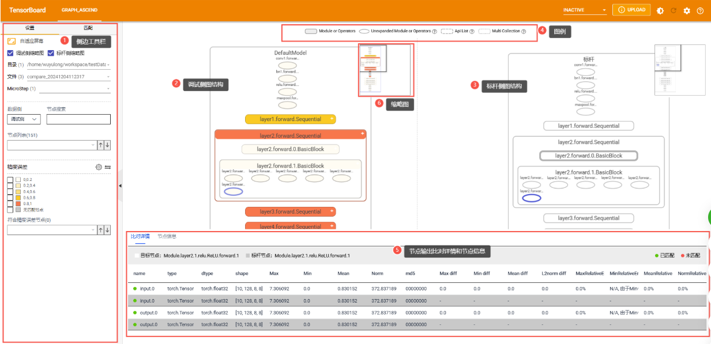

-   区域一：工具栏，一句话简单介绍下。
-   区域二：调试侧图结构，一句话简单介绍下。
-   区域三：标杆侧图结构，一句话简单介绍下。

**泳道信息**

| 一层级泳道名称 | 二层级泳道名称 | 说明                                                         |
| -------------- | -------------- | ------------------------------------------------------------ |
| Host           | process        | 仅db格式文件支持展示此泳道，在二层级process泳道下存在三层级泳道Thread，四层级泳道pytorch、CANN和MsTx，分别展示的是PyTorch框架下上层应用线程运行的耗时信息、CANN框架下线程运行的耗时信息和打点信息。 |
| Python         | Thread         | 用层数据，每个子泳道Thread包含上层应用线程运行的耗时信息，需要使用PyTorch Profiler或msproftx采集。仅支持在TEXT格式文件下展示该泳道。 |
| CANN           | Thread         | CANN层数据，每个子泳道Thread主要包含AscendCL、GE、Runtime组件以及Node（算子）的耗时数据。<br/>如果是db格式文件，二层级泳道名称可能包含acl，model，node，hccl，runtime，op，queue，trace，mstx等。 |
| MindSpore      | Thread         | 在MindSpore场景下，展示当前Thread下运行的阶段耗时。          |
| Scope Layer    | Thread         | 在MindSpore场景下，展示当前Thread网络层级的执行耗时。        |


##### 使用说明

_资料书写要求：_

1.  _描写工具使用指南，针对工具的使用给出具体使用操作步骤和方法。_
2.  _如果工具使用功能在5个以内，可使用1个topic，以section形式分别呈现。_
3.  _如果工具使用功能在5个以上，则根据实际功能划分细类，区分topic呈现。_
4.  _如果工具使用功能操作步骤超过7个，且比较复杂，需要好几个section呈现，可使用topic呈现。_
5.  _如果需要截图，截图需要清晰完整，且使用红框标注功能菜单。_
6.  _如果涉及到界面参数，需以表格形式补充参数说明。_
7.  _如果涉及到具体指导操作的，需使用“步骤”样式。_

_反例：不可在图上直接标注_

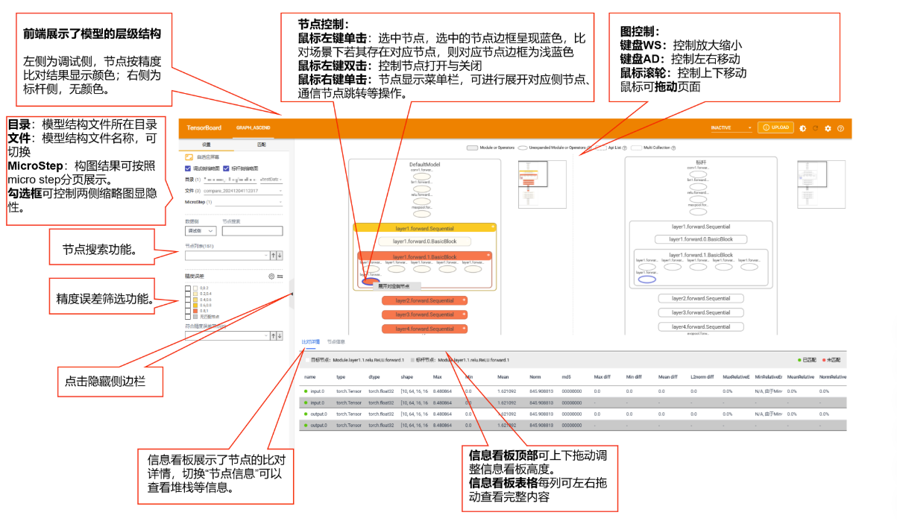

_正例：_

界面如图所示，对应的基础操作如表所示。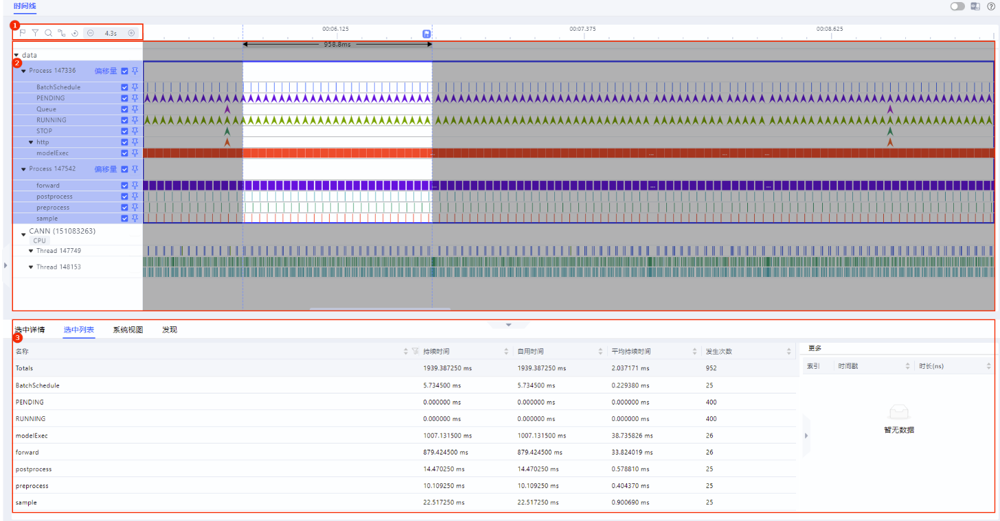

**表 1**  tensorboard首页基础操作

| 编号 | 说明                                                         |
| ---- | ------------------------------------------------------------ |
| 1    | 节点搜索功能。                                               |
| 2    | 精度误差筛选功能。                                           |
| 3    | 节点控制功能。<br/>&#8226; 鼠标左键单击xxx<br/>&#8226; 鼠标双击xxx<br/>&#8226; 鼠标右键单击xxx |


#### 案例（可选）

_资料书写要求：_

1.  _可选章节，如果该场景或者功能涉及案例，可在本章节承载。_
2.  _案例的写作规范可参见**《案例手册》**模板。_

### 附录

_资料书写要求：_

1.  _呈现安全说明，FAQ等参考信息。_
2.  _使用topic形式呈现。_
3.  _安全声明，模板可参考《**安全声明**》模板，安全声明中已包含安全建议、公网url、通讯矩阵等内容。_
4.  _FAQ，模板可参考《**FAQ**》模板。_

